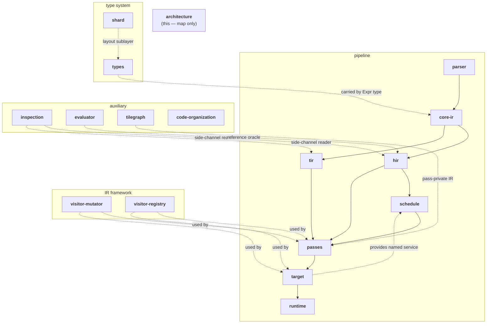

# TileFoundry Spec — Compiler Architecture Overview

> Architectural entry point. This document is the **map**: the
> pipeline shape, the support network, and the spec-ownership table.
> Concrete fields, invariants, and procedures live in the owner specs
> (§8). Whenever a downstream spec is revised, check it against this
> document first; whenever a structural change here lands, the
> downstream owner must follow.

## 1. Spec relationship map

A TileFoundry compilation flows left to right along the **pipeline**:
`parser → core-ir → {hir, tir} → passes → target → runtime`. Typed HIR MAY
first pass through an explicitly selected `schedule` service that returns
materialized HIR before pass sequencing. The
**type system** (types + shard) and the **IR framework**
(visitor-mutator + visitor-registry) cut across every pipeline stage:
they are co-designed with the IR, not standalone modules. Auxiliary
specs (inspection, tilegraph, code-organization) attach where
indicated and never gain pipeline ownership.

## 2. IR design

IR design has three regions: `core_ir` holds the shared node algebra
(`Module` / `Expr` / `Op` / `Call` / `Var` / `Constant` / `Tuple`);
`hir` extends it with a value-semantic `Function` (an `Expr`
subclass), `GridRegionExpr`, and value Ops; `tir` extends it with a
`Stmt` base, `PrimFunction`, structural / effect Stmts, and TIR-owned
tensor-handle / view Exprs. `hir` and `tir` are siblings — neither
leaks its node kinds into the other's final contract. The class-level
diagrams live in the owners: [core-ir](./core-ir.md) for the shared
algebra, [hir](./hir.md) for the HIR shape, [tir](./tir.md) for the
Stmt hierarchy.

## 3. Type system

The type system is what each `Expr` carries. It is split into a
**core** layer ([types](./types.md)) and a **shard / layout** sublayer
([shard](./shard.md)).

- core types: `IRType` (abstract base) / `TensorType` / `TupleType` /
  `UnitType` / `DType` / `dim.*`.
- shard / layout sublayer: `IntTuple` / `Layout` / `ComposedLayout` /
  `Topology` / `Mesh` family / `ShardAttr` / `ShardLayout`.
  `TensorType.layout` accepts any member of the layout hierarchy.

The full type-relationship diagram lives in [types](./types.md), and
the layout / shard hierarchy diagram lives in [shard](./shard.md).

## 4. Parser

The parser turns Python DSL source into a `core_ir.Module`. There are
two layers: a **module layer** (`parse_module`, the sole top entry)
that assembles the compilation unit, and a **function layer**
(`parse_func` / `parse_prim_func`) that turns each `ast.FunctionDef`
into an `hir.Function` or `tir.PrimFunction`. The DSL surface
(authoring namespace, OpSchema registry, dispatch tokens, AST
subset, sugar disambiguation) and the lexical-env rules for
`with Mesh` are owned by [parser](./parser.md).

Inspection is a side-channel consumer of the same IR and type
objects — DOT, Python DSL pretty-printer, dump integration, and the
interactive viewer — and never introduces new semantic ownership.
Concrete presentation contracts live in [inspection](./inspection.md).

## 5. Analysis & optimization

This stage layers two concerns on top of the same IR:

1. **Per-node analyses** — callable families dispatched on a single IR
   node (Op or Stmt). The settled split: `typeinfer` covers any
   Expr-producing `Op` `Call` (HIR value Ops + TIR-owned Expr Ops);
   `verify` covers TIR `Stmt` nodes plus cross-function invariants and
   recursively retriggers `typeinfer` on embedded Expr fields. The
   dispatch pattern (`AnalysisRegistry`, per-class handler
   registration, `(Call, ctx)` / `(Stmt, ctx)` signature families)
   lives in [visitor-registry](./visitor-registry.md). Concrete
   per-node rules live with the node owner ([tir](./tir.md) /
   [hir](./hir.md) / [parser](./parser.md) / [target](./target.md)).
2. **Passes** — module-level transforms sequenced by a `PassManager`
   ([passes](./passes.md)). Lowering passes and optimization passes
   are both ordinary stages in that manager. A pass may use a
   pass-private intermediate representation
   (e.g. [tilegraph](./tilegraph.md)) without elevating it to a peer
   IR layer.

IR traversal / rewrite utilities (`ExprVisitor` / `ExprMutator` /
`StmtVisitor` / `StmtMutator` / mixed stmt-expr rewriters) are shared
infrastructure used by both passes and codegen walkers; the framework
contract lives in [visitor-mutator](./visitor-mutator.md).

Scheduling is an explicit HIR materialization service, not a pass-manager
stage. A caller selects a named service from the root Function's Target and
invokes it directly; the service returns HIR to the ordinary pass pipeline.
The direct invocation contract and public result structures are owned by
[schedule](./schedule.md).

## 6. Target / codegen

Codegen is the back end. **TIR is the lowest IR**, and each target
(CUDA, LLVM IR, …) walks the verified TIR tree and emits the final
target code string directly; there is no intermediate per-target IR
layer. HIR Ops do not reach codegen — any HIR Op participating in
final emission must first be lowered into TIR-owned forms.

Codegen groups a module's functions by their target, emits one
`LinkableModule` per target, and links them into one `LinkedModule`;
the runtime then loads the `LinkedModule` into a `RuntimeModule`:

    verified TIR → codegen emit (per-target LinkableModule) → link → LinkedModule → runtime load → RuntimeModule

The emit / link pipeline and its products (`LinkableFunction` /
`LinkableModule` / `LinkedModule`) are owned by [codegen](./codegen.md).
Target capability (the `Target` descriptors and the admitted program
topology levels) is owned by [target](./target.md). The Python-side
`RuntimeModule` boundary (field semantics, ABI, launch rules) is owned
by [runtime](./runtime.md).

## 7. Runtime boundary

The runtime is outside the IR compile pipeline. It provides the
execution support used by generated target code and by Python-side
`RuntimeModule` objects:

- the Python `RuntimeModule` / `RuntimeFunction` surface returned by
  `build(...)` / `compile(...)` / `jit(...)`;
- the C++ runtime surface (`runtime.h` umbrella header,
  `tilefoundry::Topology` / `Mesh` / `ShardLayout` primitives, the
  `tilefoundry::ops::*` op free-function contract);
- the load path that turns a `LinkedModule` ([codegen](./codegen.md))
  into a loadable, callable `RuntimeModule`.

All field-level diagrams and ABI contracts live in
[runtime](./runtime.md).

## 8. Spec ownership

This table is the authoritative spec-to-box map. Each row lists the
**current** owner; changes to ownership update this table first.

| Spec | Owns |
|---|---|
| **[architecture](./architecture.md)** (this doc) | The map: pipeline + support-network picture, IR-region overview, spec-ownership table |
| **[core-ir](./core-ir.md)** | core_ir shared node algebra: `Module` / `Expr` / `Op` / `Call` / `Var` / `Constant` / `Tuple`. No types, no `Stmt` |
| **[types](./types.md)** | Core type system: `IRType` abstract base / `TensorType` / `TupleType` / `UnitType` / `DType` / `dim.*` + TensorType invariants |
| **[shard](./shard.md)** | Shard / layout sublayer: `IntTuple` / `Layout` / `ComposedLayout` / `Mesh` family / `ShardAttr` / `ShardLayout` + shard-binding invariants |
| **[hir](./hir.md)** | HIR dataflow IR: `Function` (`Expr` subclass), op subdirectories (math / tensor / nn / shape / sharding), `GridRegionExpr`, hir-side Mesh-scope rule |
| **[tir](./tir.md)** | TIR stmt IR: `Stmt` base (tir-only), `PrimFunction`, `Sequential(Stmt)`, control-flow Stmts, effect / tile Ops in `Evaluate(op, args)` form, user `@intrinsic` Stmt generation |
| **[parser](./parser.md)** | Parser two-layer entry, AST subset, DSL surface rules, OpSchema dispatch contracts, `with Mesh` lexical-env rule |
| **[inspection](./inspection.md)** | Developer-facing IR presentation: DOT, Python DSL pretty-printer, viewer detail rules, dump integration |
| **[evaluator](./evaluator.md)** | HIR reference interpreter: `evaluate` entry, `Value` family (`TensorValue` / `TupleValue`), `register_eval` op registry, node-evaluation + `GridRegionExpr` + layout-domain rules. Logical reference oracle, no codegen / runtime |
| **[visitor-registry](./visitor-registry.md)** | Derived-visitor dispatch pattern: `AnalysisRegistry`, per-class handler registration, four instances (`typeinfer` / `verify` / `codegen_<target>` / `cost`) with their Context / Visitor derivations |
| **[analysis](./analysis.md)** | Static analysis service semantics: type propagation (relation-derived type behavior), access relation analysis, shard propagation (logical shape → layout domain, relation-driven propagation, output storage + mesh/layout compatibility). The registration mechanism itself is owned by visitor-registry |
| **[visitor-mutator](./visitor-mutator.md)** | IR traversal / rewrite infrastructure: expr / stmt visitors, mutators, identity-preserving rewrite invariants, mixed stmt-expr traversal |
| **[passes](./passes.md)** | Pass framework + implemented passes: `Pass` / `PassManager`, three pass granularities, per-pass subsections (lowering / optimization rules) |
| **[schedule](./schedule.md)** | Explicit Target-owned HIR scheduling service: direct invocation protocol, shared options, materialized result, and stable objective report |
| **[tilegraph](./tilegraph.md)** | TileGraph — pass-internal IR for polyhedral / tile-search passes |
| **[target](./target.md)** | Target capability descriptors (`Target` / `CudaTarget` / `CpuTarget`) and the admitted program topology levels |
| **[codegen](./codegen.md)** | Emit / link pipeline and products (`LinkableFunction` / `LinkableModule` / `LinkedModule`), emitter registry, dispatch + shape-scalar ABI, program-shape / dynamic-CTA source contract, ShardLayout emission |
| **[runtime](./runtime.md)** | `RuntimeModule` / launcher ABI, C++ runtime surface, `runtime.h` umbrella header, runtime op free-function contract |
| **[code-organization](./code-organization.md)** | Implementation guide (not architectural): Python source tree layout |

**Cross-spec sync.** Downstream specs link back to the relevant § of
this document; a downstream spec change that touches an architectural
invariant defined here MUST update this ownership map in the same spec
change. There is no separate sync manifest.
