# TileFoundry Command-Line Interface

This file is the normative reference printed by `tilefoundry help cli`. It
defines the command-line contract for Agent-authored HIR analysis. `help dsl`
prints the installed [HIR specification](./hir.md); Python authoring syntax and
grammar productions remain in the [parser specification](./parser.md).

## Commands

```text
tilefoundry analyze model.py[:Module[.function]]
    [--roofline] [--footprint] [--timeline]

tilefoundry schedule model.py[:Module[.function]] --stage LEVEL

tilefoundry inspect capabilities model.py[:Module[.function]]

tilefoundry help dsl
tilefoundry help cli
```

`SOURCE` is a Python file followed optionally by `:Module`, `:Function`, or
`:Module.function`. Without a selector, the source must define exactly one HIR
Module or exactly one HIR Function. A selector chooses the named Module, the
named Function, or a named Function inside a Module.

## Analyze

`analyze` first runs deterministic type inference and then prints complete type
comments, regardless of analysis flags. It never performs candidate search,
layout enumeration, or automatic resharding.

With no analysis flag, `analyze` runs roofline, footprint, and timeline. When
one or more flags are present, it runs only the named analyses. The selected
Function target, or the selected Module entry Function target, determines the
hardware specification; there is no ordinary `--target` option.

On success, stdout begins with the overall analysis summary followed by
annotated HIR. On inference, verification, or analysis failure, stdout is empty
and stderr reports the source location, binding where available, and reason.

## Schedule

`schedule` models one authored HIR Function at one level of its target's
topology and prints the scaffold an authoring agent fills. It runs the pipeline
[schedule §4](./schedule.md#4-kernel-schedule-construction) defines: extract the
polyhedral model, construct the schedule tree, select each statement's atom,
emit the scaffold. It selects nothing else — no tile search, no layout
enumeration, no resharding.

The target is not a flag. It comes from the selected Function's own target, or
from the selected Module entry Function's, and falls back to the default target
when the Function declares none: a kernel is authored against one target.

`--stage` is required and names one topology level of that target
([target](./target.md)). A level the target does not own is rejected naming the
levels it does own. A target that enumerates no levels leaves the mismatch to
the stage service lookup, which reports the same failure.

On success stdout carries a `#`-headed machine-parsable summary followed by
three labelled sections:

| Section | Lines |
|---|---|
| summary | `# schedule` — target, stage, function, statement names; `# decisions` — status and makespan; one `# decisions statement=` per statement — its atom, derived placement, start and end; `# ring` — every buffer whose ring depth was decided, present only when one was |
| `# skeleton` | the holed, C-like loop nest |
| `# swimlane` | the Mermaid gantt rendering |
| `# holes` | one `# hole=` line per hole contract: its op, schedule coordinates, input buffers, and output buffer |

`makespan`, `start` and `end` are in the atom selector's own integer duration
units, not nanoseconds
([schedule §4.2](./schedule.md#42-atom-selection)); the `ns` figure is what a
`Schedule` service's own report carries
([schedule §2.3](./schedule.md#23-schedulereport)).

On any failure stdout is empty and stderr carries one `tilefoundry: error:` line
naming the cause.

Scheduling this AMX kernel, whose 32x32 f32 accumulator is exactly the width of
the AMX accumulator register file:

```python
# example
@func(target="amx")
def blocked_matmul(
    x: Tensor[(32, 64), "f32"],
    w: Tensor[(64, 32), "f32"],
) -> Tensor[(32, 32), "f32"]:
    return matmul(x, w)
```

````text
# example
$ tilefoundry schedule model.py:blocked_matmul --stage core
# schedule target=amx stage=core function=blocked_matmul statements=MM
# decisions status=OPTIMAL makespan=1474560
# decisions statement=MM atom=AMX_FMA32_16x16x1_F32 place=coincident[0,1] start=0 end=1474560
# ring t0=2 w=1 x=1

# skeleton
for (int c3 = 0; c3 <= 31; c3 += 1)
  for (int c4 = 0; c4 <= 31; c4 += 1)
    for (int c5 = 0; c5 <= 63; c5 += 1)
      {
        HOLE_MM(/*in*/ x, w, t0[(c5) % 2], /*out*/ t0[(c5) % 2], /*coords*/ c3, c4, c5);
        // barrier
      }

# swimlane

```mermaid
gantt
    title tilefoundry scaffold -- statement swimlanes
    dateFormat  X
    axisFormat  %s
    section MM
    MM(0, 0, 0) (prologue) :0, 1d
    MM(0, 0, 1) (steady) :1, 1d
    MM(0, 0, 2) (steady) :2, 1d
    MM(0, 0, 3) (steady) :3, 1d
    MM(0, 0, 4) (steady) :4, 1d
    ... x65530 elided :5, 1d
    MM(31, 31, 63) (epilogue) :6, 1d
```


# holes
# hole=HOLE_MM op=MatMul coords=c3,c4,c5 inputs=x,w,t0 output=t0
````

The buffer named `t0` is the unbound `matmul` result: a value with no authored
binding is numbered in visit order, so the skeleton never carries a memory
address.

## Inspect Capabilities

`inspect capabilities` resolves the target from the selected Function or Module
entry Function and prints the installed compact hardware capability record. It
does not emit compiler operation coverage. Hardware facts identify their unit,
qualification, source, and whether they are direct, derived, runtime queried,
or unavailable.

## Help

`help dsl` writes `share/tilefoundry/spec/hir.md` verbatim; `help cli` writes
`share/tilefoundry/spec/cli.md`. In a source or editable tree, they read the
matching files from `docs/spec/`. Python operation signatures are provided
separately by installed stubs and Python introspection.
