# TileFoundry Command-Line Interface

This file is the normative reference printed by `tilefoundry help cli`. It
defines the command-line contract for Agent-authored HIR analysis. `help dsl`
prints the installed [HIR specification](./hir.md); Python authoring syntax and
grammar productions remain in the [parser specification](./parser.md).

## Commands

```text
tilefoundry analyze model.py[:Module[.child_module...][.function]]
    [--roofline] [--footprint] [--timeline]

tilefoundry schedule model.py[:Module[.child_module...][.function]] --stage LEVEL

tilefoundry inspect capabilities model.py[:Module[.child_module...][.function]]

tilefoundry help dsl
tilefoundry help cli
```

`SOURCE` is a Python file followed optionally by
`:Module[.child_module...][.function]`. Without a selector, the source must
define exactly one top-level HIR Module or Function. A selector chooses the
named Module, or a Function reached through the chain of child Modules that own
it: each segment names a child Module of the one before it, and only the last
MAY name a Function. A leaf selected this way MUST keep resolving the Target and
hierarchy it inherits from the owners it was reached through.

A selector MAY name a top-level binding that is a bare `Function` — a source
whose `@func` declares no execution context binds one. Every verb here reads
hardware facts, so such a selection MUST be rejected naming the Module that
would declare its context, rather than analysed or scheduled against a default
([target §6](./target.md#6-target-ownership-and-compile-resolution)).

## Analyze

`analyze` first runs deterministic type inference and then prints complete type
comments, regardless of analysis flags. It never performs candidate search,
layout enumeration, or automatic resharding.

Each flag names one root analysis. With no flag, `analyze` runs all of them. The
selected Module's resolved Target determines the hardware specification; there is
no ordinary `--target` option.

- constraints:
  - `analyze` MUST invoke the public operation once per requested root, because
    that operation takes one root per call
    ([analysis §3](./analysis.md#3-composed-analysis)). Requesting two analyses
    MUST NOT change what either reports.
  - A selection MUST resolve to a Module. A bare Function MUST be rejected
    naming the reason: it declares neither the Target its numbers are measured
    against nor the topology hierarchy they divide over.
  - `--json` MUST print the report as JSON instead of text. Both formats MUST
    carry the same conclusions ([analysis §2](./analysis.md#2-authored-hir-metrics)).
  - Output MUST report the analyses that were requested. A dependency that ran
    because a requested root needed it MUST appear in the executed list and MUST
    NOT have its own measurements reported.
  - On success, text output begins with the `#`-headed report followed by
    annotated HIR. On inference, verification, or analysis failure, stdout MUST
    be empty and stderr MUST report the source location, binding where
    available, and reason.

## Schedule

`schedule` models one authored HIR Function at one level of its target's
topology and prints the scaffold an authoring agent fills. It runs the pipeline
[schedule §4](./schedule.md#4-kernel-schedule-construction) defines: extract the
polyhedral model, construct the schedule tree, select each statement's atom,
emit the scaffold. It selects nothing else — no tile search, no layout
enumeration, no resharding.

The target is not a flag. It comes from the selected Module's resolved Target
([core-ir §1](./core-ir.md#1-module)): a kernel is authored against one target.
A selection that is a bare Function, or a Module whose owner chain declares no
Target, MUST be rejected — `schedule` does not resolve an omission to a default
([target §6](./target.md#6-target-ownership-and-compile-resolution)).

`--stage` is required and names one topology level of that target
([target](./target.md)). A level the target does not own is rejected naming the
levels it does own. A target that enumerates no levels leaves the mismatch to
the stage service lookup, which reports the same failure.

On success stdout carries a `#`-headed machine-parsable summary followed by
three labelled sections:

| Section | Lines |
|---|---|
| summary | `# schedule` — target, stage, function, statement names; `# decisions` — status and makespan; one `# decisions statement=` per statement — its atom, derived placement, start and end; `# ring` — every buffer whose ring depth was decided, present only when one was |
| `# skeleton` | the holed, C-like loop nest |
| `# swimlane` | the Mermaid gantt rendering |
| `# holes` | one `# hole=` line per hole contract: its op, schedule coordinates, input buffers, and output buffer |

`makespan`, `start` and `end` are in the atom selector's own integer duration
units, not nanoseconds
([schedule §4.2](./schedule.md#42-atom-selection)); the `ns` figure is what a
`Schedule` service's own report carries
([schedule §2.3](./schedule.md#23-schedulereport)).

On any failure stdout is empty and stderr carries one `tilefoundry: error:` line
naming the cause.

Scheduling this AMX kernel, whose 32x32 f32 accumulator is exactly the width of
the AMX accumulator register file:

```python
# example
@func(target="amx")
def blocked_matmul(
    x: Tensor[(32, 64), "f32"],
    w: Tensor[(64, 32), "f32"],
) -> Tensor[(32, 32), "f32"]:
    return matmul(x, w)
```

````text
# example
$ tilefoundry schedule model.py:blocked_matmul --stage core
# schedule target=amx stage=core function=blocked_matmul statements=MM
# decisions status=OPTIMAL makespan=1474560
# decisions statement=MM atom=AMX_FMA32_16x16x1_F32 place=coincident[0,1] start=0 end=1474560
# ring t0=2 w=1 x=1

# skeleton
for (int c3 = 0; c3 <= 31; c3 += 1)
  for (int c4 = 0; c4 <= 31; c4 += 1)
    for (int c5 = 0; c5 <= 63; c5 += 1)
      {
        HOLE_MM(/*in*/ x, w, t0[(c5) % 2], /*out*/ t0[(c5) % 2], /*coords*/ c3, c4, c5);
        // barrier
      }

# swimlane

```mermaid
gantt
    title tilefoundry scaffold -- statement swimlanes
    dateFormat  X
    axisFormat  %s
    section MM
    MM(0, 0, 0) (prologue) :0, 1d
    MM(0, 0, 1) (steady) :1, 1d
    MM(0, 0, 2) (steady) :2, 1d
    MM(0, 0, 3) (steady) :3, 1d
    MM(0, 0, 4) (steady) :4, 1d
    ... x65530 elided :5, 1d
    MM(31, 31, 63) (epilogue) :6, 1d
```


# holes
# hole=HOLE_MM op=MatMul coords=c3,c4,c5 inputs=x,w,t0 output=t0
````

The buffer named `t0` is the unbound `matmul` result: a value with no authored
binding is numbered in visit order, so the skeleton never carries a memory
address.

## Inspect Capabilities

`inspect capabilities` resolves the target from the selected Module and prints
the installed compact hardware capability record. It does not emit compiler
operation coverage. The record names both the architecture and the device
document behind the target, each with its content digest, then every recorded
fact by its path. A fact identifies its unit, the conditions it holds under,
its source, and its origin — vendor-published, measured on the described host,
cited from a reference, derived, or a reading no source states. A fact with no
usable value is reported as unavailable rather than given a placeholder number.
A target composed from a directly supplied value has no installed document to
report, and the command says so instead of naming the resource it resembles.

## Help

`help dsl` writes `share/tilefoundry/spec/hir.md` verbatim; `help cli` writes
`share/tilefoundry/spec/cli.md`. In a source or editable tree, they read the
matching files from `docs/spec/`. Python operation signatures are provided
separately by installed stubs and Python introspection.
