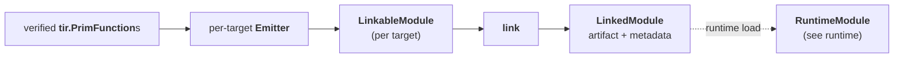

# TileFoundry Spec — Codegen

Codegen turns verified, lowered `tir.PrimFunction`s into a loadable artifact.
It owns the whole producer side of the build: emitting per-target source,
assembling each target's translation unit, and linking those units into one
host-callable shared library. Loading that artifact and exposing it as a
`RuntimeModule` is owned by [runtime](./runtime.md).



## 1. Pipeline

- **Input** is verified TIR. HIR Ops MUST NOT reach codegen.
- A module's functions are grouped by their `target` (`cuda` / `cpu`). Each
  group is emitted by its target's emitter into one `LinkableModule`.
- The link step compiles every `LinkableModule` with its own toolchain and
  links them into one `LinkedModule` — a host-callable shared library plus the
  host-visible metadata the loader needs.
- Codegen does not run passes, does not load or launch device code, and does
  not own the user-facing entry points (`compile` / `build` / `jit`).
- **Host / device boundary.** A host `LinkableModule` MUST NOT reference CUDA or
  CuTe symbols or types. A CUDA `LinkableModule` owns the kernels and their
  C-ABI launch shims. The host module invokes device code only through that
  C-ABI shim.

The target-specific emitter behavior — how a `cpu` vs `cuda` function emits, the
dispatch and shape-scalar ABI, program-shape / dynamic-CTA accessors, and the
`ShardLayout` runtime mapping — is owned by [target](./target.md).

## 2. Emitter


An emitter walks a verified `tir.PrimFunction` and produces source plus the
metadata the link step needs.

### 2.1 Emitter registry

```python
def get_emitter(target: str) -> Emitter: ...    # resolve the emitter registered for a target
# Emitter: Callable[[tuple[PrimFunction, ...]], LinkableModule]
```

- constraints:
  - each target registers one emitter, resolved by target name.

An emitter MUST consume only TIR and MUST return a `LinkableModule` for its
target. The emitter file layout mirrors the IR file layout
(`codegen/<target>/tir/...` parallels `ir/tir/...`); the mirror rule is owned
by [code-organization](./code-organization.md).

### 2.2 Per-Op handler registry

```python
@register_codegen_<target>(Op)                              # decorator: register a per-Op handler on a target's emitter
def handler(call: Call, ctx: CodegenContext) -> None: ...   # Call (wrapped Op inside Evaluate) + CodegenContext
```

- constraints:
  - dispatch (matching `Evaluate` and selecting the handler) is owned by visitor-registry.

Dispatch is owned by [visitor-registry §6](./visitor-registry.md). A handler
receives the `Call` (the wrapped Op inside `Evaluate`) plus a `CodegenContext`,
and MUST emit through `ctx.emit(...)`; raw `print` / direct file writes are
prohibited.

### 2.3 `CodegenContext`

```python
class CodegenContext:
    def emit(self, line: str) -> None: ...               # append a target source line
    def expr(self, node: Expr) -> str: ...               # render an Expr as a target expression string
    def dtype_to_cpp(self, dtype_name: str) -> str: ...  # backend dtype mapping
    def make_var_name(self, ...) -> str: ...             # allocate fresh target-side identifiers
```

- constraints:
  - the per-walk state object passed to handlers; the single source of truth for
    target-side type strings, so handlers do not read the IR for them directly.

A handler MUST NOT reach into the IR for type strings on its own; the context is
the single source of truth. Other helpers MAY be added per target.

### 2.4 Effect Op dispatch

Effect Ops (`Copy`, `Fill`, `Mma`, `tir.nn.*`, ...) appear in Stmt
position as `Evaluate(op, args)` rather than as Stmt subclasses. The
walker matches `Evaluate` and dispatches on `type(callable)` through
the handler registry. Handlers stay small; the runtime function they
call carries the semantic load.

## 3. Runtime-owned op dispatch

Where more than one runtime template implements an op, codegen emits **one
uniform runtime op call**, passing the operand `ShardLayout`s (and any
codegen-static participant geometry) as compile-time template parameters. The
runtime template dispatches on those layouts at compile time; codegen does not
select a tier, compute a per-tier parameter, or carry the selection on the TIR
op. This is the codegen side of the runtime-owned dispatch principle, whose
contract lives in [runtime.md §3](runtime.md#3-runtime-ops). The target-side
emission that produces these calls is owned by
[target §5](./target.md#5-target-driven-emission).

## 4. Codegen products

### 4.1 `LinkableFunction`


One lowered function's pre-link source.

```python
class LinkableFunction:
    name: str      # the function / kernel symbol
    source: str    # that function's emitted text
```

- constraints:
  - MUST be the function / kernel symbol.
  - MUST be that function's emitted text.

### 4.2 `LinkableModule`

One target's pre-link translation unit.

```python
class LinkableModule:
    target: str                              # the function target name (cuda / cpu)
    language: str                            # the source language (cu / cpp)
    source: str                              # the assembled translation-unit text
    functions: tuple[LinkableFunction, ...]  # the module's constituent LinkableFunctions
```

- constraints:
  - MUST be the function target name (`cuda` / `cpu`).
  - MUST be the source language: `cu` for a CUDA translation unit, `cpp` for a
    host translation unit.
  - MUST be the assembled translation-unit text the link step compiles.
  - MUST list the module's constituent `LinkableFunction`s, in emission order.

A `LinkableModule` is a build artifact, not a runtime object and not a
user-callable.

### 4.3 `LinkedModule`

The link output: a loadable artifact plus the host-visible metadata the loader
needs.

```python
class LinkedModule:
    library_path: Path                  # the produced shared library
    source: str                         # the assembled host + device source
    entry: CallableType                 # the host-visible callable type of the module entry
    launch_config: LaunchConfig         # the entry's launch geometry (grid / block extents)
    kernels: tuple[KernelInfo, ...]     # the ABI of the module's __global__ kernels
```

- constraints:
  - MUST point at the produced shared library.
  - MUST carry the assembled host + device source — the diagnostic source the
    runtime exposes as `RuntimeModule.source` ([runtime](./runtime.md)).
  - MUST be the host-visible callable type of the module entry.
  - MUST carry the entry's launch geometry (grid / block extents).
  - MUST list the ABI of the module's `__global__` kernels.

The `entry` `CallableType`, `launch_config` `LaunchConfig`, and `kernels`
`KernelInfo` are host-visible ABI metadata types owned by
[runtime](./runtime.md); codegen references them on `LinkedModule` and MUST NOT
redefine them.

The link step consumes the per-target `LinkableModule`s, compiles each with its
own toolchain, and links them into one `LinkedModule`. `LinkedModule` is
consumed by the runtime loader ([runtime](./runtime.md)); the concrete compiler
commands are an implementation detail and not part of the contract.
