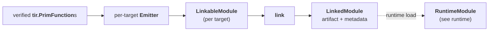

# TileFoundry Spec — Codegen

Codegen turns verified, lowered `tir.PrimFunction`s into a loadable artifact.
It owns the whole producer side of the build: emitting per-target source,
assembling each target's translation unit, and linking those units into one
host-callable shared library. Loading that artifact and exposing it as a
`RuntimeModule` is owned by [runtime](./runtime.md).



## 1. Pipeline

- **Input** is verified TIR. HIR Ops MUST NOT reach codegen.
- A module's functions are grouped by their `target` (`cuda` / `cpu`). Each
  group is emitted by its target's emitter into one `LinkableModule`.
- The link step compiles every `LinkableModule` with its own toolchain and
  links them into one `LinkedModule` — a host-callable shared library plus the
  host-visible metadata the loader needs.
- Codegen does not run passes, does not load or launch device code, and does
  not own the user-facing entry points (`compile` / `build` / `jit`).
- **Host / device boundary.** A host `LinkableModule` MUST NOT reference CUDA or
  CuTe symbols or types. A CUDA `LinkableModule` owns the kernels and their
  C-ABI launch shims. The host module invokes device code only through that
  C-ABI shim.

## 2. Emitter

An emitter walks a verified `tir.PrimFunction` and produces source plus the
metadata the link step needs.

### 2.1 Emitter registry

Each target registers an emitter, resolved by target name:

```python
emit = get_emitter("cuda")    # tuple[PrimFunction, ...] -> LinkableModule
```

An emitter MUST consume only TIR and MUST return a `LinkableModule` for its
target. The emitter file layout mirrors the IR file layout
(`codegen/<target>/tir/...` parallels `ir/tir/...`); the mirror rule is owned
by [code-organization](./code-organization.md).

### 2.2 Per-Op handler registry

Within a target, per-Op handlers are registered for the emitter:

```python
@register_codegen_cuda(Copy)
def _(call: Call, ctx: CodegenContext) -> None:
    ctx.emit(f"tilefoundry::copy({ctx.expr(call.args[0])}, {ctx.expr(call.args[1])});")
```

Dispatch is owned by [visitor-registry §6](./visitor-registry.md). A handler
receives the `Call` (the wrapped Op inside `Evaluate`) plus a `CodegenContext`,
and MUST emit through `ctx.emit(...)`; raw `print` / direct file writes are
prohibited.

### 2.3 `CodegenContext`

`CodegenContext` is the per-walk state object passed to handlers. It exposes the
helpers a handler is allowed to use:

- `emit(line: str)` — append a target source line.
- `expr(node: Expr) -> str` — render an `Expr` as a target expression string.
- `dtype_to_cpp(dtype_name: str) -> str` — backend dtype mapping.
- `make_var_name(...)` — allocate fresh target-side identifiers.

A handler MUST NOT reach into the IR for type strings on its own; the context is
the single source of truth. Other helpers MAY be added per target.

### 2.4 Effect Op dispatch

Effect Ops (`Copy`, `Fill`, `Mma`, `tir.nn.*`, ...) appear in Stmt
position as `Evaluate(op, args)` rather than as Stmt subclasses. The
walker matches `Evaluate` and dispatches on `type(callable)` through
the handler registry. Handlers stay small; the runtime function they
call carries the semantic load.

## 3. Target-driven emission

Emission is split by function `target`; one `LinkableModule` is produced per
target group.

- A `cpu`-target entry function emits the **host translation unit**: a host
  wrapper that marshals `tvm::ffi::Tensor` arguments and invokes the device
  entry through its C-ABI launch shim. For a dispatch prototype the wrapper
  also performs the `DispatchCall` selection (§5).
- A `cuda`-target function emits the **device translation unit**: a
  `__global__` kernel plus its C-ABI launch shim. An operand's layout selects
  how it is viewed inside the kernel — `cute::` for a plain `Layout`,
  `tilefoundry::` shard tensor for a `ShardLayout` (§7) — it does not change the
  function into a `__device__`-parameter function.

### 3.1 Runtime-owned op dispatch

Where more than one runtime template implements an op, codegen emits **one
uniform runtime op call**, passing the operand `ShardLayout`s (and any
codegen-static participant geometry) as compile-time template parameters. The
runtime template dispatches on those layouts at compile time; codegen does not
select a tier, compute a per-tier parameter, or carry the selection on the TIR
op. This is the codegen side of the runtime-owned dispatch principle, whose
contract lives in [runtime.md §3](runtime.md#3-runtime-ops).

## 4. Codegen products

### 4.1 `LinkableFunction`

One lowered function's pre-link source.

```python
@dataclass(frozen=True)
class LinkableFunction:
    name: str
    source: str
```

#### `name`
- MUST be the function / kernel symbol.

#### `source`
- MUST be that function's emitted text.

### 4.2 `LinkableModule`

One target's pre-link translation unit.

```python
@dataclass(frozen=True)
class LinkableModule:
    target: str
    language: str
    source: str
    functions: tuple[LinkableFunction, ...]
```

#### `target`
- MUST be the function target name (`cuda` / `cpu`).

#### `language`
- MUST be the source language: `cu` for a CUDA translation unit, `cpp` for a
  host translation unit.

#### `source`
- MUST be the assembled translation-unit text the link step compiles.

#### `functions`
- MUST list the module's constituent `LinkableFunction`s, in emission order.

A `LinkableModule` is a build artifact, not a runtime object and not a
user-callable.

### 4.3 `LinkedModule`

The link output: a loadable artifact plus the host-visible metadata the loader
needs.

```python
@dataclass(frozen=True)
class LinkedModule:
    library_path: Path
    source: str
    entry: CallableType
    launch_config: LaunchConfig
    kernels: tuple[KernelInfo, ...]
```

#### `library_path`
- MUST point at the produced shared library.

#### `source`
- MUST carry the assembled host + device source — the diagnostic source the
  runtime exposes as `RuntimeModule.source` ([runtime](./runtime.md)).

#### `entry`
- MUST be the host-visible callable type of the module entry.

#### `launch_config`
- MUST carry the entry's launch geometry (grid / block extents).

#### `kernels`
- MUST list the ABI of the module's `__global__` kernels.

The `entry` `CallableType`, `launch_config` `LaunchConfig`, and `kernels`
`KernelInfo` are host-visible ABI metadata types owned by
[runtime](./runtime.md); codegen references them on `LinkedModule` and MUST NOT
redefine them.

The link step consumes the per-target `LinkableModule`s, compiles each with its
own toolchain, and links them into one `LinkedModule`. `LinkedModule` is
consumed by the runtime loader ([runtime](./runtime.md)); the concrete compiler
commands are an implementation detail and not part of the contract.

## 5. Dispatch and shape-scalar ABI

A `tir.PrimFunction` produced by HIR→TIR lowering for a dispatch prototype
([hir §5](./hir.md#5-dispatch-specializations)) emits as a host dispatch entry
plus its variant kernels:

- **Dispatch entry** (PrimFunction whose body is a single `tir.DispatchCall`):
  the host module emits a host-only entry — no kernel. It reads the dispatch
  subject from the host-visible tensor shape, evaluates the case predicates in
  source order, and invokes the matching variant's C-ABI launch shim. The
  `fallback` MUST fail the host call with a host-side error.
- **Variant**: a `cuda`-target function (§3) — a `__global__` kernel plus its
  C-ABI launch shim in the CUDA module, carrying the hidden shape-scalar
  parameters below. A variant has no host wrapper of its own; the dispatch entry
  calls its shim.

**Host-visible entry symbol.** The host-visible entry wrapper (the CPU entry) is
emitted under an internal symbol `__tilefoundry_<sanitized>_host`, where
`<sanitized>` is the user-facing name with `$` replaced by `__` (`$` is a GCC
extension, not portable C++). The user-facing name is republished via the
runtime ABI macro:

```cpp
TVM_FFI_DLL_EXPORT_TYPED_FUNC(<name>, __tilefoundry_<sanitized>_host);
```

**Shape-scalar parameter ABI.** Each `tir.ShapeOf(param, axis)`
([tir §7](./tir.md#7-shapeof)) reachable from a PrimFunction body adds a hidden
kernel-scalar parameter named `f"{param.name}_shape_<axis>"` — a rank-0 `i32`
shape-scalar `TensorType` with `storage=None`. The host wrapper extracts the
value from the
corresponding `tvm::ffi::Tensor.shape()[axis]` and forwards it. These hidden
parameters are filtered out of the exported `CallableType.params` so they remain
invisible at the user FFI surface. A user-declared rank-0 `i32` parameter is
*not* filtered — the filter is keyed on the canonical `<name>_shape_<axis>` form
synthesised by lowering.

## 6. Program shape and dynamic CTA

The emitted device source reads its program geometry through two accessors:

- `program_shape<T>()` MUST be the shape composed of a topology level's program
  dims.
- `program_dim<T>()` MUST be the size of one topology level `T`.

For a static CTA count, `program_dim<cta>()` is a compile-time constant and a
constexpr `program_shape<cta>` is emitted. For a launch-provided (dynamic) CTA
count, the emitter MUST NOT emit a constexpr `program_shape<cta>`; device code
MUST read the count through `program_dim<cta>()`, which resolves to the
launch-provided grid extent. The topology level set a target admits is owned by
[target §topology](./target.md).

## 7. `ShardLayout` / `ShardTensor` mapping

A `ShardLayout` ([shard §7](./shard.md)) on a TIR tensor type is materialised
through `tilefoundry::make_shard_tensor(buffer, global_layout, shard_layout)`
([runtime](./runtime.md)). A handler that consumes a sharded operand emits the
shard-tensor view; effect Ops then route through `tilefoundry::` runtime helpers
(for example `tilefoundry::copy`) instead of plain `cute::` primitives. A plain
`Layout` operand goes through `cute::` directly. The selection is handler-local,
based on `arg.type.layout`.

Codegen consumes the `ShardLayout` already present on the TIR tensor type; the
cute MMA fragment → `ShardLayout` recipe that produces it is owned by the
lowering pass ([passes.md §7.1](./passes.md#71-hirtotirpass)).
