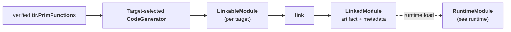

# TileFoundry Spec — Codegen

Codegen turns verified, lowered `tir.PrimFunction`s into a loadable artifact.
It owns the whole producer side of the build: emitting per-target source,
assembling each target's translation unit, and linking those units into one
host-callable shared library. Loading that artifact and exposing it as a
`RuntimeModule` is owned by [runtime](./runtime.md).


```mermaid
flowchart LR
    TIR["verified <b>tir.PrimFunction</b>s"]
    Emit["Target-selected <b>CodeGenerator</b>"]
    LM["<b>LinkableModule</b><br/>(per target)"]
    Link["<b>link</b>"]
    Linked["<b>LinkedModule</b><br/>artifact + metadata"]
    RM["<b>RuntimeModule</b><br/>(see runtime)"]

    TIR --> Emit --> LM --> Link --> Linked
    Linked -. runtime load .-> RM
```

## 1. Pipeline

- **Input** is verified TIR. HIR Ops MUST NOT reach codegen.
- A module's functions are grouped by equal Target values in source order. Each
  group is emitted by the exact Target's CodeGenerator into one
  `LinkableModule`.
- The link step compiles every `LinkableModule` with its own toolchain and
  links them into one `LinkedModule` — a host-callable shared library plus the
  host-visible metadata the loader needs.
- Codegen does not run passes, does not load or launch device code, and does
  not own the user-facing entry points (`compile` / `build` / `jit`).
- **Host / device boundary.** A host `LinkableModule` MUST NOT reference CUDA or
  CuTe symbols or types. A CUDA `LinkableModule` owns the kernels and their
  C-ABI launch shims. The host module invokes device code only through that
  C-ABI shim.

The target-specific generator behavior — how a CPU vs CUDA function emits,
program-shape / dynamic-CTA accessors, and the `ShardLayout` runtime mapping —
is owned by [target](./target.md).

## 2. CodeGenerator

A generator walks verified `tir.PrimFunction`s and produces source plus the
metadata the link step needs.

### 2.1 Target-selected service

```python
class CodeGenerator:
    emit: Callable[
        [Module, tuple[PrimFunction, ...], Target, CodegenContext], LinkableModule
    ]


class Target:
    def get_code_generator(self) -> CodeGenerator: ...


def emit_cuda_module(
    module: Module,
    functions: tuple[PrimFunction, ...],
    target: Target,
    ctx: CodegenContext,
) -> LinkableModule: ...
```

- constraints:
  - A Target MUST return one immutable CodeGenerator descriptor. A subclass MAY
    inherit its base generator without another registration step.
  - All generators MUST share the `(module, functions, target, ctx)` callable
    shape. The context is built once per compile and carries what every
    generator has to agree on ([§2.3](#23-codegencontext)); a generator MUST
    NOT settle any of it for itself.
  - A generator writes each function twice and no more: once as the
    declaration a caller sees, without entering the body, and once as the
    definition, by walking it.
  - Generator selection MUST NOT branch on `Target.name`. There MUST be no
    emitter registry or string-to-emitter lookup.
  - A second unequal CUDA Target group MUST fail before any generator emits;
    multiple device translation units or architectures in one linked artifact
    are unsupported.

A generator MUST consume only TIR and MUST return a `LinkableModule` for its
backend. The emitter file layout mirrors the IR file layout
(`codegen/<target>/tir/...` parallels `ir/tir/...`); the mirror rule is owned
by [code-organization](./code-organization.md).

### 2.2 Per-Op handler registry

```python
def handler(call: Call, ctx: CodegenContext) -> None: ...
```

- constraints:
  - a handler is registered inside a concrete generator against its own target
    ([visitor-registry §6](./visitor-registry.md#6-instance-3--codegen));
    dispatch (matching `Evaluate` and selecting the handler) is owned by
    visitor-registry.

Dispatch is owned by [visitor-registry §6](./visitor-registry.md#6-instance-3--codegen). A handler
receives the `Call` (the wrapped Op inside `Evaluate`) plus a `CodegenContext`,
and MUST emit through `ctx.emit(...)`; raw `print` / direct file writes are
prohibited.

### 2.3 `CodegenContext`

```python
class CodegenContext:
    """The context one compile writes through, whatever targets it writes for."""

    symbols: Mapping[int, CallableSignature]
    exported: bool

    def signature_of(self, fn) -> CallableSignature: ...
    def register_kernel_param(self, var) -> None: ...
    def is_kernel_param(self, var) -> bool: ...
    def emit(self, line: str) -> None: ...
    def blank(self) -> None: ...
    def indent(self) -> None: ...
    def dedent(self) -> None: ...
    def name_for(self, var) -> str: ...
    def source(self) -> str: ...
    def capture(self, fn) -> str: ...
    def emit_node(self, node) -> None: ...
    def declare(
        self, signature, callee_target=None, *, exported: bool = False
    ) -> tuple[str, ...]: ...
    def parameters(
        self, signature, callee_target=None, *, exported: bool = False
    ) -> str: ...
    def argument(self, signature, callee_target) -> tuple[str, ...]: ...
    def arguments(self, signature, callee_target) -> str: ...
    def local_value(self, signature) -> str: ...
    def local_extent(self, signature, axis: int) -> str: ...


class CudaCodegenContext(CodegenContext):
    """A compile writing CUDA: the shared context plus what only CUDA states."""

    launches: Mapping[int, Geometry]
    dynamic_extents: dict[str, str]

    def bind_extents(self, params) -> None: ...
    def reset_barrier_ids(self) -> None: ...
    def alloc_barrier_id(self) -> int: ...
    def dtype_to_cpp(self, dtype_name: str) -> str: ...


class CpuCodegenContext(CodegenContext):
    """A compile writing the host unit: the shared context plus what a tensor is here."""
```

- constraints:
  - One context spans one whole compile rather than one translation unit: the
    symbol table it carries is read by every emitter, and the boundary of the
    unit being written is drawn by `capture`. There MUST NOT be a second
    per-unit context object.
  - `signature_of` answers from `symbols` ([§4.4](#44-signatures)) and from
    nowhere else; it MUST raise when the function has no row there.
  - `emit_node` dispatches `Evaluate(op, args)` by the wrapped Op class; all
    other nodes dispatch by their own class.
  - `source` returns accumulated source text, and `capture` temporarily isolates
    only the output buffer while preserving indentation and symbol bindings.
  - `declare` and `argument` are the two sides of one call and key on the
    callee's target ([visitor-registry §6](./visitor-registry.md#6-instance-3--codegen)):
    `declare` states the parameters the callee takes, `argument` the values
    this scope passes for them. `declare` defaults to this context's own
    target, so a unit declaring a foreign symbol and the unit defining it
    reach the one handler and cannot come to disagree.
  - `exported` is set while a parameter list another translation unit will read
    is being written. A target whose types are its own MUST answer with what
    plain C states while it is set, because that is all the reading unit can
    spell.
  - `local_value` and `local_extent` are what the writing scope calls the value
    and the extent it passes; a scope that holds something richer than a plain
    parameter — a host entry holding a runtime tensor — states so by overriding
    them. They are the only place a caller's own vocabulary enters a call.
  - `dynamic_extents` says where the kernel being written reads each open
    dimension's extent, and is filled by `bind_extents` from the parameter
    types alone. `launches` is the geometry each device function is called at,
    keyed by `id(fn)`, settled where the `Launch` was written
    ([passes §7.3](./passes.md#73-insert_default_host_entry)).
  - A target subclass owns the type strings and hardware counters only it can
    state; a handler MUST reach them through the context rather than reading
    the IR for them. Other helpers MAY be added per target.

### 2.4 Effect Op dispatch

Effect Ops (`Copy`, `Fill`, `Mma`, `tir.nn.*`, ...) appear in Stmt
position as `Evaluate(op, args)` rather than as Stmt subclasses. The
walker matches `Evaluate` and dispatches on `type(callable)` through
the handler registry. Handlers stay small; the runtime function they
call carries the semantic load.

## 3. Runtime-owned op dispatch

Where more than one runtime template implements an op, codegen emits **one
uniform runtime op call**, passing the operand `ShardLayout`s (and any
codegen-static participant geometry) as compile-time template parameters. The
runtime template dispatches on those layouts at compile time; codegen does not
select a tier, compute a per-tier parameter, or carry the selection on the TIR
op. This is the codegen side of the runtime-owned dispatch principle, whose
contract lives in [runtime §2.6](./runtime.md#26-cudaops). The target-side
emission that produces these calls is owned by [target](./target.md).

## 4. Codegen products

### 4.1 `LinkableFunction`


One lowered function's pre-link source, in both of its positions.

```python
class LinkableFunction:
    """One lowered function's pre-link source, in both of its positions.

    Attributes:
        name: attribute; function or kernel symbol.
        declaration: attribute; what a caller of this function must see.
        definition: attribute; the function's own implementation.
    """

    name: str
    declaration: str
    definition: str
```

- constraints:
  - `declaration` and `definition` MUST both be written from the one
    `CallableSignature` ([§4.4](#44-signatures)) that the compile settled for
    this function, so the two cannot state different parameters.

### 4.2 `LinkableModule`

One target's pre-link translation unit.

```python
class LinkableModule:
    """One target's pre-link translation unit, assembled from its functions.

    Attributes:
        target: attribute; generator/linker backend label.
        language: attribute; source language.
        preamble: attribute; the part of the unit that is not a function.
        functions: attribute; constituent linkable functions in emission order.
    """

    target: str
    language: str
    preamble: str
    functions: tuple[LinkableFunction, ...] = field(default_factory=tuple)

    def source(self) -> str: ...
```

- constraints:
  - `target` MUST be the generator/linker backend label (`"cuda"` or `"cpu"`
    for the built-ins), never an external Target registration name.
  - MUST be the source language: `cu` for a CUDA translation unit, `cpp` for a
    host translation unit.
  - MUST list the module's constituent `LinkableFunction`s, in emission order.
  - `preamble` MUST carry what the unit states outside any function: includes,
    macros, unit-level template specializations, and device state emitted only
    where a function used it. It is a field because it is settled only once
    every function of the unit has been walked.
  - `source` is a read-only property and MUST be the only place a translation
    unit is assembled: the preamble, then every declaration, then every
    definition. A generator MUST NOT emit the unit a second time alongside
    `functions`.

A `LinkableModule` is a build artifact, not a runtime object and not a
user-callable.

### 4.3 `LinkedModule`

The link output: a loadable artifact plus the host-visible metadata the loader
needs.

```python
class LinkedModule:
    """Linked library plus the entry's signature.

    Attributes:
        library_path: attribute; produced shared-library path.
        source: attribute; assembled host and device source.
        entry: attribute; the loaded entry's signature.
    """

    library_path: Path
    source: str
    entry: CallableSignature
```

- constraints:
  - MUST carry the assembled host + device source — the diagnostic source the
    runtime exposes as `RuntimeModule.source` ([runtime](./runtime.md)).

The `entry` signature is [§4.4](#44-signatures)'s `CallableSignature`: codegen
produces it and the runtime loader consumes it.

The link step consumes the per-target `LinkableModule`s, compiles each with its
own toolchain, and links them into one `LinkedModule`. `LinkedModule` is
consumed by the runtime loader ([runtime](./runtime.md)); the concrete compiler
commands are an implementation detail and not part of the contract.

### 4.4 Signatures

A signature is what one IR `Type` becomes once its function is compiled to
C++. The two layers differ: an IR function returns a value, where a C++ entry
writes into trailing parameters, and a call may carry ids the IR never
declared. So codegen states the C++ side as its own family, mirroring
`Type` ([types §7](./types.md#7-callabletype)).

```python
class Signature:
    """One parameter, or one whole call, as C++ spells it."""

class TensorSignature(Signature):
    """A declared tensor: its pointer, and the extents its type leaves open."""

    name: str
    type: TensorType                # dtype / shape / storage / layout come from here

    @property
    def dynamic_axes(self) -> tuple[int, ...]: ...

class ProgramIdSignature(Signature):
    """The id of one topology level, told to a program that cannot read it."""

    name: str
    topology_level: str

class ProgramMetaSignature(Signature):
    """The block of ids a kernel hands to the runtime it was compiled against."""

    name: str

class LaunchSignature(Signature):
    """One of the geometry arguments a launch is told beyond the kernel's own."""

    name: str
    ctype: str

class TupleSignature(Signature):
    """The C++ side of a `TupleType`."""

    fields: tuple[Signature, ...] = ()

class UnitSignature(Signature):
    """The C++ side of `UnitType`: nothing is passed."""

class CallableSignature(Signature):
    """One calling convention of one IR function."""

    name: str
    params: tuple[Signature, ...] = ()      # what the IR declares, outputs last
    output_count: int = 0                   # trailing count of output parameters
    leading: tuple[Signature, ...] = ()     # hidden parameters ahead of `params`
    trailing: tuple[Signature, ...] = ()    # hidden parameters after `params`
```

- constraints:
  - `params` lists ALL declared parameters (inputs + outputs) in declaration
    order; `output_count` is the trailing count of outputs. `input_count` is
    `len(params) - output_count`; `input_params` / `output_params` are the
    corresponding slices; `all_params` is `leading + params + trailing`, the
    order the C++ declaration lists.
  - a `TensorSignature` reuses the IR type system instead of restating it: a
    dynamic dim is whatever `type.shape` carries (e.g. a `DimVar`), and there
    is no separate dynamic-dim sentinel. `dynamic_axes` are the axes it carries
    as a `DimVar`, and only those extents travel with the pointer.
  - a program id, a program-meta block and a launch argument have no IR
    counterpart on purpose: those parameters do not exist in the IR at all,
    which is what makes them hidden. Each is its own class, so whoever writes
    one out dispatches on the type instead of reading the name.
  - one compiled function has three C++ conventions — the host entry, the
    launch shim and the device kernel — and they differ only in `leading` and
    `trailing`. They MUST be three `CallableSignature` values; the class MUST
    NOT be subclassed. Only the first two are reachable by name; the kernel's
    is derived inside the unit that defines it and is not in the table.
  - every identifier codegen generates carries the `tilefoundry_` prefix: the
    three symbols, the parameters codegen inserts, and any state a unit emits
    for itself. How one is spelled belongs to the target whose language it is
    written in, so each target states its own; there is no neutral module
    spelling names for all of them. A user's own parameter names are never
    prefixed, and a name that reaches C++ through one of these is a plain C
    identifier -- a mangled variant's `$` is not one.
  - the entry the loader is handed ([§4.3](#43-linkedmodule)) is a fourth
    value of the same shape: its `name` is the exported symbol, and each
    `leading` entry is a `ProgramIdSignature` whose `topology_level` names the
    level whose id the host must supply, because that caller reads the id out
    of a `Placement` ([shard §5](./shard.md#5-mesh)) instead of writing a C++
    declaration.

```python
def program_id_params(
    module: Module, target: Target
) -> tuple[ProgramIdSignature, ...]:
    """The ids a call into *module* has to carry for *target* to run it."""
    ...


def symbol_table(module: Module, target: Target) -> Mapping[int, CallableSignature]:
    """What every function in the tree is called by, before anything is emitted."""
    ...
```

- constraints:
  - `program_id_params` is the one place that asks which levels supply their
    own program ids: the levels whose `TopologyFacts` entry is `from_target`
    ([target §1](./target.md#1-target)), intersected with the levels
    the module's program names. A level stated that way has no register the
    device can read, so its id arrives with the call.
  - `symbol_table` states one `CallableSignature` per function in the tree,
    keyed by `id(fn)`, so a call site holds its callee and never asks which
    module the callee lives in. A specialization variant gets no row: nothing
    calls one, because its prototype compiles to the one symbol and picks
    between the variants inside it ([§5](#5-specialization-dispatch)).
  - a row is what a caller must write and nothing about what an emitter
    produced. A device function appears as its launch shim, because that is
    the only convention a caller can reach; the kernel's own convention is not
    in the table.

## 5. Specialization dispatch

A specialization prototype and its variants compile to one symbol, and which
variant runs is decided on the device.

- constraints:
  - The variants of one prototype MUST agree on launch geometry. A translation
    unit states its program dimensions once for every kernel in it
    ([target](./target.md)), so variants that disagreed could not share one
    unit -- and they have nothing else to disagree about that a launch could
    express.
  - Because the geometry is one, the host MUST NOT choose between variants: it
    writes the one call the symbol table names ([§4.4](#44-signatures)). There
    is no host-side chain over N shims and no per-variant shim.
  - The prototype's kernel holds every variant as a branch, taken on the extent
    the call already carries -- the parameter the open axis expands into. A
    shape outside every variant's range is a call-contract violation and the
    kernel traps.

