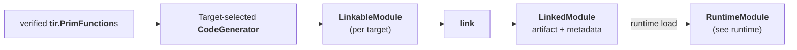

# TileFoundry Spec — Codegen

Codegen turns verified, lowered `tir.PrimFunction`s into a loadable artifact.
It owns the whole producer side of the build: emitting per-target source,
assembling each target's translation unit, and linking those units into one
host-callable shared library. Loading that artifact and exposing it as a
`RuntimeModule` is owned by [runtime](./runtime.md).


```mermaid
flowchart LR
    TIR["verified <b>tir.PrimFunction</b>s"]
    Emit["Target-selected <b>CodeGenerator</b>"]
    LM["<b>LinkableModule</b><br/>(per target)"]
    Link["<b>link</b>"]
    Linked["<b>LinkedModule</b><br/>artifact + metadata"]
    RM["<b>RuntimeModule</b><br/>(see runtime)"]

    TIR --> Emit --> LM --> Link --> Linked
    Linked -. runtime load .-> RM
```

## 1. Pipeline

- **Input** is verified TIR. HIR Ops MUST NOT reach codegen.
- A module's functions are grouped by equal Target values in source order. Each
  group is emitted by the exact Target's CodeGenerator into one
  `LinkableModule`.
- The link step compiles every `LinkableModule` with its own toolchain and
  links them into one `LinkedModule` — a host-callable shared library plus the
  host-visible metadata the loader needs.
- Codegen does not run passes, does not load or launch device code, and does
  not own the user-facing entry points (`compile` / `build` / `jit`).
- **Host / device boundary.** A host `LinkableModule` MUST NOT reference CUDA or
  CuTe symbols or types. A CUDA `LinkableModule` owns the kernels and their
  C-ABI launch shims. The host module invokes device code only through that
  C-ABI shim.

The target-specific generator behavior — how a CPU vs CUDA function emits, the
dispatch and shape-scalar ABI, program-shape / dynamic-CTA accessors, and the
`ShardLayout` runtime mapping — is owned by [target](./target.md).

## 2. CodeGenerator

A generator walks verified `tir.PrimFunction`s and produces source plus the
metadata the link step needs.

### 2.1 Target-selected service

```python
class CodeGenerator:
    emit: Callable[
        [Module, tuple[PrimFunction, ...], Target], LinkableModule
    ]


class Target:
    def get_code_generator(self) -> CodeGenerator: ...


def emit_cuda_module(
    module: Module,
    functions: tuple[PrimFunction, ...],
    target: Target,
) -> LinkableModule: ...
```

- constraints:
  - A Target MUST return one immutable CodeGenerator descriptor. A subclass MAY
    inherit its base generator without another registration step.
  - All generators MUST share the `(module, functions, target)` callable shape.
  - Generator selection MUST NOT branch on `Target.name`. There MUST be no
    emitter registry or string-to-emitter lookup.
  - A second unequal CUDA Target group MUST fail before any generator emits;
    multiple device translation units or architectures in one linked artifact
    are unsupported.

A generator MUST consume only TIR and MUST return a `LinkableModule` for its
backend. The emitter file layout mirrors the IR file layout
(`codegen/<target>/tir/...` parallels `ir/tir/...`); the mirror rule is owned
by [code-organization](./code-organization.md).

### 2.2 Per-Op handler registry

```python
def handler(call: Call, ctx: CodegenContext) -> None: ...
```

- constraints:
  - a handler is registered inside a concrete generator with the per-backend
    `register_codegen_*` decorator ([visitor-registry §6](./visitor-registry.md#6-instance-3--codegen_));
    dispatch (matching `Evaluate` and selecting the handler) is owned by
    visitor-registry.

Dispatch is owned by [visitor-registry §6](./visitor-registry.md#6-instance-3--codegen_). A handler
receives the `Call` (the wrapped Op inside `Evaluate`) plus a `CodegenContext`,
and MUST emit through `ctx.emit(...)`; raw `print` / direct file writes are
prohibited.

### 2.3 `CodegenContext`

```python
class CodegenContext:
    """Mutable CUDA source builder passed to registered handlers."""

    def reset_barrier_ids(self) -> None: ...
    def alloc_barrier_id(self) -> int: ...
    def dtype_to_cpp(self, dtype_name: str) -> str: ...
    def register_kernel_param(self, var) -> None: ...
    def is_kernel_param(self, var) -> bool: ...
    def emit(self, line: str) -> None: ...
    def blank(self) -> None: ...
    def indent(self) -> None: ...
    def dedent(self) -> None: ...
    def name_for(self, var) -> str: ...
    def source(self) -> str: ...
    def capture(self, fn) -> str: ...
    def emit_node(self, node) -> None: ...
```

- constraints:
  - This is the concrete CUDA context; it has a zero-argument constructor and
    keeps its output, indentation, symbol table, and counters private.
  - `emit_node` dispatches `Evaluate(op, args)` by the wrapped Op class; all
    other nodes dispatch by their own class.
  - `source` returns accumulated source text, and `capture` temporarily isolates
    only the output buffer while preserving indentation and symbol bindings.
  - The context is the single source of truth for target-side type strings, so
    handlers do not read the IR for them directly.

A handler MUST NOT reach into the IR for type strings on its own; the context is
the single source of truth. Other helpers MAY be added per target.

### 2.4 Effect Op dispatch

Effect Ops (`Copy`, `Fill`, `Mma`, `tir.nn.*`, ...) appear in Stmt
position as `Evaluate(op, args)` rather than as Stmt subclasses. The
walker matches `Evaluate` and dispatches on `type(callable)` through
the handler registry. Handlers stay small; the runtime function they
call carries the semantic load.

## 3. Runtime-owned op dispatch

Where more than one runtime template implements an op, codegen emits **one
uniform runtime op call**, passing the operand `ShardLayout`s (and any
codegen-static participant geometry) as compile-time template parameters. The
runtime template dispatches on those layouts at compile time; codegen does not
select a tier, compute a per-tier parameter, or carry the selection on the TIR
op. This is the codegen side of the runtime-owned dispatch principle, whose
contract lives in [runtime.md §3](./runtime.md#3-runtime-ops). The target-side
emission that produces these calls is owned by [target](./target.md).

## 4. Codegen products

### 4.1 `LinkableFunction`


One lowered function's pre-link source.

```python
class LinkableFunction:
    """One lowered function's pre-link source.

    Attributes:
        name: attribute; function or kernel symbol.
        source: attribute; emitted function text.
    """

    name: str
    source: str
```

- constraints:
  - No additional constraints.

### 4.2 `LinkableModule`

One target's pre-link translation unit.

```python
class LinkableModule:
    """One target's pre-link translation unit.

    Attributes:
        target: attribute; generator/linker backend label.
        language: attribute; source language.
        source: attribute; assembled translation-unit text.
        functions: attribute; constituent linkable functions in emission order.
    """

    target: str
    language: str
    source: str
    functions: tuple[LinkableFunction, ...] = field(default_factory=tuple)
```

- constraints:
  - `target` MUST be the generator/linker backend label (`"cuda"` or `"cpu"`
    for the built-ins), never an external Target registration name.
  - MUST be the source language: `cu` for a CUDA translation unit, `cpp` for a
    host translation unit.
  - MUST list the module's constituent `LinkableFunction`s, in emission order.

A `LinkableModule` is a build artifact, not a runtime object and not a
user-callable.

### 4.3 `LinkedModule`

The link output: a loadable artifact plus the host-visible metadata the loader
needs.

```python
class LinkedModule:
    """Linked library plus host-visible ABI metadata.

    Attributes:
        library_path: attribute; produced shared-library path.
        source: attribute; assembled host and device source.
        entry: attribute; host-visible ABI of the module entry.
    """

    library_path: Path
    source: str
    entry: EntryABI
```

- constraints:
  - MUST carry the assembled host + device source — the diagnostic source the
    runtime exposes as `RuntimeModule.source` ([runtime](./runtime.md)).

The `entry` `EntryABI` is a host-visible ABI metadata type owned by
[runtime](./runtime.md); codegen references it on `LinkedModule` and MUST NOT
redefine it.

The link step consumes the per-target `LinkableModule`s, compiles each with its
own toolchain, and links them into one `LinkedModule`. `LinkedModule` is
consumed by the runtime loader ([runtime](./runtime.md)); the concrete compiler
commands are an implementation detail and not part of the contract.
