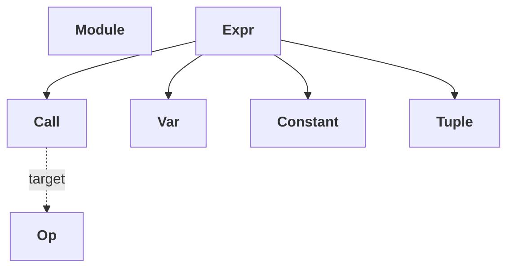

# TileFoundry Spec — core_ir

Defines the shared node algebra — `Module` / `Expr` / `Op` / `Call` /
`Var` / `Constant` / `Tuple` — that both HIR and TIR consume. `core_ir` is the
shared node algebra layer, not a standalone IR: HIR and TIR each extend it with
their own `Function` container and their own `Op` / `Stmt` subclasses. Types
carried by `Expr.type` are defined in [types](./types.md); the distributed
layout layer is [shard](./shard.md); `Stmt` is not here — it lives only in
[tir §1](./tir.md) as a TIR-only base class.



`Module.functions` is `hir.Function | tir.PrimFunction`; the
heterogeneous container is described in [§1](#1-module). HIR
`Function` is an `Expr` subclass, TIR `PrimFunction` is a `Stmt`
subclass — the diagram above intentionally does not draw an edge
from `Module` to `Expr` to avoid implying that all functions are
Exprs.

## 1. `Module`

```python
@dataclass(frozen=True)
class Module:
    """The top-level compilation unit. Parser output; pass input/output."""
    name: str
    functions: tuple["hir.Function | tir.PrimFunction", ...]
    entry: str                         # required: a name in `functions`
    topologies: tuple[Topology, ...]   # module-level program topology namespace
    metadata: dict[str, object]        # target / option metadata, never semantic mesh bindings
```

- `parse_module` (see [parser §1](./parser.md)) returns a `Module`.
- `entry` is the public entry point — `tilefoundry.lower(...)` and the
  emitter both start there. Other functions only enter the output if
  they are reachable from `entry`.
- `entry` MUST be the `name` of a function present in `functions`;
  the verifier checks this.
- A bare `@func` / `@prim_func` becomes an implicit single-function
  `Module` whose `entry` is set to that function. If the function
  declares `topologies`, those declarations lift to the module-level
  `topologies` namespace.
- Same-module `@prim_func` calls resolve through the module's symbol
  table, not Python closures.
- `topologies` is the module-level program topology namespace.
  `with Mesh(topology="cta", ...)` inside a function body looks up
  topologies here by name and creates a lexical mesh binding.
- `metadata` carries target / compiler-option configuration, never
  semantic topology / mesh information.
- Constructing a `Module` **seals** its functions: each base function and
  its specialization variants are finalized. Variants may be added to a
  base only during authoring, before the base enters a `Module`; once
  sealed, adding a variant is an error
  ([hir.md §1.1](./hir.md#11-function)).

### 1.1 Function access

A `Module` mirrors the model it describes: a caller reaches a kernel by name.

Each `name` maps to at most one `Module.functions` entry. Shape-specialization
variants of a function live inside that entry's `Function.variants`
([hir.md §1.1](./hir.md#11-function)), never as separate same-name
entries — so name resolution is always single-valued.

- `mod.lookup(name)` returns the function named `name`; it raises when no
  function matches. This is the canonical name-resolution contract (e.g. for a
  `SymbolRef` callee).
- `mod.function_named(name)` returns the entries named `name`. In a verified
  module this is length 0 or 1 (variants are not separate entries).
- `mod.entry_function()` returns the function named by `entry`.
- Python attribute access `mod.<name>` is sugar for name lookup: it MUST return
  the function when one is named `<name>` and MUST raise `AttributeError` when
  none match. Names beginning with `_` are never functions and resolve by normal
  attribute rules. This lets a module read like the model it mirrors —
  `decoder.self_attention`.

## 2. `Expr`

```python
class Expr:
    """Every expression node. In HIR, an Expr is the SSA value; in TIR,
    Stmts embed Exprs in their Expr-typed sub-fields."""
    type: IRType                  # see [types §1](./types.md)
    source: str | None            # optional: original source slice for debug / error location
```

`Expr` always carries a `type`. The runtime class of `Expr.type` is
one of `TensorType` / `TupleType` / `UnitType`
([types §2 / §4 / §6](./types.md)). Concrete `Expr` subclasses are
not introduced per Op — value-producing Ops appear as `Call` nodes
whose `target` carries the Op instance. Multi-output Ops produce a
single `Call` whose `type` is `TupleType`; consumers project a single
field through the `tuple_get_item` Op (a regular registered Op; no
dedicated `Expr` subclass).

Dialect-specific `Expr` subclasses are owned by their dialect specs, not
here: HIR owns `Function` and `GridRegionExpr` ([hir §1](./hir.md#1-hir-expr-constructs)),
and TIR owns `SymbolRef` and other TIR-specific `Expr` constructs
([tir](./tir.md)).

### 2.1 `Call`

```python
@dataclass(frozen=True)
class Call(Expr):
    """A call to an Op. The HIR body is a tree of value-form Calls; in
    TIR a value-form Call is anchored by LetStmt, while a Stmt-position
    effect invocation is Evaluate(op, args) (tir §1.4). A Call MUST NOT
    appear as a top-level Stmt directly."""
    target: Op
    args: tuple[Expr, ...]
    # type is computed by typeinfer(target, args); it is one of
    # TensorType / TupleType / UnitType depending on the Op's form.
```

Constraints:

- `len(args)` MUST equal the number of `kind="input"` ParamDefs on
  `target`.
- Each `args[i].type` MUST satisfy the i-th input ParamDef's pattern
  / typeinfer rule.

### 2.2 `Var` / `Constant` / `Tuple`

```python
@dataclass(frozen=True)
class Var(Expr):
    """A named value. HIR uses Var for function parameters; TIR uses Var
    for LetStmt / For / MeshScope bindings."""
    name: str
    type: IRType                  # declaration-side type; the binding stmt does not override it

@dataclass(frozen=True)
class Constant(Expr):
    """Literal constant. A scalar is a rank-0 TensorType."""
    value: object       # int / float / tuple / ...

@dataclass(frozen=True)
class Tuple(Expr):
    """Value-level multi-output aggregate. type is TupleType
    ([types §4](./types.md))."""
    fields: tuple[Expr, ...]
```

`Tuple` is the value-level aggregate node; it pairs with `TupleType`
([types §4](./types.md)) but is not the same — `Tuple` is an `Expr`
in the IR graph, `TupleType` is the type carried by `Expr.type`.

### 2.3 `Op`

`Op` is a value class (it describes an op's signature and attributes)
— not an `Expr` subclass. A `Call` carries an `Op` instance in its
`target` field. The custom-op mechanism is declared here: parameters are
`ParamDef` class attributes discovered through reflection, and a class is
registered with `@register_op`.

```python
class Op:
    """Base of every Op. Ops are value-producing through Call. Most are
    pure; TIR has resource-introducing Ops (e.g. tir.memory.AllocTensor)
    with positional-identity requirements that MUST be anchored by a
    LetStmt — see [tir §2.3](./tir.md#23-tir-ops). Parameters are declared as
    ParamDef class attributes and discovered through reflection."""

    @classmethod
    def params(cls) -> list[ParamDef]:
        """Reflectively scan class-level ParamDef attributes and return
        the ordered ParamDef list."""

    def __init__(self, **attrs): ...
```

```python
@dataclass(frozen=True)
class ParamDef:
    """Single Op parameter descriptor."""
    kind: Literal["input", "attribute"]
    annotation: type | None = None     # Python type (Expr / int / bool / tuple / ...)
    pattern: Pattern | None = None     # input-kind only: pattern matched against arg.type
    default: object = MISSING          # attribute-kind only: omitted-call default
    optional: bool = False             # attribute-kind only: nullable
```

Example:

```python
@register_op
class Binary(Op):
    lhs  = ParamDef(kind="input", pattern=Tensor)
    rhs  = ParamDef(kind="input", pattern=Tensor)
    kind = ParamDef(kind="attribute", annotation=BinaryKind)

@register_op
class ReduceSum(Op):
    input    = ParamDef(kind="input", pattern=Tensor)
    axis     = ParamDef(kind="attribute", annotation=int)
    keepdims = ParamDef(kind="attribute", annotation=bool, default=False)
```

**Instantiation**:

- An Op with no `kind="attribute"` parameter returns the same
  singleton from each `Op()` call.
- An Op with attributes (e.g. `Binary`, `ReduceSum`) carries the
  attribute values on the instance: `Binary(kind=BinaryKind.ADD)` /
  `ReduceSum(axis=1, keepdims=True)`.

#### Surface aliases (`@register_alias`)

A **surface alias** is a registry entry that has no IR class of its
own; instead, its `OpSchema.builder` callback constructs a *target*
Op with some attributes pre-fixed. Aliases let several user-callable
surface names share a single kinded IR class without exposing the
`kind=...` attribute at the call site.

```python
@register_alias(dialect="tf", category="math", name="add",
                params=[Binary.lhs, Binary.rhs])
def _add() -> Op:
    return Binary(kind=BinaryKind.ADD)
```

Properties:

- `OpSchema.op_class is None` — alias schemas have no IR class.
- `params` reuses the **static `ParamDef` references** of the target
  Op. The alias never re-declares ParamDef structures.
- `builder` takes attribute kwargs only; input args still flow into
  `Call.args` via the parser. For a value-form alias whose builder
  fixes every attribute (e.g. `add` fixes `kind`), the builder takes
  zero kwargs.
- Aliases prepend to the schema bucket so they win first-match
  resolution. `_first_op_class` skips alias entries so any
  ``op_class``-keyed legacy lookup transparently sees the real class
  registered for the same name (or `None` when there is none).

HIR `math` uses aliases for kinded sugar names (`add` / `sub` /
... / `cmp_eq` / ... / `neg` / ...); the IR core has just `Binary`
/ `Unary` (see [hir math ops](./hir.md#irhirmath)).

#### Input position and form

The order of `kind="input"` ParamDefs determines `Call.args`
position: `call.args[i]` corresponds to the `i`-th input ParamDef
from `op.params()`.

An Op is **value-form** when its `Call` produces an observable
result the IR consumes — `Call.type` is then `TensorType` or
`TupleType`. An Op is **effect-form** when it performs an in-place
effect (e.g. `tir.memory.Copy` / `tir.cuda.nn.Mma`) and produces no
readable value (`UnitType`, [types §6](./types.md)); in Stmt position
it appears as `Evaluate(op, args)`
([tir §1.4](./tir.md#14-evaluate)).

## 3. `Pattern`

`Pattern` is the reusable predicate carrier shared by parser dispatch
and specialization dispatch.

```python
@dataclass(frozen=True)
class Pattern:
    """Base predicate. Subclasses override match(subject) -> bool."""

    def match(self, subject) -> bool: ...
```

Two consumer surfaces:

- **Parser dispatch** — `ParamDef.pattern` (§2.3) is matched against an
  argument's `Expr.type` during overload resolution. Subclasses used:
  `ScalarPat` (rank-0), `TensorPat(rank?, dtype?)` (non-scalar), and
  `AndPat(parts)` (conjunction). Two singletons are exported as
  convenience: `Scalar = ScalarPat()` and `Tensor = TensorPat()`.
- **Specialization dispatch** — patterns appearing in
  `hir.Function.specializations` ([hir.md §1.1](./hir.md#11-function))
  and the parallel `tir.DispatchCall.case_patterns`
  ([tir.md §1.6](./tir.md#16-dispatchcall)) describe which runtime
  shape range a variant covers. The HIR→TIR lowering inspects each
  pattern's fields directly; it does not call `match`.

### 3.1 `DimVarRangePat`

```python
@dataclass(frozen=True)
class DimVarRangePat(Pattern):
    dim_var: str
    lo: int
    hi: int
```

- `dim_var` MUST be a non-empty `str` — the name of the `DimVar` the
  range applies to. The lowering resolves it to a runtime
  `ShapeOf(param, axis)` by walking the enclosing function signature.
- `lo` and `hi` MUST be plain `int`s (`bool` is rejected).
- The interval is half-open `[lo, hi)` (`lo` inclusive, `hi`
  exclusive); construction MUST satisfy `lo < hi`. A single-point
  range is `[k, k+1)`.
- `match(value)` returns `True` for an `int` value `v` iff
  `lo <= v < hi`. The `dim_var` field does not participate in
  `match`.
- The pattern references a `DimVar` by name only. The envelope of
  the named dim lives on the `DimVar(name, lo, hi)` itself (see
  [types.md §4](./types.md#4-dim--symbolic-shape-dimensions)); the
  `DimVarRangePat` carries the per-variant sub-range. Envelope
  containment (`pattern ⊆ DimVar envelope`) is checked in
  signature context — by the `@tilefoundry.func` validator and the
  HIR→TIR lowering — not by `DimVarRangePat.__post_init__`.
