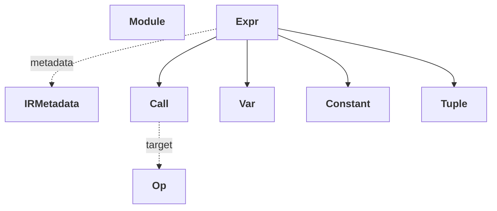

# TileFoundry Spec — core_ir

Defines the shared node algebra — `Module` / `Expr` / `IRMetadata` / `Op` /
`Call` / `Var` / `Constant` / `Tuple` — that both HIR and TIR consume.
`core_ir` is the shared node algebra layer, not a standalone IR: HIR and TIR
each extend it with their own `Function` container and their own `Op` / `Stmt`
subclasses. Types carried by `Expr.type` are defined in [types](./types.md);
the distributed layout layer is [shard](./shard.md); `Stmt` is not here — it
lives only in [tir §1](./tir.md#1-tir-stmt-hierarchy) as a TIR-only base class.


```mermaid
flowchart TB
    Module["<b>Module</b>"]
    Expr["<b>Expr</b>"]
    IRMetadata["<b>IRMetadata</b>"]
    Op["<b>Op</b>"]
    Call["<b>Call</b>"]
    Var["<b>Var</b>"]
    Constant["<b>Constant</b>"]
    Tuple["<b>Tuple</b>"]
    Expr --> Var
    Expr --> Constant
    Expr --> Tuple
    Expr --> Call
    Expr -. metadata .-> IRMetadata
    Call -. target .-> Op
```

`Module.functions` is `hir.Function | tir.PrimFunction`; the
heterogeneous container is described in [§1](#1-module). HIR
`Function` is an `Expr` subclass, TIR `PrimFunction` is a `Stmt`
subclass — the diagram above intentionally does not draw an edge
from `Module` to `Expr` to avoid implying that all functions are
Exprs.

## 1. `Module`

```python
class Module:
    """Contain one execution domain and its owned module tree.

    Attributes:
        name: attribute; Module name within its owner.
        functions: attribute; Heterogeneous HIR and TIR function container.
        entry: attribute; Optional public entry-function name.
        modules: attribute; Child modules named by their attachment attributes.
        target: attribute; Declared hardware target, or None to inherit.
        topologies: attribute; Declared hierarchy, None to inherit, or an empty tuple.
        metadata: attribute; Target and compiler-option metadata.
        methods: attribute; Plain Python orchestration methods.
    """

    name: str
    functions: tuple[hir.Function | tir.PrimFunction, ...]
    entry: str | None = None
    modules: tuple["Module", ...] = field(default_factory=tuple)
    target: Target | None = None
    topologies: tuple[Topology, ...] | None = None
    metadata: dict[str, object] = field(default_factory=dict)
    methods: Mapping[str, object] = field(default_factory=dict)

    def weights(self) -> Mapping[str, TensorType]: ...
    def resolve_target(self) -> Target: ...
    def effective_topologies(self) -> tuple[Topology, ...]: ...
    def resolve_topology(self, name: str) -> Topology: ...
    def owns(self, function: object, *, derived: bool = False) -> bool: ...
    def load(self, resource) -> "LoadedModule": ...
    def forward(self, *args): ...
    def prepare(
        self, raw, out_dir: str, *, device: str = "cpu"
    ) -> None: ...
```

- constraints:
  - the top-level compilation unit (parser output; pass input/output);
    constructing a `Module` seals its functions.
  - a `Module` is the execution domain of the functions it owns: it, not they,
    declares the `Target` and the ordered `Topology` hierarchy.
  - a `Module` owns its child subtree. Placing a child that already belongs to
    another owner MUST NOT change what the first owner's subtree resolves.
  - `owns(function)` MUST use identity and accept the Module's direct functions
    and their specialization variants. With `derived=True`, it MUST also follow
    a rebuilt function's recorded origin
    ([hir §2](./hir.md#2-function-specialization-api)) for the whole chain, not
    only its first edge — a rebuild may itself be rebuilt; equal copies and
    same-name functions from another Module MUST remain unowned.

A `Module` is a static ownership and execution-context container, not a dynamic
invocation. Owning a `Function`, attaching a child `Module`, or declaring a
`Target` or `Topology` hierarchy never itself begins or counts an invocation;
Python-to-HIR entry and HIR-to-HIR device calls are governed by
[hir §1.1](./hir.md#11-function).

- `parse_module` (see [parser §2](./parser.md#2-syntax-and-rules)) returns a `Module`.
- A bare `@func` / `@prim_func` becomes an implicit single-function
  `Module` whose `entry` is set to that function. A function that declares
  execution context of its own is therefore already a `Module`.
- Same-module `@prim_func` calls resolve through the module's symbol
  table, not Python closures.
- `topologies` is the execution domain's complete ordered hierarchy.
  `with Mesh(("cta",), layout=...)` inside a function body names one of the
  effective levels and creates a lexical mesh binding.

**Effective context.** `target` and `topologies` record what a Module
*declares*, not what it resolves to; resolution is lexical over the owner
chain and is not copied onto each Module or Function.

- constraints:
  - `topologies = None` declares nothing and inherits the owner's hierarchy;
  `topologies = ()` declares an explicitly topology-free domain; an explicit
  tuple replaces the inherited hierarchy whole rather than extending it. A
  declared tuple MUST NOT repeat a level name.
  - `resolve_topology(name)` returns the single effective level with that exact
  name and MUST fail, naming the levels that are available, when there is
  none.
  - `metadata` carries target / compiler-option configuration, never
  semantic topology / mesh information.
  - Each entry of `modules` is named by the attribute it is attached under —
  torch / HuggingFace checkpoint-naming semantics: assigning a child to
  `self.self_attn` in a class body names that child `self_attn` in the tree,
  independent of the child's own `name`.
  - `mod.cloned()` returns an independent copy: its functions, their bodies, its
  children, and every `Call` targeting one of them are copies, with internal
  `Call.target`s redirected to the copy. The immutable context around the node —
  its owner, `target` and `topologies` — MUST stay shared, since those are not
  part of it. `mod.renamed(name)` is that copy under a different `name`.
  Copying rather than sharing is required, not an optimisation to skip: an
  analysis records its result on the IR it measured, in place, so two nodes
  holding one Function would report one measurement under two names. This is
  what lets one definition become N distinct instances (N decoder layers, each
  renamed by index) and one prototype serve any number of independent builds.
  - `methods` collects plain Python functions (orchestration methods, e.g.
  `forward` / `init_caches`; full collection rule in
  [parser §3](./parser.md#3-implementation-overview)). A function name,
  a child module name, and a method name MUST be disjoint at one `Module`'s
  own level — all three resolve through the same attribute surface ([§1.1](#11-function-access)
  below), so a name used by more than one would be ambiguous.
  - `weights` is a derived property, not a stored field: each access unions
  every function's `ConstTensor` params (`Var.is_const`), in (function
  order, param order); the same name in two functions MUST carry an
  identical `TensorType`, or the access raises. There is no `states` field
  or persistent-state concept in the IR — a tensor that must survive across
  steps (e.g. a KV cache) is an ordinary `Tensor` param the caller passes in
  and receives back explicitly ([runtime §1.1.2](./runtime.md#112-weight-converter-and-prepare--forward)).
  - Constructing a `Module` **seals** its functions: each base function and
  its specialization variants are finalized. Variants may be added to a
  base only during authoring, before the base enters a `Module`; once
  sealed, adding a variant is an error
  ([hir.md §1.1](./hir.md#11-function)).

#### Target inheritance

A Module's target declaration belongs to its execution domain and is resolved
through its owner chain.

- constraints:
  - `resolve_target()` MUST return this Module's declared target when it has
    one; otherwise it MUST return the nearest target declared by an owner.
  - Only the outermost Module of a tree MAY declare a target. A child Module
    that declares a target of its own MUST be refused when it is attached, and
    MUST inherit its owner's target instead.
  - A Module with no declaration anywhere in its owner chain MUST be refused
    when its target is resolved. Its root Module MUST declare one, for example
    with `target=CudaTarget("nvidia.h200_sxm")`.
  - A Target declaration MUST be a constructed Target instance.
    A string MUST be refused rather than resolved or constructed.
  - `resolve_target()` MUST return the exact instance the root declared; it MUST
    NOT reconstruct or replace an equal value.
  - A Module reused as an owned child and as an independently analysed root
    declares a target only in the latter role.
  - A Module published as an independently analysable root MUST declare both
    its target and the topology levels it is aimed at, so that Analyze answers
    it as it is published rather than after an edit. Naming the device is
    enough; the architecture is derived from that device's document
    ([target §4](./target.md#4-cudatarget)).
  - Declaring a Module MUST NOT require a target. Whether a Module becomes an
    owned child is decided by the owner, after the child has been constructed,
    so a construction-time requirement would refuse trees whose children
    correctly declare nothing.

#### Default step

A Module's optional `entry` determines whether it exposes a default execution
step.

- constraints:
  - When `entry` is present, it MUST name a function in `functions`.
    `entry_function()` MUST return that function, and `tilefoundry.lower(...)`
    and the emitter MUST start there. Other functions enter the output only when
    reachable from `entry`.
  - When `entry` is omitted (`None`), the Module MUST have no default step.
    `entry_function()` and a bare call MUST be refused, naming the Module's
    functions and explaining that one is selected with `lookup('<name>')`.
    Each function remains reachable by name. A Module that composes children in
    an orchestration method has no single step to nominate.
  - A bare `@func` / `@prim_func` MUST become an implicit single-function
    Module whose `entry` names that function.

The shared HIR call-graph queries are:

```python
def called_functions(function: HirFunction) -> tuple[HirFunction, ...]: ...
def reachable_functions(root: HirFunction) -> tuple[HirFunction, ...]: ...
```

- constraints:
  - `called_functions` MUST return each direct Function-call target in the
    body's operand-before-consumer definition order. Repeated call sites remain
    repeated entries.
  - `reachable_functions` MUST return the root followed by its transitively
    called Functions, callers before callees and deduplicated by Function
    identity.

### 1.1 Function access

A `Module` mirrors the model it describes: a caller reaches a kernel, a child
component, or an orchestration step through the same attribute surface.

Each `name` maps to at most one entry among `Module.functions`,
`Module.modules`, and `Module.methods`. Within `functions`,
shape-specialization variants live inside that entry's `Function.variants`
([hir.md §1.1](./hir.md#11-function)), never as separate same-name entries.

- constraints:
  - A function name, child-module name, and method name MUST be mutually
  disjoint at one Module's own level.
  - `mod.lookup(name)` returns the function named `name`; it raises unless
  exactly one function matches. This is the canonical name-resolution
  contract (e.g. for a `SymbolRef` callee) and always returns the `Function`
  / `PrimFunction` node itself.
  - `mod.function_named(name)` returns the entries named `name`. In a verified
  module this is length 0 or 1 (variants are not separate entries).
  - `mod.entry_function()` returns the function named by `entry`.
  - Python attribute access `mod.<name>` resolves, in order, a function, a
  child module, or a method named `<name>`, and MUST raise `AttributeError`
  when none match or when more than one same-kind entry shares the name. A
  **function** name resolves to a callable that runs it — not to the
  `Function` / `PrimFunction` node itself (reach that with `lookup` /
  `function_named` above). A `Module` holds no constants, so that callable
  takes **one argument per declared param**, a `ConstTensor` one included; the
  callable that fills constants from bindings instead belongs to
  `LoadedModule`, which runs on the one device its bindings and activations
  agree on ([runtime §1.1.2](./runtime.md#112-weight-converter-and-prepare--forward)). A **child module** name
  resolves to that child `Module`. A **method** name resolves to the
  class-body function bound like an instance method (`m.forward(...)`). Names
  beginning with `_` are never functions, modules, or methods and resolve by
  normal attribute rules. This lets a module read like the model it mirrors —
  `decoder.layer0.attention(...)`.

### 1.2 Selecting a node by path

A caller that names one kernel of a tree needs the kernel *and* the execution
domain it belongs to: a `Function` carries neither the Target its numbers are
measured against nor the topology hierarchy they divide over, so a bare function
is not a thing a cost can be stated about.

- constraints:
  - `select(module, path)` MUST resolve a dotted `path` relative to `module`
    and return a `Module`. Each segment MUST name a child module, except that
    the last MAY instead name one of the reached module's own functions and
    return that module re-entried at it. An empty path is the input module; an
    empty segment MUST be refused.
  - `function_selectors(module)` MUST return every HIR function in the module
    tree paired with its resolving path, in source order and parents before
    children. It MUST NOT return `PrimFunction` entries.

## 2. `Expr`

```python
class IRMetadata:
    """Describe one immutable expression annotation."""

class BindingMetadata(IRMetadata):
    """Describe an authored SSA binding name.

    Attributes:
        name: attribute; Authored binding name.
    """

    name: str

class ExecutionDomainMetadata(IRMetadata):
    """Describe the Mesh scopes an occurrence was authored inside.

    Attributes:
        scopes: attribute; Enclosing Mesh scopes, outermost first.
    """

    scopes: tuple["Mesh", ...] = ()

    def at(self, level: str) -> "Mesh | None": ...

class SourceSpanMetadata(IRMetadata):
    """Describe an authored source range.

    Attributes:
        file: attribute; Source file.
        line: attribute; Starting line.
        column: attribute; Starting column.
        end_line: attribute; Optional ending line.
        end_column: attribute; Optional ending column.
    """

    file: str
    line: int
    column: int
    end_line: int | None = None
    end_column: int | None = None
```

- constraints:
  - the immutable base of every typed annotation stored on an `Expr`: typed
    fields and nothing about how they are read. What a record looks like as text
    or as JSON is decided by inspection
    ([inspection §2.8](./inspection.md#28-record-comment-forms)), so a record
    MUST NOT carry a rendering, a key name, or a family name of its own.
  - `BindingMetadata` is the authored SSA label. The parser maps explicit DSL
    `loc=` syntax and inferred assignment names to this metadata; there is no
    parallel `Expr.loc` field.
  - `SourceSpanMetadata` records the parser source range before type inference.
  - `ExecutionDomainMetadata` records the `with Mesh(...)` scopes a `Call` was
    written inside, outermost first
    ([parser §2.1](./parser.md#21-syntax)). `at(level)` returns the
    innermost scope naming *level*, or `None` when none does. It states where
    the work ran, which is not what the result's layout states -- a value laid
    out across threads may have been produced by work one CTA did -- so the two
    MUST NOT be derived from each other. A rebuild that binds a dimension MUST
    restate these scopes at the bound extents, exactly as it restates types: a
    concrete program whose own execution domain is still a range has no
    positions to count.

```python
class Expr:
    """Provide the mutable base for every typed expression.

    Attributes:
        type: attribute; Expression type.
        metadata: attribute; Typed expression annotations.
    """

    type: Type
    metadata: tuple[IRMetadata, ...] = ()
```

- constraints:
  - base of every expression node; concrete subclasses are dialect-owned, not
    introduced per Op (value-producing Ops appear as `Call` nodes).
  - `type` and `metadata` may be updated by the authorised typing and analysis
    passes; expression equality remains structural and metadata is excluded.
  - `metadata` contains only `IRMetadata` values and contains at most one value
    of each exact concrete metadata class; invalid entries or duplicate classes
    raise `VerifyError`, including `SourceSpanMetadata` or `BindingMetadata`
    context when it is available.
  - `metadata` MUST NOT participate in expression equality, hashing, or repr.

```python
def get_metadata(expr: "Expr", cls: type[T]) -> T | None: ...
def replace_metadata(expr: "Expr", value: IRMetadata) -> "Expr": ...
def remove_metadata(expr: "Expr", cls: type[IRMetadata]) -> "Expr": ...
def attach_metadata(expr: "Expr", value: IRMetadata) -> None: ...
def detach_metadata(expr: "Expr", cls: type[IRMetadata]) -> None: ...
def binding_name(expr: "Expr") -> str | None: ...
def describe_expr(expr: "Expr") -> str: ...
def diagnostic_location(expr: "Expr") -> str | None: ...
def source_metadata(expr: "Expr") -> tuple[IRMetadata, ...]: ...
```

- constraints:
  - `get_metadata`, `replace_metadata`, and `remove_metadata` match an exact
    concrete class, not subclasses, and never mutate the input expression.
  - `get_metadata` returns the unique matching value or `None`.
  - `replace_metadata` returns a copy with the matching value replaced in its
    existing position; every other value keeps its relative order, and a value
    whose class is absent is appended.
  - `remove_metadata` returns a copy without the matching value; when the class
    is absent it returns the input expression unchanged.
  - `attach_metadata` and `detach_metadata` perform those exact-class updates
    in place for passes that annotate the caller's IR. Attaching replaces any
    existing value and appends the new value after the retained metadata.
  - `binding_name` returns the authored SSA label. `diagnostic_location`
    prefers a source span and falls back to that label. `source_metadata`
    copies only binding/span metadata when a compiler pass synthesizes a
    replacement expression.
  - `describe_expr` returns one diagnostic line with the source span when
    present, the binding name or `<unnamed>`, and the Call target or Expr class.

`Expr` always carries a `type`. The runtime class of `Expr.type` is
one of `TensorType` / `TupleType` / `UnitType`
([types §2](./types.md#2-tensortype) / [types §4](./types.md#4-dim--symbolic-shape-dimensions)
/ [types §6](./types.md#6-unittype)). Concrete `Expr` subclasses are
not introduced per Op — value-producing Ops appear as `Call` nodes
whose `target` carries the Op instance. Multi-output Ops produce a
single `Call` whose `type` is `TupleType`; consumers project a single
field through the `tuple_get_item` Op (a regular registered Op; no
dedicated `Expr` subclass).

Dialect-specific `Expr` subclasses are owned by their dialect specs, not
here: HIR owns `Function` and `GridRegionExpr` ([hir §1](./hir.md#1-hir-expr-constructs)),
and TIR owns `SymbolRef` and other TIR-specific `Expr` constructs
([tir](./tir.md)).

### 2.1 `Call`

```python
class Call(Expr):
    """Represent an Op invocation.

    Attributes:
        target: attribute; Op being called.
        args: attribute; Input expressions in parameter order.
    """

    target: Op
    args: tuple[Expr, ...]
```

- constraints:
  - a value-form `Call` is anchored by `LetStmt` in TIR; a Stmt-position effect
    invocation is `Evaluate(op, args)`.
  - A `Call` MUST NOT appear as a top-level Stmt directly.
  - Normally, `len(args)` MUST equal the number of `kind="input"` ParamDefs on
    `target`. A sole input annotated `Tuple[T]` describes a variadic sequence,
    and every flattened argument corresponds to that ParamDef.
  - Each argument MUST satisfy its corresponding input ParamDef's pattern /
    typeinfer rule.

### 2.2 `Var` / `Constant` / `Tuple`

```python
class Var(Expr):
    """Represent a named value.

    Attributes:
        name: attribute; Value name.
        type: attribute; Declaration-side type.
        is_const: attribute; Whether this is an external constant parameter.
    """

    name: str
    type: Type
    is_const: bool = False

class Constant(Expr):
    """Represent a literal value.

    Attributes:
        value: attribute; Literal payload.
    """

    value: object

class Tuple(Expr):
    """Represent a value-level aggregate.

    Attributes:
        elements: attribute; Aggregate elements in field order.
    """

    elements: tuple[Expr, ...]
```

- constraints:
  - `Tuple` is an `Expr` in the IR graph, distinct from the `TupleType` it carries.
  - `Var.is_const` MUST be preserved for HIR function parameters and MUST mark
    an external constant tensor parameter without embedding a tensor payload or
    changing its `TensorType`.

### 2.3 `Op`

`Op` is a value class (it describes an op's signature and attributes)
— not an `Expr` subclass. A `Call` carries an `Op` instance in its
`target` field. The custom-op mechanism is declared here: parameters are
`ParamDef` class attributes discovered through reflection, and a class is
registered with `@register_op`.

```python
class ParameterInfo:
    """Describe the public reflection view of one Op parameter.

    Attributes:
        name: attribute; Declared parameter name.
        kind: attribute; Whether the parameter is an input or attribute.
        type: attribute; Declared Python annotation.
    """

    name: str
    kind: Literal["input", "attribute"]
    type: object


class Op:
    """Describe an operation signature and its attribute values."""

    def params(cls) -> list[ParameterInfo]: ...
    def __init__(self, **attrs): ...
```

- constraints:
  - a value class describing an op's signature/attributes, not an `Expr` subclass;
    a `Call` carries an `Op` instance in `target`; most Ops are pure.
  - resource-introducing Ops (e.g. `tir.memory.AllocTensor`) with
    positional-identity requirements MUST be anchored by a `LetStmt`
    (see [tir §2.3](./tir.md#23-tir-ops)).

```python
class ParamDef:
    """Declare one Op input or attribute.

    Attributes:
        kind: attribute; Whether the parameter is an input or attribute.
        annotation: attribute; Python value-family annotation.
        pattern: attribute; Optional input-type predicate.
        optional: attribute; Whether None is accepted.
        default: attribute; Call-site default or the required-value sentinel.
    """

    kind: Literal["input", "attribute"]
    annotation: type = field(default=object)
    pattern: Pattern | None = None
    optional: bool = False
    default: Any = MISSING
```

- constraints:
  - a single Op parameter descriptor; the order of input-kind ParamDefs fixes `Call.args` position.

Example:

```python
# example
@register_op
class Binary(Op):
    lhs  = ParamDef(kind="input", pattern=Tensor)
    rhs  = ParamDef(kind="input", pattern=Tensor)
    kind = ParamDef(kind="attribute", annotation=BinaryKind)

@register_op
class ReduceSum(Op):
    input    = ParamDef(kind="input", pattern=Tensor)
    axis     = ParamDef(kind="attribute", annotation=int)
    keepdims = ParamDef(kind="attribute", annotation=bool, default=False)
```

**Instantiation**:

- An Op with no `kind="attribute"` parameter returns the same
  singleton from each `Op()` call.
- An Op with attributes (e.g. `Binary`, `ReduceSum`) carries the
  attribute values on the instance: `Binary(kind=BinaryKind.ADD)` /
  `ReduceSum(axis=1, keepdims=True)`.

#### Surface aliases (`@register_alias`)

A **surface alias** is a registry entry that has no IR class of its
own; instead, its `OpSchema.builder` callback constructs a *target*
Op with some attributes pre-fixed. Aliases let several user-callable
surface names share a single kinded IR class without exposing the
`kind=...` attribute at the call site.

```python
# Registry coordinates select the surface bucket; ``params`` reuses the
# target Op's static ParamDef references.
@register_alias(dialect="...", category="...", name="...", params=[...])
def builder() -> Op:
    """Return a target Op with attributes pre-fixed; takes attribute kwargs only."""
```

- constraints:
  - alias schemas have no IR class (`OpSchema.op_class is None`) and prepend to the
    schema bucket so they win first-match resolution.

Properties:

- `params` reuses the **static `ParamDef` references** of the target
  Op. The alias never re-declares ParamDef structures.
- `builder` takes attribute kwargs only; input args still flow into
  `Call.args` via the parser. For a value-form alias whose builder
  fixes every attribute (e.g. `add` fixes `kind`), the builder takes
  zero kwargs.
- Aliases prepend to the schema bucket so they win first-match
  resolution. `_first_op_class` skips alias entries so any
  ``op_class``-keyed legacy lookup transparently sees the real class
  registered for the same name (or `None` when there is none).

```python
# example
@register_alias(dialect="tf", category="math", name="add",
                params=[Binary.lhs, Binary.rhs])
def _add() -> Op:
    return Binary(kind=BinaryKind.ADD)
```

#### Input position and form

The order of `kind="input"` ParamDefs determines `Call.args`
position: `call.args[i]` corresponds to the `i`-th input ParamDef
from `op.params()`.

An Op is **value-form** when its `Call` produces an observable
result the IR consumes — `Call.type` is then `TensorType` or
`TupleType`. An Op is **effect-form** when it performs an in-place
effect (e.g. `tir.memory.Copy` / `tir.cuda.nn.Mma`) and produces no
readable value (`UnitType`, [types §6](./types.md#6-unittype)); in Stmt position
it appears as `Evaluate(op, args)`
([tir §1.4](./tir.md#14-evaluate)).

## 3. `Pattern`

`Pattern` is the reusable predicate carrier shared by parser dispatch
and specialization dispatch.

```python
class Pattern:
    """Carry a reusable dispatch predicate."""

    def match(self, subject) -> bool: ...
```

- constraints:
  - shared by parser dispatch (`ParamDef.pattern`) and specialization dispatch
    (`Function.specializations` / `DispatchCall.case_patterns`).

Two consumer surfaces:

- **Parser dispatch** — `ParamDef.pattern` ([§2.3](#23-op)) is matched against an
  argument's `Expr.type` during overload resolution. Subclasses used:
  `ScalarPat` (rank-0), `TensorPat(rank?, dtype?)` (non-scalar), and
  `AndPat(parts)` (conjunction). Two singletons are exported as
  convenience: `Scalar = ScalarPat()` and `Tensor = TensorPat()`.
- **Specialization dispatch** — patterns appearing in
  `hir.Function.specializations` ([hir.md §1.1](./hir.md#11-function))
  and the parallel `tir.DispatchCall.case_patterns`
  ([tir.md §1.6](./tir.md#16-dispatchcall)) describe which runtime
  shape range a variant covers. The HIR→TIR lowering inspects each
  pattern's fields directly; it does not call `match`.

### 3.1 `DimVarRangePat`

```python
class DimVarRangePat(Pattern):
    """Match one sub-range of a named dimension.

    Attributes:
        dim_var: attribute; Name of the dimension.
        lo: attribute; Inclusive lower bound.
        hi: attribute; Exclusive upper bound.
    """

    dim_var: str = ""
    lo: int = 0
    hi: int = 0
```

- constraints:
  - This is the per-variant sub-range for a named `DimVar`; `match(v)` is
    `lo <= v < hi` and ignores `dim_var`.
  - `dim_var` MUST be a non-empty `str` — the name of the `DimVar` the
    range applies to. The lowering resolves it to a runtime
    `ShapeOf(param, axis)` by walking the enclosing function signature.
  - `lo` and `hi` MUST be plain `int`s (`bool` is rejected).
  - The interval is half-open `[lo, hi)` (`lo` inclusive, `hi`
    exclusive); construction MUST satisfy `lo < hi`. A single-point
    range is `[k, k+1)`.
  - `match(value)` returns `True` for an `int` value `v` iff
    `lo <= v < hi`. The `dim_var` field does not participate in
    `match`.
  - The pattern references a `DimVar` by name only. The envelope of
    the named dim lives on the `DimVar(name, lo, hi)` itself (see
    [types.md §4](./types.md#4-dim--symbolic-shape-dimensions)); the
    `DimVarRangePat` carries the per-variant sub-range. Envelope
    containment (`pattern ⊆ DimVar envelope`) is checked in
    signature context — by the `@tilefoundry.func` validator and the
    HIR→TIR lowering — not by `DimVarRangePat.__post_init__`.

## 4. Shared operation kinds

```python
class BinaryKind(enum.Enum):
    """Enumerate pointwise binary operation kinds shared by HIR and TIR."""

    ADD = "add"
    SUB = "sub"
    MUL = "mul"
    DIV = "div"
    FLOOR_DIV = "floor_div"
    MOD = "mod"
    MIN = "min"
    MAX = "max"
    EQ = "eq"
    NE = "ne"
    LT = "lt"
    LE = "le"
    GT = "gt"
    GE = "ge"
    AND = "and"
    OR = "or"


class UnaryKind(enum.Enum):
    """Enumerate pointwise unary operation kinds shared by HIR and TIR."""

    NEG = "neg"
    ABS = "abs"
    RSQRT = "rsqrt"
    CAST = "cast"
    NOT = "not"
    RELU = "relu"
    SQUARE = "square"
    EXP = "exp"
    LOG = "log"
    CEIL = "ceil"
    ROUND = "round"
    EXP2 = "exp2"
    LOG2 = "log2"


class ReduceKind(enum.Enum):
    """Enumerate reduction operation kinds shared by HIR and TIR."""

    MEAN = "mean"
    SUM = "sum"
    ABS_MAX = "abs_max"
    MAX = "max"
```

- constraints:
  - These enums MUST be the single shared kind vocabulary carried by HIR and
    TIR generic operations; lowering MUST preserve a kind without remapping it.
  - The member names and string values above are the complete built-in sets.
