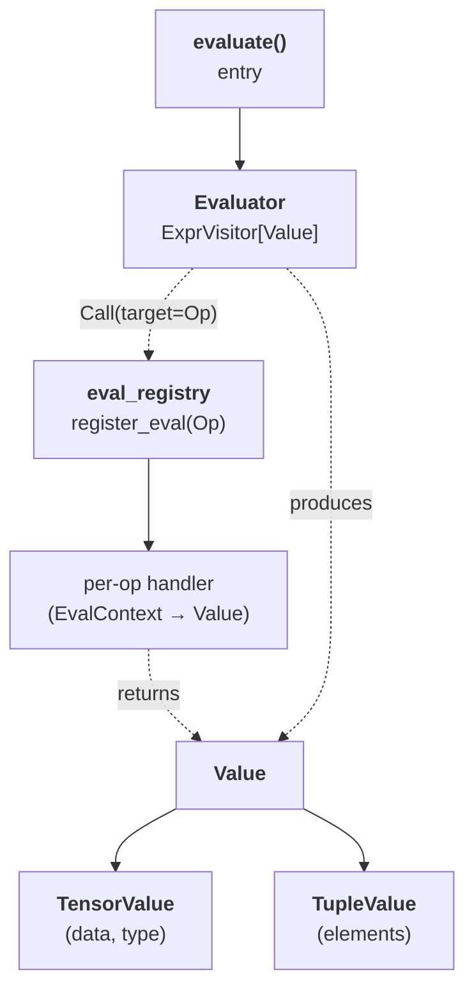

# TileFoundry Spec — evaluator (HIR reference interpreter)

The evaluator executes a HIR `Function`'s SSA-DAG on a tensor backend
and returns concrete values. It is a codegen-independent reference
oracle for parser output, type inference, and op value semantics; it
does not lower to TIR or invoke codegen / runtime.



```python
def evaluate(
    fn_or_call: "Function | Call",
    *inputs: "torch.Tensor",
    backend: str = "torch",
) -> "torch.Tensor | tuple[torch.Tensor, ...]":
    ...
```

`evaluate` binds `inputs` to the entry `Function`'s parameters in
order, walks the body, and returns the logical tensor for a single
output or a tuple for a `TupleType` result. `backend` selects the
tensor engine; `"torch"` is the defined backend.

## 1. `Value`

The values that flow through evaluation form a small hierarchy: a
single-output node produces a `TensorValue`; a multi-output node (a
`Tuple`, a `TupleType` `Call`, or a multi-carry `GridRegionExpr`)
produces a `TupleValue`.

```text
Value()
```

- kind: Python class
- fields: none — base of every evaluated value
- constraints: none — abstract base; concrete values are `TensorValue` / `TupleValue`

### `TensorValue`

```text
TensorValue(data: torch.Tensor, type: TensorType)
```

- kind: Python class
- fields:
  - data: the logical tensor value
  - type: the HIR type of this value (carries layout)
- constraints:
  - `data` holds the value in its **logical shape** — the shape of
    `type` ([types §2](./types.md)), not a layout-domain shape.
  - `type.layout`, when a `ShardLayout` or `Layout`, drives the
    layout-domain projection of [§6](#6-layout-domain).
  - A scalar value is a rank-0 `data` with a rank-0 `TensorType`.

### `TupleValue`

```text
TupleValue(elements: tuple[Value, ...])
```

- kind: Python class
- fields:
  - elements: the per-field `Value`s
- constraints:
  - `elements` are the per-field `Value`s; `tuple_get_item` projects one
    by static index.

## 2. Parameters and inputs

`evaluate` binds each entry-`Function` parameter `Var` to the
corresponding positional input:

- An input MUST be convertible to a backend tensor; it is cast to the
  parameter `TensorType`'s dtype.
- Weights and activations are bound identically — a weight is an
  ordinary `Function` parameter, not a distinct constant carrier.
- Each `DimVar` ([types §3](./types.md)) appearing in a parameter's
  `TensorType.shape` is bound from the corresponding axis of the input
  tensor's concrete shape. A later occurrence of the same `DimVar` MUST
  agree with the first binding.

## 3. `register_eval` and the eval context

Each op's value semantics are a handler registered against the op
class. The registry is local to the evaluator (it reuses the
`AnalysisRegistry` container of
[visitor-registry §2](./visitor-registry.md) but is not one of that
spec's module-level instances).

```python
eval_registry: AnalysisRegistry[type[Op]]

def register_eval(op_cls: type[Op]): ...   # decorator
```

A handler receives an `EvalContext` and returns a `Value`:

- `ctx.args` — the already-evaluated operands in `Call.args` order; each
  is a `Value` (`TensorValue`, or `TupleValue` for a multi-output
  operand).
- `ctx.op` — the op instance; attributes are read as fields (e.g.
  `ctx.op.kind`, `ctx.op.index`).
- `ctx.result_type` — the `Call`'s result type.
- `ctx.device` — the backend device; a handler that materialises a new
  tensor (e.g. `Zeros`) creates it there.

A `Call` whose op class has no registered handler raises an error that
names the op class. Backend dtype promotion follows the backend's own
rules; a handler MUST NOT depend on type inference having run.

## 4. Node evaluation

Evaluation is an `ExprVisitor[Value]`
([visitor-mutator §1](./visitor-mutator.md)) memoized on `id(expr)`, so
a shared sub-DAG ([hir §1.1](./hir.md)) is evaluated once:

```python
def visit(expr):                      # memoized: id(expr) -> Value
    match expr:
        case Var():
            return env[expr]
        case Constant():
            return TensorValue(as_tensor(expr.value, expr.type.dtype), expr.type)
        case Tuple():
            return TupleValue(tuple(visit(e) for e in expr.elements))
        case Call(target=Op() as op):                  # value op
            args = tuple(visit(a) for a in expr.args)
            return eval_registry[type(op)](EvalContext(op, args, expr.type))
        case Call(target=Function() as fn):            # function call
            args = [visit(a) for a in expr.args]
            sub_env = {p: a for p, a in zip(fn.params, args)}
            return Evaluator(sub_env).visit(fn.body)
        case GridRegionExpr():
            return eval_grid(expr)                      # §5
```

- A `Var` resolves to its binding in the current environment; a
  `Constant` ([core-ir §2](./core-ir.md)) materialises to a backend
  tensor of its `TensorType` (a scalar becomes a rank-0 tensor).
- A `Call` whose `target` is an `Op` evaluates its operands, then
  dispatches through `eval_registry`
  ([§3](#3-register_eval-and-the-eval-context)).
- A `Call` whose `target` is a `Function` ([hir §1.1](./hir.md)) binds the
  evaluated arguments to the callee's parameters in a fresh environment
  and evaluates the callee `body` — the same value semantics a call site
  has under type inference.

## 5. `GridRegionExpr`

A `GridRegionExpr` ([hir §1.2](./hir.md)) is a loop over its iteration
domain whose carry chain starts from `init_args`:

```python
def eval_grid(region):
    if not region.carried_args:                        # no-carry loop
        for i in range(0, region.extent, region.step):
            last = Evaluator({**env, iv: scalar(i)}).visit(region.body)
        return last                                    # final body value

    carried = [visit(init) for init in region.init_args]
    for i in range(0, region.extent, region.step):
        scope = {**env, region.induction_var: scalar(i)}
        scope.update(zip(region.carried_args, carried))
        carried = [Evaluator(scope).visit(y) for y in region.yield_values]
    return carried[0] if len(carried) == 1 else TupleValue(tuple(carried))
```

- The first iteration binds each `carried_args` phi to the matching
  `init_args` value; each later iteration binds it to the previous
  iteration's `yield_values`.
- `induction_var` is bound to the current index (a rank-0 tensor) for
  every iteration.
- The result is the final carried value (single carry) or a `TupleValue`
  of them (multi-carry), matching the node's `type`.
- A no-carry loop (`init_args` / `carried_args` / `yield_values` all
  empty) yields the final `body` value.

## 6. Layout domain

Evaluation models a **single mesh participant** and operates on logical
values:

- An axis-bearing op (`Reduce`, `rms_norm`, …) addresses its `axis` /
  `axes` in the operand's **logical** `TensorType.shape`, regardless of
  `type.layout`. A computation that must group a logical axis differently
  (e.g. per-head normalisation) is expressed by a logical `Reshape`
  ([hir §1.3](./hir.md)) to the target logical shape *before* the op; the
  op's axis then indexes that reshaped logical shape. `Reshard` only
  changes distribution / layout and never changes which values an op
  reduces or indexes.
- `as_layout_view(value: TensorValue) -> torch.Tensor` reshapes `data`
  from its logical shape to the element organisation of
  `type.layout.shape` (for a `ShardLayout`, its `layout.shape`) under
  default-contiguous ordering; `from_layout_view(data, type)` is the
  inverse. These are provided for an op explicitly defined to compute in
  the layout domain; no op in the current set is layout-domain, so none
  of them call these helpers.
- `Reshard` ([hir §1.3](./hir.md)) preserves the logical value and MAY
  reshape it into the target layout's shape; it performs no
  cross-participant data movement.
- `Local` ([hir §1.3](./hir.md)) returns its operand's value for the
  single modelled participant.
