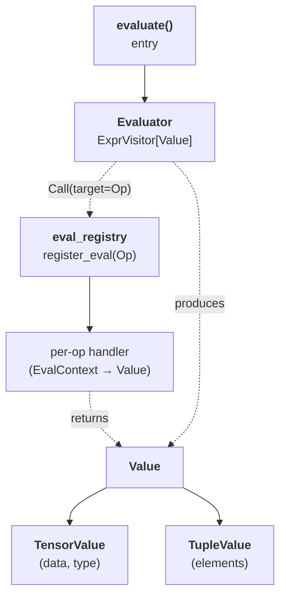

# TileFoundry Spec — evaluator (HIR reference interpreter)

The evaluator executes a HIR `Function`'s SSA-DAG on a tensor backend
and returns concrete values. It is a codegen-independent reference
oracle for parser output, type inference, and op value semantics; it
does not lower to TIR or invoke codegen / runtime.


```mermaid
flowchart TB
    evaluate["<b>evaluate()</b><br/>entry"]
    Evaluator["<b>Evaluator</b><br/>ExprVisitor[Value]"]
    registry["<b>eval_registry</b><br/>register_eval(Op)"]
    handler["per-op handler<br/>(EvalContext → Value)"]
    Value["<b>Value</b>"]
    TensorValue["<b>TensorValue</b><br/>(data, type)"]
    TupleValue["<b>TupleValue</b><br/>(elements)"]

    evaluate --> Evaluator
    Evaluator -. "Call(target=Op)" .-> registry
    registry --> handler
    handler -. returns .-> Value
    Evaluator -. produces .-> Value
    Value --> TensorValue
    Value --> TupleValue
```

```python
def evaluate(
    fn_or_call: "Function | Call",
    *inputs: "torch.Tensor",
    backend: str = "torch",
    device: str | None = None,
) -> "torch.Tensor | tuple[torch.Tensor, ...]":
    ...
```

`evaluate` binds `inputs` to the entry `Function`'s parameters in
order, walks the body, and returns the logical tensor for a single
output or a tuple for a `TupleType` result. `backend` selects the
tensor engine; `"torch"` is the defined backend.
`device` selects the torch device; when omitted it chooses CUDA when available
and otherwise CPU.

## 1. `Value`

The values that flow through evaluation form a small hierarchy: a
single-output node produces a `TensorValue`; a multi-output node (a
`Tuple`, a `TupleType` `Call`, or a multi-carry `GridRegionExpr`)
produces a `TupleValue`.

```python
class Value:
    """Provide the base of every evaluated value."""
```

- constraints: none — abstract base; concrete values are `TensorValue` / `TupleValue`

### `TensorValue`

```python
class TensorValue(Value):
    """Pair a logical tensor value with its HIR type.

    Attributes:
        data: attribute; Logical tensor value.
        type: attribute; HIR tensor type, including layout.
    """

    data: torch.Tensor
    type: TensorType
```

- constraints:
  - `data` holds the value in its **logical shape** — the shape of
    `type` ([types §2](./types.md#2-tensortype)), not a layout-domain shape.
  - `type.layout`, when a `ShardLayout` or `Layout`, drives the
    layout-domain projection of [§6](#6-layout-domain).
  - A scalar value is a rank-0 `data` with a rank-0 `TensorType`.

### `TupleValue`

```python
class TupleValue(Value):
    """Aggregate evaluated values.

    Attributes:
        elements: attribute; Values in field order.
    """

    elements: tuple[Value, ...]
```

- constraints:
  - `elements` are the per-field `Value`s; `tuple_get_item` projects one
    by static index.

## 2. Parameters and inputs

`evaluate` binds each entry-`Function` parameter `Var` to the
corresponding positional input:

- An input MUST be convertible to a backend tensor; it is cast to the
  parameter `TensorType`'s dtype.
- Weights and activations are bound identically — a weight is an
  ordinary `Function` parameter, not a distinct constant carrier.
- Each `DimVar` ([types §3](./types.md#3-dtype)) appearing in a parameter's
  `TensorType.shape` is bound from the corresponding axis of the input
  tensor's concrete shape. A later occurrence of the same `DimVar` MUST
  agree with the first binding.

- constraints:
  - `evaluate` is the exact public entry: it MUST take one input per declared
    parameter and MUST take no resource context. A run whose constants come from
    a loaded reading instead is `LoadedModule` execution
    ([runtime §1.1.2](./runtime.md#112-weight-converter-and-prepare--forward)),
    not this entry.

## 3. `register_eval` and the eval context

Each op's value semantics are a handler registered against the op
class. The registry is local to the evaluator (it reuses the
`AnalysisRegistry` container of
[visitor-registry §2](./visitor-registry.md#2-core-contract) but is not one of that
spec's module-level instances).

```python
eval_registry: AnalysisRegistry[type[Op]]

def register_eval(op_cls: type[Op]):
    """Return the evaluator registration decorator for an Op class."""
    ...
```

A handler receives an `EvalContext` and returns a `Value`:

```python
class EvalContext:
    """Carry one registered evaluator invocation.

    Attributes:
        op: attribute; Operation instance.
        args: attribute; Evaluated operands in Call-argument order.
        result_type: attribute; Call result type.
        device: attribute; Backend device name.
        dim_bindings: attribute; concrete values for symbolic ShapeDims.
    """

    op: Any
    args: tuple[Any, ...]
    result_type: Any
    device: str = "cpu"
    dim_bindings: dict[str, int] | None = None

def handler(ctx: EvalContext) -> Value:
    """Evaluate one registered Op invocation."""
    ...
```

A `Call` whose op class has no registered handler raises an error that
names the op class. Backend dtype promotion follows the backend's own
rules; a handler MUST NOT depend on type inference having run.

## 4. Node evaluation

Evaluation is an `ExprVisitor[Value]`
([visitor-mutator §1](./visitor-mutator.md#1-role)) memoized on `id(expr)`, so
a shared sub-DAG ([hir §1.1](./hir.md#11-function)) is evaluated once:

```python
class Evaluator(ExprVisitor):
    """Evaluate expressions with identity-based memoization."""

    def visit(self, expr: Expr) -> Value: ...
    def visit_GridRegionExpr(self, region: GridRegionExpr) -> Value: ...
```

- A `Var` resolves to its binding in the current environment; a
  `Constant` ([core-ir §2](./core-ir.md#2-expr)) materialises to a backend
  tensor of its `TensorType` (a scalar becomes a rank-0 tensor).
- A `Call` whose `target` is an `Op` evaluates its operands, then
  dispatches through `eval_registry`
  ([§3](#3-register_eval-and-the-eval-context)).
- `EvalContext` carries evaluated operands and concrete `dim_bindings` for
  call-invariant `ShapeDim` attributes. Expr-valued runtime data MUST be a Call
  operand; handlers MUST NOT re-enter the evaluator through an attribute.
- `Slice` consumes its evaluated `starts` tuple and resolves `sizes/strides`
  through `dim_bindings`. A window exceeding a runtime axis MUST raise
  `EvalError` rather than return a value whose data disagrees with its full-window type.
- A dim-arithmetic `Call` reached as an operand — a `Slice` start moved off a
  loop's induction variable is one — folds the values its operands evaluated to.
  It performs the arithmetic `resolve_dim` performs in a shape position; only the
  leaves differ, being operands rather than `DimVar` sizes.
- A `Call` whose `target` is a `Function` ([hir §1.1](./hir.md#11-function)) binds the
  evaluated arguments to the callee's parameters in a fresh environment
  and evaluates the callee `body` — the same value semantics a call site
  has under type inference.

## 5. `GridRegionExpr`

A `GridRegionExpr` ([hir §1.2](./hir.md#12-gridregionexpr)) is a loop over its iteration
domain whose carry chain starts from `init_args`:

`Evaluator.visit_GridRegionExpr(region)` implements the loop; there is no
separate `eval_grid` function.

- The first iteration binds each `carried_args` phi to the matching
  `init_args` value; each later iteration binds it to the previous
  iteration's `yield_values`.
- `induction_var` is bound to the current index (a rank-0 tensor) for
  every iteration.
- The result is the final carried value (single carry) or a `TupleValue`
  of them (multi-carry), matching the node's `type`.
- A no-carry loop (`init_args` / `carried_args` / `yield_values` all
  empty) yields the final `body` value.

## 6. Layout domain

Evaluation models a **single mesh participant** and operates on logical
values:

- An axis-bearing op (`Reduce`, `rms_norm`, …) addresses its `axis` /
  `axes` in the operand's **logical** `TensorType.shape`, regardless of
  `type.layout`. A computation that must group a logical axis differently
  (e.g. per-head normalisation) is expressed by a logical `Reshape`
  ([hir §1.3](./hir.md#13-op)) to the target logical shape *before* the op; the
  op's axis then indexes that reshaped logical shape. `Reshard` only
  changes distribution / layout and never changes which values an op
  reduces or indexes.
- `as_layout_view(value: TensorValue) -> torch.Tensor` reshapes `data`
  from its logical shape to the element organisation of
  `type.layout.shape` (for a `ShardLayout`, its `layout.shape`) under
  default-contiguous ordering; `from_layout_view(data, type)` is the
  inverse. These are provided for an op explicitly defined to compute in
  the layout domain; no op in the current set is layout-domain, so none
  of them call these helpers.
- `Reshard` ([hir §1.3](./hir.md#13-op)) preserves the logical value and MAY
  reshape it into the target layout's shape; it performs no
  cross-participant data movement.
- `Local` ([hir §1.3](./hir.md#13-op)) returns its operand's value for the
  single modelled participant.
