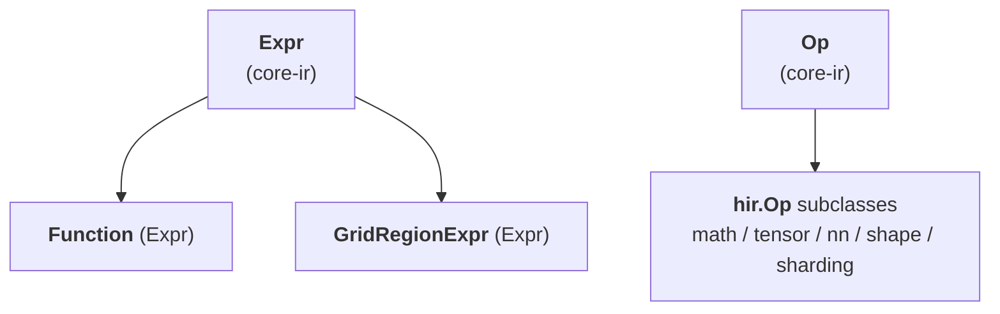

# TileFoundry Spec — hir (`@func` pure SSA dataflow IR)

Defines `hir.Function`, the HIR Op subdirectories
(math / tensor / nn / shape / sharding), the structured-SSA
exception `GridRegionExpr`, and the parser-level Mesh-scope rule.



## 1. `Function`

```python
@dataclass(frozen=True)
class Function(Expr):
    """HIR's function container. An Expr subclass — its value type is
    the function signature, and call sites resolve through Module's
    symbol table."""
    name: str
    params: tuple[Var, ...]                 # each Var carries a type annotation
    body: Expr | None                       # a single Expr — typically a Call DAG; None for a dispatch prototype
    return_type: IRType                     # TensorType for single output, TupleType for multi
    topologies: tuple[Topology, ...]        # convenience for single-function modules
```

`Function.body` is a **single Expr** (usually a Call DAG, possibly
nested inside a `GridRegionExpr`). HIR has no Stmt sequence; name
reuse lives in the parser's lexical environment, not the IR. The one
exception is a **dispatch prototype** — a specialized function's base,
whose body is `None` (written `pass` in the DSL); it declares the
signature and dispatch envelope only, and its variants carry the
implementations ([§5](#5-dispatch-specializations)).

`Function` always returns by value; explicit output parameters are
TIR-only (see [tir](./tir.md)). `HirToTirPass` materialises the HIR
return value into a TIR explicit output buffer parameter at the
HIR → TIR boundary.

`topologies` is the convenience declaration for a single-function
program. Before `compile` / `jit`, it lifts to `Module.topologies`
([core-ir §2](./core-ir.md)). A `with Mesh(topology="cta", ...) as cta:`
inside the body resolves the topology name through the active
namespace and creates a parser-lexical mesh binding;
`ShardLayout.mesh` MUST point at an active binding on the lexical
path.

**Signature annotation `Layout.strides` materialization.** A
`Tensor[..., (sugar)]` annotation on a parameter or return appears
at the kernel boundary, where the underlying engine is a shared
buffer handed across the FFI surface. When the surface sugar emits
`Layout(strides=None)` ([parser.md §1.5](./parser.md#15-layout-sugar)),
function-signature binding MUST materialize it to **shared-engine
C-order over the canonical global shape** before the resulting
`TensorType` enters the body. Verbose `Layout(strides=tuple)`
annotations are preserved verbatim. After signature binding, no
`Tensor[...]` annotation reachable from the function carries
`strides=None`.

**SSA shape**. HIR is pure **SSA-as-DAG** — sharing of intermediate
results is expressed by Python object identity:

- *Single use*: nest the Calls.
  `Call(Binary(kind=MUL), (Call(Binary(kind=ADD), (a, b)), c))` does
  not name the inner `Binary` result.
- *Multiple uses*: the parser binds `c = add(a, b)` in its lexical
  env so subsequent `mul(c, c)` / `sub(c, d)` share the same Call
  node. The IR has no binding nodes; DAG edges express "same value".

There are no `Region` / `Block` abstractions in HIR. The single
structured exception that carries loop-phi-shaped SSA is
`GridRegionExpr` ([§4](#4-gridregionexpr)). Everything else is a
pure Call DAG.

## 2. Op subdirectories

HIR Ops are organised under `tilefoundry.ir.hir.<category>/`. The
subdirectory is *file organisation* and not a separate IR layer.

For each Op, the spec records the responsibility plus a link to
external documentation when the Op matches a widely-known operator
(`add`, `relu`, `softmax`, …). Custom Ops carry their own contract;
field-level signatures and `ParamDef` listings live in code (see
[core-ir §4](./core-ir.md)).

### 2.1 `ir/hir/math/`

Pointwise arithmetic and comparison. Surfaces follow the standard
`torch.<op>` semantics with TileFoundry type-promotion rules. Two
value-form Ops cover the kinded family, plus one tag-free unary
that needs distinct typeinfer:

```python
@dataclass(frozen=True)
class Binary(Op):
    """ADD / SUB / MUL / DIV / FLOOR_DIV / MOD / MIN / MAX (arith);
    EQ / NE / LT / LE / GT / GE (comparison, result dtype bool);
    AND / OR (boolean, operands MUST be bool)."""
    lhs: Expr
    rhs: Expr
    kind: BinaryKind

@dataclass(frozen=True)
class Unary(Op):
    """HIR unary kinds: NEG / ABS / NOT.
    The shared UnaryKind enum also carries TIR-only tags (RSQRT,
    CAST); those tags MUST NOT appear on a HIR Unary."""
    x: Expr
    kind: UnaryKind

@dataclass(frozen=True)
class Rsqrt(Op):
    """Distinct numerical / dispatch behaviour from kinded Unary."""
    x: Expr
```

Each user-callable surface name (`add` / `sub` / `cmp_eq` /
`logical_and` / `neg` / `logical_not` / …) is registered as a
**surface alias** ([core-ir §4](./core-ir.md)) whose `builder`
constructs the kinded target Op directly. There are no per-name
`Add` / `Sub` / `CmpEq` IR classes; the alias mechanism collapses 19
sugar names into the two kinded IR Ops.
[torch element-wise ops](https://pytorch.org/docs/stable/torch.html#pointwise-ops).

### 2.2 `ir/hir/tensor/`

Tensor structural operations. Consensus surface follows torch /
numpy: `Reshape`, `Transpose`, `Slice`, `Concat`, `Stack`, `Split`,
`Gather`, `ShapeOf`, `Rank`, `Cast`. See
[torch tensor manipulation ops](https://pytorch.org/docs/stable/torch.html#indexing-slicing-joining-mutating-ops).

`Split` is multi-output: its `Call.type` is `TupleType` and the
parser desugars `a, b = split(x)` to `tuple_get_item` projections
([core-ir §5](./core-ir.md)).

TileFoundry-specific: `Zeros`. Allocates a zero-initialised tensor with
explicit `shape` / `dtype` / `storage`; sharding is established by a
subsequent `Reshard`.

`hir.tensor.Slice` Op calls are emitted from tensor subscripts
`x[slice0, slice1, …]`. Each axis accepts an `ast.Slice` (`:` or
`a:b[:c]`) or a `Name` that resolves to a `RangeSlice` (the parser
binding produced by `tile(extent, step)`).

**`Reduce(x, axes, keepdim, kind)` output layout.** When `x` is
sharded (`x.type.layout: ShardLayout`), reducing over an axis
that is `Split` across mesh axes produces a result every
participant sees identically. The contract is the natural
"project to local layout, take default strides":

1. **Project** the input `ShardLayout` to its **local layout**
   under the current device's shard view: every cute position
   bound to a mesh axis via a `Split` attr shrinks to size 1
   (the mesh handles per-shard dispatch).
2. **Reduce** the local layout: every cute position that falls
   within a reduced tensor axis collapses to size 1.
3. **Strides** follow the natural row-major default for the
   resulting local shape: positions with size 1 carry stride 0
   (no distinct element to address); other positions carry the
   default contiguous stride for the surviving dimension(s).
4. **Attrs**: every `Split(axis=L)` whose cute position `L`
   falls within a reduced tensor axis is replaced by
   `Broadcast()`. Non-reduced mesh axes preserve their original
   attr (`Split` / `Partial` / `Broadcast` / `Dynamic`).
5. The logical `TensorType.shape` follows numpy semantics: the
   reduced axis becomes 1 when `keepdim=True`, otherwise the
   axis is removed.
6. `storage` is preserved (the reduce does not change physical
   memory level).

For the rmsnorm demo (`(1, 1536) → (1, 1)`, every mesh axis
covering the reduced last axis), every cute position ends up
either size-1-non-reduced (outer tensor axis 0) or reduced, so
the canonical output is
`shape=(1,1,1,1) strides=(0,0,0,0) attrs=(Broadcast, Broadcast)`.

For a partial reduce (`(M, N) → (M, 1)` with mesh covering only
the reduced axis), the outer tensor axis 0 still indexes
distinct rows, so its cute stride is preserved; only the reduced
positions go to size 1 stride 0.

Cute layout position → tensor axis mapping uses the
left-to-right product convention: each tensor axis `k` claims as
many cute positions as needed to accumulate to
`tensor_shape[k]`; trailing cute positions attach to the last
tensor axis; a singleton tensor axis claims exactly one cute
position.

If `x.type.layout` is plain (non-`ShardLayout`) or `None`, the
output layout passes through unchanged.

The "default contiguous stride" rule above applies only when the
input `ShardLayout` is itself in default-stride form (the case for
everyday `reshard(..., 'rmem')` + Op chains). A non-default-stride
input (a transposed / permuted view) MUST carry explicit strides
from its producer; an input that is neither default-stride nor
carries explicit strides is rejected by verify / typeinfer.

**`insert_slice(dst, update, offsets)` — dynamic-update-slice.** Returns a
tensor equal to `dst` with `update` written into the window that begins at
`offsets` and spans `update`'s shape — the value-form (SSA) spelling of
"slice then store", distinct from `scatter` (data-dependent multi-index write).
The result has `dst`'s type; an in-place realization is a lowering concern
(the result is anchored on the `dst` buffer). Contract:

1. `update` MUST have the same rank as `dst`, and the same dtype.
2. `offsets` is a rank-1 `i32` vector whose length equals `dst`'s rank — one
   start per `dst` axis; its entries MAY be runtime scalars (e.g. a loop
   induction variable).
3. `dst` and `update` are **rank-1** — one start in `offsets`, a
   contiguous window `[offsets[0], offsets[0] + update.shape[0])`.
4. A statically-known window that exceeds `dst`'s extent is rejected by
   typeinfer; a window resolved only at runtime is the caller's responsibility.

The TIR side (`tir.tensor.Reduce`) remains
`Reduce(src, dst, axes, kind)` with no extra parameters — the
hardware-level dispatch (intra-thread loop / intra-warp shuffle /
intra-block shmem reduce) is derived by the CUDA codegen +
runtime from `src` / `dst`'s `ShardLayout` and `Mesh`
(see [tir §3.4](./tir.md)).

### 2.3 `ir/hir/nn/`

Neural-network value Ops following standard torch semantics:
`MatMul`, `Conv2D`, `ReLU`, `Sigmoid`, `Tanh`, `SoftMax`,
`LayerNorm`. See
[torch.nn.functional](https://pytorch.org/docs/stable/nn.functional.html).

The category also hosts arch-specific MMA Ops (`Mma_SM80_16x8x16`,
`Wgmma_SM90_64x128x16`, …) used at the SSA boundary between
value-form HIR and effect-form TIR. Each MMA Op takes the two
operand fragments and produces a fragment-typed result; accumulation
is expressed at HIR by `Call(Binary(kind=ADD), (acc, mma_result))`
and lowered to in-place TIR `tir.cuda.nn.Mma` at the HIR → TIR boundary
(see [tir §3.2](./tir.md#32-nn-ops-tirnn)).

### 2.4 `ir/hir/shape/`

Shape-level Ops on whole shape values. [types §3](./types.md)
(`dim.*`) covers the per-axis Expr-level Ops; this category covers
Ops that consume or produce a full shape: `ShapeExtract` (extract
one axis from a shape value) and `ShapeCompose` (assemble a shape
from per-axis dims).

### 2.5 `ir/hir/sharding/`

```python
@dataclass(frozen=True)
class Reshard(Op):
    """Convert *x* to a target layout / storage in place. Covers all
    four physical kinds (zero-copy view / cross-storage copy /
    cross-CTA redistribute / mixed); typeinfer + costmodel classify
    each call from its input ↔ output TensorType delta."""
    x: Expr
    layout: ShardLayout | None = None  # compile-time constant; None preserves x.layout
    storage: str = ""                  # "" preserves x.storage

@dataclass(frozen=True)
class Local(Op):
    """Return the current device's local view of a sharded tensor."""
    x: Expr
```

`Reshard` is a single Op covering layout / sharding / storage
transitions. It **preserves the logical `TensorType.shape`** of the
input — `ShardLayout.layout.shape` (a per-shard / sharding-internal
layout shape) need not match `TensorType.shape` and does not drive
it (e.g. a `(1, 1536)` logical tensor MAY reshard to a
`ShardLayout` whose internal `layout.shape=(1, 8, 192)` reflects
the per-shard physical organisation; the output `TensorType.shape`
remains `(1, 1536)`). User-visible shape rewrites (transpose,
flatten, true logical reshape) go through `Reshape`
([§2.2](#22-irhirtensor)). `Local`'s result shape contracts
according to the input's `ShardLayout` `Split` axes.

`ShardLayout` and `Mesh` are type-system constructs, not Expr inputs
([shard §5](./shard.md)).

## 3. Typing / structural rules

Every constraint below is enforced by the registered
`@register_typeinfer(<OpClass>)` body via `ctx.error(...)`
([visitor-registry §4](./visitor-registry.md)).

- `Function.body` is a single Expr; Stmts MUST NOT appear.
- `Local(x)`: `x.type.layout` MUST be `ShardLayout`. The result
  shape contracts per the `Split` axes; dtype is preserved; layout
  becomes the corresponding local layout.
- `Reshard(x, layout, storage)`: `layout` and `storage` are
  attributes (compile-time constants). The output **preserves
  `x.type.shape`** (logical). `ShardLayout.layout.shape` is
  internal sharding geometry and may differ from the logical shape.
  Logical-shape rewrites are out of scope — use `Reshape`.

  **Semantics (spec table).** Let `src = x.type` and
  `direction(src.storage, storage)` follow the physical
  addressability hierarchy

  ```
  rmem < smem < gmem
  ```

  (`rmem` per-thread, `smem` per-CTA, `gmem` per-program /
  device-global). Typeinfer dispatches on `(layout, storage)`:

  | `layout` | `storage` | Output type |
  |----------|-----------|-------------|
  | `None` | `""` (unchanged) | `src` (no-op). |
  | `None` | changed | **error** — storage change MUST come with an explicit `layout=`. |
  | `Layout(strides=None)` (sugar) | `""` (unchanged) | dest `strides` materialized to match the form already present on `src.layout`: Split-axes-zero ⇒ per-instance form; otherwise ⇒ shared-engine C-order over canonical global shape. When `src.layout is None` (plain kernel-param surface), fall back to **shared-engine C-order over canonical global shape** — plain inputs are kernel-boundary shared engines. |
  | `Layout(strides=None)` (sugar) | low → high level | dest `strides` = C-order over `layout.shape` (shared-engine form). |
  | `Layout(strides=None)` (sugar) | high → low level | dest `strides[k]=0` for every Split axis `k`; non-Split axes follow C-order over `shard_layout_local_shape(layout)` with size-1 → 0 normalisation (per-instance form). |
  | `Layout(strides=tuple)` (verbose) | any | dest `strides` taken verbatim; typeinfer MUST NOT rewrite. |

  **Invariant**: after `Reshard` typeinfer has run, every
  `ShardLayout` reachable from the value's type has a concrete
  `layout.strides` (never `None`). The un-materialized form is an
  intermediate signal between parser and typeinfer.

  User-provided non-default strides (e.g. SM80 MMA fragment layouts
  with hand-crafted `(1, 2, 8, 64)` patterns) describe intentional
  per-thread+per-value access and are preserved verbatim — they
  fall under the "verbose" row of the table.
- Any HIR Op MUST be value-form ([core-ir §4](./core-ir.md));
  emitting an effect-form Call into HIR is a verify error.

### 3.1 Relation-driven type validity

An op's typeinfer MAY derive the output type from a forward access
relation ([visitor-registry §4.1](./visitor-registry.md#41-forward-relation-service--type_relation))
rather than from a hand-written rule. The relation describes one
shared iteration domain and, per boundary, an access map from that
domain to the tensor's index space. The relation carries **no tensor
shape**: the output shape is typeinfer-side data, derived from the
op's shape rule or (where implemented) from the relation by composing
the output access map over the domain.

Within the relation:

- A domain dim that appears in an input access map but **not** in the
  output access map is a **reduction** dim (it is eliminated in the
  output).
- A tensor axis whose access maps to a constant (rather than a domain
  dim) is a **broadcast** axis.
- A symbolic size is an isl parameter of the domain; the relation's
  rank is fixed and is read from the input types.

The shard consequences of these structural facts (how `Split` /
`Broadcast` / `Partial` propagate, and the reduction effect) are
defined in [shard §9](./shard.md#9-relation-driven-shard-propagation).

### 3.2 Output storage of multi-input ops

A symmetric multi-input op (`Binary`, `MatMul`, `Concat`, `Stack`,
`Mma`) resolves its output `storage` by **anchoring** on the concrete
residency among its operands ([types §2](./types.md)). The rule does not
appeal to any ordering of storage kinds and is independent of operand order:

- An **unmaterialized** operand (`storage=umat`) does not constrain the
  output — it abstains.
- One concrete operand storage (alongside any unmaterialized operands) is
  the **anchor**; the output takes that storage.
- Several concrete operands that agree on a storage → the output takes that
  storage.
- Several concrete operands that disagree on storage → typeinfer MUST
  `ctx.error`, unless the op defines its own destination/mixed-storage
  resolution. There is no operand-order tie-break.
- All operands unmaterialized → the output is unmaterialized (`umat`).

This resolution uses no memory-level lattice; output residency is a function
of the concrete anchor(s) alone. (The `rmem < smem < gmem` hierarchy in §3 is
a `Reshard`-*direction* notion and is unrelated to output-storage anchoring.)

### 3.3 Operand layout / mesh ownership

A tensor value's mesh / layout is carried by its `TensorType.layout`
(`ShardLayout.mesh` names the mesh instance) — that type is the source of
truth, and the IR places no scope-based restriction on values from
different meshes coexisting. Each op's registered typeinfer **owns** the
operand layout / mesh compatibility it requires and its result layout;
there is no uniform cross-op rule imposed from outside typeinfer.
`Reshard` is the explicit op that changes a value's layout / mesh.

## 4. `GridRegionExpr`

```python
@dataclass(frozen=True)
class GridRegionExpr(Expr):
    """Loop-phi-shaped structured SSA — the only HIR exception to
    pure Call DAG. Folds a tile-style loop into a single Expr value."""
    induction_var: Var
    carried_args: tuple[Var, ...]
    init_args: tuple[Expr, ...]
    body: Expr
    yield_values: tuple[Expr, ...]
    extent: ShapeDim                         # iteration-domain stop (half-open)
    step: ShapeDim                           # induction-var stride
    start: ShapeDim = 0                       # iteration-domain start (default 0)
```

**Iteration domain.** Both DSL loop surfaces — `for i in tile(...)` and
`for i in range(...)` — lower to this one node; they share the domain
`(start, extent, step)` and differ only in the loop-variable binding (`tile`
2-arg binds a parser-side `RangeSlice`, everything else binds a scalar; see
[parser §1.7](./parser.md)). `range` is not unrolled. `induction_var` ranges
over `range(start, extent, step)`: `start` and `extent` are the **half-open**
`[start, extent)` Python-range endpoints (so `extent` is the **stop** value,
not a count). `start` defaults to `0` (`tile(...)` and `range(stop)`); the
`range(start, stop[, step])` surface sets it. Each of `start` / `extent` /
`step` is a `ShapeDim` ([types §4](./types.md)).

- When `start` / `extent` / `step` are static `int`, the trip count is
  recoverable from the node alone, without the parser-side
  `RangeSlice` binding ([parser §5.6](./parser.md)).
- Every `DimVar` referenced by a `ShapeDim` `start` / `extent` / `step` MUST
  be bound by the enclosing Function's parameter shapes. Resolution
  substitutes each such `DimVar` with the corresponding argument-shape
  size and folds the dim `Expr` to a value `n`. The resolved `start` and
  `extent` MUST be non-negative integers and the resolved `step` MUST be a
  positive integer; otherwise resolution MUST raise. An unbound
  `DimVar` MUST raise.
- A `ShapeDim` `start` / `extent` / `step` is resolved by the evaluator at
  call time against concrete argument shapes; its trip count is not
  statically recoverable from the node alone.

**Carry-out semantics.** The parser populates the carry chain when a
`for i in tile(...)` body contains an `ast.Assign` whose single
`Name` target binds an outer-scope name:

- the carried name becomes a phi `Var` in `carried_args`,
- the pre-loop binding of that name becomes the matching entry in
  `init_args` (the carry's value on the first iteration),
- inside the loop body the same name resolves to that phi `Var`,
- after the loop, the post-region binding refers to the
  `GridRegionExpr` itself (single carry) or a `tuple_get_item` of it
  (multi-carry, when `len(yield_values) > 1`).

`init_args` are value Exprs (traversed and rewritten by the
visitor / mutator), distinct from the binding-site `carried_args` /
`induction_var`. `len(init_args) == len(carried_args) ==
len(yield_values)`; all three are empty for a no-carry loop. The node
is self-contained: the first-iteration value of each `carried_args`
phi is its `init_args` entry, not a name looked up in the enclosing
parser scope.

`GridRegionExpr.type` is `TensorType` (single carry) or `TupleType`
(multi-carry); the value is the Expr itself, not a `Call`.
Parser-side rules: see [parser §5.6](./parser.md).

**Minimal example** — loop-carried accumulator:

```python
acc = zeros((M,), f32, storage="rmem")
for i in tile(K, step=BLOCK):
    acc = acc + load_tile(x, i)
# After the loop, `acc` resolves to the GridRegionExpr value.
```

becomes (sketched):

```python
GridRegionExpr(
    induction_var = i,
    carried_args  = (acc_phi,),
    init_args     = (Call(Zeros(...), ()),),   # the pre-loop `acc`
    body          = Call(Binary(kind=ADD), (acc_phi, load_tile(x, i))),
    yield_values  = (Call(Binary(kind=ADD), ...),),
    extent        = K,
    step          = BLOCK,
)
```

## 5. Dispatch specializations

`Function` is the sole HIR function `Expr`. Shape-dispatch is carried on a
single **base** `Function` through its `variants` field; there is no
separate specialized-function type. The field is the IR-side carrier for
the parser surface in [parser.md §8](./parser.md#8-dispatch-specializations).

```python
@dataclass(frozen=True)
class Function(Expr):
    ...
    specializations: tuple[Pattern, ...] = ()
    variants: tuple["Function", ...] = ()
```

**Structure.** A `Function` is exactly one of three shapes:

- **normal** — `specializations == ()`, `variants == ()`, `body` is an
  `Expr`. An ordinary function.
- **dispatch prototype (base)** — `specializations == ()`,
  `variants != ()`, `body is None`. Declares the signature and dispatch
  envelope only; the implementations live in its variants.
- **variant** — `specializations != ()`, `variants == ()`, `body` is an
  `Expr`. A shape-specialized implementation registered on a base.

Nesting is exactly one level: a variant MUST NOT itself carry variants.
In a sealed (verified) `Module` the invariant is `body is None` ⟺
`variants != ()` — a function with no body and no variants is uncallable
and invalid, and a real body combined with variants is invalid. During
authoring the base is transiently `body is None, variants == ()` between
`@func def f: pass` and the first `@f.specialize(...)`; this unsealed
state is allowed only until the base enters a `Module` (see **Authoring
freeze** below).

- `variants` is a canonical IR field — it participates in structural
  equality, hashing, and canonical printing.
- Every variant of a base MUST share the base's `name`, `params`,
  `return_type`, `target`, and `topologies`: a variant specializes the
  body, not the signature.
- A variant carries exactly one `DimVarRangePat` in `specializations`.
  The canonical signature is
  `";".join(f"{p.dim_var}${p.lo}_{p.hi}" for p in specializations)`
  (v0 allows only `DimVarRangePat`). Two variants of one base MUST have
  distinct canonical signatures.

**Envelope coverage.** A dispatched function's parameter
`TensorType.shape` carries a `DimVar(name, lo, hi)` whose `(lo, hi)` is
the dispatch envelope; `DimVarRangePat` references that `DimVar` by name.
The variants' ranges MUST **partition** the envelope — pairwise
**disjoint** and jointly **complete** (their union is exactly the
half-open `[lo, hi)`). Adjacent half-open ranges meet at the shared
boundary value as `[.., c)` then `[c, ..)`. Every in-envelope shape
therefore selects exactly one variant.

**Prototype body.** A base's `body is None`: the prototype is never
typeinferred, lowered, or evaluated as a body. Only its variants carry
executable bodies. There is no base body to fall back to.

**Dispatch resolution.** A `Call` whose target is a dispatch prototype
(`variants != ()`) is a dispatch call: the variant whose `DimVarRangePat`
matches the call's concrete argument shapes is selected and is the call's
result. A shape outside the envelope matches no variant and is an error;
there is no base body to fall back to (the prototype body is `None`). A
`Call` whose target has `variants == ()` is a direct call to that body.

**Authoring freeze.** Variants accumulate during authoring, before the
base `Function` enters a `Module` ([core-ir §2](./core-ir.md#2-module)). A
sealed base rejects further variants. Because `variants` participates in
hashing, a base MUST NOT be hashed while still accumulating variants. A
top-level `Module.functions` entry MUST NOT be a variant: a top-level
`Function` with `specializations != ()` is a verifier error.

**Canonical `DimVar` subject rule.** When a `DimVar D` appears at
multiple `(param_index, axis)` positions in the function signature,
the lowering picks the **first** occurrence under
`(param_index ascending, axis ascending)` as the canonical subject
for `ShapeOf` lookups. Other occurrences are assumed equal at call
time (caller responsibility — runtime UB on mismatch).

HIR→TIR lowering details: see
[passes.md §7.1](./passes.md#71-hirtotirpass) `HirToTirPass`.
