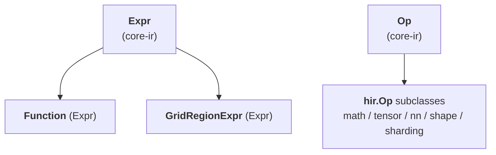

# TileFoundry Spec — hir (`@func` pure SSA dataflow IR)

Defines HIR, the pure SSA-as-DAG dataflow IR: its `Expr` constructs — the
`Function` container, the structured-SSA exception `GridRegionExpr`, and the
HIR Op subdirectories (math / tensor / nn / shape / sharding) — together with
their HIR-specific typing rules. Mesh scope is authored in the parser
([parser](./parser.md)) and its `Mesh` / `Topology` are defined by shard
([shard §5](./shard.md)); HIR links to those owners where a construct carries
the result.



## 1. HIR Expr constructs

HIR values are `Expr` nodes ([core-ir §2](./core-ir.md)): a `Function`
container, the loop-phi-shaped `GridRegionExpr`, and value `Op` calls. HIR is
pure **SSA-as-DAG** — there are no `Region` / `Block` abstractions and no Stmt
sequence; the single structured exception that carries loop-phi-shaped SSA is
`GridRegionExpr`.

### 1.1 `Function`

```python
class Function(Expr):
    """HIR's function container; its value type is the function signature.

    Attributes:
        name: the function name; call sites resolve through Module's symbol table.
        params: each Var carries a type annotation.
        body: a single Expr — typically a Call DAG; None for a dispatch prototype.
        return_type: TensorType for single output, TupleType for multi.
        topologies: convenience for single-function modules.
    """

    name: str
    params: tuple[Var, ...]
    body: Expr | None
    return_type: IRType
    topologies: tuple[Topology, ...]
```
- constraints:
  - an `Expr` subclass whose value type is the function signature; always returns
    by value (explicit output params are TIR-only). Typing and shape-dispatch
    rules are stated below.
  - defined as a frozen dataclass — instances are immutable after construction.

`Function.body` is a **single Expr** (usually a Call DAG, possibly
nested inside a `GridRegionExpr`). HIR has no Stmt sequence; name
reuse lives in the parser's lexical environment, not the IR. The one
exception is a **dispatch prototype** — a specialized function's base,
whose body is `None` (written `pass` in the DSL); it declares the
signature and dispatch envelope only, and its variants carry the
implementations (see **Shape dispatch and specializations** below).

`Function` always returns by value; explicit output parameters are
TIR-only (see [tir](./tir.md)). `HirToTirPass` materialises the HIR
return value into a TIR explicit output buffer parameter at the
HIR → TIR boundary.

The return type MAY carry a `Partial(reduction)` in a `TensorType`, or in any
tensor field of a nested `TupleType`. Function construction, type inference,
and call elaboration MUST allow that state. A Function boundary MUST preserve
the `ShardLayout` mesh and per-axis reduction; it MUST NOT complete the value
or reject it merely because it is `Partial`.

`topologies` is the convenience declaration for a single-function
program. Before `compile` / `jit`, it lifts to `Module.topologies`
([core-ir §1](./core-ir.md)). A `with Mesh(topology="cta", ...) as cta:`
inside the body resolves the topology name through the active
namespace and creates a parser-lexical mesh binding;
`ShardLayout.mesh` MUST point at an active binding on the lexical
path.

**Value type.** `Function.type` is the IR-level `CallableType`
([types §7](./types.md#7-callabletype)) projected from `params` +
`return_type`. The projection is fixed at construction and stays
consistent across construction sites.

**Call typing — elaboration.** The template a `@func` declares lives at the
Python-source level; IR never carries a template object or a shared
polymorphic body. A `Call` whose target is a `Function` types by
*elaboration*: `elaborate(callee, arg_types)` binds each parameter to the
caller's actual argument type, then reconstructs the body under that
binding — every node the reconstruction touches is typeinferred afresh and
stamped exactly once, so **the callee specializes per call site** and a
caller-supplied layout (sharding) flowing into a layout-unconstrained
parameter propagates through the whole body, including through a `Tuple` or
`GridRegionExpr` return. The result of elaboration is the concrete
`Function` instance that becomes the `Call`'s `target`; the `Call`'s type is
that instance's (re-derived) body type, never a stale `return_type` field
carried over from a different call site.

Argument ↔ parameter binding is:

- Arity MUST match — exactly one argument per parameter.
- A parameter that is a `TensorType` with `layout is None` is a **template
  wildcard**: it binds to the argument's full type, including any
  `ShardLayout`, once the argument's logical `shape` and `dtype` match.
- A parameter that carries a `ShardLayout` is an explicit **contract**: the
  argument type MUST match it exactly.
- Any other parameter requires exact type equality.
- `DimVar` shapes keep envelope matching — elaboration does not
  monomorphize a dynamic shape into a concrete one (that is **Shape
  dispatch and specializations** below, unaffected by elaboration).

The per-mesh-axis `Partial` state is part of the actual argument type. When a
layout-unconstrained parameter binds to a sharded argument, elaboration MUST
carry each `Partial(reduction)` at its original mesh-axis index through the
body and into the concrete return type, including tuple fields. Only an
explicit `Reshard` or allreduce may complete that state.

When the body cannot express a propagated sharding (e.g. a reshape
whose layout factorization straddles a new axis), typeinfer fails at that
op, not at the boundary. Reconstructing IR for every call is unnecessary
when nothing would change: elaborating with argument types that already
equal the callee's current parameter types returns the same `Function`
instance (dedup) rather than a clone — an optimization, not a semantic;
callers MUST NOT rely on getting a distinct instance. A dispatch-prototype
callee (`variants != ()`, `body is None`) is not elaborated: the call's
result is the declared `return_type` and the `None` body is never inspected
(variant selection is **Shape dispatch and specializations** below).

Elaboration memoizes per construction session — one parser run, or one
top-level `elaborate` call and every nested call it re-elaborates — keyed
on (callee, argument types): two call sites of the same callee with
identical argument types MUST resolve to the identical `Function`
instance, not merely an equal one, so a viewer/printer keyed on instance
identity renders one node per distinct specialization. The memo is
session-local state, not module or process state; it carries nothing
across sessions.

**Signature annotation `Layout.strides` materialization.** A
`Tensor[..., (sugar)]` annotation on a parameter or return appears
at the kernel boundary, where the underlying engine is a shared
buffer handed across the FFI surface. When the surface sugar emits
`Layout(strides=None)` ([parser.md §1.5](./parser.md#15-layout-sugar)),
function-signature binding MUST materialize it to **shared-engine
C-order over the canonical global shape** before the resulting
`TensorType` enters the body. Verbose `Layout(strides=tuple)`
annotations are preserved verbatim. After signature binding, no
`Tensor[...]` annotation reachable from the function carries
`strides=None`.

**SSA shape**. HIR is pure **SSA-as-DAG** — sharing of intermediate
results is expressed by Python object identity:

- *Single use*: nest the Calls.
  `Call(Binary(kind=MUL), (Call(Binary(kind=ADD), (a, b)), c))` does
  not name the inner `Binary` result.
- *Multiple uses*: the parser binds `c = add(a, b)` in its lexical
  env so subsequent `mul(c, c)` / `sub(c, d)` share the same Call
  node. The IR has no binding nodes; DAG edges express "same value".

There are no `Region` / `Block` abstractions in HIR. The single
structured exception that carries loop-phi-shaped SSA is
`GridRegionExpr` ([§1.2](#12-gridregionexpr)). Everything else is a
pure Call DAG.

**Function typing rules.** Enforced by the registered
`@register_typeinfer(Function)` body via `ctx.error(...)`
([visitor-registry §4](./visitor-registry.md)):

- `Function.body` is a single Expr; Stmts MUST NOT appear.
- `Function.params` entries MUST be `Var`s.
- Within a `Function` signature, every occurrence of a same-name
  `DimVar` across `params` and `return_type` MUST agree on its
  `(lo, hi)` bounds; a disagreement is a verify error. A
  `DimVarRangePat` specialization MUST anchor to a `DimVar` reachable
  from an input parameter and lie within that `DimVar`'s envelope
  (see **Shape dispatch and specializations** below).

**Shape dispatch and specializations.**
`Function` is the sole HIR function `Expr`. Shape-dispatch is carried on a
single **base** `Function` through its `variants` field; there is no
separate specialized-function type. The field is the IR-side carrier for
the parser surface ([parser.md](./parser.md)).

```python
class Function(Expr):
    ...
    specializations: tuple[Pattern, ...] = ()
    variants: tuple["Function", ...] = ()
```

*Structure.* A `Function` is exactly one of three shapes:

- **normal** — `specializations == ()`, `variants == ()`, `body` is an
  `Expr`. An ordinary function.
- **dispatch prototype (base)** — `specializations == ()`,
  `variants != ()`, `body is None`. Declares the signature and dispatch
  envelope only; the implementations live in its variants.
- **variant** — `specializations != ()`, `variants == ()`, `body` is an
  `Expr`. A shape-specialized implementation registered on a base.

Nesting is exactly one level: a variant MUST NOT itself carry variants.
In a sealed (verified) `Module` the invariant is `body is None` ⟺
`variants != ()` — a function with no body and no variants is uncallable
and invalid, and a real body combined with variants is invalid. During
authoring the base is transiently `body is None, variants == ()` between
`@func def f: pass` and the first `@f.specialize(...)`; this unsealed
state is allowed only until the base enters a `Module` (see **Authoring
freeze** below).

- `variants` is a canonical IR field — it participates in structural
  equality, hashing, and canonical printing.
- Every variant of a base MUST share the base's `name`, `params`,
  `return_type`, `target`, and `topologies`: a variant specializes the
  body, not the signature.
- A variant carries exactly one `DimVarRangePat` in `specializations`.
  The canonical signature is
  `";".join(f"{p.dim_var}${p.lo}_{p.hi}" for p in specializations)`
  (v0 allows only `DimVarRangePat`). Two variants of one base MUST have
  distinct canonical signatures.

*Envelope coverage.* A dispatched function's parameter
`TensorType.shape` carries a `DimVar(name, lo, hi)` whose `(lo, hi)` is
the dispatch envelope; `DimVarRangePat` references that `DimVar` by name.
The variants' ranges MUST **partition** the envelope — pairwise
**disjoint** and jointly **complete** (their union is exactly the
half-open `[lo, hi)`). Adjacent half-open ranges meet at the shared
boundary value as `[.., c)` then `[c, ..)`. Every in-envelope shape
therefore selects exactly one variant.

*Prototype body.* A base's `body is None`: the prototype is never
typeinferred, lowered, or evaluated as a body. Only its variants carry
executable bodies. There is no base body to fall back to.

*Dispatch resolution.* A `Call` whose target is a dispatch prototype
(`variants != ()`) is a dispatch call: the variant whose `DimVarRangePat`
matches the call's concrete argument shapes is selected and is the call's
result. A shape outside the envelope matches no variant and is an error;
there is no base body to fall back to (the prototype body is `None`). A
`Call` whose target has `variants == ()` is a direct call to that body.

*Authoring freeze.* Variants accumulate during authoring, before the
base `Function` enters a `Module` ([core-ir §1](./core-ir.md#1-module)). A
sealed base rejects further variants. Because `variants` participates in
hashing, a base MUST NOT be hashed while still accumulating variants. A
top-level `Module.functions` entry MUST NOT be a variant: a top-level
`Function` with `specializations != ()` is a verifier error.

### 1.2 `GridRegionExpr`

```python
class GridRegionExpr(Expr):
    """Loop-phi-shaped structured SSA folding a tile-style loop into one Expr value.

    Attributes:
        induction_var: loop induction Var, ranging over range(start, extent, step).
        carried_args: loop-phi carry chain (equal lengths).
        init_args: loop-phi carry chain (equal lengths).
        body: the loop body Expr.
        yield_values: loop-phi carry chain (equal lengths).
        extent: iteration-domain stop (half-open).
        step: induction-var stride.
        start: iteration-domain start (default 0).
    """

    induction_var: Var
    carried_args: tuple[Var, ...]
    init_args: tuple[Expr, ...]
    body: Expr
    yield_values: tuple[Expr, ...]
    extent: ShapeDim
    step: ShapeDim
    start: ShapeDim = 0
```
- constraints:
  - the only HIR exception to pure Call DAG: loop-phi-shaped structured SSA that
    folds a tile-style loop into one `Expr` value; `type` is `TensorType` (single
    carry) or `TupleType` (multi-carry).
  - defined as a frozen dataclass — instances are immutable after construction.

**Iteration domain.** Both DSL loop surfaces — `for i in tile(...)` and
`for i in range(...)` — lower to this one node; they share the domain
`(start, extent, step)` and differ only in the loop-variable binding (`tile`
2-arg binds a parser-side `RangeSlice`, everything else binds a scalar; see
[parser §1.7](./parser.md)). `range` is not unrolled. `induction_var` ranges
over `range(start, extent, step)`: `start` and `extent` are the **half-open**
`[start, extent)` Python-range endpoints (so `extent` is the **stop** value,
not a count). `start` defaults to `0` (`tile(...)` and `range(stop)`); the
`range(start, stop[, step])` surface sets it. Each of `start` / `extent` /
`step` is a `ShapeDim` ([types §4](./types.md)).

- When `start` / `extent` / `step` are static `int`, the trip count is
  recoverable from the node alone, without the parser-side
  `RangeSlice` binding ([parser §5.6](./parser.md)).
- Every `DimVar` referenced by a `ShapeDim` `start` / `extent` / `step` MUST
  be bound by the enclosing Function's parameter shapes. Resolution
  substitutes each such `DimVar` with the corresponding argument-shape
  size and folds the dim `Expr` to a value `n`. The resolved `start` and
  `extent` MUST be non-negative integers and the resolved `step` MUST be a
  positive integer; otherwise resolution MUST raise. An unbound
  `DimVar` MUST raise.
- A `ShapeDim` `start` / `extent` / `step` is resolved by the evaluator at
  call time against concrete argument shapes; its trip count is not
  statically recoverable from the node alone.

**Carry-out semantics.** The parser populates the carry chain when a
`for i in tile(...)` body contains an `ast.Assign` whose single
`Name` target binds an outer-scope name:

- the carried name becomes a phi `Var` in `carried_args`,
- the pre-loop binding of that name becomes the matching entry in
  `init_args` (the carry's value on the first iteration),
- inside the loop body the same name resolves to that phi `Var`,
- after the loop, the post-region binding refers to the
  `GridRegionExpr` itself (single carry) or a `tuple_get_item` of it
  (multi-carry, when `len(yield_values) > 1`).

`init_args` are value Exprs (traversed and rewritten by the
visitor / mutator), distinct from the binding-site `carried_args` /
`induction_var`. `len(init_args) == len(carried_args) ==
len(yield_values)`; all three are empty for a no-carry loop. The node
is self-contained: the first-iteration value of each `carried_args`
phi is its `init_args` entry, not a name looked up in the enclosing
parser scope.

`GridRegionExpr.type` is `TensorType` (single carry) or `TupleType`
(multi-carry); the value is the Expr itself, not a `Call`.
Parser-side rules: see [parser §5.6](./parser.md).

**Minimal example** — loop-carried accumulator:

```python
# example
acc = zeros((M,), f32, storage="rmem")
for i in tile(K, step=BLOCK):
    acc = acc + load_tile(x, i)
# After the loop, `acc` resolves to the GridRegionExpr value.
```

becomes (sketched):

```python
# example
GridRegionExpr(
    induction_var = i,
    carried_args  = (acc_phi,),
    init_args     = (Call(Zeros(...), ()),),   # the pre-loop `acc`
    body          = Call(Binary(kind=ADD), (acc_phi, load_tile(x, i))),
    yield_values  = (Call(Binary(kind=ADD), ...),),
    extent        = K,
    step          = BLOCK,
)
```

### 1.3 Op

HIR Ops are organised under `tilefoundry.ir.hir.<namespace>/`; the
subdirectory is file organisation, not a separate IR layer. A **custom Op**
records its full contract (fields, typing / verifier rules, worked examples)
in its catalog entry below; a **consensus Op** needs only one sentence or a
grouped external reference, per [SPEC-RULES](../SPEC-RULES.md). The op name is
the pointer — code carries no back-link to this catalog. `ParamDef` plumbing
stays in code; the mechanism is owned by [core-ir §2.3](./core-ir.md).

**HIR-specific typing hooks.** Each op's constraints are enforced by its
registered `@register_typeinfer(<OpClass>)` body via `ctx.error(...)`
([visitor-registry §4](./visitor-registry.md)):

- `Local(x)`: `x.type.layout` MUST be `ShardLayout`. The result
  shape contracts per the `Split` axes; dtype is preserved; layout
  becomes the corresponding local layout.
- `Reshard(x, layout, storage)`: `layout` and `storage` are attributes
  (compile-time constants); the output preserves `x.type.shape` (logical).
  Architecture invariant: after HIR typeinfer runs, every `ShardLayout`
  reachable from a value's type has concrete `layout.strides` (never `None`) —
  the un-materialized (`strides=None`) parser sugar MUST be materialized by the
  owning typeinfer. The per-op `(layout, storage)` resolution table is in the
  `Reshard` op entry below.
- Any HIR Op MUST be value-form ([core-ir §2.3](./core-ir.md));
  emitting an effect-form Call into HIR is a verify error.

Generic, analysis-wide typing behavior is owned by
[analysis](./analysis.md): relation-driven type validity
([analysis §1.1](./analysis.md#11-relation-derived-type-behavior)), output
storage of multi-input ops, and operand layout / mesh ownership
([analysis §3.3](./analysis.md#33-output-storage-and-meshlayout-compatibility)).
HIR ops call these services; each op's registered typeinfer owns the layout /
mesh compatibility and result layout it requires, and `Reshard` is the explicit
op that changes a value's layout / mesh.

#### `ir/hir/math/`

Pointwise arithmetic and comparison, torch semantics with TileFoundry
type-promotion. User-callable names (`add` / `cmp_eq` / `logical_and` / …) are
surface aliases ([core-ir §2.3](./core-ir.md)) over the kinded Ops; there are no
per-name IR classes.
[torch element-wise ops](https://pytorch.org/docs/stable/torch.html#pointwise-ops).

##### Binary
```python
class Binary(Op):
    """Kind-tagged pointwise binary operation; produces a Tensor.

    Attributes:
        lhs: input; input tensor.
        rhs: input; input tensor.
        kind: attribute; binary arithmetic, comparison, or boolean tag.
    """

    lhs: Tensor
    rhs: Tensor
    kind: BinaryKind
```
- constraints:
  - Behavior follows torch pointwise semantics with TileFoundry type promotion.
  - The elementwise `min` / `max` kinds are also surfaced as `minimum` / `maximum`.
  - A `ShardLayout` operand carrying `Partial(reduction)` propagates to the
    output only when `kind` provably commutes with `reduction`
    (`op(reduction(x)) == reduction(op(x))`); typeinfer rejects otherwise,
    naming the offending operand and the fix (an explicit `Reshard` to
    `Broadcast`).
    Decisions are made independently for each mesh axis. `Partial` states on
    different axes are not interchangeable; `ADD` rejects two Partial inputs
    when their states occupy different mesh axes.
    - `ADD` with both operands `Partial`: commutes (passes) only when both
      carry the same `reduction="sum"` on that mesh axis (`max`/`min` reject
      — `max(x)+max(y)` is not `max(x+y)`).
    - `ADD` with one `Partial` operand and the other plain/`Broadcast`:
      commutes (passes) for `reduction` in `{"max", "min"}` (adding a
      replicated constant is order-preserving) and rejects for `"sum"`
      (`sum(x)+b != sum(x+b)`).
    - `MUL` with one `Partial` operand and the other plain/`Broadcast`:
      commutes (passes) only for `reduction="sum"` (scaling by a replicated
      constant distributes over `sum`); rejects for `"max"`/`"min"` (the
      constant's sign is not statically provable, and a negative scale flips
      `max` to `min`).
    - Every other `kind` / operand-shape combination involving a `Partial`
      operand (including `MUL` with both operands `Partial`) rejects: not
      proven to commute with any `reduction`.

##### Unary
```python
class Unary(Op):
    """Kind-tagged pointwise unary operation; produces a Tensor.

    Attributes:
        x: input; input tensor.
        kind: attribute; unary tag including neg, abs, logical_not, rsqrt,
            exp, log, ceil, round, exp2, and log2.
    """

    x: Tensor
    kind: UnaryKind
```
- constraints:
  - Behavior follows torch pointwise semantics with TileFoundry type promotion.
  - `exp` is the natural exponential `e ** x`; `log` is the natural logarithm;
    `exp2` / `log2` are the base-2 counterparts. `ceil` rounds toward
    positive infinity; `round` rounds to the nearest integer with ties to
    even (banker's rounding, matching torch's own `round` semantics).
  - A `ShardLayout` operand carrying `Partial(reduction)` propagates to the
    output only when `kind` provably commutes with `reduction`; typeinfer
    rejects otherwise, naming the offending operand and the fix (an explicit
    `Reshard` to `Broadcast`). `exp` / `log` / `relu` / `ceil` / `round` /
    `exp2` / `log2` are monotone non-decreasing, so they commute with `max` /
    `min` but not `sum`. `neg` is linear, so it commutes with `sum` but not
    `max` / `min` (negation reverses order). `abs` / `square` / `rsqrt` /
    `logical_not` are not proven to commute with any `reduction` and reject a
    `Partial` operand unconditionally.

#### `ir/hir/tensor/`

Tensor structural operations; consensus ops (`Transpose` / `Slice` / `Concat`
/ `Stack` / `ShapeOf` / `Rank`) follow torch / numpy
([torch tensor manipulation ops](https://pytorch.org/docs/stable/torch.html#indexing-slicing-joining-mutating-ops)).

##### Reshape
```python
class Reshape(Op):
    """Reshape ``x`` to ``new_shape``; produces a Tensor.

    Attributes:
        x: input; source tensor.
        new_shape: attribute; target logical shape.
    """

    x: Tensor
    new_shape: tuple
```
- constraints:
  - The result shape is `new_shape`; `size(new_shape)` MUST equal `size(x.shape)`.
  - A plain (non-`ShardLayout`) input reshapes to a plain output.
  - A fully-`Broadcast` `ShardLayout` input (every attr `Broadcast`, no genuine
    sharding) reshapes to a plain (unsharded) output.
  - A genuine `ShardLayout` input (at least one non-`Broadcast` attr) carries
    through `Reshape` when the reshape is expressible as a view over the
    input's layout positions (`layout.layout.shape`, [shard §7.1.1](./shard.md#711-layoutshape)):
    - every layout position lies entirely within one new axis — non-size-1 new
      axes are the product of a contiguous run of whole layout positions, in
      either merge direction; size-1 axes insert/drop freely and hold no
      sharding; a `Split` layout-axis reference remaps to its new layout
      position; `Partial` / `Broadcast` carry through unchanged (mesh-axis
      states, no layout axis); OR
    - a `Split`-bound layout position divides across a new-axis boundary at a
      point its bound mesh extent evenly divides: the outer (earlier)
      sub-factor itself further factors into `(mesh_ext, Split-bound, local
      extent 1)` and `(sub-factor / mesh_ext, plain)`, and the inner residual
      becomes a plain (non-`Split`) layout position — every `Split`-bound layout
      dim keeps local extent 1 ([shard §7.1.1](./shard.md#711-layoutshape)).
  - Arbitrary rank-N regroup — a `Split`-bound position whose device-owned
    block spans a boundary deeper than one divide, or two or more
    `Split`-bound positions interacting across the same regroup — is not yet
    supported and MUST fail closed.
  - A reshape not expressible by the above MUST fail closed rather than
    fabricate a layout.

##### Cast
```python
class Cast(Op):
    """Convert the element dtype; produces a Tensor.

    Attributes:
        x: input; source tensor.
        dtype: attribute; target element dtype.
    """

    x: Tensor
    dtype: DType
```
- constraints:
  - Identity in shape / storage / layout; only the element dtype changes to
    `dtype`. A `ShardLayout` input keeps its layout (the relation is the identity).
  - `Cast` is the conversion boundary for the low-precision dtypes (`fp8e4m3` /
    `f8e8m0` / `f4e2m1`, see types.md §3), accepted as either the input or the
    target dtype.
  - The evaluator supports a `dtype` in `{f32, f16, bf16, fp8e4m3, f8e8m0, i32,
    i64, bool}`; evaluating a `Cast` to a dtype outside this set (e.g. `f4e2m1`)
    raises an unsupported-dtype error.

##### Gather
```python
class Gather(Op):
    """Gather along one axis, optionally batched; produces a Tensor.

    Attributes:
        x: input; source.
        indices: input; integer index tensor.
        axis: attribute; gathered axis.
        batch_dims: attribute; number of leading batched dims.
    """

    x: Tensor
    indices: Tensor
    axis: int
    batch_dims: int = 0
```
- constraints:
  - Result shape is `x.shape[:axis] + index.shape[batch_dims:] + x.shape[axis+1:]`; the gathered `axis` is replaced by `index`'s non-batch dims, and `x`'s other dims pass through.
  - `batch_dims` MUST satisfy `0 <= batch_dims <= min(axis, rank(index))`, and the leading `batch_dims` dims of `x` and `index` MUST be equal.
  - Element rule: `out[c.., i.., t..] = x[c.., index[b.., i..], t..]`, where the first `batch_dims` of the `axis` leading dims also index `index`.
  - `batch_dims=0` (default) inserts the full `index` shape at `axis`; a leading-dimension shape coincidence MUST NOT implicitly enable batching — batching is selected only by an explicit positive `batch_dims`.
  - `batch_dims > 0` is defined for type inference and evaluation over unsharded or fully replicated (`Broadcast`) operands; value-carrying `ShardLayout` operands and the HIR→TIR lowering of a batched gather are not yet supported and MUST fail closed.
  - `Gather` produces a new tensor: for a `ShardLayout` operand, the internal `Layout` is always natural contiguous over the output shape; it MUST NOT be inherited from the input.
  - Only the shard `attrs` migrate, per mesh axis. `Broadcast` and `Partial` carry through unchanged — gather is a linear row selection (`gather(Σᵢ xᵢ) == Σᵢ gather(xᵢ)`).
  - A `Split` targeting the gathered axis produces `Partial(sum)` on that mesh axis (each device already holds the true value at the rows it owns and a zero row elsewhere, so summing the per-device partials across the mesh axis reconstructs the true gather).
  - A `Split` targeting another axis carries through, with its logical axis renumbered for the axis removed at the gathered `axis` and `index`'s non-batch dims inserted in its place.
  - Multiple `Split`s where one targets the gathered axis, and a composed layout, have no derivable output and MUST fail closed.

##### Zeros
```python
class Zeros(Op):
    """Allocate a zero-initialised tensor; produces a Tensor.

    Attributes:
        shape: attribute; output logical shape.
        dtype: attribute; output dtype.
        storage: attribute; output storage kind.
    """

    shape: tuple
    dtype: DType
    storage: StorageKind = StorageKind.GMEM
```
- constraints:
  - The result is zero-initialised.

##### Reduce
```python
class Reduce(Op):
    """Reduce ``x`` over the selected axes; produces a Tensor.

    Attributes:
        x: input; input tensor.
        axes: attribute; reduced logical axes.
        keepdim: attribute; whether reduced axes remain as size-1 axes.
        kind: attribute; mean, sum, abs_max, or max.
    """

    x: Tensor
    axes: tuple
    keepdim: bool = True
    kind: ReduceKind = ReduceKind.MEAN
```
- constraints:
  - The logical result shape follows numpy reduction rules.
  - Storage is preserved.
  - Plain input layout passes through unchanged.
  - For `ShardLayout` input, every split layout position that belongs to a
    reduced tensor axis collapses to broadcast with size-1 stride-0 output.
  - Non-default-stride sharded input must carry explicit producer strides, or
    typeinfer rejects it.
  - Lowering emits TIR `Reduce`; runtime dispatch is derived from operands, not
    from an HIR dispatch field.
  - An `x` mesh axis carrying `Partial(reduction)` (a pending cross-device
    reduction, orthogonal to the reduced tensor `axes`) propagates only when
    `kind` commutes with `reduction`: `SUM` / `MEAN` (both linear over the
    reduced axes) commute with `reduction="sum"` only; `MAX` commutes with
    `reduction="max"` only (the same associative operator applied over the
    combined tensor-axis and mesh-axis index set); `ABS_MAX` (a nonlinear
    `abs` composed with `max`) does not commute with any `reduction`.
    Typeinfer rejects a non-commuting combination, naming the offending
    `reduction` and the fix (an explicit `Reshard` to `Broadcast`).

##### InsertSlice
```python
class InsertSlice(Op):
    """Write ``update`` into a window of ``dst``; produces a Tensor.

    Attributes:
        dst: input; target tensor (value form returns a tensor anchored on this
            buffer at lowering time).
        update: input; tensor written into the window.
        offsets: input; per-axis window starts — a rank-0 integer scalar for a
            rank-1 dst, or a tuple of rank-0 integer scalars (literal or
            runtime), one per axis, for rank N.
    """

    dst: Tensor
    update: Tensor
    offsets: Scalar
```
- constraints:
  - `update` has the same rank and dtype as `dst`; the window on each axis is
    `[offset_axis, offset_axis + update.shape[axis])`.
  - A rank-1 `dst` accepts a bare rank-0 scalar offset; a rank-N `dst` requires
    an offset tuple whose length equals the rank.
  - A *literal* (compile-time) offset that places a negative or out-of-bounds
    window on an axis fails typeinfer, naming the axis; a runtime offset is
    checked at eval/runtime.
  - The value form writes `update` into a slice view of `dst`'s existing buffer
    (a loop-carried `dst` reuses one buffer with no replacement allocation).
  - When `dst`'s `ShardLayout` carries a `Partial(reduction)` mesh axis,
    `update` MUST carry the identical mesh and the identical per-mesh-axis
    `ShardAttr` state (`update`'s own cute layout may still differ, since its
    tensor shape is the smaller write window) for the write to type — writing
    a differently-sharded (or unsharded) `update` into a still-partial `dst`
    position under one output type is unrepresentable; typeinfer rejects
    otherwise.
  - When `dst` is complete, an `update` carrying a `Partial` MUST be rejected;
    the write result cannot preserve that secondary value state. An explicit
    `Reshard(update, Broadcast)` completes it.

##### TopK
```python
class TopK(Op):
    """Select the top ``k`` elements on ``axis``; produces ``(values, indices)``.

    Attributes:
        x: input; source tensor.
        k: attribute; elements kept on the selected axis.
        axis: attribute; selected axis.
        largest: attribute; greatest vs smallest selection.
        sorted: attribute; ordered selection.
    """

    x: Tensor
    k: ShapeDim
    axis: int = -1
    largest: bool = True
    sorted: bool = True
```
- constraints:
  - The result is a `(values, indices)` tuple; both shrink the selected axis to
    length `k`; `values` keep `x`'s dtype and `indices` are `i64`.
  - `k` is a `ShapeDim` ([types §4](./types.md)): a static `int`, or a dynamic
    k derived from a context-length `DimVar` (e.g. `dim_min(512, CTX_LEN //
    4)`) — a first-class value propagated as the selected axis's symbolic
    length in the output shape, not a pad+mask workaround. `k` MUST satisfy
    the `ShapeDim` contract (`int` / `DimVar` / dim-arithmetic `Expr`); any
    other value fails typeinfer.
  - `k` MUST be non-negative (checked whenever `k` is static) and MUST NOT
    exceed the selected-axis length (checked whenever the axis length is
    static and `k` is either static or a symbolic value whose
    statically-derivable upper bound — `DimVar.hi - 1`, composed through
    `DimMin`/`DimMax`/`DimAdd`/`DimMul`/`DimFloorDiv`/`DimMod` — is known). A
    symbolic `k` against a symbolic axis length, or an upper bound that does
    not statically compose (e.g. through `DimSub`, or a `DimFloorDiv`/
    `DimMod` with a symbolic divisor), is not checked at typeinfer — it fails
    open, same as the pre-existing static-only check this widens.
  - A symbolic `k`'s `DimVar`(s) MUST be resolvable from `x`'s own (input)
    shape at evaluation time: narrower than `GridRegionExpr`'s `ShapeDim`
    fields ([§1.2](#12-gridregionexpr)), which resolve against the enclosing
    Function's full parameter shapes — a `k` expression whose `DimVar`
    appears only in some other argument, never in `x`, is not resolvable at
    TopK's evaluation site.
  - The selected axis MUST NOT be `Split`-sharded by a `ShardLayout`; a split
    selected axis fails typeinfer.
  - A `ShardLayout` output preserves the non-selected sharding and any
    replication; only the selected axis's layout extent becomes `k`, so the
    layout keeps size parity with the result shape.
  - `sorted` returns the selected elements ordered by `largest`; otherwise the
    same selected set is returned in an unspecified order.
  - `x` MUST NOT carry a `Partial(reduction)` mesh axis: `indices` identifies
    *which* position wins, which cannot be recovered from a per-device
    partial value without a paired value+device-identity reduction that a
    plain `Partial` attr cannot express; typeinfer rejects any `Partial`
    input regardless of `reduction` or `k`.

#### `ir/hir/nn/`

Neural-network value Ops following torch semantics
([torch.nn.functional](https://pytorch.org/docs/stable/nn.functional.html)).

##### MatMul / Conv2D / ReLU / Sigmoid / Tanh / SoftMax / LayerNorm
Consensus torch.nn.functional ops.
- constraints:
  - A `ShardLayout` operand carrying `Partial(reduction)` propagates to the
    output only when the op provably commutes with `reduction`; typeinfer
    rejects otherwise, naming the offending operand and the fix (an explicit
    `Reshard` to `Broadcast`).
  - `ReLU` / `Sigmoid` / `Tanh` are monotone non-decreasing elementwise, so
    they commute with `max` / `min` but not `sum`.
  - `MatMul` is linear in one value input when the other value-carrying input
    is `Broadcast` / replicated. On each mesh axis, one `Partial(sum)` is
    therefore allowed; a double-Partial input or a non-`sum` reduction is
    rejected.
  - `Conv2D` applies the same per-axis multilinear constraint to `input`,
    `weight`, and `bias`. A `Partial(sum)` on `input` is preserved only when
    the other value inputs are replicated. A secondary `Partial` on `weight`
    or `bias` is rejected when the result layout cannot preserve that state.
  - `SoftMax` / `LayerNorm` normalize across an axis (a non-monotonic
    combination of every value on that axis), so no `reduction` provably
    commutes; typeinfer rejects any `Partial` operand, including secondary
    affine inputs.

##### RoPE
```python
class RoPE(Op):
    """Rotate query and key tensors using position-indexed cos/sin caches."""

    q: Tensor
    k: Tensor
    cos_cache: Tensor
    sin_cache: Tensor
    pos_ids: Tensor
```
- constraints:
  - The result is `(q_rope, k_rope)` and each branch preserves the layout of
    its corresponding `q` or `k` input.
  - On each mesh axis, a branch MAY preserve one `Partial(sum)` on its
    corresponding query or key input only when `cos_cache`, `sin_cache`, and
    `pos_ids` are `Broadcast` / replicated on that axis.
  - A non-`sum` Partial, multiple value-carrying Partials, or a Partial on a
    secondary cache/index input MUST be rejected with a `Reshard` remedy.

#### `ir/hir/shape/`

Shape-level Ops on whole shape values (per-axis dim Ops are
[types §3](./types.md)).

##### ShapeExtract
```python
class ShapeExtract(Op):
    """Extract one axis from a shape value; produces a Dim.

    Attributes:
        shape: input; input shape value.
        index: attribute; extracted axis.
    """

    shape: Tensor
    index: int
```
- constraints:
  - The result is the dimension at `index`.

##### ShapeCompose
```python
class ShapeCompose(Op):
    """Assemble per-axis dims into a shape value; produces a Shape.

    Attributes:
        dims: input; per-axis dimensions.
    """

    dims: Tensor
```
- constraints:
  - The result is a shape value assembled in input order.

#### `ir/hir/sharding/`

`ShardLayout` and `Mesh` are type-system constructs, not Expr inputs
([shard §5](./shard.md)).

##### Reshard
```python
class Reshard(Op):
    """Convert ``x`` to a target layout / storage; produces a Tensor.

    Attributes:
        x: input; input tensor.
        layout: attribute; optional target ShardLayout.
        storage: attribute; optional target storage kind.
    """

    x: Tensor
    layout: ShardLayout = None
    storage: StorageKind = None
```
- constraints:
  - Omitting `layout` preserves `x.layout`; omitting `storage` preserves
    `x.storage`.
  - The output preserves the input logical `TensorType.shape`.
  - Supplied `layout` is a `ShardLayout`.
  - Destination storage is concrete, not unmaterialized.
  - The single op covers zero-copy view, cross-storage copy, cross-CTA
  redistribute, and mixed cases; typeinfer and the recursive-local Cost
  Evaluator classify the call.

**Stride resolution.** Storage direction follows the physical addressability
hierarchy `rmem < smem < gmem` (per-thread / per-CTA / per-program). Typeinfer
dispatches on `(layout, storage)`:

- `layout=None`, storage unchanged → `x.type` (no-op).
- `layout=None`, storage changed → error; a storage change MUST carry an
  explicit `layout=`.
- `layout=Layout(strides=None)` (sugar), storage unchanged → dest strides match
  the form already on `x.layout`: a Split-axes-zero source ⇒ per-instance form;
  otherwise ⇒ shared-engine C-order over the canonical global shape. When
  `x.layout` is `None` (plain kernel-param), fall back to shared-engine C-order.
- `layout=Layout(strides=None)` (sugar), low → high level → dest strides =
  C-order over `layout.shape` (shared-engine form).
- `layout=Layout(strides=None)` (sugar), high → low level → dest `strides[k]=0`
  for every `Split` axis `k`; non-`Split` axes follow C-order over
  `shard_layout_local_shape(layout)` with size-1 → 0 (per-instance form).
- `layout=Layout(strides=tuple)` (verbose) → dest strides are taken verbatim;
  typeinfer MUST NOT rewrite them (e.g. SM80 MMA fragment layouts).

**Cross-CTA fence.** The grid fence for a cross-CTA reshard is owned by the
reshard lowering, not by a separately authored sync. When a reshard reads a
gmem shard produced under a different CTA ownership (an ownership change across
a cta mesh), the lowering MUST emit a grid barrier before the reshard so every
CTA's prior shard writes are visible. The reshard lowering owns only the fence;
cross-CTA data redistribution (all-to-all / gather across CTAs) is not part of
this op.

##### Local
```python
class Local(Op):
    """Take the current device's local view of a sharded tensor; produces a Tensor.

    Attributes:
        x: input; input tensor with ShardLayout.
    """

    x: Tensor
```
- constraints:
  - The result shape contracts each `Split` axis by that mesh axis's extent.
  - `dtype` and `storage` are preserved.
  - The shard wrapper is stripped, leaving the base `Layout`.
  - Static split sizes divide by mesh extent; symbolic sizes pass through.
