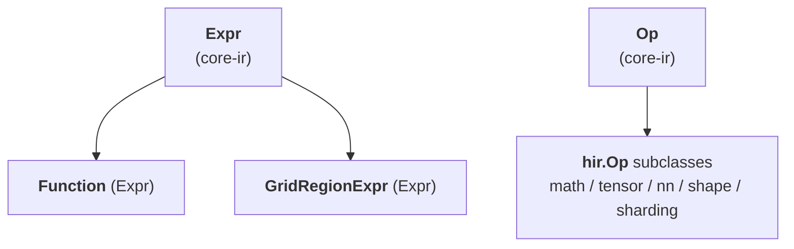

# TileFoundry Spec — hir (`@func` pure SSA dataflow IR)

Defines HIR, the pure SSA-as-DAG dataflow IR: its `Expr` constructs — the
`Function` container, the structured-SSA exception `GridRegionExpr`, and the
HIR Op subdirectories (math / tensor / nn / shape / sharding) — together with
their HIR-specific typing rules. Mesh scope is authored in the parser
([parser](./parser.md)) and its `Mesh` / `Topology` are defined by shard
([shard §5](./shard.md)); HIR links to those owners where a construct carries
the result.



## 1. HIR Expr constructs

HIR values are `Expr` nodes ([core-ir §2](./core-ir.md)): a `Function`
container, the loop-phi-shaped `GridRegionExpr`, and value `Op` calls. HIR is
pure **SSA-as-DAG** — there are no `Region` / `Block` abstractions and no Stmt
sequence; the single structured exception that carries loop-phi-shaped SSA is
`GridRegionExpr`.

### 1.1 `Function`

```python
@dataclass(frozen=True)
class Function(Expr):
    """HIR's function container. An Expr subclass — its value type is
    the function signature, and call sites resolve through Module's
    symbol table."""
    name: str                               # the function name; call sites resolve through Module's symbol table
    params: tuple[Var, ...]                 # each Var carries a type annotation
    body: Expr | None                       # a single Expr — typically a Call DAG; None for a dispatch prototype
    return_type: IRType                     # TensorType for single output, TupleType for multi
    topologies: tuple[Topology, ...]        # convenience for single-function modules
```
- constraints:
  - an `Expr` subclass whose value type is the function signature; always returns
    by value (explicit output params are TIR-only). Typing and shape-dispatch
    rules are stated below.

`Function.body` is a **single Expr** (usually a Call DAG, possibly
nested inside a `GridRegionExpr`). HIR has no Stmt sequence; name
reuse lives in the parser's lexical environment, not the IR. The one
exception is a **dispatch prototype** — a specialized function's base,
whose body is `None` (written `pass` in the DSL); it declares the
signature and dispatch envelope only, and its variants carry the
implementations (see **Shape dispatch and specializations** below).

`Function` always returns by value; explicit output parameters are
TIR-only (see [tir](./tir.md)). `HirToTirPass` materialises the HIR
return value into a TIR explicit output buffer parameter at the
HIR → TIR boundary.

`topologies` is the convenience declaration for a single-function
program. Before `compile` / `jit`, it lifts to `Module.topologies`
([core-ir §1](./core-ir.md)). A `with Mesh(topology="cta", ...) as cta:`
inside the body resolves the topology name through the active
namespace and creates a parser-lexical mesh binding;
`ShardLayout.mesh` MUST point at an active binding on the lexical
path.

**Value type.** `Function.type` is the IR-level `CallableType`
([types §7](./types.md#7-callabletype)) projected from `params` +
`return_type`. The projection is fixed at construction and stays
consistent across construction sites.

**Call typing.** A `Call` whose target is a `Function` types by
re-deriving the callee under the *actual* argument types: each
parameter binds to its caller argument's type and the body is
typeinferred afresh, so the callee **specializes per call site** and a
caller-supplied layout (sharding) flows into a layout-unconstrained
parameter and propagates through the body. Argument ↔ parameter
matching is:

- Arity MUST match — exactly one argument per parameter.
- A parameter that is a `TensorType` with `layout is None` is a
  **logical tensor**: its layout is unconstrained, so an argument of
  any layout (plain / replicated / split / partial) is accepted when
  its logical `shape` and `dtype` match.
- A parameter that carries a `ShardLayout` is an explicit layout
  constraint: the argument type MUST match it exactly.
- Any other parameter requires exact type equality.

When the body cannot express a propagated sharding (e.g. a reshape
whose cute factorization straddles a new axis), typeinfer fails at that
op, not at the boundary. A dispatch-prototype callee (`variants != ()`,
`body is None`) is not re-derived: the call's result is the declared
`return_type` and the `None` body is never inspected (variant selection
is **Shape dispatch and specializations** below).

**Signature annotation `Layout.strides` materialization.** A
`Tensor[..., (sugar)]` annotation on a parameter or return appears
at the kernel boundary, where the underlying engine is a shared
buffer handed across the FFI surface. When the surface sugar emits
`Layout(strides=None)` ([parser.md §1.5](./parser.md#15-layout-sugar)),
function-signature binding MUST materialize it to **shared-engine
C-order over the canonical global shape** before the resulting
`TensorType` enters the body. Verbose `Layout(strides=tuple)`
annotations are preserved verbatim. After signature binding, no
`Tensor[...]` annotation reachable from the function carries
`strides=None`.

**SSA shape**. HIR is pure **SSA-as-DAG** — sharing of intermediate
results is expressed by Python object identity:

- *Single use*: nest the Calls.
  `Call(Binary(kind=MUL), (Call(Binary(kind=ADD), (a, b)), c))` does
  not name the inner `Binary` result.
- *Multiple uses*: the parser binds `c = add(a, b)` in its lexical
  env so subsequent `mul(c, c)` / `sub(c, d)` share the same Call
  node. The IR has no binding nodes; DAG edges express "same value".

There are no `Region` / `Block` abstractions in HIR. The single
structured exception that carries loop-phi-shaped SSA is
`GridRegionExpr` ([§1.2](#12-gridregionexpr)). Everything else is a
pure Call DAG.

**Function typing rules.** Enforced by the registered
`@register_typeinfer(Function)` body via `ctx.error(...)`
([visitor-registry §4](./visitor-registry.md)):

- `Function.body` is a single Expr; Stmts MUST NOT appear.
- `Function.params` entries MUST be `Var`s.
- Within a `Function` signature, every occurrence of a same-name
  `DimVar` across `params` and `return_type` MUST agree on its
  `(lo, hi)` bounds; a disagreement is a verify error. A
  `DimVarRangePat` specialization MUST anchor to a `DimVar` reachable
  from an input parameter and lie within that `DimVar`'s envelope
  (see **Shape dispatch and specializations** below).

**Shape dispatch and specializations.**
`Function` is the sole HIR function `Expr`. Shape-dispatch is carried on a
single **base** `Function` through its `variants` field; there is no
separate specialized-function type. The field is the IR-side carrier for
the parser surface ([parser.md](./parser.md)).

```python
@dataclass(frozen=True)
class Function(Expr):
    ...
    specializations: tuple[Pattern, ...] = ()
    variants: tuple["Function", ...] = ()
```

*Structure.* A `Function` is exactly one of three shapes:

- **normal** — `specializations == ()`, `variants == ()`, `body` is an
  `Expr`. An ordinary function.
- **dispatch prototype (base)** — `specializations == ()`,
  `variants != ()`, `body is None`. Declares the signature and dispatch
  envelope only; the implementations live in its variants.
- **variant** — `specializations != ()`, `variants == ()`, `body` is an
  `Expr`. A shape-specialized implementation registered on a base.

Nesting is exactly one level: a variant MUST NOT itself carry variants.
In a sealed (verified) `Module` the invariant is `body is None` ⟺
`variants != ()` — a function with no body and no variants is uncallable
and invalid, and a real body combined with variants is invalid. During
authoring the base is transiently `body is None, variants == ()` between
`@func def f: pass` and the first `@f.specialize(...)`; this unsealed
state is allowed only until the base enters a `Module` (see **Authoring
freeze** below).

- `variants` is a canonical IR field — it participates in structural
  equality, hashing, and canonical printing.
- Every variant of a base MUST share the base's `name`, `params`,
  `return_type`, `target`, and `topologies`: a variant specializes the
  body, not the signature.
- A variant carries exactly one `DimVarRangePat` in `specializations`.
  The canonical signature is
  `";".join(f"{p.dim_var}${p.lo}_{p.hi}" for p in specializations)`
  (v0 allows only `DimVarRangePat`). Two variants of one base MUST have
  distinct canonical signatures.

*Envelope coverage.* A dispatched function's parameter
`TensorType.shape` carries a `DimVar(name, lo, hi)` whose `(lo, hi)` is
the dispatch envelope; `DimVarRangePat` references that `DimVar` by name.
The variants' ranges MUST **partition** the envelope — pairwise
**disjoint** and jointly **complete** (their union is exactly the
half-open `[lo, hi)`). Adjacent half-open ranges meet at the shared
boundary value as `[.., c)` then `[c, ..)`. Every in-envelope shape
therefore selects exactly one variant.

*Prototype body.* A base's `body is None`: the prototype is never
typeinferred, lowered, or evaluated as a body. Only its variants carry
executable bodies. There is no base body to fall back to.

*Dispatch resolution.* A `Call` whose target is a dispatch prototype
(`variants != ()`) is a dispatch call: the variant whose `DimVarRangePat`
matches the call's concrete argument shapes is selected and is the call's
result. A shape outside the envelope matches no variant and is an error;
there is no base body to fall back to (the prototype body is `None`). A
`Call` whose target has `variants == ()` is a direct call to that body.

*Authoring freeze.* Variants accumulate during authoring, before the
base `Function` enters a `Module` ([core-ir §1](./core-ir.md#1-module)). A
sealed base rejects further variants. Because `variants` participates in
hashing, a base MUST NOT be hashed while still accumulating variants. A
top-level `Module.functions` entry MUST NOT be a variant: a top-level
`Function` with `specializations != ()` is a verifier error.

### 1.2 `GridRegionExpr`

```python
@dataclass(frozen=True)
class GridRegionExpr(Expr):
    """Loop-phi-shaped structured SSA — the only HIR exception to
    pure Call DAG. Folds a tile-style loop into a single Expr value."""
    induction_var: Var                       # loop induction Var, ranging over range(start, extent, step)
    carried_args: tuple[Var, ...]            # loop-phi carry chain (equal lengths)
    init_args: tuple[Expr, ...]              # loop-phi carry chain (equal lengths)
    body: Expr                               # the loop body Expr
    yield_values: tuple[Expr, ...]           # loop-phi carry chain (equal lengths)
    extent: ShapeDim                         # iteration-domain stop (half-open)
    step: ShapeDim                           # induction-var stride
    start: ShapeDim = 0                       # iteration-domain start (default 0)
```
- constraints:
  - the only HIR exception to pure Call DAG: loop-phi-shaped structured SSA that
    folds a tile-style loop into one `Expr` value; `type` is `TensorType` (single
    carry) or `TupleType` (multi-carry).

**Iteration domain.** Both DSL loop surfaces — `for i in tile(...)` and
`for i in range(...)` — lower to this one node; they share the domain
`(start, extent, step)` and differ only in the loop-variable binding (`tile`
2-arg binds a parser-side `RangeSlice`, everything else binds a scalar; see
[parser §1.7](./parser.md)). `range` is not unrolled. `induction_var` ranges
over `range(start, extent, step)`: `start` and `extent` are the **half-open**
`[start, extent)` Python-range endpoints (so `extent` is the **stop** value,
not a count). `start` defaults to `0` (`tile(...)` and `range(stop)`); the
`range(start, stop[, step])` surface sets it. Each of `start` / `extent` /
`step` is a `ShapeDim` ([types §4](./types.md)).

- When `start` / `extent` / `step` are static `int`, the trip count is
  recoverable from the node alone, without the parser-side
  `RangeSlice` binding ([parser §5.6](./parser.md)).
- Every `DimVar` referenced by a `ShapeDim` `start` / `extent` / `step` MUST
  be bound by the enclosing Function's parameter shapes. Resolution
  substitutes each such `DimVar` with the corresponding argument-shape
  size and folds the dim `Expr` to a value `n`. The resolved `start` and
  `extent` MUST be non-negative integers and the resolved `step` MUST be a
  positive integer; otherwise resolution MUST raise. An unbound
  `DimVar` MUST raise.
- A `ShapeDim` `start` / `extent` / `step` is resolved by the evaluator at
  call time against concrete argument shapes; its trip count is not
  statically recoverable from the node alone.

**Carry-out semantics.** The parser populates the carry chain when a
`for i in tile(...)` body contains an `ast.Assign` whose single
`Name` target binds an outer-scope name:

- the carried name becomes a phi `Var` in `carried_args`,
- the pre-loop binding of that name becomes the matching entry in
  `init_args` (the carry's value on the first iteration),
- inside the loop body the same name resolves to that phi `Var`,
- after the loop, the post-region binding refers to the
  `GridRegionExpr` itself (single carry) or a `tuple_get_item` of it
  (multi-carry, when `len(yield_values) > 1`).

`init_args` are value Exprs (traversed and rewritten by the
visitor / mutator), distinct from the binding-site `carried_args` /
`induction_var`. `len(init_args) == len(carried_args) ==
len(yield_values)`; all three are empty for a no-carry loop. The node
is self-contained: the first-iteration value of each `carried_args`
phi is its `init_args` entry, not a name looked up in the enclosing
parser scope.

`GridRegionExpr.type` is `TensorType` (single carry) or `TupleType`
(multi-carry); the value is the Expr itself, not a `Call`.
Parser-side rules: see [parser §5.6](./parser.md).

**Minimal example** — loop-carried accumulator:

```python
acc = zeros((M,), f32, storage="rmem")
for i in tile(K, step=BLOCK):
    acc = acc + load_tile(x, i)
# After the loop, `acc` resolves to the GridRegionExpr value.
```

becomes (sketched):

```python
GridRegionExpr(
    induction_var = i,
    carried_args  = (acc_phi,),
    init_args     = (Call(Zeros(...), ()),),   # the pre-loop `acc`
    body          = Call(Binary(kind=ADD), (acc_phi, load_tile(x, i))),
    yield_values  = (Call(Binary(kind=ADD), ...),),
    extent        = K,
    step          = BLOCK,
)
```

### 1.3 Op

HIR Ops are organised under `tilefoundry.ir.hir.<namespace>/`; the
subdirectory is file organisation, not a separate IR layer. A **custom Op**
records its full contract (fields, typing / verifier rules, worked examples)
in its catalog entry below; a **consensus Op** needs only one sentence or a
grouped external reference, per [SPEC-RULES](../SPEC-RULES.md). The op name is
the pointer — code carries no back-link to this catalog. Field signatures and
`ParamDef` listings stay in code ([core-ir §2.3](./core-ir.md)).

**HIR-specific typing hooks.** Each op's constraints are enforced by its
registered `@register_typeinfer(<OpClass>)` body via `ctx.error(...)`
([visitor-registry §4](./visitor-registry.md)):

- `Local(x)`: `x.type.layout` MUST be `ShardLayout`. The result
  shape contracts per the `Split` axes; dtype is preserved; layout
  becomes the corresponding local layout.
- `Reshard(x, layout, storage)`: `layout` and `storage` are attributes
  (compile-time constants); the output preserves `x.type.shape` (logical).
  Architecture invariant: after HIR typeinfer runs, every `ShardLayout`
  reachable from a value's type has concrete `layout.strides` (never `None`) —
  the un-materialized (`strides=None`) parser sugar MUST be materialized by the
  owning typeinfer. The per-op `(layout, storage)` resolution table is in the
  `Reshard` op entry below.
- Any HIR Op MUST be value-form ([core-ir §2.3](./core-ir.md));
  emitting an effect-form Call into HIR is a verify error.

Generic, analysis-wide typing behavior is owned by
[analysis](./analysis.md): relation-driven type validity
([analysis §1.1](./analysis.md#11-relation-derived-type-behavior)), output
storage of multi-input ops, and operand layout / mesh ownership
([analysis §3.3](./analysis.md#33-output-storage-and-meshlayout-compatibility)).
HIR ops call these services; each op's registered typeinfer owns the layout /
mesh compatibility and result layout it requires, and `Reshard` is the explicit
op that changes a value's layout / mesh.

#### `ir/hir/math/`

Pointwise arithmetic and comparison, torch semantics with TileFoundry
type-promotion. Most user-callable names (`add` / `cmp_eq` / `logical_and` / …)
are surface aliases ([core-ir §2.3](./core-ir.md)) over the kinded `Binary` /
`Unary` Ops. A few pointwise ops are first-class per-name IR classes instead
(e.g. `Exp`); their surface name maps to the dedicated Op, not to a kind.
[torch element-wise ops](https://pytorch.org/docs/stable/torch.html#pointwise-ops).

##### Binary
```python
Binary(kind, lhs, rhs) -> Tensor    # kind: binary arithmetic, comparison, or boolean tag; lhs / rhs: input tensors
```
- constraints:
  - Behavior follows torch pointwise semantics with TileFoundry type promotion.
  - The elementwise `min` / `max` kinds are also surfaced as `minimum` / `maximum`.

##### Unary
```python
Unary(kind, x) -> Tensor    # kind: unary tag including neg, abs, logical_not, rsqrt, and log; x: input tensor
```
- constraints:
  - Behavior follows torch pointwise semantics with TileFoundry type promotion.
  - `log` is the natural logarithm; `exp` is NOT a Unary kind — it is the
    first-class `Exp` Op below.

##### Exp
```python
Exp(x) -> Tensor    # x: input tensor
```
- constraints:
  - Pointwise natural exponential `e ** x`; a first-class Op with surface name
    `exp`, not a `Unary` kind.

#### `ir/hir/tensor/`

Tensor structural operations; consensus ops follow torch / numpy
([torch tensor manipulation ops](https://pytorch.org/docs/stable/torch.html#indexing-slicing-joining-mutating-ops)).

##### Reshape / Transpose / Slice / Concat / Stack / Split / Gather / ShapeOf / Rank / Cast
Consensus torch / numpy structural ops.

##### Zeros
```python
Zeros(shape, dtype, storage) -> Tensor    # shape: output logical shape; dtype: output dtype; storage: output storage kind
```
- constraints:
  - The result is zero-initialised.

##### Reduce
```python
Reduce(x, axes, keepdim, kind) -> Tensor    # x: input tensor; axes: reduced logical axes; keepdim: whether reduced axes remain as size-1 axes; kind: mean, sum, abs_max, or max
```
- constraints:
  - The logical result shape follows numpy reduction rules.
  - Storage is preserved.
  - Plain input layout passes through unchanged.
  - For `ShardLayout` input, every split cute position that belongs to a
    reduced tensor axis collapses to broadcast with size-1 stride-0 output.
  - Non-default-stride sharded input must carry explicit producer strides, or
    typeinfer rejects it.
  - Lowering emits TIR `Reduce`; runtime dispatch is derived from operands, not
    from an HIR dispatch field.

##### insert_slice
```python
insert_slice(dst, update, offsets) -> Tensor    # dst: target tensor (value form returns a tensor anchored on this buffer at lowering time); update: tensor written into the window; offsets: per-axis window starts — a rank-0 integer scalar for a rank-1 dst, or a tuple of rank-0 integer scalars (literal or runtime), one per axis, for rank N
```
- constraints:
  - `update` has the same rank and dtype as `dst`; the window on each axis is
    `[offset_axis, offset_axis + update.shape[axis])`.
  - A rank-1 `dst` accepts a bare rank-0 scalar offset; a rank-N `dst` requires
    an offset tuple whose length equals the rank.
  - A *literal* (compile-time) offset that places a negative or out-of-bounds
    window on an axis fails typeinfer, naming the axis; a runtime offset is
    checked at eval/runtime.
  - The value form writes `update` into a slice view of `dst`'s existing buffer
    (a loop-carried `dst` reuses one buffer with no replacement allocation).

##### TopK
```python
TopK(x, k, axis=-1, largest=True, sorted=True) -> (Tensor, Tensor)    # x: input; k: elements kept on axis; largest: greatest vs smallest; sorted: ordered selection -> (values keep x dtype, i64 indices)
```
- constraints:
  - The result is a `(values, indices)` tuple; both shrink the selected axis to
    length `k`; `values` keep `x`'s dtype and `indices` are `i64`.
  - `k` MUST be non-negative, and a static `k` greater than the selected-axis
    length fails typeinfer.
  - The selected axis MUST NOT be `Split`-sharded by a `ShardLayout`; a split
    selected axis fails typeinfer.
  - A `ShardLayout` output preserves the non-selected sharding and any
    replication; only the selected axis's layout extent becomes `k`, so the
    layout keeps size parity with the result shape.
  - `sorted` returns the selected elements ordered by `largest`; otherwise the
    same selected set is returned in an unspecified order.

#### `ir/hir/nn/`

Neural-network value Ops following torch semantics
([torch.nn.functional](https://pytorch.org/docs/stable/nn.functional.html)).

##### MatMul / Conv2D / ReLU / Sigmoid / Tanh / SoftMax / LayerNorm
Consensus torch.nn.functional ops.

#### `ir/hir/shape/`

Shape-level Ops on whole shape values (per-axis dim Ops are
[types §3](./types.md)).

##### ShapeExtract
```python
ShapeExtract(shape, axis) -> Dim    # shape: input shape value; axis: extracted axis
```
- constraints:
  - The result is the dimension at `axis`.

##### ShapeCompose
```python
ShapeCompose(dims) -> Shape    # dims: per-axis dimensions
```
- constraints:
  - The result is a shape value assembled in input order.

#### `ir/hir/sharding/`

`ShardLayout` and `Mesh` are type-system constructs, not Expr inputs
([shard §5](./shard.md)).

##### Reshard
```python
Reshard(x, layout=None, storage=None) -> Tensor    # x: input tensor; layout: optional target ShardLayout; storage: optional target storage kind
```
- constraints:
  - Omitting `layout` preserves `x.layout`; omitting `storage` preserves
    `x.storage`.
  - The output preserves the input logical `TensorType.shape`.
  - Supplied `layout` is a `ShardLayout`.
  - Destination storage is concrete, not unmaterialized.
  - The single op covers zero-copy view, cross-storage copy, cross-CTA
    redistribute, and mixed cases; typeinfer/costmodel classify the call.

**Stride resolution.** Storage direction follows the physical addressability
hierarchy `rmem < smem < gmem` (per-thread / per-CTA / per-program). Typeinfer
dispatches on `(layout, storage)`:

- `layout=None`, storage unchanged → `x.type` (no-op).
- `layout=None`, storage changed → error; a storage change MUST carry an
  explicit `layout=`.
- `layout=Layout(strides=None)` (sugar), storage unchanged → dest strides match
  the form already on `x.layout`: a Split-axes-zero source ⇒ per-instance form;
  otherwise ⇒ shared-engine C-order over the canonical global shape. When
  `x.layout` is `None` (plain kernel-param), fall back to shared-engine C-order.
- `layout=Layout(strides=None)` (sugar), low → high level → dest strides =
  C-order over `layout.shape` (shared-engine form).
- `layout=Layout(strides=None)` (sugar), high → low level → dest `strides[k]=0`
  for every `Split` axis `k`; non-`Split` axes follow C-order over
  `shard_layout_local_shape(layout)` with size-1 → 0 (per-instance form).
- `layout=Layout(strides=tuple)` (verbose) → dest strides are taken verbatim;
  typeinfer MUST NOT rewrite them (e.g. SM80 MMA fragment layouts).

**Cross-CTA fence.** The grid fence for a cross-CTA reshard is owned by the
reshard lowering, not by a separately authored sync. When a reshard reads a
gmem shard produced under a different CTA ownership (an ownership change across
a cta mesh), the lowering MUST emit a grid barrier before the reshard so every
CTA's prior shard writes are visible. The reshard lowering owns only the fence;
cross-CTA data redistribution (all-to-all / gather across CTAs) is not part of
this op.

##### Local
```python
Local(x) -> Tensor    # x: input tensor with ShardLayout
```
- constraints:
  - The result shape contracts each `Split` axis by that mesh axis's extent.
  - `dtype` and `storage` are preserved.
  - The shard wrapper is stripped, leaving the base `Layout`.
  - Static split sizes divide by mesh extent; symbolic sizes pass through.
