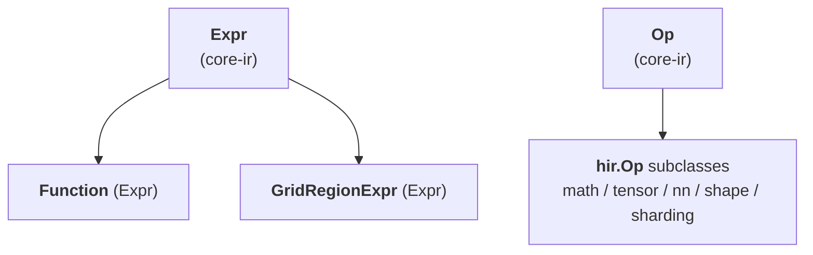

# TileFoundry Spec — hir (`@func` pure SSA dataflow IR)

Defines `hir.Function`, the HIR Op subdirectories
(math / tensor / nn / shape / sharding), the structured-SSA
exception `GridRegionExpr`, and the parser-level Mesh-scope rule.



## 1. `Function`

```python
@dataclass(frozen=True)
class Function(Expr):
    """HIR's function container. An Expr subclass — its value type is
    the function signature, and call sites resolve through Module's
    symbol table."""
    name: str
    params: tuple[Var, ...]                 # each Var carries a type annotation
    body: Expr | None                       # a single Expr — typically a Call DAG; None for a dispatch prototype
    return_type: IRType                     # TensorType for single output, TupleType for multi
    topologies: tuple[Topology, ...]        # convenience for single-function modules
```

`Function.body` is a **single Expr** (usually a Call DAG, possibly
nested inside a `GridRegionExpr`). HIR has no Stmt sequence; name
reuse lives in the parser's lexical environment, not the IR. The one
exception is a **dispatch prototype** — a specialized function's base,
whose body is `None` (written `pass` in the DSL); it declares the
signature and dispatch envelope only, and its variants carry the
implementations ([§5](#5-dispatch-specializations)).

`Function` always returns by value; explicit output parameters are
TIR-only (see [tir](./tir.md)). `HirToTirPass` materialises the HIR
return value into a TIR explicit output buffer parameter at the
HIR → TIR boundary.

`topologies` is the convenience declaration for a single-function
program. Before `compile` / `jit`, it lifts to `Module.topologies`
([core-ir §2](./core-ir.md)). A `with Mesh(topology="cta", ...) as cta:`
inside the body resolves the topology name through the active
namespace and creates a parser-lexical mesh binding;
`ShardLayout.mesh` MUST point at an active binding on the lexical
path.

**Value type.** `Function.type` is the IR-level `CallableType`
([types §7](./types.md#7-callabletype)) projected from `params` +
`return_type`. The projection is fixed at construction and stays
consistent across construction sites.

**Call typing.** A `Call` whose target is a `Function` types by
re-deriving the callee under the *actual* argument types: each
parameter binds to its caller argument's type and the body is
typeinferred afresh, so the callee **specializes per call site** and a
caller-supplied layout (sharding) flows into a layout-unconstrained
parameter and propagates through the body. Argument ↔ parameter
matching is:

- Arity MUST match — exactly one argument per parameter.
- A parameter that is a `TensorType` with `layout is None` is a
  **logical tensor**: its layout is unconstrained, so an argument of
  any layout (plain / replicated / split / partial) is accepted when
  its logical `shape` and `dtype` match.
- A parameter that carries a `ShardLayout` is an explicit layout
  constraint: the argument type MUST match it exactly.
- Any other parameter requires exact type equality.

When the body cannot express a propagated sharding (e.g. a reshape
whose cute factorization straddles a new axis), typeinfer fails at that
op, not at the boundary. A dispatch-prototype callee (`variants != ()`,
`body is None`) is not re-derived: the call's result is the declared
`return_type` and the `None` body is never inspected (variant selection
is [§5](#5-dispatch-specializations)).

**Signature annotation `Layout.strides` materialization.** A
`Tensor[..., (sugar)]` annotation on a parameter or return appears
at the kernel boundary, where the underlying engine is a shared
buffer handed across the FFI surface. When the surface sugar emits
`Layout(strides=None)` ([parser.md §1.5](./parser.md#15-layout-sugar)),
function-signature binding MUST materialize it to **shared-engine
C-order over the canonical global shape** before the resulting
`TensorType` enters the body. Verbose `Layout(strides=tuple)`
annotations are preserved verbatim. After signature binding, no
`Tensor[...]` annotation reachable from the function carries
`strides=None`.

**SSA shape**. HIR is pure **SSA-as-DAG** — sharing of intermediate
results is expressed by Python object identity:

- *Single use*: nest the Calls.
  `Call(Binary(kind=MUL), (Call(Binary(kind=ADD), (a, b)), c))` does
  not name the inner `Binary` result.
- *Multiple uses*: the parser binds `c = add(a, b)` in its lexical
  env so subsequent `mul(c, c)` / `sub(c, d)` share the same Call
  node. The IR has no binding nodes; DAG edges express "same value".

There are no `Region` / `Block` abstractions in HIR. The single
structured exception that carries loop-phi-shaped SSA is
`GridRegionExpr` ([§4](#4-gridregionexpr)). Everything else is a
pure Call DAG.

## 2. Op catalog

HIR Ops are organised under `tilefoundry.ir.hir.<namespace>/`; the
subdirectory is file organisation, not a separate IR layer. A **custom Op**
records its full contract (fields, typing / verifier rules, worked examples)
in its catalog entry below; a **consensus Op** needs only one sentence or a
grouped external reference, per [SPEC-RULES](../SPEC-RULES.md). The op name is
the pointer — code carries no back-link to this catalog. Field signatures and
`ParamDef` listings stay in code ([core-ir §4](./core-ir.md)).

### 2.1 `ir/hir/math/`

Pointwise arithmetic and comparison, torch semantics with TileFoundry
type-promotion. User-callable names (`add` / `cmp_eq` / `logical_and` / …) are
surface aliases ([core-ir §4](./core-ir.md)) over the kinded Ops; there are no
per-name IR classes.
[torch element-wise ops](https://pytorch.org/docs/stable/torch.html#pointwise-ops).

#### Binary
Kinded pointwise arithmetic, comparison, and boolean.

#### Unary
Kinded pointwise unary (`neg` / `abs` / `logical_not`).

#### Rsqrt
Reciprocal square root.

### 2.2 `ir/hir/tensor/`

Tensor structural operations; consensus ops follow torch / numpy
([torch tensor manipulation ops](https://pytorch.org/docs/stable/torch.html#indexing-slicing-joining-mutating-ops)).

#### Reshape / Transpose / Slice / Concat / Stack / Split / Gather / ShapeOf / Rank / Cast
Consensus torch / numpy structural ops.

#### Zeros
Allocate a zero-initialised tensor.

#### Reduce
Axis reduction (`mean` / `sum` / `abs_max` / `max`).
`Reduce(x, axes=(0,), keepdim=True, kind=ReduceKind.MEAN)` lowers to TIR
`Reduce`, whose hardware dispatch is derived by codegen + runtime from the
operand `ShardLayout` / `Mesh`.

- The logical `TensorType.shape` follows numpy: a reduced axis becomes `1`
  when `keepdim=True`, otherwise it is removed.
- `storage` MUST be preserved.
- When `x.type.layout` is plain (non-`ShardLayout`) or `None`, the output
  layout passes through unchanged.

**Output layout — sharded input.** When `x.type.layout` is a `ShardLayout`,
reducing over an axis that is `Split` across mesh axes produces a result every
participant sees identically. The output layout is "project to the local
layout, then take default strides":

- The input `ShardLayout` MUST be projected to its local layout under the
  current device's shard view: every cute position bound to a mesh axis via a
  `Split` attr shrinks to size 1.
- Every cute position that falls within a reduced tensor axis MUST collapse to
  size 1.
- Strides MUST follow the row-major default for the resulting local shape:
  size-1 positions carry stride `0`; other positions carry the default
  contiguous stride for the surviving dimension(s).
- Attrs: every `Split(axis=L)` whose cute position `L` falls within a reduced
  tensor axis MUST become `Broadcast()`. Non-reduced mesh axes MUST preserve
  their attr (`Split` / `Partial` / `Broadcast` / `Dynamic`).

The default-contiguous-stride rule applies only when the input `ShardLayout` is
itself in default-stride form; a non-default-stride (transposed / permuted)
input MUST carry explicit strides from its producer, else verify / typeinfer
MUST reject it.

Cute position → tensor axis mapping uses the left-to-right product convention:
each tensor axis `k` claims as many cute positions as needed to accumulate to
`tensor_shape[k]`; trailing cute positions attach to the last tensor axis; a
singleton tensor axis claims exactly one cute position.

Worked examples: rmsnorm `(1, 1536) → (1, 1)` with every mesh axis covering the
reduced last axis — every cute position ends up size-1-non-reduced (outer axis
0) or reduced, so the output is `shape=(1,1,1,1) strides=(0,0,0,0)
attrs=(Broadcast, Broadcast)`. A partial reduce `(M, N) → (M, 1)` with the mesh
covering only the reduced axis keeps outer axis 0's stride (it still indexes
distinct rows); only the reduced positions go to size 1 stride 0.

#### insert_slice
Dynamic-update-slice: return `dst` with `update` written into the window that
starts at `offsets` (one start per dim) and spans `update`'s shape — the SSA
spelling of "slice + store", kept distinct from `scatter` (data-dependent
multi-index).

- `update` MUST have the same rank as `dst`, and the same dtype.
- `offsets` gives one start per sliced dim. The 1-D case (the only implemented
  rank) takes a single scalar start: a rank-0 `()` integer tensor for a runtime
  value, or a compile-time integer literal. An N-D slice takes a rank-1 vector
  of length equal to the number of sliced dims; that rides the same surface and
  lands with the N-D case.
- `dst` / `update` are rank-1 — one scalar start, a contiguous window
  `[start, start + update.shape[0])`. Higher-rank `dst` / `update` share this
  surface and MUST be rejected at typeinfer.
- A statically-known window exceeding `dst`'s extent MUST be rejected by
  typeinfer; a window resolved only at runtime MUST be checked by the eval /
  runtime guard.

The value form returns a new `dst`; an in-place realization is a lowering
concern (the result is anchored on the `dst` buffer).

### 2.3 `ir/hir/nn/`

Neural-network value Ops following torch semantics
([torch.nn.functional](https://pytorch.org/docs/stable/nn.functional.html)).

#### MatMul / Conv2D / ReLU / Sigmoid / Tanh / SoftMax / LayerNorm
Consensus torch.nn.functional ops.

#### MMA ops
Arch-specific matrix-multiply-accumulate (`Mma_SM80_16x8x16`,
`Wgmma_SM90_64x128x16`, …) at the value-form-HIR ↔ effect-form-TIR boundary.

### 2.4 `ir/hir/shape/`

Shape-level Ops on whole shape values (per-axis dim Ops are
[types §3](./types.md)).

#### ShapeExtract
Extract one axis from a shape value.

#### ShapeCompose
Assemble a shape from per-axis dims.

### 2.5 `ir/hir/sharding/`

`ShardLayout` and `Mesh` are type-system constructs, not Expr inputs
([shard §5](./shard.md)).

#### Reshard
Convert `x` to a target layout / storage in place, preserving the logical
`TensorType.shape`. A single `reshard` covers layout / sharding / storage
changes plus the logical-shape view shifts that arise from sharding (e.g.
`(1, 64)` plain → `(1, 8192 @ cta)` sharded on a 128-cta mesh — physically
each cta still holds 64, logically the `TensorType.shape` is 8192). Local
memory rearrangement (transpose / flatten / true reshape) is **not** in scope
— use `Reshape` for that.

- Both attributes are optional: omitting `layout` preserves `x.layout`;
  omitting `storage` preserves `x.storage`.
- The output MUST preserve the logical `TensorType.shape` of the input.
- `layout` MUST be a `ShardLayout` when supplied.
- Destination `storage` MUST NOT be unmaterialized (`umat`); a reshard targets
  a concrete residency.
- The single op covers all four physical kinds (zero-copy view / cross-storage
  copy / cross-CTA redistribute / mixed); typeinfer + costmodel classify each
  call from its input ↔ output `TensorType` delta. The IR keeps one node per
  user call.

**Stride resolution.** Storage direction follows the physical addressability
hierarchy `rmem < smem < gmem` (per-thread / per-CTA / per-program). Typeinfer
dispatches on `(layout, storage)`:

- `layout=None`, storage unchanged → `x.type` (no-op).
- `layout=None`, storage changed → error; a storage change MUST carry an
  explicit `layout=`.
- `layout=Layout(strides=None)` (sugar), storage unchanged → dest strides match
  the form already on `x.layout`: a Split-axes-zero source ⇒ per-instance form;
  otherwise ⇒ shared-engine C-order over the canonical global shape. When
  `x.layout` is `None` (plain kernel-param), fall back to shared-engine C-order.
- `layout=Layout(strides=None)` (sugar), low → high level → dest strides =
  C-order over `layout.shape` (shared-engine form).
- `layout=Layout(strides=None)` (sugar), high → low level → dest `strides[k]=0`
  for every `Split` axis `k`; non-`Split` axes follow C-order over
  `shard_layout_local_shape(layout)` with size-1 → 0 (per-instance form).
- `layout=Layout(strides=tuple)` (verbose) → dest strides are taken verbatim;
  typeinfer MUST NOT rewrite them (e.g. SM80 MMA fragment layouts).

**Cross-CTA fence.** The grid fence for a cross-CTA reshard is owned by the
reshard lowering, not by a separately authored sync. When a reshard reads a
gmem shard produced under a different CTA ownership (an ownership change across
a cta mesh), the lowering MUST emit a grid barrier before the reshard so every
CTA's prior shard writes are visible. The reshard lowering owns only the fence;
cross-CTA data redistribution (all-to-all / gather across CTAs) is not part of
this op.

#### Local
The current device's local view of a `ShardLayout` tensor.

- `x.type.layout` MUST be a `ShardLayout`.
- The result shape MUST contract along each `Split` axis by that mesh axis's
  extent; `dtype` and `storage` MUST be preserved.
- The shard wrapper MUST be stripped, leaving the base `Layout`.

A statically-known `Split` axis size divides by the mesh-axis extent; a
symbolic axis size is carried through unchanged (folded later).

## 3. Typing / structural rules

Every constraint below is enforced by the registered
`@register_typeinfer(<OpClass>)` body via `ctx.error(...)`
([visitor-registry §4](./visitor-registry.md)).

- `Function.body` is a single Expr; Stmts MUST NOT appear.
- `Function.params` entries MUST be `Var`s.
- Within a `Function` signature, every occurrence of a same-name
  `DimVar` across `params` and `return_type` MUST agree on its
  `(lo, hi)` bounds; a disagreement is a verify error. A
  `DimVarRangePat` specialization MUST anchor to a `DimVar` reachable
  from an input parameter and lie within that `DimVar`'s envelope
  ([§5](#5-dispatch-specializations)).
- `Local(x)`: `x.type.layout` MUST be `ShardLayout`. The result
  shape contracts per the `Split` axes; dtype is preserved; layout
  becomes the corresponding local layout.
- `Reshard(x, layout, storage)`: `layout` and `storage` are attributes
  (compile-time constants); the output preserves `x.type.shape` (logical).
  Architecture invariant: after HIR typeinfer runs, every `ShardLayout`
  reachable from a value's type has concrete `layout.strides` (never `None`) —
  the un-materialized (`strides=None`) parser sugar MUST be materialized by the
  owning typeinfer. The per-op `(layout, storage)` resolution table is in the
  `Reshard` catalog entry (§2.5).
- Any HIR Op MUST be value-form ([core-ir §4](./core-ir.md));
  emitting an effect-form Call into HIR is a verify error.

### 3.1 Relation-driven type validity

An op's typeinfer MAY derive the output type from a forward access
relation ([visitor-registry §4.1](./visitor-registry.md#41-forward-relation-service--type_relation))
rather than from a hand-written rule. The relation describes one
shared iteration domain and, per boundary, an access map from that
domain to the tensor's index space. The relation carries **no tensor
shape**: the output shape is typeinfer-side data, derived from the
op's shape rule or (where implemented) from the relation by composing
the output access map over the domain.

Within the relation:

- A domain dim that appears in an input access map but **not** in the
  output access map is a **reduction** dim (it is eliminated in the
  output).
- A tensor axis whose access maps to a constant (rather than a domain
  dim) is a **broadcast** axis.
- A symbolic size is an isl parameter of the domain; the relation's
  rank is fixed and is read from the input types.

The shard consequences of these structural facts (how `Split` /
`Broadcast` / `Partial` propagate, and the reduction effect) are
defined in [shard §9](./shard.md#9-relation-driven-shard-propagation).

### 3.2 Output storage of multi-input ops

A symmetric multi-input op (`Binary`, `MatMul`, `Concat`, `Stack`,
`Mma`) resolves its output `storage` by **anchoring** on the concrete
residency among its operands ([types §2](./types.md)). The rule does not
appeal to any ordering of storage kinds and is independent of operand order:

- An **unmaterialized** operand (`storage=umat`) does not constrain the
  output — it abstains.
- One concrete operand storage (alongside any unmaterialized operands) is
  the **anchor**; the output takes that storage.
- Several concrete operands that agree on a storage → the output takes that
  storage.
- Several concrete operands that disagree on storage → typeinfer MUST
  `ctx.error`, unless the op defines its own destination/mixed-storage
  resolution. There is no operand-order tie-break.
- All operands unmaterialized → the output is unmaterialized (`umat`).

This resolution uses no memory-level lattice; output residency is a function
of the concrete anchor(s) alone. (The `rmem < smem < gmem` hierarchy in §3 is
a `Reshard`-*direction* notion and is unrelated to output-storage anchoring.)

### 3.3 Operand layout / mesh ownership

A tensor value's mesh / layout is carried by its `TensorType.layout`
(`ShardLayout.mesh` names the mesh instance) — that type is the source of
truth, and the IR places no scope-based restriction on values from
different meshes coexisting. Each op's registered typeinfer **owns** the
operand layout / mesh compatibility it requires and its result layout;
there is no uniform cross-op rule imposed from outside typeinfer.
`Reshard` is the explicit op that changes a value's layout / mesh.

A single-index `Gather` — a scalar index or a rank-1 one-element (`(1,)`) index
— on a **non-sharded** axis is a slice of the sharded input: its result layout
drops that axis's cute positions (scalar index) or collapses them to size 1
(`(1,)` index) and remaps the surviving `Split` cute-axis references onto their
new positions, carrying the mesh through unchanged. A gather along a sharded
(`Split`) axis, a multi-index gather (any index rank other than scalar or
`(1,)`, including a multi-index whose total size is 1), or a composed layout is
outside this slice contract and carries the input layout through unchanged.

## 4. `GridRegionExpr`

```python
@dataclass(frozen=True)
class GridRegionExpr(Expr):
    """Loop-phi-shaped structured SSA — the only HIR exception to
    pure Call DAG. Folds a tile-style loop into a single Expr value."""
    induction_var: Var
    carried_args: tuple[Var, ...]
    init_args: tuple[Expr, ...]
    body: Expr
    yield_values: tuple[Expr, ...]
    extent: ShapeDim                         # iteration-domain stop (half-open)
    step: ShapeDim                           # induction-var stride
    start: ShapeDim = 0                       # iteration-domain start (default 0)
```

**Iteration domain.** Both DSL loop surfaces — `for i in tile(...)` and
`for i in range(...)` — lower to this one node; they share the domain
`(start, extent, step)` and differ only in the loop-variable binding (`tile`
2-arg binds a parser-side `RangeSlice`, everything else binds a scalar; see
[parser §1.7](./parser.md)). `range` is not unrolled. `induction_var` ranges
over `range(start, extent, step)`: `start` and `extent` are the **half-open**
`[start, extent)` Python-range endpoints (so `extent` is the **stop** value,
not a count). `start` defaults to `0` (`tile(...)` and `range(stop)`); the
`range(start, stop[, step])` surface sets it. Each of `start` / `extent` /
`step` is a `ShapeDim` ([types §4](./types.md)).

- When `start` / `extent` / `step` are static `int`, the trip count is
  recoverable from the node alone, without the parser-side
  `RangeSlice` binding ([parser §5.6](./parser.md)).
- Every `DimVar` referenced by a `ShapeDim` `start` / `extent` / `step` MUST
  be bound by the enclosing Function's parameter shapes. Resolution
  substitutes each such `DimVar` with the corresponding argument-shape
  size and folds the dim `Expr` to a value `n`. The resolved `start` and
  `extent` MUST be non-negative integers and the resolved `step` MUST be a
  positive integer; otherwise resolution MUST raise. An unbound
  `DimVar` MUST raise.
- A `ShapeDim` `start` / `extent` / `step` is resolved by the evaluator at
  call time against concrete argument shapes; its trip count is not
  statically recoverable from the node alone.

**Carry-out semantics.** The parser populates the carry chain when a
`for i in tile(...)` body contains an `ast.Assign` whose single
`Name` target binds an outer-scope name:

- the carried name becomes a phi `Var` in `carried_args`,
- the pre-loop binding of that name becomes the matching entry in
  `init_args` (the carry's value on the first iteration),
- inside the loop body the same name resolves to that phi `Var`,
- after the loop, the post-region binding refers to the
  `GridRegionExpr` itself (single carry) or a `tuple_get_item` of it
  (multi-carry, when `len(yield_values) > 1`).

`init_args` are value Exprs (traversed and rewritten by the
visitor / mutator), distinct from the binding-site `carried_args` /
`induction_var`. `len(init_args) == len(carried_args) ==
len(yield_values)`; all three are empty for a no-carry loop. The node
is self-contained: the first-iteration value of each `carried_args`
phi is its `init_args` entry, not a name looked up in the enclosing
parser scope.

`GridRegionExpr.type` is `TensorType` (single carry) or `TupleType`
(multi-carry); the value is the Expr itself, not a `Call`.
Parser-side rules: see [parser §5.6](./parser.md).

**Minimal example** — loop-carried accumulator:

```python
acc = zeros((M,), f32, storage="rmem")
for i in tile(K, step=BLOCK):
    acc = acc + load_tile(x, i)
# After the loop, `acc` resolves to the GridRegionExpr value.
```

becomes (sketched):

```python
GridRegionExpr(
    induction_var = i,
    carried_args  = (acc_phi,),
    init_args     = (Call(Zeros(...), ()),),   # the pre-loop `acc`
    body          = Call(Binary(kind=ADD), (acc_phi, load_tile(x, i))),
    yield_values  = (Call(Binary(kind=ADD), ...),),
    extent        = K,
    step          = BLOCK,
)
```

## 5. Dispatch specializations

`Function` is the sole HIR function `Expr`. Shape-dispatch is carried on a
single **base** `Function` through its `variants` field; there is no
separate specialized-function type. The field is the IR-side carrier for
the parser surface in [parser.md §8](./parser.md#8-dispatch-specializations).

```python
@dataclass(frozen=True)
class Function(Expr):
    ...
    specializations: tuple[Pattern, ...] = ()
    variants: tuple["Function", ...] = ()
```

**Structure.** A `Function` is exactly one of three shapes:

- **normal** — `specializations == ()`, `variants == ()`, `body` is an
  `Expr`. An ordinary function.
- **dispatch prototype (base)** — `specializations == ()`,
  `variants != ()`, `body is None`. Declares the signature and dispatch
  envelope only; the implementations live in its variants.
- **variant** — `specializations != ()`, `variants == ()`, `body` is an
  `Expr`. A shape-specialized implementation registered on a base.

Nesting is exactly one level: a variant MUST NOT itself carry variants.
In a sealed (verified) `Module` the invariant is `body is None` ⟺
`variants != ()` — a function with no body and no variants is uncallable
and invalid, and a real body combined with variants is invalid. During
authoring the base is transiently `body is None, variants == ()` between
`@func def f: pass` and the first `@f.specialize(...)`; this unsealed
state is allowed only until the base enters a `Module` (see **Authoring
freeze** below).

- `variants` is a canonical IR field — it participates in structural
  equality, hashing, and canonical printing.
- Every variant of a base MUST share the base's `name`, `params`,
  `return_type`, `target`, and `topologies`: a variant specializes the
  body, not the signature.
- A variant carries exactly one `DimVarRangePat` in `specializations`.
  The canonical signature is
  `";".join(f"{p.dim_var}${p.lo}_{p.hi}" for p in specializations)`
  (v0 allows only `DimVarRangePat`). Two variants of one base MUST have
  distinct canonical signatures.

**Envelope coverage.** A dispatched function's parameter
`TensorType.shape` carries a `DimVar(name, lo, hi)` whose `(lo, hi)` is
the dispatch envelope; `DimVarRangePat` references that `DimVar` by name.
The variants' ranges MUST **partition** the envelope — pairwise
**disjoint** and jointly **complete** (their union is exactly the
half-open `[lo, hi)`). Adjacent half-open ranges meet at the shared
boundary value as `[.., c)` then `[c, ..)`. Every in-envelope shape
therefore selects exactly one variant.

**Prototype body.** A base's `body is None`: the prototype is never
typeinferred, lowered, or evaluated as a body. Only its variants carry
executable bodies. There is no base body to fall back to.

**Dispatch resolution.** A `Call` whose target is a dispatch prototype
(`variants != ()`) is a dispatch call: the variant whose `DimVarRangePat`
matches the call's concrete argument shapes is selected and is the call's
result. A shape outside the envelope matches no variant and is an error;
there is no base body to fall back to (the prototype body is `None`). A
`Call` whose target has `variants == ()` is a direct call to that body.

**Authoring freeze.** Variants accumulate during authoring, before the
base `Function` enters a `Module` ([core-ir §2](./core-ir.md#2-module)). A
sealed base rejects further variants. Because `variants` participates in
hashing, a base MUST NOT be hashed while still accumulating variants. A
top-level `Module.functions` entry MUST NOT be a variant: a top-level
`Function` with `specializations != ()` is a verifier error.

**Canonical `DimVar` subject rule.** When a `DimVar D` appears at
multiple `(param_index, axis)` positions in the function signature,
the lowering picks the **first** occurrence under
`(param_index ascending, axis ascending)` as the canonical subject
for `ShapeOf` lookups. Other occurrences are assumed equal at call
time (caller responsibility — runtime UB on mismatch).

HIR→TIR lowering details: see
[passes.md §7.1](./passes.md#71-hirtotirpass) `HirToTirPass`.
