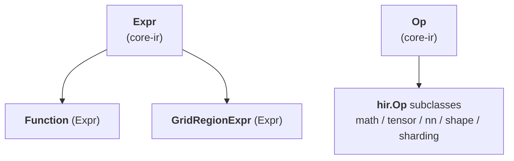

# TileFoundry Spec — hir (`@func` pure SSA dataflow IR)

Defines HIR, the pure SSA-as-DAG dataflow IR: its `Expr` constructs — the
`Function` container, the structured-SSA exception `GridRegionExpr`, and the
HIR Op subdirectories (math / tensor / nn / shape / sharding) — together with
their HIR-specific typing rules. Mesh scope is authored in the parser
([parser](./parser.md)) and its `Mesh` / `Topology` are defined by shard
([shard §5](./shard.md#5-mesh)); HIR links to those owners where a construct carries
the result.


```mermaid
flowchart TB
    Expr["<b>Expr</b><br/>(core-ir)"]
    Op["<b>Op</b><br/>(core-ir)"]
    Function["<b>Function</b> (Expr)"]
    GridRegionExpr["<b>GridRegionExpr</b> (Expr)"]
    HirOpBase["<b>hir.Op</b> subclasses<br/>math / tensor / nn / shape / sharding"]

    Expr --> Function
    Expr --> GridRegionExpr
    Op --> HirOpBase
```

## 1. HIR Expr constructs

HIR values are `Expr` nodes ([core-ir §2](./core-ir.md#2-expr)): a `Function`
container, the loop-phi-shaped `GridRegionExpr`, and value `Op` calls. HIR is
pure **SSA-as-DAG** — there are no `Region` / `Block` abstractions and no Stmt
sequence; the single structured exception that carries loop-phi-shaped SSA is
`GridRegionExpr`.

### 1.1 `Function`

```python
class Function(Expr):
    """HIR's function container; its value type is the function signature.

    Attributes:
        name: attribute; the function name; call sites resolve through Module's symbol table.
        params: attribute; each Var carries a type annotation.
        body: attribute; a single Expr — typically a Call DAG; None for a dispatch prototype.
        return_type: attribute; TensorType for single output, TupleType for multi.
        specializations: attribute; Dispatch patterns carried by a variant.
        variants: attribute; Shape-specialized implementations carried by a prototype.
        converters: attribute; Weight names paired with offline converter functions.
    """

    name: str
    params: tuple[Var, ...]
    body: Expr | None
    return_type: Type
    specializations: tuple[Pattern, ...] = field(default_factory=tuple)
    variants: tuple["Function", ...] = field(default_factory=tuple)
    converters: tuple[tuple[str, "Function"], ...] = field(default_factory=tuple)
```
- constraints:
  - an `Expr` subclass whose value type is the function signature; always returns
    by value (explicit output params are TIR-only). Typing and shape-dispatch
    rules are stated below.
  - defined as a frozen dataclass — instances are immutable after construction.
  - a `Function` MUST NOT declare or override execution context. The `Module`
    that owns it declares the `Target` and the ordered `Topology` hierarchy its
    body runs against ([core-ir §1](./core-ir.md#1-module)).

**Kernel invocation.** Entering an HIR `Function` from Python begins one kernel
invocation. A `Call` from one HIR `Function` to another is a device call inside
the current kernel invocation and never begins another one, regardless of which
`Module` owns the callee. A `Module` is a static container and an invocation is
a dynamic event: Python entering one root twice is two invocations, and a Python
loop entering it N times is N. Module ownership, topology equality, call-graph
depth, source nesting, and how often a call site repeats take no part in this
rule: a repeated site and a site a loop varies repeat device work inside the
invocation they are already in.

| Caller | Callee | Meaning |
|---|---|---|
| Python | HIR `Function`, directly or through a `Module` entry | Begin one kernel invocation |
| HIR `Function` | HIR `Function` with the same owner | Same-kernel device call |
| HIR `Function` | HIR `Function` with a different owner | Same-kernel device call |
| Python | Plain Python `Module` method | Ordinary host orchestration |
| HIR `Function` | Plain Python method | Invalid |

A plain Python `Module` method stays on the host. Each HIR `Function` it enters
therefore begins its own invocation; the method itself is not interpreted,
traced, or dummy-run as HIR.

`Function.body` is a **single Expr** (usually a Call DAG, possibly
nested inside a `GridRegionExpr`). HIR has no Stmt sequence; name
reuse lives in the parser's lexical environment, not the IR. The one
exception is a **dispatch prototype** — a specialized function's base,
whose body is `None` (written `pass` in the DSL); it declares the
signature and dispatch envelope only, and its variants carry the
implementations (see **Shape dispatch and specializations** below).

`Function` always returns by value; explicit output parameters are
TIR-only (see [tir](./tir.md)). `HirToTirPass` materialises the HIR
return value into a TIR explicit output buffer parameter at the
HIR → TIR boundary.

The return type MAY carry a `Partial(reduction)` in a `TensorType`, or in any
tensor field of a nested `TupleType`. Function construction, type inference,
and call elaboration MUST allow that state. A Function boundary MUST preserve
the `ShardLayout` mesh and per-axis reduction; it MUST NOT complete the value
or reject it merely because it is `Partial`.

A `with Mesh(("cta",), layout=...) as cta:` inside the body names a level of
the execution domain the owning `Module` declares. The name MUST resolve to
one of that Module's effective `Topology` levels, and the scope creates a
parser-lexical mesh binding; `ShardLayout.mesh` MUST point at an active
binding on the lexical path. A `Mesh` MAY map fewer levels than the domain
declares, but it MUST NOT create a level or change one's extent.

**Value type.** `Function.type` is the IR-level `CallableType`
([types §7](./types.md#7-callabletype)) projected from `params` +
`return_type`. The projection is fixed at construction and stays
consistent across construction sites.

**Call typing — elaboration.** The template a `@func` declares lives at the
Python-source level; IR never carries a template object or a shared
polymorphic body. A `Call` whose target is a `Function` types by
*elaboration*: `elaborate(callee, arg_types)` binds each parameter to the
caller's actual argument type, then reconstructs the body under that
binding — every node the reconstruction touches is typeinferred afresh and
stamped exactly once, so **the callee specializes per call site** and a
caller-supplied layout (sharding) flowing into a layout-unconstrained
parameter propagates through the whole body, including through a `Tuple` or
`GridRegionExpr` return. The result of elaboration is the concrete
`Function` instance that becomes the `Call`'s `target`; the `Call`'s type is
that instance's (re-derived) body type, never a stale `return_type` field
carried over from a different call site.

How a `Call` binds is part of what it states: which declared parameters
`Call.args` supply, and the scope
([visitor-registry §4](./visitor-registry.md#4-instance-1--typeinfer)) the
callee's body is read in. Argument types bind to the supplied parameters in
order; a parameter the call does not supply keeps its declared type in the
rebuilt signature, which for a `ConstTensor` is already concrete — no value it
stands for enters the IR, and what fills it comes from outside
([runtime §1.1.2](./runtime.md#112-weight-converter-and-prepare--forward)). The
binding is part of the elaboration cache key. It MUST be stated by the call in
the scope it is read in, never counted from how many arguments the call passes,
and it is not a question the context answers.

Omitting a parameter is valid only where, within that scope, the callee is
uniquely owned by a direct child of the caller's owner
([core-ir §1](./core-ir.md#1-module)); before collection the authored binding
answers the same question of the child it names. Ownership that is missing,
ambiguous, or not a direct child supplies every declared parameter, as does
`elaborate` with no call in hand, so a standalone or low-level call cannot
acquire implicit constants.

Caller and callee MUST resolve one effective `Target` and one effective topology
hierarchy: a same-kernel call is one execution context, whichever `Module` owns
each end. Inheritance is the canonical spelling, and a callee declaring the
caller's hierarchy explicitly is accepted only when the resolved tuples are
equal. A mismatch is invalid; it is not a nested launch.

Argument ↔ parameter binding is:

- Arity MUST match — exactly one argument per supplied parameter.
- A parameter that is a `TensorType` with `layout is None` is a **template
  wildcard**: it binds to the argument's full type, including any
  `ShardLayout`, once the argument's logical `shape` and `dtype` match.
- A parameter that carries a `ShardLayout` is an explicit **contract**: the
  argument type MUST match it exactly.
- Any other parameter requires exact type equality.
- `DimVar` shapes keep envelope matching — elaboration does not
  monomorphize a dynamic shape into a concrete one (that is **Shape
  dispatch and specializations** below, unaffected by elaboration).

The per-mesh-axis `Partial` state is part of the actual argument type. When a
layout-unconstrained parameter binds to a sharded argument, elaboration MUST
carry each `Partial(reduction)` at its original mesh-axis index through the
body and into the concrete return type, including tuple fields. Only an
explicit `Reshard` or allreduce may complete that state.

When the body cannot express a propagated sharding (e.g. a reshape
whose layout factorization straddles a new axis), typeinfer fails at that
op, not at the boundary. A dispatch-prototype callee
(`variants != ()`, `body is None`) is not elaborated: the call's
result is the declared `return_type` and the `None` body is never inspected
(variant selection is **Shape dispatch and specializations** below).

An elaborated instance MUST record the function it was rebuilt from, the same
record a specialization writes (`origin_of`, **Function specialization API**
below), so the instance in a `Call.target` stays connected to the function a
Module owns without matching on the name they share. It records no bound
dimensions: a call site binds parameter types, it does not choose an extent.

Elaboration memoizes per construction session — one parser run, or one
top-level `elaborate` call and every nested call it re-elaborates — keyed
on (callee, argument types): two call sites of the same callee with
identical argument types MUST resolve to the identical `Function`
instance, not merely an equal one, so a viewer/printer keyed on instance
identity renders one node per distinct specialization. The memo is
session-local state, not module or process state; it carries nothing
across sessions.

**Signature annotation `Layout.strides` materialization.** A
`Tensor[..., (sugar)]` annotation on a parameter or return appears
at the kernel boundary, where the underlying engine is a shared
buffer handed across the FFI surface. When the surface sugar emits
`Layout(strides=None)` ([parser.md §1.5](./parser.md#15-layout-sugar)),
function-signature binding MUST materialize it to **shared-engine
C-order over the canonical global shape** before the resulting
`TensorType` enters the body. Verbose `Layout(strides=tuple)`
annotations are preserved verbatim. After signature binding, no
`Tensor[...]` annotation reachable from the function carries
`strides=None`.

**SSA shape**. HIR is pure **SSA-as-DAG** — sharing of intermediate
results is expressed by Python object identity:

- *Single use*: nest the Calls.
  `Call(Binary(kind=MUL), (Call(Binary(kind=ADD), (a, b)), c))` does
  not name the inner `Binary` result.
- *Multiple uses*: the parser binds `c = add(a, b)` in its lexical
  env so subsequent `mul(c, c)` / `sub(c, d)` share the same Call
  node. The IR has no binding nodes; DAG edges express "same value".

There are no `Region` / `Block` abstractions in HIR. The single
structured exception that carries loop-phi-shaped SSA is
`GridRegionExpr` ([§1.2](#12-gridregionexpr)). Everything else is a
pure Call DAG.

**Function typing rules.** Enforced by the registered
`@register_typeinfer(Function)` body via `ctx.error(...)`
([visitor-registry §4](./visitor-registry.md#4-instance-1--typeinfer)):

- `Function.body` is a single Expr; Stmts MUST NOT appear.
- `Function.params` entries MUST be `Var`s.
- Within a `Function` signature, every occurrence of a same-name
  `DimVar` across `params` and `return_type` MUST agree on its
  `(lo, hi)` bounds; a disagreement is a verify error. A
  `DimVarRangePat` specialization MUST anchor to a `DimVar` reachable
  from an input parameter and lie within that `DimVar`'s envelope
  (see **Shape dispatch and specializations** below).

**Shape dispatch and specializations.**
`Function` is the sole HIR function `Expr`. Shape-dispatch is carried on a
single **base** `Function` through its `variants` field; there is no
separate specialized-function type. The field is the IR-side carrier for
the parser surface ([parser.md](./parser.md)).

The `specializations`, `variants`, and `converters` tuples are canonical
`Function` fields. `converters` records `(weight_name, converter)` pairs in
registration order and is sealed recursively with the base and its variants.

*Structure.* A `Function` is exactly one of three shapes:

- **normal** — `specializations == ()`, `variants == ()`, `body` is an
  `Expr`. An ordinary function.
- **dispatch prototype (base)** — `specializations == ()`,
  `variants != ()`, `body is None`. Declares the signature and dispatch
  envelope only; the implementations live in its variants.
- **variant** — `specializations != ()`, `variants == ()`, `body` is an
  `Expr`. A shape-specialized implementation registered on a base.

Nesting is exactly one level: a variant MUST NOT itself carry variants.
In a sealed (verified) `Module` the invariant is `body is None` ⟺
`variants != ()` — a function with no body and no variants is uncallable
and invalid, and a real body combined with variants is invalid. During
authoring the base is transiently `body is None, variants == ()` between
`@func def f: pass` and the first `@f.specialize(...)`; this unsealed
state is allowed only until the base enters a `Module` (see **Authoring
freeze** below).

- `variants` is a canonical IR field — it participates in structural
  equality, hashing, and canonical printing.
- A variant MAY carry a **display label**, taken from the identifier its author
  decorated ([parser §1.1](./parser.md#11-decorators)). The label is
  non-canonical metadata: it MUST NOT participate in structural equality,
  hashing, or the canonical signature, and nothing MAY select an implementation
  by it. Printing a variant back to source MUST preserve it, since it is the only
  thing distinguishing two implementations that share a name.
- Every variant of a base MUST share the base's `name`, `params`, and
  `return_type`: a variant specializes the body, not the signature. A variant
  runs in the same execution domain as its base because both are owned by the
  same `Module`.
- A variant carries exactly one `DimVarRangePat` in `specializations`.
  The canonical signature is
  `";".join(f"{p.dim_var}${p.lo}_{p.hi}" for p in specializations)`
  (v0 allows only `DimVarRangePat`). Two variants of one base MUST have
  distinct canonical signatures.

*Envelope coverage.* A dispatched function's parameter
`TensorType.shape` carries a `DimVar(name, lo, hi)` whose `(lo, hi)` is
the dispatch envelope; `DimVarRangePat` references that `DimVar` by name.
The variants' ranges MUST **partition** the envelope — pairwise
**disjoint** and jointly **complete** (their union is exactly the
half-open `[lo, hi)`). Adjacent half-open ranges meet at the shared
boundary value as `[.., c)` then `[c, ..)`. Every in-envelope shape
therefore selects exactly one variant.

*Prototype body.* A base's `body is None`: the prototype is never
typeinferred, lowered, or evaluated as a body. Only its variants carry
executable bodies. There is no base body to fall back to.

*Dispatch resolution.* A `Call` whose target is a dispatch prototype
(`variants != ()`) is a dispatch call: the variant whose `DimVarRangePat`
matches the call's concrete argument shapes is selected and is the call's
result. A shape outside the envelope matches no variant and is an error;
there is no base body to fall back to (the prototype body is `None`). A
`Call` whose target has `variants == ()` is a direct call to that body.

*Authoring freeze.* Variants accumulate during authoring, before the
base `Function` enters a `Module` ([core-ir §1](./core-ir.md#1-module)). A
sealed base rejects further variants. Because `variants` participates in
hashing, a base MUST NOT be hashed while still accumulating variants. A
top-level `Module.functions` entry MUST NOT be a variant: a top-level
`Function` with `specializations != ()` is a verifier error.

### 1.2 `GridRegionExpr`

```python
class GridRegionExpr(Expr):
    """Loop-phi-shaped structured SSA folding a tile-style loop into one Expr value.

    Attributes:
        induction_var: attribute; loop induction Var, ranging over range(start, extent, step).
        carried_args: attribute; loop-phi carry chain (equal lengths).
        init_args: attribute; loop-phi carry chain (equal lengths).
        body: attribute; the loop body Expr.
        yield_values: attribute; loop-phi carry chain (equal lengths).
        extent: attribute; iteration-domain stop (half-open).
        step: attribute; induction-var stride.
        start: attribute; iteration-domain start (default 0).
    """

    induction_var: Var
    carried_args: tuple[Var, ...]
    init_args: tuple[Expr, ...]
    body: Expr
    yield_values: tuple[Expr, ...]
    extent: ShapeDim
    step: ShapeDim
    start: ShapeDim = 0
```
- constraints:
  - the only HIR exception to pure Call DAG: loop-phi-shaped structured SSA that
    folds a tile-style loop into one `Expr` value; `type` is `TensorType` (single
    carry) or `TupleType` (multi-carry).
  - defined as a frozen dataclass — instances are immutable after construction.

**Iteration domain.** Both DSL loop surfaces — `for i in tile(...)` and
`for i in range(...)` — lower to this one node; they share the domain
`(start, extent, step)` and differ only in the loop-variable binding (`tile`
2-arg binds a parser-side Python `slice`, everything else binds a scalar; see
[parser §1.7](./parser.md#17-for-i-in-tile--for-i-in-range-hir-only)). `range` is not unrolled. `induction_var` ranges
over `range(start, extent, step)`: `start` and `extent` are the **half-open**
`[start, extent)` Python-range endpoints (so `extent` is the **stop** value,
not a count). `start` defaults to `0` (`tile(...)` and `range(stop)`); the
`range(start, stop[, step])` surface sets it. Each of `start` / `extent` /
`step` is a `ShapeDim` ([types §4](./types.md#4-dim--symbolic-shape-dimensions)).

For a two-argument `tile(extent, step)`, the parser-side window at one
iteration is `[induction_var, induction_var + step)`. The induction value is
already a coordinate in `range(0, extent, step)`, not an ordinal to multiply by
`step`.

- When `start` / `extent` / `step` are static `int`, the trip count is
  recoverable from the node alone, without the parser-side window binding
  ([parser §1.7](./parser.md#17-for-i-in-tile--for-i-in-range-hir-only)).
- Every `DimVar` referenced by a `ShapeDim` `start` / `extent` / `step` MUST
  be bound by the enclosing Function's parameter shapes. Resolution
  substitutes each such `DimVar` with the corresponding argument-shape
  size and folds the dim `Expr` to a value `n`. The resolved `start` and
  `extent` MUST be non-negative integers and the resolved `step` MUST be a
  positive integer; otherwise resolution MUST raise. An unbound
  `DimVar` MUST raise.
- A `ShapeDim` `start` / `extent` / `step` is resolved by the evaluator at
  call time against concrete argument shapes; its trip count is not
  statically recoverable from the node alone.

**Carry-out semantics.** The parser populates the carry chain when a
`for i in tile(...)` body contains an `ast.Assign` whose single
`Name` target binds an outer-scope name:

- the carried name becomes a phi `Var` in `carried_args`,
- the pre-loop binding of that name becomes the matching entry in
  `init_args` (the carry's value on the first iteration),
- inside the loop body the same name resolves to that phi `Var`,
- after the loop, the post-region binding refers to the
  `GridRegionExpr` itself (single carry) or a `tuple_get_item` of it
  (multi-carry, when `len(yield_values) > 1`).

`init_args` are value Exprs (traversed and rewritten by the
visitor / mutator), distinct from the binding-site `carried_args` /
`induction_var`. `len(init_args) == len(carried_args) ==
len(yield_values)`; all three are empty for a no-carry loop. The node
is self-contained: the first-iteration value of each `carried_args`
phi is its `init_args` entry, not a name looked up in the enclosing
parser scope.

`GridRegionExpr.type` is `TensorType` (single carry) or `TupleType`
(multi-carry); the value is the Expr itself, not a `Call`.
Parser-side rules: see
[parser §5.1](./parser.md#51-gridregionexpr-carry-out-lifting).

**Minimal example** — loop-carried accumulator:

```python
# example
acc = zeros((M,), f32, storage="rmem")
for i in tile(K, step=BLOCK):
    acc = acc + load_tile(x, i)
# After the loop, `acc` resolves to the GridRegionExpr value.
```

becomes (sketched):

```python
# example
GridRegionExpr(
    induction_var = i,
    carried_args  = (acc_phi,),
    init_args     = (Call(Zeros(...), ()),),   # the pre-loop `acc`
    body          = Call(Binary(kind=ADD), (acc_phi, load_tile(x, i))),
    yield_values  = (Call(Binary(kind=ADD), ...),),
    extent        = K,
    step          = BLOCK,
)
```

### 1.3 Op

HIR Ops are organised under `tilefoundry.ir.hir.<namespace>/`; the
subdirectory is file organisation, not a separate IR layer. A **custom Op**
records its full contract (fields, typing / verifier rules, worked examples)
in its catalog entry below; a **consensus Op** needs only one sentence or a
grouped external reference, per [SPEC-RULES](../SPEC-RULES.md). The op name is
the pointer — code carries no back-link to this catalog. `ParamDef` plumbing
stays in code; the mechanism is owned by [core-ir §2.3](./core-ir.md#23-op).

**HIR-specific typing hooks.** Each op's constraints are enforced by its
registered `@register_typeinfer(<OpClass>)` body via `ctx.error(...)`
([visitor-registry §4](./visitor-registry.md#4-instance-1--typeinfer)):

- `Local(x)`: `x.type.layout` MUST be `ShardLayout`. The result
  shape contracts per the `Split` axes; dtype is preserved; layout
  becomes the corresponding local layout.
- `Reshard(x, layout, storage)`: `layout` and `storage` are attributes
  (compile-time constants); the output preserves `x.type.shape` (logical).
  Architecture invariant: after HIR typeinfer runs, every `ShardLayout`
  reachable from a value's type has concrete `layout.strides` (never `None`) —
  the un-materialized (`strides=None`) parser sugar MUST be materialized by the
  owning typeinfer. The per-op `(layout, storage)` resolution table is in the
  `Reshard` op entry below.
- Any HIR Op MUST be value-form ([core-ir §2.3](./core-ir.md#23-op));
  emitting an effect-form Call into HIR is a verify error.
- Each result layout MUST describe that result. A view derives its layout from
  its source when one is stated; an op producing a distinct value derives a
  layout over its own result shape. An op MUST NOT copy an input layout across
  a shape change.

Generic, analysis-wide typing behavior is owned by
[semantic-analysis](./semantic-analysis.md): relation-driven type validity
([semantic-analysis §1.1](./semantic-analysis.md#11-relation-derived-type-behavior)), output
storage of multi-input ops, and operand layout / mesh ownership
([semantic-analysis §3.3](./semantic-analysis.md#33-output-storage-and-meshlayout-compatibility)).
HIR ops call these services; each op's registered typeinfer owns the layout /
mesh compatibility and result layout it requires, and `Reshard` is the explicit
op that changes a value's layout / mesh.

#### `ir/hir/math/`

Pointwise arithmetic and comparison, torch semantics with TileFoundry
type-promotion. User-callable names (`add` / `cmp_eq` / `logical_and` / …) are
surface aliases ([core-ir §2.3](./core-ir.md#23-op)) over the kinded Ops; there are no
per-name IR classes.
[torch element-wise ops](https://pytorch.org/docs/stable/torch.html#pointwise-ops).

One spelling is preferred, so that two authors reading the same IR write it the
same way: an arithmetic or comparison operand pair SHOULD be written with the
Python operator (`a + b`, `a * b`, `a < b`), and a sub-tensor SHOULD be written as
a subscript (`x[:, :, j:j + 1]`, `x[:, :, 3]`). The named forms `add(a, b)` and
`slice(x, begin=…, end=…, strides=…)` remain the underlying surface — they are what
the operator and subscript resolve to, and they stay available where a name must be
computed — but they are not the form to reach for first. Both spellings build the
same IR, so the choice carries no semantic weight; leaving it open is what lets one
model read one way and its neighbour another.

##### Binary
```python
class Binary(Op):
    """Kind-tagged pointwise binary operation; produces a Tensor.

    Attributes:
        lhs: input; input tensor.
        rhs: input; input tensor.
        kind: attribute; binary arithmetic, comparison, or boolean tag.
    """

    lhs: Tensor
    rhs: Tensor
    kind: BinaryKind
```
- constraints:
  - Values follow torch pointwise semantics; dtypes do not promote. Both operands
    MUST already carry the same `dtype`, and typeinfer MUST reject a mismatch. A
    Python float scalar is given the other operand's float dtype by the authoring
    surface, before it is an operand at all ([parser §1.9](./parser.md#19-compile-time-values)); a Python
    integer is not.
  - The elementwise `min` / `max` kinds are also surfaced as `minimum` / `maximum`.
  - Equal plain layouts, or one plain layout paired with `layout=None`, pass
    through only when that layout describes the broadcast result. Otherwise two
    non-sharded operands produce `layout=None`; broadcasting differently shaped
    views does not make either operand's layout describe the result. This
    fallback MUST NOT accept an incompatible `ShardLayout` pair.
  - A `ShardLayout` operand carrying `Partial(reduction)` propagates to the
    output only when `kind` provably commutes with `reduction`
    (`op(reduction(x)) == reduction(op(x))`); typeinfer rejects otherwise,
    naming the offending operand and the fix (an explicit `Reshard` to
    `Broadcast`).
    Decisions are made independently for each mesh axis. `Partial` states on
    different axes are not interchangeable; `ADD` rejects two Partial inputs
    when their states occupy different mesh axes.
    - `ADD` with both operands `Partial`: commutes (passes) only when both
      carry the same `reduction="sum"` on that mesh axis (`max`/`min` reject
      — `max(x)+max(y)` is not `max(x+y)`).
    - `ADD` with one `Partial` operand and the other plain/`Broadcast`:
      commutes (passes) for `reduction` in `{"max", "min"}` (adding a
      replicated constant is order-preserving) and rejects for `"sum"`
      (`sum(x)+b != sum(x+b)`).
    - `MUL` with one `Partial` operand and the other plain/`Broadcast`:
      commutes (passes) only for `reduction="sum"` (scaling by a replicated
      constant distributes over `sum`); rejects for `"max"`/`"min"` (the
      constant's sign is not statically provable, and a negative scale flips
      `max` to `min`).
    - Every other `kind` / operand-shape combination involving a `Partial`
      operand (including `MUL` with both operands `Partial`) rejects: not
      proven to commute with any `reduction`.

##### Unary
```python
class Unary(Op):
    """Kind-tagged pointwise unary operation; produces a Tensor.

    Attributes:
        x: input; input tensor.
        kind: attribute; unary tag including neg, abs, logical_not, rsqrt,
            exp, log, ceil, round, exp2, and log2.
    """

    x: Tensor
    kind: UnaryKind
```
- constraints:
  - Behavior follows torch pointwise semantics with TileFoundry type promotion.
  - `exp` is the natural exponential `e ** x`; `log` is the natural logarithm;
    `exp2` / `log2` are the base-2 counterparts. `ceil` rounds toward
    positive infinity; `round` rounds to the nearest integer with ties to
    even (banker's rounding, matching torch's own `round` semantics).
  - A `ShardLayout` operand carrying `Partial(reduction)` propagates to the
    output only when `kind` provably commutes with `reduction`; typeinfer
    rejects otherwise, naming the offending operand and the fix (an explicit
    `Reshard` to `Broadcast`). `exp` / `log` / `relu` / `ceil` / `round` /
    `exp2` / `log2` are monotone non-decreasing, so they commute with `max` /
    `min` but not `sum`. `neg` is linear, so it commutes with `sum` but not
    `max` / `min` (negation reverses order). `abs` / `square` / `rsqrt` /
    `logical_not` are not proven to commute with any `reduction` and reject a
    `Partial` operand unconditionally.

##### Clamp

```python
class Clamp(Op):
    """Clamp every element to a closed interval; produces a Tensor.

    Attributes:
        x: input; Source tensor.
        min_val: attribute; Lower bound.
        max_val: attribute; Upper bound.
    """

    x: Tensor
    min_val: float
    max_val: float
```

- constraints:
  - The result MUST preserve `x`'s shape, dtype, layout, and storage.
  - Clamp is monotone non-decreasing, so it MAY preserve a `Partial(max)` or
    `Partial(min)` state and MUST reject `Partial(sum)`.

##### Softplus

```python
class Softplus(Op):
    """Apply pointwise softplus; produces a Tensor.

    Attributes:
        x: input; Source tensor.
    """

    x: Tensor
```

- constraints:
  - The result MUST preserve `x`'s type.
  - Softplus is monotone non-decreasing, so it MAY preserve a `Partial(max)`
    or `Partial(min)` state and MUST reject `Partial(sum)`.

#### `ir/hir/tensor/`

Tensor structural operations; consensus ops (`Transpose` / `Slice` / `Concat`
/ `Stack` / `ShapeOf` / `Rank`) follow torch / numpy
([torch tensor manipulation ops](https://pytorch.org/docs/stable/torch.html#indexing-slicing-joining-mutating-ops)).

`Transpose`, statically positioned `Slice`, and `Reshape` derive a view layout from
their input when it states one. An input with `layout=None` produces a view with
`layout=None`; a runtime-bounded `Slice` also keeps `layout=None` because
`ComposedLayout.offset` is static. Neither case says that the view materialized.

- `Transpose` MUST permute the layout shape and strides by the same permutation
  as the tensor shape. A `ShardLayout` MUST remap its split positions through
  the registered relation.
- `Slice` is normalized as `Slice(x, starts, sizes=..., strides=...)`.
  `starts` is a tuple of rank-0 integer operands; `sizes` and `strides` are
  `ShapeDim` attributes. Its result shape is exactly `sizes` and MUST NOT contain
  an induction `Var`.
- `Slice` with static starts MUST produce a `ComposedLayout`: its offset is the
  source offset plus the starts multiplied by the source strides, and its outer
  layout carries the sliced shape and the retained strides (multiplied by any
  slice step). A runtime-bounded `Slice` MUST remain accepted with `layout=None`.
- Runtime starts MUST remain ordinary Call operands and produce `layout=None`.
  The result type describes a full window; whether a loop iteration can contain
  that window is an analysis-domain question, not a type-inference question.

##### Rank and ShapeOf

- `Rank` produces a rank-0 `i64`; `ShapeOf` produces a rank-1 `i64` vector with
  one entry per input axis.
- Both results are host shape metadata with `layout=EMPTY_LAYOUT` and
  `storage=None`, not device-resident tensors.
- Evaluation MUST read the concrete runtime tensor rank and extents. A symbolic
  input `TensorType.shape` is the result bound, not the value returned at
  runtime.

##### ArgMax

```python
class ArgMax(Op):
    """Produce indices of maximum values along an axis.

    Attributes:
        x: input; Source tensor.
        axis: attribute; Reduction axis.
    """

    x: Tensor
    axis: int = -1
```

- constraints:
  - `x` MUST have rank at least one and `axis` MUST resolve within that rank.
  - The result MUST remove `axis`, use dtype `i64`, preserve storage, and derive
    a layout over the reduced result shape. A `Split` on a surviving logical
    axis propagates through the registered relation.
  - The reduction axis MUST NOT be `Split`-sharded. A winning index cannot be
    recovered from independent per-device winners, so typeinfer requires an
    explicit `Reshard` instead of silently completing that split.
  - `x` MUST NOT carry a `Partial` state because a winning index cannot be
    recovered from an unpaired per-device partial reduction.

##### FullLike

```python
class FullLike(Op):
    """Produce a tensor like an input filled with a scalar constant.

    Attributes:
        x: input; Type and shape template.
        value: attribute; Fill value.
    """

    x: Tensor
    value: float
```

- constraints:
  - The result MUST have exactly `x`'s type and every element MUST equal
    `value` converted to that dtype.

##### Quant

```python
class Quant(Op):
    """Produce per-token-group quantized values and scales.

    Attributes:
        x: input; Source tensor.
        scheme: attribute; Quantization scheme.
        group: attribute; Last-axis group size.
        target_dtype: attribute; Quantized element dtype.
    """

    x: Tensor
    scheme: str = "per_token_group"
    group: int = 128
    target_dtype: DType = DType.fp8e4m3
```

- constraints:
  - `x` MUST have rank at least one and MUST NOT carry a `Partial` state.
  - `scheme` is exactly `"per_token_group"`; packed block formats are a
    different operation boundary. `group` MUST be a positive, non-boolean
    integer, and `target_dtype` is exactly `fp8e4m3`.
  - For a static last extent, `group` MUST divide that extent. For a symbolic
    extent, the scale extent is the symbolic floor division by `group`, and
    evaluation rejects an indivisible runtime extent before reshaping.
  - The result MUST be `(x_q, x_scale)`: `x_q` preserves `x.shape` with
    `fp8e4m3`; `x_scale` has dtype `f32` and replaces the last extent by
    `x.shape[-1] // group`. Both fields preserve storage and receive freshly
    derived layouts over their own shapes. Outer-axis splits propagate. A
    last-axis split propagates only when its factorization proves that every
    owner holds complete groups and the scale split is representable;
    otherwise typeinfer requires an explicit `Reshard`. A fully `Broadcast`
    `ShardLayout` pins no mesh and produces unsharded result layouts.
  - Evaluation computes each group's f32 absolute maximum and scale
    `absmax / 448`, divides, clamps to `[-448, 448]`, then casts to `fp8e4m3`.
    An all-zero group uses scale one and produces no NaN.

##### RepeatInterleave

```python
class RepeatInterleave(Op):
    """Repeat elements along one axis; produces a Tensor.

    Attributes:
        x: input; Source tensor.
        repeats: attribute; Repetitions per source element.
        axis: attribute; Axis to expand.
    """

    x: Tensor
    repeats: int
    axis: int
```

- constraints:
  - `axis` MUST resolve within the rank and its result extent MUST be the input
    extent multiplied by `repeats`; all other extents and storage are preserved.
  - The result layout is unsharded. A genuinely sharded input MUST be refused;
    an unsharded or fully broadcast input is accepted.

##### Split

```python
class Split(Op):
    """Split a tensor into equal parts; produces a Tuple.

    Attributes:
        x: input; Source tensor.
        axis: attribute; Split axis.
        num_splits: attribute; Number of outputs.
    """

    x: Tensor
    axis: int
    num_splits: int
```

- constraints:
  - `axis` MUST resolve in `[-rank, rank)`, and `num_splits` MUST be positive.
  - A static selected extent MUST be divisible by `num_splits`; every output
    field has that extent divided by `num_splits` and otherwise preserves the
    input type.
  - A symbolic selected extent is retained in each output until a tighter
    symbolic quotient is available.
  - Evaluation materializes `num_splits` equal tensors in axis order. Each
    element carries exactly its corresponding inferred `TupleType` field,
    including that field's storage and shard layout; the tuple aggregate has no
    independent layout or storage.

##### Stack

```python
class Stack(Op):
    """Stack equal-shaped tensors along a new axis; produces a Tensor.

    Attributes:
        inputs: input; variadic tensors to stack.
        axis: attribute; inserted result axis.
        is_variadic: attribute; Whether the input parameter consumes all args.
    """

    inputs: Tensor
    axis: int
    is_variadic: ClassVar[bool] = True
```

- constraints:
  - At least one input is required; every input MUST have the same shape and
    dtype. `axis` MUST resolve in `[-rank-1, rank]`.
  - The operation materializes one distinct result. The inserted axis is local
    and unsharded, and the result layout is freshly derived over the result
    shape rather than copied from any input.
  - Stack states a relation in which input `i` accesses the result slice whose
    inserted-axis coordinate is `i`; every old logical axis projects to the
    corresponding result axis on the other side of the insertion. Shared shard
    propagation derives any representable ownership from that relation.
  - Compatible `Split` ownership carries to the shifted old logical axis. A
    fully replicated input contributes no sharding. Incompatible input meshes
    or per-axis states, a non-uniform `Partial` across result slices, and an
    unrepresentable result layout MUST fail naming the conflicting input and
    requiring an explicit `Reshard`; typeinfer MUST NOT select input zero's
    layout or silently discard real ownership.

##### TupleGetItem

```python
class TupleGetItem(Op):
    """Extract one field from a tuple-typed expression.

    Attributes:
        tuple_value: input; Tuple-typed expression.
        index: attribute; Static field index.
    """

    tuple_value: Expr
    index: int
```

- constraints:
  - `tuple_value.type` MUST be `TupleType` and `index` MUST be in range.
  - The result type MUST be exactly the selected field type.

##### Reshape
```python
class Reshape(Op):
    """Reshape ``x`` to ``new_shape``; produces a Tensor.

    Attributes:
        x: input; source tensor.
        new_shape: attribute; target logical shape.
    """

    x: Tensor
    new_shape: tuple
```
- constraints:
  - The result shape is `new_shape`; `size(new_shape)` MUST equal `size(x.shape)`.
  - A plain C-order input reshapes to a C-order `Layout` over `new_shape`. An
    input with no assigned layout, or a non-contiguous plain input whose regroup
    cannot be expressed, has a `None` result layout.
  - A fully-`Broadcast` `ShardLayout` input (every attr `Broadcast`, no genuine
    sharding) reshapes to a plain (unsharded) output.
  - A genuine `ShardLayout` input (at least one non-`Broadcast` attr) carries
    through `Reshape` when the reshape is expressible as a view over the
    input's layout positions (`layout.layout.shape`, [shard §7.1.1](./shard.md#711-layoutshape)):
    - every layout position lies entirely within one new axis — non-size-1 new
      axes are the product of a contiguous run of whole layout positions, in
      either merge direction; size-1 axes insert/drop freely and hold no
      sharding; a `Split` layout-axis reference remaps to its new layout
      position; `Partial` / `Broadcast` carry through unchanged (mesh-axis
      states, no layout axis); OR
    - a `Split`-bound layout position divides across a new-axis boundary at a
      point its bound mesh extent evenly divides: the outer (earlier)
      sub-factor itself further factors into `(mesh_ext, Split-bound, local
      extent 1)` and `(sub-factor / mesh_ext, plain)`, and the inner residual
      becomes a plain (non-`Split`) layout position — every `Split`-bound layout
      dim keeps local extent 1 ([shard §7.1.1](./shard.md#711-layoutshape)).
  - Arbitrary rank-N regroup — a `Split`-bound position whose device-owned
    block spans a boundary deeper than one divide, or two or more
    `Split`-bound positions interacting across the same regroup — is not yet
    supported and MUST fail closed.
  - A reshape not expressible by the above MUST fail closed rather than
    fabricate a layout.

##### Cast
```python
class Cast(Op):
    """Convert the element dtype; produces a Tensor.

    Attributes:
        x: input; source tensor.
        dtype: attribute; target element dtype.
    """

    x: Tensor
    dtype: DType
```
- constraints:
  - Identity in shape / storage / layout; only the element dtype changes to
    `dtype`. A `ShardLayout` input keeps its layout (the relation is the identity).
  - `Cast` is the conversion boundary for the low-precision dtypes (`fp8e4m3` /
    `f8e8m0` / `f4e2m1`, see [types §3](./types.md#3-dtype)), accepted as either the input or the
    target dtype.
  - The evaluator supports a `dtype` in `{f32, f16, bf16, fp8e4m3, f8e8m0, i32,
    i64, bool}`; evaluating a `Cast` to a dtype outside this set (e.g. `f4e2m1`)
    raises an unsupported-dtype error.

##### IndexAdd / IndexCopy / IndexSelect
```python
class IndexAdd(Op):
    """Return dst with src slices accumulated at index along dim."""
    dst: Tensor
    index: Tensor
    src: Tensor
    dim: int = 0

class IndexCopy(Op):
    """Return dst with src slices copied to index along dim."""
    dst: Tensor
    index: Tensor
    src: Tensor
    dim: int = 0

class IndexSelect(Op):
    """Select whole slices from x at index along dim."""
    x: Tensor
    index: Tensor
    dim: int = 0
```

These are pure value forms of torch's whole-slice indexing family
([`torch.index_select`](https://pytorch.org/docs/stable/generated/torch.index_select.html),
[`Tensor.index_add_`](https://pytorch.org/docs/stable/generated/torch.Tensor.index_add_.html),
[`Tensor.index_copy_`](https://pytorch.org/docs/stable/generated/torch.Tensor.index_copy_.html)).
They do not mutate an input. `torch.gather` is the separate elementwise-indexing
operation and is not an HIR op.

- constraints:
  - Every `dim` accepts torch-style negative indexing and MUST be in range for
    the data tensor's rank.
  - `IndexSelect.index` MUST be rank 1 with dtype i32 or i64. Its result has
    `x`'s rank, dtype, and storage; `shape[dim]` becomes `index.shape[0]` and all
    other extents are unchanged.
  - `IndexSelect` produces a natural contiguous internal `Layout` for a
    `ShardLayout` input. `Broadcast` and `Partial` states carry through; a
    `Split` on `dim` becomes `Partial(sum)`, and a `Split` on another dim keeps
    its target. Multiple `Split`s including `dim`, or a composed shard layout,
    MUST fail closed.
  - HIR-to-TIR lowers `IndexSelect` as a view only when `index.shape == (1,)`
    and every input extent before `dim` is `1`. Other forms require a
    materializing selection and MUST fail closed.
  - `IndexAdd` and `IndexCopy` require rank-1 `index`, equal `dst`/`src` dtype
    and rank, equal non-`dim` extents, and
    `index.shape[0] == src.shape[dim]`. Their result type is exactly `dst`'s.
  - `IndexAdd.index` accepts i32 or i64. Repeated indices accumulate. Its value
    rule uses torch's default `alpha=1`; scaling `src` is explicit HIR.
  - `IndexCopy.index` accepts i64 only. Repeated indices have undefined output
    because torch's last copy is nondeterministic; consumers MUST NOT rely on an
    order.
  - `IndexAdd` and `IndexCopy` reject a `Partial` on `dst`, `index`, or `src`.
    Complete `Split` and `Broadcast` layouts remain logical HIR types.
  - `IndexAdd` and `IndexCopy` have type inference, cost, and evaluator
    semantics only. No HIR-to-TIR lowering is registered.
  - `IndexAdd` charges one add and reads `src`, `index`, and the addressed `dst`
    slices before writing those slices. `IndexCopy` charges no arithmetic and
    does not read the overwritten `dst` slices. Neither cost scales with the
    full `dst` extent.

##### Zeros
```python
class Zeros(Op):
    """Allocate a zero-initialised tensor; produces a Tensor.

    Attributes:
        shape: attribute; output logical shape.
        dtype: attribute; output dtype.
        storage: attribute; output storage kind.
    """

    shape: tuple
    dtype: DType
    storage: StorageKind = StorageKind.GMEM
```
- constraints:
  - The result is zero-initialised.

##### Reduce
```python
class Reduce(Op):
    """Reduce ``x`` over the selected axes; produces a Tensor.

    Attributes:
        x: input; input tensor.
        axes: attribute; reduced logical axes.
        keepdim: attribute; whether reduced axes remain as size-1 axes.
        kind: attribute; mean, sum, abs_max, or max.
    """

    x: Tensor
    axes: tuple
    keepdim: bool = True
    kind: ReduceKind = ReduceKind.MEAN
```
- constraints:
  - The logical result shape follows numpy reduction rules.
  - A reduction over an axis of no elements MUST return that kind's identity
    rather than fail. For `max` that is the least value its result dtype can
    hold, which is not always `-inf`: an integer dtype cannot hold `-inf`,
    `bool`'s least value is `False`, and a finite-only float has no infinity.
    `abs_max` is 0, its results being magnitudes. `sum` is 0. `mean` has no
    identity — there is nothing to divide by — so it MUST NOT invent one.
  - Storage is preserved.
  - Plain input layout passes through unchanged.
  - For `ShardLayout` input, every split layout position that belongs to a
    reduced tensor axis collapses to broadcast with size-1 stride-0 output.
  - Non-default-stride sharded input must carry explicit producer strides, or
    typeinfer rejects it.
  - Lowering emits TIR `Reduce`; runtime dispatch is derived from operands, not
    from an HIR dispatch field.
  - An `x` mesh axis carrying `Partial(reduction)` (a pending cross-device
    reduction, orthogonal to the reduced tensor `axes`) propagates only when
    `kind` commutes with `reduction`: `SUM` / `MEAN` (both linear over the
    reduced axes) commute with `reduction="sum"` only; `MAX` commutes with
    `reduction="max"` only (the same associative operator applied over the
    combined tensor-axis and mesh-axis index set); `ABS_MAX` (a nonlinear
    `abs` composed with `max`) does not commute with any `reduction`.
    Typeinfer rejects a non-commuting combination, naming the offending
    `reduction` and the fix (an explicit `Reshard` to `Broadcast`).

##### InsertSlice
```python
class InsertSlice(Op):
    """Write ``update`` into a window of ``dst``; produces a Tensor.

    Attributes:
        dst: input; target tensor (value form returns a tensor anchored on this
            buffer at lowering time).
        update: input; tensor written into the window.
        offsets: input; per-axis window starts — a rank-0 integer scalar for a
            rank-1 dst, or a tuple of rank-0 integer scalars (literal or
            runtime), one per axis, for rank N.
    """

    dst: Tensor
    update: Tensor
    offsets: Scalar
```
- constraints:
  - `update` has the same rank and dtype as `dst`; the window on each axis is
    `[offset_axis, offset_axis + update.shape[axis])`.
  - A rank-1 `dst` accepts a bare rank-0 scalar offset; a rank-N `dst` requires
    an offset tuple whose length equals the rank.
  - A *literal* (compile-time) offset that places a negative or out-of-bounds
    window on an axis fails typeinfer, naming the axis; a runtime offset is
    checked at eval/runtime.
  - The value form writes `update` into a slice view of `dst`'s existing buffer
    (a loop-carried `dst` reuses one buffer with no replacement allocation).
  - When `dst`'s `ShardLayout` carries a `Partial(reduction)` mesh axis,
    `update` MUST carry the identical mesh and the identical per-mesh-axis
    `ShardAttr` state (`update`'s own cute layout may still differ, since its
    tensor shape is the smaller write window) for the write to type — writing
    a differently-sharded (or unsharded) `update` into a still-partial `dst`
    position under one output type is unrepresentable; typeinfer rejects
    otherwise.
  - When `dst` is complete, an `update` carrying a `Partial` MUST be rejected;
    the write result cannot preserve that secondary value state. An explicit
    `Reshard(update, Broadcast)` completes it.
  - `ComputeCostMetadata` charges no traffic for the untouched `dst`, one
    window-sized `update` read, the scalar or structural tuple `offsets` read,
    and one window-sized result write.

##### CacheUpdate
```python
class CacheUpdate(Op):
    """Write a window of ``new`` into ``cache``; produces a same-shape cache.

    Attributes:
        cache: input; cache that receives the write.
        cur_pos: input; i32 scalar where the write begins.
        s: input; i32 scalar number of positions to write.
        new: input; source positions, taken as ``new[:, :s]``.
    """

    cache: Tensor
    cur_pos: Tensor
    s: Tensor
    new: Tensor
```
- constraints:
  - `cache` and `new` MUST be rank-4 `[B, len, kv_heads, head_dim]` tensors
    with the same dtype and equal `B`, `kv_heads`, and `head_dim`; typeinfer
    rejects a mismatch. When both lengths are static, `new.len` MUST NOT exceed
    `cache.len`.
  - `cur_pos` and `s` MUST be i32 scalar tensors. A scalar is rank-0 or has
    only literal size-1 dimensions; typeinfer rejects another dtype or shape.
  - The write interval is runtime data, never a shape dimension. The result has
    `cache`'s same static shape; no context-length `DimVar` grows with a write.
  - `cur_pos >= 0`, `1 <= s <= new.len`, and `cur_pos + s <= cache.len` MUST
    be checked at eval/runtime, not typeinfer, because their operands are
    runtime values.
  - This is a pure value-form op. Lowering MAY realize the output in place on
    `cache`'s buffer.
  - A `cache` carrying `Partial(reduction)` on a mesh axis requires `new` to
    carry the identical mesh and per-mesh-axis state; a complete `cache`
    rejects a `new` carrying `Partial`. Typeinfer rejects either mismatch.
  - No affine access relation is registered because the data-dependent write
    boundaries are opaque to the polyhedral footprint path. The cost evaluator
    instead supplies the traffic consumed by memory and roofline analysis: no
    traffic for the untouched `cache`, one read for each runtime scalar, and a
    `new`-bounded read and result write.

##### TopK
```python
class TopK(Op):
    """Select the top ``k`` elements on ``axis``; produces ``(values, indices)``.

    Attributes:
        x: input; source tensor.
        k: attribute; elements kept on the selected axis.
        axis: attribute; selected axis.
        largest: attribute; greatest vs smallest selection.
        sorted: attribute; ordered selection.
    """

    x: Tensor
    k: ShapeDim
    axis: int = -1
    largest: bool = True
    sorted: bool = True
```
- constraints:
  - The result is a `(values, indices)` tuple; both shrink the selected axis to
    length `k`; `values` keep `x`'s dtype and `indices` are `i64`.
  - `k` is a `ShapeDim` ([types §4](./types.md#4-dim--symbolic-shape-dimensions)): a static `int`, or a dynamic
    k derived from a context-length `DimVar` (e.g. `dim_min(512, CTX_LEN //
    4)`) — a first-class value propagated as the selected axis's symbolic
    length in the output shape, not a pad+mask workaround. `k` MUST satisfy
    the `ShapeDim` contract (`int` / `DimVar` / dim-arithmetic `Expr`); any
    other value fails typeinfer.
  - `k` MUST be non-negative (checked whenever `k` is static) and MUST NOT
    exceed the selected-axis length (checked whenever the axis length is
    static and `k` is either static or a symbolic value whose
    statically-derivable upper bound — `DimVar.hi - 1`, composed through
    `DimMin`/`DimMax`/`DimAdd`/`DimMul`/`DimFloorDiv`/`DimMod` — is known). A
    symbolic `k` against a symbolic axis length, or an upper bound that does
    not statically compose (e.g. through `DimSub`, or a `DimFloorDiv`/
    `DimMod` with a symbolic divisor), is not checked at typeinfer — it fails
    open, same as the pre-existing static-only check this widens.
  - A symbolic `k`'s `DimVar`(s) MUST be resolvable from `x`'s own (input)
    shape at evaluation time: narrower than `GridRegionExpr`'s `ShapeDim`
    fields ([§1.2](#12-gridregionexpr)), which resolve against the enclosing
    Function's full parameter shapes — a `k` expression whose `DimVar`
    appears only in some other argument, never in `x`, is not resolvable at
    TopK's evaluation site.
  - The selected axis MUST NOT be `Split`-sharded by a `ShardLayout`; a split
    selected axis fails typeinfer.
  - A `ShardLayout` output preserves the non-selected sharding and any
    replication; only the selected axis's layout extent becomes `k`, so the
    layout keeps size parity with the result shape.
  - `sorted` returns the selected elements ordered by `largest`; otherwise the
    same selected set is returned in an unspecified order.
  - `x` MUST NOT carry a `Partial(reduction)` mesh axis: `indices` identifies
    *which* position wins, which cannot be recovered from a per-device
    partial value without a paired value+device-identity reduction that a
    plain `Partial` attr cannot express; typeinfer rejects any `Partial`
    input regardless of `reduction` or `k`.

#### `ir/hir/nn/`

Neural-network value Ops following torch semantics
([torch.nn.functional](https://pytorch.org/docs/stable/nn.functional.html)).

##### MatMul / Conv2D / ReLU / Sigmoid / Tanh / SoftMax / LayerNorm
Consensus torch.nn.functional ops.
- constraints:
  - A `ShardLayout` operand carrying `Partial(reduction)` propagates to the
    output only when the op provably commutes with `reduction`; typeinfer
    rejects otherwise, naming the offending operand and the fix (an explicit
    `Reshard` to `Broadcast`).
  - `ReLU` / `Sigmoid` / `Tanh` are monotone non-decreasing elementwise, so
    they commute with `max` / `min` but not `sum`.
  - `MatMul` is linear in one value input when the other value-carrying input
    is `Broadcast` / replicated. On each mesh axis, one `Partial(sum)` is
    therefore allowed; a double-Partial input or a non-`sum` reduction is
    rejected.
  - `Conv2D` requires rank-4 NCHW input and OIHW weight, a rank-1 bias, and one
    common operand dtype. `stride` and `dilation` are positive length-2 tuples,
    `padding` is a non-negative length-2 tuple, and `groups` is positive. Input
    and output channels MUST be divisible by `groups`, the weight's input
    channel extent MUST equal `input_channels / groups`, and the bias extent
    MUST equal the output channels.
  - `Conv2D` states its grouped input / weight / bias / output relation over
    output positions and the input-channel and kernel contraction dimensions.
    Shared shard propagation derives a fresh result layout: input batch and
    compatible weight/bias output-channel splits survive. A contraction split
    of the input-channel axis MUST be aligned on input and weight at the same
    mesh axis; a single-sided channel split is not a representable local
    convolution. A contraction split produces `Partial(sum)` only when the bias
    carries the same per-mesh-axis `Partial(sum)` state, so completing the
    partial result adds the bias exactly once. A translated/halo access,
    incompatible contraction, mesh, or per-axis state that
    the relation cannot represent MUST fail naming the operand and requiring an
    explicit `Reshard`; no input layout is copied or real ownership discarded.
  - `Conv2D` costs `2 * numel(output) * weight.shape[1] * kh * kw` flops after
    topology projection, where the weight extents are reconstructed on logical
    I/KH/KW axes from any factorized local layout. Traffic has exactly four
    slots: complete reads of input, weight, and bias followed by one complete
    result write.
  - `SoftMax` normalizes across an axis (a non-monotonic combination of every
    value on that axis), so no `reduction` provably commutes; typeinfer rejects
    every `Partial` input.
  - `LayerNorm(axis=a)` normalizes over the complete trailing shape
    `x.shape[a:]`, after resolving `a` in `[-rank, rank)`. Weight and bias shapes
    MUST each equal that suffix exactly rather than merely broadcast to it.
    `x` MUST use `f32`, `f16`, or `bf16`. Weight and bias dtypes MUST agree and
    either match `x`, or be `f32` when `x` is `f16`/`bf16`; the result dtype is
    `x`'s.
  - `LayerNorm` rejects every `Partial` operand and every `Split` on a logical
    normalized-suffix axis of `x`, weight, or bias. A `Split` on an `x` prefix
    axis remains on the same-shape result.

##### Gelu
```python
class Gelu(Op):
    """Gaussian Error Linear Unit.

    Attributes:
        x: input; tensor the activation applies to elementwise.
        approximate: attribute; ``"tanh"`` selects the tanh-based
            approximation (HF ``gelu_pytorch_tanh`` / Gemma-2 MLP activation).
    """

    x: Tensor
    approximate: str = "tanh"
```
- constraints:
  - Elementwise: the output type, shape, and layout are `x`'s.
  - `x * Phi(x)` dips below zero before rising back through it near zero, so
    GELU is **not** monotone and commutes with no reduction — unlike the
    `ReLU` / `Sigmoid` / `Tanh` group above, which commutes with `max` / `min`.
    typeinfer rejects any `Partial` operand with a `Reshard` remedy.

##### Silu
```python
class Silu(Op):
    """Sigmoid Linear Unit — ``x * sigmoid(x)`` as one op.

    Attributes:
        x: input; tensor the activation applies to elementwise.
    """

    x: Tensor
```
- constraints:
  - Elementwise: the output type, shape, and layout are `x`'s.
  - Fused rather than decomposed into `Sigmoid` + `Binary(MUL)`: the fused form
    does not round the intermediate `sigmoid(x)` to `x`'s dtype, so at reduced
    precision the two differ by up to ~1 ULP per element.
  - `x * sigmoid(x)` has a minimum near `x = -1.278`, so SiLU is **not** monotone
    and commutes with no reduction; typeinfer rejects any `Partial` operand with a
    `Reshard` remedy, as `Gelu` does.

##### RMSNorm
```python
class RMSNorm(Op):
    """Normalize ``x`` by the root-mean-square of its last axis, scaled by ``weight``.

    Attributes:
        x: input; tensor normalized over its last axis.
        weight: input; rank-1 scale, same length as ``x``'s last axis.
        eps: attribute; added to the mean square before the root.
    """

    x: Tensor
    weight: Tensor
    eps: float = 1e-6
```
- constraints:
  - `weight` MUST be rank-1 with the same length as `x`'s last axis; every
    other `x` axis, including a dynamic (`DimVar` / dim-arithmetic) entry,
    flows through unchanged.
  - The normalization reduces the whole last axis at once (every output
    element depends on that axis's full mean of squares), so the reduced
    axis MUST stay inside a single op instance: it is never an
    iteration-domain axis of its own, only an existential range that both
    the read and the write cover in full.
  - `x` / `weight` normalize across an axis (a non-monotonic combination of
    every value on that axis), so no mesh-axis reduction provably commutes;
    typeinfer rejects any `Partial` operand.

##### RoPE
```python
class RoPE(Op):
    """Rotate query and key tensors using position-indexed cos/sin caches."""

    q: Tensor
    k: Tensor
    cos_cache: Tensor
    sin_cache: Tensor
    pos_ids: Tensor
```
- constraints:
  - The rotation is the **rotate-half** form: the last axis splits in two
    halves and the pair `(x[i], x[i + d/2])` rotates together. This is the
    unqualified HF convention (`apply_rotary_pos_emb` / `rotate_half`); the
    interleaved form (`rotate_every_two`, GPT-J / CodeGen) is a different Op,
    not an attribute of this one.
  - The result is `(q_rope, k_rope)` and each branch preserves the layout of
    its corresponding `q` or `k` input.
  - On each mesh axis, a branch MAY preserve one `Partial(sum)` on its
    corresponding query or key input only when `cos_cache`, `sin_cache`, and
    `pos_ids` are `Broadcast` / replicated on that axis.
  - A non-`sum` Partial, multiple value-carrying Partials, or a Partial on a
    secondary cache/index input MUST be rejected with a `Reshard` remedy.

##### CUDA matrix multiply-accumulate family

```python
class Mma(Op):
    """Provide the marker base for HIR CUDA matrix operations."""


class Mma_SM80_16x8x16(Mma):
    """Produce an SM80 16-by-8 accumulator fragment.

    Attributes:
        a: input; Left 16-by-16 fragment.
        b: input; Right 16-by-8 fragment.
        dtype_a: attribute; Left operand dtype.
        dtype_b: attribute; Right operand dtype.
        dtype_acc: attribute; Accumulator dtype.
        a_layout: attribute; Left matrix orientation.
        b_layout: attribute; Right matrix orientation.
    """

    a: Tensor
    b: Tensor
    dtype_a: DType
    dtype_b: DType
    dtype_acc: DType
    a_layout: str = "T"
    b_layout: str = "N"


class Wgmma_SM90_64x128x16(Mma):
    """Produce an SM90 64-by-128 accumulator fragment.

    Attributes:
        a: input; Left fragment.
        b: input; Right fragment.
        dtype_a: attribute; Left operand dtype.
        dtype_b: attribute; Right operand dtype.
        dtype_acc: attribute; Accumulator dtype.
        a_layout: attribute; Left matrix orientation.
        b_layout: attribute; Right matrix orientation.
    """

    a: Tensor
    b: Tensor
    dtype_a: DType
    dtype_b: DType
    dtype_acc: DType
    a_layout: str = "T"
    b_layout: str = "N"
```

- constraints:
  - `Mma` is a marker base used for family dispatch and has no independent
    callable parameter surface.
  - HIR MMA is the two-input value `a @ b`; it has no accumulator input. The
    evaluator converts the rounded operands to `dtype_acc` before multiplying.
    The independent handwritten TIR MMA surface has an in-place accumulator,
    but there is no HIR-to-TIR compile route between these contracts.
  - `Mma_SM80_16x8x16` requires `a.shape == (16, 16)` and
    `b.shape == (16, 8)`, and returns `(16, 8)`. `Wgmma_SM90_64x128x16`
    requires `(64, 16)` and `(16, 128)`, and returns `(64, 128)`.
  - Each operand dtype MUST equal its declared `dtype_a` / `dtype_b`. Supported
    `(dtype_a, dtype_b, dtype_acc)` combinations are `(f16, f16, f16)`,
    `(bf16, bf16, bf16)`, `(f16, f16, f32)`, `(bf16, bf16, f32)`, and
    `(f32, f32, f32)`. Each orientation MUST be `N` or `T`; orientation names
    the hardware encoding and does not transpose either logical HIR input.
  - Plain logical input Types remain valid for evaluation and Analyze. Their
    result has a fresh row-major logical layout when either operand has a plain
    layout. Fully `Broadcast` `ShardLayout` inputs carry no real ownership and
    therefore pin no result mesh.
  - Only the known SM80 BF16/BF16/F32 TN A/B fragment pair in RMEM derives the
    known C fragment. Its A/B layouts, `Split` bindings, thread topology, and
    mesh shape MUST match. Mesh coordinate names do not participate in
    identity; the derived C layout uses `a`'s physically compatible mesh. Any
    other genuine SM80 shard claim or fragment in non-RMEM storage MUST fail
    with an explicit `Reshard` / materialize-to-RMEM remedy.
  - WGMMA has no representable fragment contract yet. A genuine WGMMA shard
    claim MUST fail with an explicit `Reshard` remedy, while plain logical
    WGMMA remains evaluable and analyzable.
  - Cost is `2*M*N*K` in the operand dtype with exactly three traffic slots:
    A read, B read, and result write. Byte residency and topology projection
    come only from the selected operand/result Types.
  - `HirToTirPass` MUST reject both concrete HIR MMA Ops by name before
    emitting TIR; see [passes §7.1](./passes.md#71-hirtotirpass).

#### `ir/hir/shape/`

Shape-level Ops on whole shape values (per-axis dim Ops are
[types §3](./types.md#3-dtype)).

Shape values are host metadata: their tensor types use `EMPTY_LAYOUT` and
`storage=None`, and their evaluators move no device bytes.

##### ShapeExtract
```python
class ShapeExtract(Op):
    """Extract one axis from a shape value; produces a Dim.

    Attributes:
        shape: input; input shape value.
        index: attribute; extracted axis.
    """

    shape: Tensor
    index: int
```
- constraints:
  - The result is the dimension at `index`.

##### ShapeCompose
```python
class ShapeCompose(Op):
    """Assemble per-axis dims into a shape value; produces a Shape.

    Attributes:
        dims: input; per-axis dimensions.
        is_variadic: attribute; Whether the input parameter consumes all args.
    """

    dims: Tensor
    is_variadic: ClassVar[bool] = True
```
- constraints:
  - The result is a shape value assembled in input order.

#### `ir/hir/sharding/`

`ShardLayout` and `Mesh` are type-system constructs, not Expr inputs
([shard §5](./shard.md#5-mesh)).

##### Reshard
```python
class Reshard(Op):
    """Convert ``x`` to a target layout / storage; produces a Tensor.

    Attributes:
        x: input; input tensor.
        layout: attribute; optional target ShardLayout.
        storage: attribute; optional target storage kind.
    """

    x: Tensor
    layout: ShardLayout = None
    storage: StorageKind = None
```
- constraints:
  - Omitting `layout` preserves `x.layout`; omitting `storage` preserves
    `x.storage`.
  - The output preserves the input logical `TensorType.shape`.
  - Supplied `layout` is a `ShardLayout`.
  - Destination storage is concrete, not unmaterialized.
  - The single op covers zero-copy view, cross-storage copy, cross-CTA
  redistribute, and mixed cases; typeinfer and the recursive-local Cost
  Evaluator classify the call.

**Stride resolution.** Storage direction follows the physical addressability
hierarchy `rmem < smem < gmem` (per-thread / per-CTA / per-program). Typeinfer
dispatches on `(layout, storage)`:

- `layout=None`, storage unchanged → `x.type` (no-op).
- `layout=None`, storage changed → error; a storage change MUST carry an
  explicit `layout=`.
- `layout=Layout(strides=None)` (sugar), storage unchanged → dest strides match
  the form already on `x.layout`: a Split-axes-zero source ⇒ per-instance form;
  otherwise ⇒ shared-engine C-order over the canonical global shape. When
  `x.layout` is `None` (plain kernel-param), fall back to shared-engine C-order.
- `layout=Layout(strides=None)` (sugar), low → high level → dest strides =
  C-order over `layout.shape` (shared-engine form).
- `layout=Layout(strides=None)` (sugar), high → low level → dest `strides[k]=0`
  for every `Split` axis `k`; non-`Split` axes follow C-order over
  `shard_layout_local_shape(layout)` with size-1 → 0 (per-instance form).
- `layout=Layout(strides=tuple)` (verbose) → dest strides are taken verbatim;
  typeinfer MUST NOT rewrite them (e.g. SM80 MMA fragment layouts).

**Cross-CTA fence.** The grid fence for a cross-CTA reshard is owned by the
reshard lowering, not by a separately authored sync. When a reshard reads a
gmem shard produced under a different CTA ownership (an ownership change across
a cta mesh), the lowering MUST emit a grid barrier before the reshard so every
CTA's prior shard writes are visible. The reshard lowering owns only the fence;
cross-CTA data redistribution (all-to-all / gather across CTAs) is not part of
this op.

##### Local
```python
class Local(Op):
    """Take the current device's local view of a sharded tensor; produces a Tensor.

    Attributes:
        x: input; input tensor with ShardLayout.
    """

    x: Tensor
```
- constraints:
  - The result shape contracts each `Split` axis by that mesh axis's extent.
  - `dtype` and `storage` are preserved.
  - The shard wrapper is stripped, leaving the base `Layout`.
  - Static split sizes divide by mesh extent; symbolic sizes pass through.
  - `Local` only names the current topology position's existing view; it
    materializes no value and moves no bytes.

## 2. Function specialization API

```python
class SpecializationError(ValueError):
    """Report that a function cannot be specialized as requested."""


PROVENANCE = "_specialized_from"
BOUND_DIMS = "_specialized_dims"


def origin_of(function: object) -> Function | None:
    """Return the source function a rebuilt function came from.

    Args:
        function: Candidate derived function.

    Returns:
        Its recorded origin, or None.
    """
    ...


def bound_dims_of(function: object) -> tuple[tuple[str, int], ...] | None:
    """Return the sorted dimensions a rebuild chose, if it chose any.

    Args:
        function: Candidate derived function.

    Returns:
        Recorded bindings, or None.
    """
    ...


def variant_for(fn: Function, dims: Mapping[str, int]) -> Function:
    """Select the unique implementation covering concrete dimensions.

    Args:
        fn: Function or dispatch prototype.
        dims: Concrete extents by dimension name.

    Returns:
        The selected implementation.
    """
    ...


def specialize_function(
    fn: Function,
    dims: Mapping[str, int],
    *,
    ctx: TypeInferContext | None = None,
) -> Function:
    """Bind stated dimensions and rebuild the selected implementation.

    Args:
        fn: Function or dispatch prototype.
        dims: Dimensions to bind.
        ctx: Optional shared type-inference context.

    Returns:
        The selected and partially or fully specialized function.
    """
    ...


def specialize_concretely(
    fn: Function, dims: Mapping[str, int], ctx: TypeInferContext | None = None
) -> Function:
    """Specialize a function with no residual symbolic dimensions.

    Args:
        fn: Function or dispatch prototype.
        dims: Complete concrete dimension bindings.
        ctx: Optional shared type-inference context.

    Returns:
        A concrete function.
    """
    ...


def residual_dims(fn: Function) -> tuple[str, ...]:
    """Return every dimension still stated as a range.

    Args:
        fn: Function to inspect recursively.

    Returns:
        Residual dimension names.
    """
    ...


def dim_vars_reached(fn: Function) -> dict[str, object]:
    """Return residual dimension declarations by name.

    Args:
        fn: Function to inspect recursively.

    Returns:
        Residual dimension declarations.
    """
    ...


def is_concrete(fn: Function) -> bool:
    """Return whether no required extent remains symbolic.

    Args:
        fn: Function to inspect.

    Returns:
        Whether the function is concrete.
    """
    ...
```

- constraints:
  - `variant_for` MUST return an ordinary function unchanged and otherwise
    MUST select exactly one matching variant. Missing or ambiguous coverage and
    an unstated dimension used by a pattern MUST raise `SpecializationError`.
  - `specialize_function` MUST reject an empty binding, an unknown dimension,
    or a selected implementation with no body. It MUST record the chosen
    implementation and sorted bindings on a rebuilt function so `origin_of`
    and `bound_dims_of` can recover them. A rebuild that chose no extent — a
    call site's elaboration — MUST record its origin and no bindings, so
    `bound_dims_of` stays `None` and two call sites of one callee are not
    reported as one program at one size.
  - `specialize_concretely` MUST require a non-empty string-to-integer mapping
    and MUST reject any residual dimension after specialization.
  - Provenance and bound-dimension records MUST NOT participate in structural
    equality or hashing; ownership checks use the recorded origin rather than
    a function name.
  - The recorded origin MUST be the function actually rebuilt, and nothing may
    re-point it afterwards. Two call sites reaching two copies of one source
    function hold two rebuilds recording two origins; one shared instance
    re-pointed instead would answer both with whichever was written last.
  - `residual_dims` and `dim_vars_reached` MUST inspect the whole function
    graph, including signatures, bodies, Op attributes, loop bounds, variants,
    and called functions. `is_concrete` additionally checks the return type.
