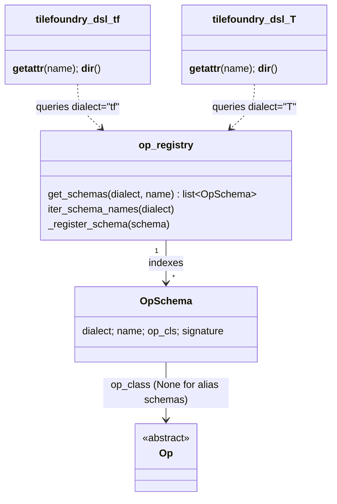
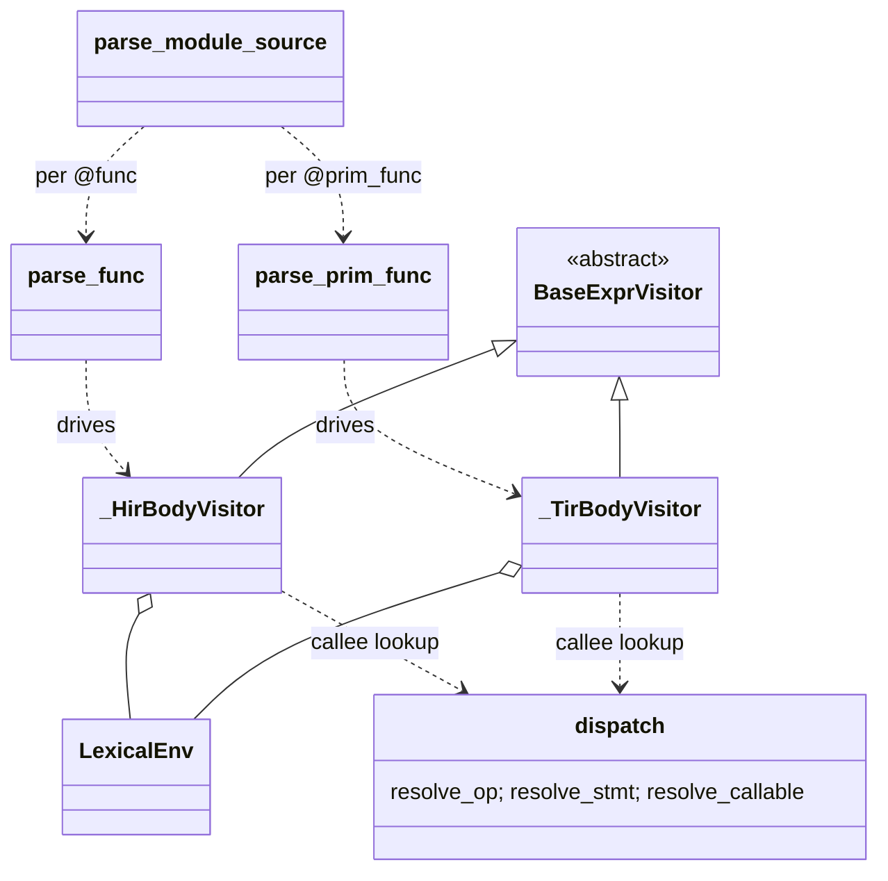

# TileFoundry Spec — Parser

The parser turns Python source decorated with TileFoundry's IR decorators
into a `core_ir.Module`. This document covers the user-facing DSL
syntax (§1), the DSL namespace surface (§2), the parser architecture
(§3), the shared machinery both IRs use (§4), and the per-IR parser
bodies (§5 / §6). Validation and rejection rules are in §7.

## 1. DSL syntax

This section is the language reference for TileFoundry DSL source.
Each subsection introduces one construct using a grammar production
followed by a short description and an example. Productions use
the convention `lhs ::= rhs`; literal terminals are quoted; `*` is
zero-or-more, `?` is optional.

### 1.1 Decorators

```
decorator-form ::= '@tilefoundry.module'
                 | '@tilefoundry.func'
                 | '@tilefoundry.prim_func'
```

`@tilefoundry.module(entry="<name>")` decorates a class and evaluates to a
`core_ir.Module`: the decorated name binds to the Module itself
(not the class). It collects the class body's `@func` / `@prim_func`
methods, in definition order, as the module's `functions`. The class body is a
pure function container — every non-dunder member MUST be a DSL function — and
`entry` is a required argument naming the public entry function (full contract
in [§2.7](#27-module-authoring-surface)). A method MAY call a sibling method
declared *above* it — the call lowers to a `Call` targeting that
sibling function; forward references (a callee declared below the
caller) are unresolved (see [§3.3](#33-description)). Functions are
reached by name on the result (see [core-ir §1.1](./core-ir.md#11-function-access)).

`@tilefoundry.func` and `@tilefoundry.prim_func` decorate functions and
evaluate to the parsed IR directly: `@func` to a `hir.Function`
([hir.md §1.1](./hir.md#11-function)), `@prim_func` to a
`tir.PrimFunction`. The decorated name binds to that IR node, not to
the original Python function. Used standalone (outside a `@module`
class), passing the resulting function to `compile` / `jit` lifts it
into an implicit single-function `Module` whose `entry` is that
function. `@func` parses with dispatch token `"hir"`, `@prim_func`
with `"tir"`.

```python
# example
@tilefoundry.module(entry="f")
class M:
    @tilefoundry.func
    def g(...): ...

    @tilefoundry.func
    def f(...):
        return g(...)   # sibling g is declared above → resolves to g's Function
```

**Specialization decorators.** A function specializes its body per input
shape through `Function.specialize`. The base function is defined with
`@tilefoundry.func`; each variant is added by decorating a throwaway `def`
with `@base.specialize(pattern)`:

```python
# example
S = DimVar("S", 1, 9)                                          # envelope [1, 9) = 1..8

@tilefoundry.func
def f(x: Tensor[(S,), "f32"]) -> Tensor[(S,), "f32"]:
    pass                                                       # prototype base

@f.specialize(DimVarRangePat("S", 1, 5))
def _(x: Tensor[(S,), "f32"]) -> Tensor[(S,), "f32"]:
    return small_impl(x)                                       # variant [1, 5) = 1..4

@f.specialize(DimVarRangePat("S", 5, 9))
def _(x: Tensor[(S,), "f32"]) -> Tensor[(S,), "f32"]:
    return large_impl(x)                                       # variant [5, 9) = 5..8
```

- `@tilefoundry.func` evaluates to the base `hir.Function`. `func()` has no
  `specializations=` parameter; specialization is reachable only through
  `.specialize`.
- The prototype base body is `pass`: it declares the signature and dispatch
  envelope only and parses to `Function.body is None`. The implementations
  live in the variants ([hir.md §1.1](./hir.md#11-function)). A
  `pass` body is legal only for a function that receives variants; a `pass`
  body with no variants, or a real body combined with variants, is rejected.
- `base.specialize(pattern)` returns a decorator. It parses the decorated
  `def` into a variant `hir.Function` (same `name` as the base,
  `specializations=(pattern,)`), registers it on `base.variants`, and
  returns the variant. The decorated name is a throwaway: `def _` is
  reusable across variants because the base is the persistent handle.
- `pattern` MUST be a single `DimVarRangePat` (see
  [core-ir §3](./core-ir.md#3-pattern)); other `Pattern` subclasses are rejected for
  v0. The referenced `DimVar` and its `(lo, hi)` envelope live on the base
  parameter's shape. Each variant's range MUST fall within that envelope,
  and the full variant set MUST partition it — disjoint and complete (see
  [hir.md §1.1](./hir.md#11-function)). Two variants with the
  same canonical signature are rejected.
- A `DimVar` shape entry MAY be written **inline** (`DimVar("S", lo, hi)`
  AST node in the shape tuple) or as a **named alias** (`S = DimVar("S",
  lo, hi)` then `Tensor[(S,), ...]`). Both resolve to the same `DimVar`
  instance (type-level cache keyed by `(name, lo, hi)`). A second `DimVar`
  with the same `name` but conflicting `(lo, hi)` is a hard parse-time
  error.
- Variants accumulate on the base only during authoring. Once the base
  enters a `Module` (see [core-ir §1](./core-ir.md#1-module)) it is sealed and
  `.specialize` raises. A variant lives only inside `base.variants`; it is
  never a separate `Module.functions` entry.

### 1.2 DSL namespace

```
import-form         ::= 'from tilefoundry.dsl.tf import *'
                      | 'from tilefoundry.dsl.T  import *'
                      | 'from tilefoundry.dsl    import' ('tf' | 'T')

namespace-callee    ::= ('tf' | 'T') '.' op-name
```

`tilefoundry.dsl.tf` (HIR) and `tilefoundry.dsl.T` (TIR) are the only
DSL-facing entries to the Op catalogue. The mechanism that backs
this surface is described in §2.

### 1.3 Op call

```
op-call             ::= callee '(' arg-list ')'
callee              ::= op-name             ; bare-name path
                      | namespace-callee    ; namespace-attribute path
op-name             ::= identifier
                      | identifier '_'      ; trailing-underscore = effect form (TIR only)
```

A bare-name callee MUST resolve to an `_op_schema`-bearing surface
value (an `Op` class for real-Op schemas, or an alias builder
function carrying `_op_schema` for surface-alias schemas) through
the function's closure (typically established by an `import-form`).
The namespace-callee form resolves on the namespace package
directly (§2). When `op-name` is registered with multiple schemas
("overloads"), the parser uses first-match dispatch (§4.3). The
trailing-underscore selector is gated to the TIR token; using it in
HIR is a verify error.

### 1.4 `Tensor[...]` annotations

`Tensor` is the parser-owned **DSL authoring annotation sugar**,
imported from `tilefoundry.dsl` (`from tilefoundry.dsl import Tensor`). It
is distinct from the IR-level `tilefoundry.ir.types.TensorType` (the
runtime carrier on `Expr.type`); the parser resolves a `Tensor[...]`
annotation into a `TensorType` at parameter / return-binding time.

```
tensor-annot   ::= 'Tensor' '[' shape ',' dtype (',' layout)? (',' storage)? ']'
shape          ::= '(' (dim (',' dim)*)? ')'        ; '()' is rank-0
dim            ::= integer-literal | dim-Expr        ; dim-Expr per types §4
dtype          ::= '"f32"' | '"f16"' | '"bf16"' | …  ; see types §3
layout         ::= layout-sugar                      ; see §1.5
                | 'ShardLayout(' … ')'              ; verbose, see shard §7
storage        ::= '"host"' | '"gmem"' | '"smem"' | '"rmem"' | '"tmem"'
```

`Tensor[...]` is the carrier of optional layout sugar; it does not
own the sugar (which lives at §1.5). A rank-0 (scalar) tensor is
written `Tensor[(), "bf16"]`; the form `Tensor["bf16"]` (without
shape) is rejected.

```python
Tensor[(4096, 2048), "bf16"]
Tensor[(4096, 2048), "bf16", (4096 @ gpu.cta, 2048)]
Tensor[(4096, 2048), "bf16", (4096 @ gpu.cta, 2048), "smem"]
Tensor[(), "bf16"]                                    # scalar
```

- constraints:
  - The dtype slot MUST use a canonical quoted `DType.name` from
    [types §3](./types.md#3-dtype).
  - The parser MUST normalize that string to the corresponding process-lifetime
    descriptor before constructing `TensorType`.
  - An unknown dtype string MUST be rejected; it MUST NOT fall back to another
    descriptor.

### 1.5 Layout sugar

```
layout-sugar  ::= axis-tuple                                            ; implicit strides, no value-state
                | '(' axis-tuple ',' stride-tuple ')'                   ; explicit strides, no value-state
                | '(' axis-tuple ',' value-state ')'                    ; implicit strides + value-state
                | '(' axis-tuple ',' stride-tuple ',' value-state ')'   ; explicit strides + value-state
axis-tuple    ::= '(' axis-spec (',' axis-spec)* ','? ')'
axis-spec     ::= axis-extent                    ; a layout dim, not split (axis placement only)
                | static-extent '@' mesh-axis    ; Split(axis_index) on mesh-axis
                | static-extent '@' '(' mesh-axis (',' mesh-axis)* ')'  ; sequential decomposition
axis-extent    ::= static-extent | dim-ref        ; a bare axis may be dynamic
static-extent  ::= integer-literal | static-dim-ref  ; split axes & mesh dims: a static int
dim-ref        ::= identifier                     ; closure-resolved DimVar (or int); bare axes only
static-dim-ref ::= identifier                     ; closure/global name bound to a static int (bool rejected)
stride-tuple  ::= '(' integer-literal (',' integer-literal)* ','? ')'
value-state   ::= '{' partial-spec (',' partial-spec)* ','? '}'  ; a set; only the last outer item
partial-spec  ::= mesh-axis '@' 'P(' '"' reduction '"' ')'       ; Partial(reduction) on mesh-axis
mesh-axis     ::= identifier '.' identifier      ; e.g. gpu.cta
reduction     ::= 'sum' | 'max' | 'min' | …
```

A **bare** axis extent (`axis-extent`) may be a static `integer-literal`
**or** a closure-resolved `dim-ref` — an identifier bound to a `DimVar`
(or an int) in the function's closure, e.g. a dynamic `seq_len`. A bare
axis is `Broadcast` (carries no mesh binding). A **split** extent
(`static-extent` on the left of `@`) MUST resolve to a static int: it
participates in mesh-extent canonicalisation (factorisation), which a
dynamic extent cannot. A dynamic split extent is rejected.

Closure/global int resolution applies to mesh-shape dims too; a `bool` or
dynamic value in a `static-extent` is rejected with a `must be a static int`
diagnostic.

A dynamic bare axis is admissible only where `Reshard` materialises strides
in the **shared-engine** form — a same-storage reshard off a plain (non
per-instance) source, or a low→high storage move. There the deferred stride
materialisation ([§Stride materialization](#stride-materialization-parser-surface))
keeps static inner strides as plain ints and only the strides of axes
*above* the dynamic axis become symbolic dim-exprs. In a **per-instance**
materialisation (a high→low storage move, or a per-instance source), the
per-shard local layout shape must be a static int — a register / shared buffer
cannot be sized by a non-split dynamic axis — so a dynamic non-split bare
axis is rejected with a deliberate error (only a launch-provided CTA `Split`,
whose per-shard extent is a static 1, may consume a dynamic axis).

The `axis-tuple` carries only **axis placement** (`Split` inlined as
`size @ mesh.axis`; a bare `size` is a non-split layout dim). The optional
`{...}` **value-state** set carries the mesh-axis `Partial` states
(`mesh.axis @ P("reduction")`). It is a Python `set` literal recognized at
the AST level (its element order carries no meaning) and MUST be the **last
item of the outer tuple**; it is never mixed into the `axis-tuple`. A mesh
axis named in no `Split` and no `Partial` is `Broadcast` (the default) —
Broadcast is never written. There is no `_ @ B(...)` / `_ @ P(...)` form.

Outer-tuple discrimination: a bare `axis-tuple` is implicit-strides with no
value-state; an outer length-2 tuple whose second item is a `stride-tuple`
is explicit strides; length-2 whose second item is a `value-state` set is
implicit-strides + value-state; length-3 `(axis-tuple, stride-tuple,
value-state)` is explicit strides + value-state.

`dim @ (m.a, m.b)` expands to one Split axis per mesh axis
(each with extent = mesh extent), followed by a bare remainder axis
of size `dim / ∏(mesh_extents)`. The remainder axis is always
appended last; the mesh-axis order in the tuple determines the tensor
axis order.

**Canonicalization (single-mesh-axis form)**. Surface sugar
`N @ m.a` where `N > mesh_extent(a)` MUST be expanded at parse time
into the factorised pair `(mesh_extent(a) @ m.a, N // mesh_extent(a))`
before the `ShardLayout` is constructed. The first element becomes
a `Split` axis with `local_shape = 1`; the second becomes a bare
residual axis (non-`Split`). `N // mesh_extent(a)` MUST divide `N`
exactly; otherwise the sugar is rejected. The factorisation is
opaque to the user: input `N @ m.a` and input
`(mesh_extent(a) @ m.a, N // mesh_extent(a))` produce the same IR.

#### Stride materialization (parser surface)

The first sugar form
(`'(' axis-spec ... ')'`) emits `Layout(shape=canonical,
strides=None)` — the layout strides are deferred to `Reshard`
typeinfer, which fills them in based on the storage-level direction
(see [hir.md §1.3](./hir.md#13-op)). The
verbose form (`'(' axis-tuple ',' stride-tuple ')'`) emits a
concrete `strides` tuple; typeinfer respects it verbatim. The
parser does NOT inspect `storage` or do any physical-materialization
logic — that responsibility lives entirely in `Reshard` typeinfer.

Spec: [shard.md §7.1.1](./shard.md#711-layoutshape),
[hir.md §1.3](./hir.md#13-op).

Layout sugar is accepted **anywhere the expected surface value is
a `ShardLayout`**. Dispatch is annotation-driven (see §4.4): the
parser consults the position's expected `ParamDef.annotation` (or
the `Tensor[...]` layout slot) to decide whether to invoke the
sugar parser. Omitted mesh axes default to `Broadcast`. Sugar
forms that would lose mesh / layout information fall through to
the verbose `ShardLayout(...)` constructor.

```python
# Tensor[...] annotation slot
Tensor[(4096, 2048), "bf16", (4096 @ gpu.cta, 2048)]

# value-state set: a Partial on a mesh axis (implicit strides)
Tensor[(4, 64), "f32", ((4 @ trd.l, 64), {trd.t @ P("sum")}), "smem"]

# Op attribute slot whose ParamDef.annotation is ShardLayout
reshard(x, layout=((2048 @ gpu.cta, 64), {gpu.warp @ P("sum")}))
```

### 1.6 `with Mesh(...) as m`

```
with-mesh   ::= 'with' 'Mesh' '(' mesh-args ')' 'as' identifier ':' suite
```

The `with Mesh(...) as m` grammar is shared by both dialects; the
binding name `m` is visible only inside `suite`. The two dialects differ
in what it lowers to:

- **HIR** treats it as an **active mesh context** — a parser-lexical
  alias for the constructed `Mesh`, so layout sugar (§1.5) may bind axes
  with `… @ m.axis` and tensors authored under it reuse the one `Mesh`.
  It is not a tensor-binding scope and emits **no IR node**. Ordinary
  values assigned inside `suite` follow normal function-body visibility
  (not confined); `return` inside `suite` returns from the enclosing
  `@func` (no mesh-region result), and a `@func` MUST NOT be defined
  inside `suite`. A tensor's mesh/layout lives on its
  `TensorType.layout`, not on the block it is written in; `reshard` is
  the explicit boundary, and op typeinfer
  ([hir §1.3](./hir.md#13-op)) decides whether values
  combine.
- **TIR** lowers it to an explicit `MeshScope` Stmt (§6) carrying the
  `Mesh` and the binding `Var`.

### 1.7 `for i in tile(...)` / `for i in range(...)` (HIR-only)

```
for-loop    ::= 'for' identifier 'in' ('tile' | 'range') '(' loop-args ')' ':' suite
loop-args   ::= extent-Expr                        # tile: extent / range: stop
              | extent-Expr ',' step-Expr          # tile(extent, step)
              | start-Expr ',' stop-Expr           # range(start, stop)
              | start-Expr ',' stop-Expr ',' step-Expr   # range(start, stop, step)
```

`tile(...)` and `range(...)` share **one** loop domain `(start, extent,
step)` and lower to the **same** `GridRegionExpr` ([hir §1.2](./hir.md)) —
`range` is not a separate construct and is **not** statically unrolled. The
only difference is the loop-variable binding:

- `range(...)` binds `i` to a **scalar** induction var (`i: i64`); use it as
  `x[i]` or write the window manually (`i : i + step`). Args follow Python
  `range`: `range(stop)` (start `0`, step `1`), `range(start, stop)` (step
  `1`), `range(start, stop, step)`.
- `tile(extent)` also binds a scalar `i: i64` (start `0`, step `1`).
- `tile(extent, step)` binds `i` to a parser-side `RangeSlice`
  (`start = iv * step`, `stop = start + step`) so `x[:, i]` lifts to a
  `Slice` over the current window. `RangeSlice` is parser-only and does not
  reach IR; `start` is `0`.

`start-Expr` / `extent-Expr` (the **stop** endpoint, not a length — the
domain is half-open `[start, extent)`) / `step-Expr` MAY be any `ShapeDim`
([types §4](./types.md)), including a dim expression such as `C // N`; the
value is carried verbatim into `GridRegionExpr.start` / `.extent` / `.step`
and resolved at evaluate time ([hir §1.2](./hir.md)).

A tensor subscript `x[slice0, …]` inside a loop body lifts to a
`hir.tensor.Slice` Op call. An `ast.Assign` whose single Name target is
bound in *outer* scope is a loop-carried rebinding (see §5 for the carry-out
lift). A **nested** `for ... in tile/range(...)` is allowed and lifts to a
nested `GridRegionExpr`; the carry scan recurses into nested loops, so an
outer-scope name rebound only inside a nested loop is still carried across the
outer loop (and the nested loop carries it too).

## 2. DSL namespace surface

### 2.1 Model

The two namespaces are real Python modules; resolution is module
`__getattr__` over the OpSchema registry. There is no
`DslNamespace` class.

```python
# tilefoundry/ir/core/op_registry.py
def _register_schema(schema: OpSchema) -> None: ...
def get_schemas(dialect: str, name: str) -> list[OpSchema]: ...
def iter_schema_names(dialect: str) -> Iterable[str]: ...

# tilefoundry/ir/core/op_schema.py — a frozen dataclass
class OpSchema:
    dialect: str            # "tf" or "T"
    name: str
    op_cls: type[Op]
    signature: tuple[ParamDef, ...]

# tilefoundry/dsl/tf/__init__.py        (TIR symmetric in tilefoundry/dsl/T)
def __getattr__(name: str) -> type[Op] | Callable: ...
def __dir__() -> list[str]: ...
```

### 2.2 Class diagram



### 2.3 Resolution algorithm

The CPython attribute-access path runs `module.__getattr__(name)`
for any name not found on the module's own namespace. Both
namespaces implement it identically:

```python
def __getattr__(name: str) -> type[Op] | Callable: ...   # resolve a dialect name to its Op class / alias builder
def __dir__() -> list[str]: ...                          # list the dialect's registered schema names
```

`__getattr__` looks up `op_registry.get_schemas(_DIALECT, name)` and raises
`AttributeError` on a miss; for a single real-Op schema it returns the `Op`
class, for a surface-alias schema (`op_class is None`) the alias builder fn, and
for more than one schema an overload resolver.

Both forms (Op class for real-Op schemas, alias builder fn for
alias schemas) carry an `_op_schema` attribute, so the parser's
bare-name resolver looks the schema up with a single
`getattr(val, "_op_schema", None)` regardless of which form was
bound.

`from tilefoundry.dsl.tf import *` invokes `__dir__` and then
`__getattr__` for every returned name; `from tilefoundry.dsl import tf`
binds the module object itself, leaving each later `tf.<name>`
attribute access to `__getattr__`.

### 2.4 `.pyi` stub regeneration

The dynamic `__getattr__` surface is invisible to static analysers
and editors. To restore IDE completion / type inference,
`tilefoundry.dsl._stub_gen` emits per-namespace `.pyi` stubs derived
from the OpSchema registry:

```
tilefoundry/dsl/tf/__init__.pyi      # generated, gitignored
tilefoundry/dsl/T/__init__.pyi       # generated, gitignored
```

The CLI is `python -m tilefoundry.dsl regen`. The generator walks
every `OpSchema` registered for the dialect and emits one
`def <name>(<param>: <type>[, ...]) -> Expr: ...` signature per
schema. Multi-schema overloads emit `@typing.overload` stubs in
registration order, followed by a final non-overload signature
that matches the runtime resolver.

Conventions:

- `kind="input"` ParamDefs render as `Expr` regardless of their
  declared `annotation` (operands are always Exprs at the DSL
  surface).
- `kind="attribute"` ParamDefs render their `annotation` verbatim
  (`int` / `str` / `ShardLayout` / …). Referenced types
  are auto-imported in the generated header so the `.pyi` is
  self-contained.
- A `DType` attribute renders as `Literal[<canonical names>] | DType`, with the
  `Literal` members derived from the closed descriptor set in
  [types §3](./types.md#3-dtype). The string form is the canonical DSL authoring
  path and the parser normalizes it to the corresponding descriptor at the call
  boundary. A descriptor value remains accepted as the IR-canonical attribute
  value in direct Python expressions.
- Any other string-valued enum attribute, such as `ReduceKind`, renders as
  `Literal[<member strings>] | <EnumType>`. Its `Literal` members derive from
  the enum, and the parser normalizes a string to the corresponding enum member
  at the call boundary.

Stubs are not part of the runtime resolution path; the parser still
goes through §2.3. They exist solely so editors can show typed
completions for `tf.<name>(...)`.

### 2.5 Invariants

- **Dialect isolation**. `tilefoundry.dsl.tf` MUST surface only
  schemas with `dialect="tf"`; `tilefoundry.dsl.T` MUST surface only
  schemas with `dialect="T"`. §4.6's strict per-dialect resolution
  depends on this.
- **Late-registration visibility**. An Op registered after the
  namespace module is first imported is visible on the next
  `__getattr__` call; the namespace MUST NOT cache resolutions in
  a way that would hide it.
- **Implementation independence**. The DSL surface MUST NOT depend
  on the `tilefoundry.ir.<dialect>.<category>` directory layout. DSL
  source addresses Ops only through `(dialect, name)`.
- **Single-schema identity**. For a single-schema name `n`,
  `getattr(tilefoundry.dsl.tf, n) is get_schemas("tf", n)[0].op_cls`.
  No wrapper class is interposed.

### 2.6 Platform sub-namespaces

`tilefoundry.dsl.T` exposes platform-specific instruction and atom
surfaces under a fixed set of **platform sub-namespaces** (e.g.
`T.cuda`). `dsl.T.__getattr__` resolves a platform name **before** the
OpSchema registry lookup (§2.3): a name in the platform set returns the
platform namespace object; every other name falls through to the
registry.

- A platform sub-namespace is not an `Op` and carries no `_op_schema`.
  It surfaces platform-specific descriptors (instruction specs, atoms)
  only, never catalogue Ops. §2.5's dialect-isolation invariant is
  unaffected — the platform set is disjoint from registered Op names.
- The platform set is fixed; a name outside it MUST resolve as an
  ordinary `dialect="T"` Op name, preserving late-registration
  visibility (§2.5).
- `T.cuda.mma` is the CUDA MMA surface: `T.cuda.mma.<NAME>` is an
  `MmaOpSpec` and `T.cuda.mma.atom(op=...)` an `MmaAtom`
  ([tir §2.3](./tir.md#mma-atom-and-the-hand-written-calling-convention)).
  The folder name (`cuda`) matches `codegen/cuda/` and the runtime tree.

In a `@prim_func` body a chain rooted at a platform sub-namespace is a
**compile-time static binding**, not a runtime value: `op = T.cuda.mma.<NAME>`
and `atom = T.cuda.mma.atom(op=op)` bind Python descriptor objects in
the parser environment and emit no `LetStmt`. A subsequent `atom.A/B/C`
attribute access resolves statically against the bound descriptor.

The `.pyi` stub generator (§2.4) emits the platform sub-namespace
surface so editors complete `T.cuda.mma.<NAME>` and `.atom(...)`.

### 2.7 `@module` authoring surface

`@module(entry="<name>")` collects a class of DSL functions into a
`Module` ([core-ir §1](./core-ir.md#1-module)). The decorated name binds to the
resulting `Module`.

- Every non-dunder class member MUST be an `@func` / `@prim_func` result (an
  `hir.Function` / `tir.PrimFunction`); any other member — an undecorated
  method, a nested class, a stray attribute — MUST be rejected.
- Members are collected in **definition order** into `Module.functions`. A
  specialization variant (a `@base.specialize` def) is not a standalone member.
- `entry` MUST name exactly one collected function; an unknown name MUST be
  rejected. The class body MUST contain at least one DSL function.
- A member MAY call a sibling **defined above it** (the call resolves to the
  sibling function / launches a sibling device kernel); a forward reference to a
  sibling defined below stays unresolved and MUST fail.
- The printer emits this surface: shared meshes at module level (before the
  class) so the class body stays function-only, then `@module(entry="<entry>")`.

#### Design rationale

`entry` is a function-name forward reference rather than a function object
because a class decorator's arguments are evaluated before the class body runs,
so the entry function does not yet exist when `@module(entry=...)` is called.

## 3. Parser architecture

### 3.1 Model

The implementation lives under `tilefoundry/parser/`. The current
function-level entry points are independent calls; there is no
`ModuleContext` / `FunctionDecl` data class.

```python
# tilefoundry/parser/hir_parser.py
def parse_func        (fn, *, topologies=()) -> hir.Function: ...
def parse_func_source (src: str) -> hir.Function: ...
def parse_module_source(src: str) -> hir.Function: ...
def parse_script      (src: str) -> hir.Function: ...
class _HirBodyVisitor(BaseExprVisitor): ...

# tilefoundry/parser/tir_parser.py
def parse_prim_func   (fn) -> tir.PrimFunction: ...
class _TirBodyVisitor(BaseExprVisitor): ...

# tilefoundry/parser/base.py
def extract_ast(fn) -> ast.FunctionDef: ...
class BaseExprVisitor: ...

# tilefoundry/parser/symtab.py
class LexicalEnv:
    def push_frame(self) -> None: ...
    def pop_frame (self) -> None: ...
    def define    (self, name, value) -> None: ...
    def lookup    (self, name) -> object: ...
    def innermost_mesh(self) -> Mesh | None: ...

# tilefoundry/parser/dispatch.py
def resolve_op    (name) -> type | None: ...
def resolve_stmt  (name) -> type | None: ...
def resolve_callable(name, token: Literal["hir", "tir"]) -> tuple[str, type]: ...
```

Each function-level parser collects a closure dict from the live
Python function (`_collect_closure(fn) -> dict[str, Any]`), reads
the AST via `extract_ast(fn)`, and walks the body with the
dialect's `BaseExprVisitor` subclass.

### 3.2 Class diagram



### 3.3 Description

`parse_func` / `parse_prim_func` consume a live Python function
(`fn`) plus optional topology declarations. `parse_func_source` /
`parse_module_source` / `parse_script` accept Python source text.
The two paths differ for the module-level form: the runtime
`@tilefoundry.module` decorator builds the `core_ir.Module` from the
class's already-parsed `@func` / `@prim_func` methods, whereas the
source-text `parse_module_source` reads one `@func` and produces a
single `hir.Function` (its surrounding `core_ir.Module` is built by
the caller); there is no `parse_module(src) -> core_ir.Module`.

The closure dict supplies same-module callee lookup. Names defined
in the user's Python module (other `@func` / `@prim_func`
functions, mesh / topology objects, Op classes imported from
`tilefoundry.dsl.tf` / `T`) are visible through the closure. The
closure also includes the `@func` / `@prim_func` bindings present in
the *definition frame* when the decorator runs — for a
`@tilefoundry.module` class body, that is the sibling methods declared
above the one being parsed. Each such binding **is** the sibling's
`hir.Function` / `tir.PrimFunction` IR node (the decorator evaluates to
the IR directly, §1.1), so a sibling callee resolves to that `Function`
and becomes the `Call` target directly. This is what makes
callee-before-caller sibling calls work; a forward reference is simply
absent from the closure and fails as an unresolved callee. The merge is
additive: it never shadows the function's own globals / freevars.

`LexicalEnv` is a frame stack used by both body visitors for
parser-time bindings (Mesh axes, `RangeSlice` from `tile`, SSA
aliasing). Frame push / pop matches the Python-source scope
(`with Mesh(...)`, `for i in tile(...)`).

`dispatch.resolve_callable(name, token)` performs strict
per-dialect Op resolution against `op_registry`; the body visitors
delegate `ast.Name` callee lookup to it after the closure path.

There is no parser-side intermediate IR; function bodies translate
directly into `core_ir` nodes plus dialect-specific subclasses.

## 4. Shared parsing machinery

### 3.1 Lexical environment

Both parsers use the same lexical-env stack. `define(name, expr_node)`
binds a Python name to an `Expr` object. Subsequent uses of that name
reuse the same `Expr`, which is how HIR's SSA-as-DAG sharing falls
out for free.

### 3.2 Closure-only callee resolution

Bare-name callees resolve through the lexical env + the function's
closure only. The parser does **not** fall back to a global Op
registry for `ast.Name` callees; without a star-import or explicit
import the bare name raises *unknown Op name*.

The closure binding for a name from `tilefoundry.dsl.tf` /
`tilefoundry.dsl.T` is whatever its module `__getattr__` returns:

- a real-Op class for single-schema names whose schema has an
  `op_class` (e.g. `tf.matmul` → `MatMul`);
- the alias's builder function for surface-alias schemas (e.g.
  `tf.add` → `_add_alias`); the function carries `_op_schema` so
  the parser still recovers the schema by attribute lookup.

Both forms expose `_op_schema`, so the parser's
`_resolve_call_target` returns an `OpSchema` uniformly. Namespace-
attribute callees (`tf.add` / `T.copy`) skip the closure binding and
go directly through `_first_schema(dialect, attr)`, which honours
alias prepend order — an alias schema (if any) wins over a legacy
real-Op schema sharing the same name.

### 3.3 OpSchema and overload resolution

A registered Op has one or more `OpSchema` entries indexed by
`(dialect, name)`. Each schema lists the Op's `ParamDef` descriptors
(see [core-ir §2.3](./core-ir.md)). When the parser sees a callee:

1. Look up the schema list via
   `op_registry.get_schemas(dialect, name)`.
2. Filter by arity. `ParamDef.is_required` (i.e. `default is
   MISSING`) sets `n_min`; `optional` does NOT lower `n_min`.
3. For the surviving candidates, walk each input ParamDef and run
   `pattern.match(arg_type)`. `pattern is None` accepts any.
4. Return the first schema whose every input pattern matches.
   Registration order is the tiebreaker; there is no "best match"
   search.

### 3.4 Annotation-driven sugar dispatch

At each attribute slot of a call, the parser consults the matched
schema's `ParamDef.annotation`:

- `annotation=ShardLayout` → `parse_shard_layout_sugar`
- `annotation=Layout`      → `parse_layout_sugar`

Sugar dispatch is annotation-driven, not name-driven: an attribute
called `shape` will not be parsed as layout sugar unless its
ParamDef declares a layout annotation. Ops without a registered
schema fall through to a small legacy heuristic
(`attr_name == "layout"` ⇒ `ShardLayout` sugar) until they migrate.

Attribute string normalization is also annotation-driven:

- `annotation=DType` resolves a canonical string by descriptor `name` and
  rejects any other string with a `VerifyError`.
- A string-valued Enum annotation resolves by Enum value and rejects any other
  string with a `VerifyError`.

### 3.5 `Tensor[...]` annotation surface

`Tensor[shape, dtype, layout, storage]` is recognised by
`try_parse_sugar_tensor_type`, which is the entry point shared by
both `@func` and `@prim_func` parsers when reading parameter and
return-type annotations. The shape and dtype slots are required;
the layout and storage slots are optional. The same routine reads
the layout sugar described in §1.4.

The dtype slot MUST resolve to the canonical descriptor named by its string.
Unknown names MUST be rejected and MUST NOT silently select `DType.f32`.

### 3.6 Per-dialect strict resolution

`parser.dispatch.resolve_callable(name, token)` does NOT fall back
across dialects. An HIR-only Op (e.g. `rope`) raises *unknown TIR
callable* in a TIR body, and a TIR-only Op (e.g. `copy`) raises
*unknown HIR callable* in an HIR body. The trailing-underscore
selector is gated to the TIR token only.

## 5. HIR parser

The HIR parser walks an `@func` body. The body is a sequence of
Python statements that the parser folds into a single `Expr` tree.

| Python | HIR action |
|---|---|
| `x = expr` | `define(x, expr_node)`; no IR node. Subsequent `x` reuses the same `Expr` (SSA-as-DAG). |
| `x + y` | `Call(Binary(kind=ADD), (x, y))`; the parser maps Python AST `BinOp` / `Compare` / `BoolOp` directly to a `Binary` instance with the matching `BinaryKind`. `UnaryOp` USub / Not maps similarly to `Unary(kind=NEG)` / `Unary(kind=NOT)`. AST `@` (matmul) routes to `MatMul` (a real Op, not kinded). |
| `foo(a, b)` | `Call(target_op, args)` where `target_op` is constructed by the resolved schema's `builder` (§4.2 / §4.3). For surface aliases (e.g. `add` / `cmp_eq` / `neg`), the alias's builder returns the kinded target Op (`Binary(kind=...)` / `Unary(kind=...)`); for real Ops, the default builder is the Op class itself. |
| `for i in tile(...)` | `GridRegionExpr` (see §1.7 and below). |
| `with Mesh(...) as m` | Push `m` onto the parser-lexical stack; pop on exit. No IR node. |
| `return expr` | Sets `Function.body`. A `return` without a value is rejected. |
| `return (a, b)` / `return a, b` | A literal tuple return (both spellings are the same AST) folds to a core `Tuple` body ([core-ir §2.2](./core-ir.md)); `Function.return_type` is the `TupleType` of the element types. Callers destructure via the existing tuple-unpack rule (`o, s = f(...)`). |
| `pass` | Accepted only as the **entire** body: sets `Function.body = None`, declaring a dispatch prototype whose implementations are registered via `.specialize` (§8). A `pass` mixed with any other statement is rejected. |

`for` / `if` / `while` over arbitrary ranges, conditionals, and other
Stmt forms are TIR-only. They are rejected by the HIR parser.

A `pass` body yields `Function.body is None`, declaring a **dispatch
prototype** that awaits variants. Immediately after `@func def f: pass`
and before any `@f.specialize(...)`, the base is transiently
`body is None, variants == ()` — a valid *unsealed authoring* state. The
sealed (verified) invariant is `body is None` ⟺ `variants != ()`
([hir.md §1.1](./hir.md#11-function)); the verifier rejects a
`body is None` function with no variants, a variant whose body is `pass`
(a variant MUST carry a real body), and a real body combined with
variants. The `@base.specialize(...)` parse rejects a `pass`-bodied
variant directly.

### 4.1 GridRegionExpr carry-out lifting

Inside a `for i in tile(...)` body, an `ast.Assign` whose single
`Name` target is already bound in *outer* scope is a loop-carried
rebinding. The parser:

1. Allocates a fresh phi `Var` per carry name (same type, same name).
2. Records the phi in `GridRegionExpr.carried_args`.
3. Snapshots the final RHS bound to that name as a `yield_value`.
4. After the loop, rebinds the carry name in the outer frame to the
   `GridRegionExpr` (single carry) or projects each carry value out
   of its `TupleType` result (multi-carry).

Only `=` assignments are accepted; `+=` is rejected. `return` and a
nested `with` inside a loop body are rejected. A nested `for ... in
tile/range(...)` IS allowed and lifts to a nested `GridRegionExpr`; the
carry scan recurses into it, so an outer-scope name rebound only inside the
nested loop is carried across both loops.

## 6. TIR parser

The TIR parser walks a `@prim_func` body. The body is a sequence of
imperative statements that fold into a `Sequential` of Stmts.

| Python | TIR action |
|---|---|
| `x = expr` | `LetStmt(var=x, value=expr, body=<sequential rest>)`. The remaining body of the function is nested as `body`. |
| `a = Tensor(...)` | `LetStmt(var=a, value=Call(tir.memory.AllocTensor, (), attrs=<TensorType fields>), body=<rest>)`. See [tir §2.3](./tir.md#23-tir-ops). |
| `foo(a, b)` (effect Op) | `Evaluate(target_op, args)` Stmt. |
| `foo(a, b)` (value Op) | `Call` Expr embedded in the right-hand side of a `LetStmt` or another Stmt's Expr field. |
| `for i in range(...)` | `For(induction_var=i, start, stop, step, body)`. |
| `if/elif/else` | `If(cond, then_body, else_body)`. |
| `while` | `While(cond, body)`. |
| `with Mesh(...) as m` | `MeshScope(mesh, binding=m, body)`. |
| `return` | `Return()` Stmt. A `return value` is rejected. |

TIR has no SSA-as-DAG sharing rule; every binding is an explicit
`LetStmt`. `for i in tile(...)` is HIR-only and is rejected here.

## 7. Validation and rejection

- Any `ast` node not in §4 / §5 is rejected — the unsupported
  forms include `try` / `with` over non-Mesh contexts / `lambda` /
  list / dict / set comprehensions / `yield` / `async`.
- Cross-dialect callees fall through to *unknown callable* (§4.6).
- A bare-name callee that the lexical env / closure does not
  resolve to an `_op_schema`-bearing surface value (`Op` subclass or
  alias builder function) is *unknown Op name*.
- `Tensor[...]` with the wrong number of slots, an unknown dtype, a
  non-injective layout, or an `ast.Slice` shape element is
  rejected.
- `for tile` is HIR-only; emitting it inside a `@prim_func` is
  rejected. `with Mesh(...) as m` is accepted in both dialects — in a
  `@prim_func` it lowers to a `MeshScope` Stmt (§6), unlike the
  no-IR-node HIR sugar (§1.6).
- Layout sugar that would lose mesh information falls through to the
  verbose form (§1.4); if neither is acceptable, the type is
  rejected.

## 8. Hard schedule constraints

The HIR parser accepts hard schedule constraints through a keyword-only
`where(...)` annotation on a tensor binding or tensor parameter:

```python
y: where(layout=(S, 16 @ cta), mesh=cta_mesh,
         storage="gmem", partial=P("sum")) = value
```

The annotation MUST be non-empty and MAY contain each of `layout`,
`mesh`, `storage`, and `partial` at most once. The layout value MUST
be a non-empty tuple. An integer or symbolic name is an exact extent; `_`
is a private wildcard; `D` is a broadcast dimension; and `extent @
topology` is a split dimension bound to that topology. The parser MUST
preserve the distinction between wildcard, broadcast, exact, and split
dimensions.

`mesh` MUST resolve to an existing `Mesh`, `storage` MUST resolve
through the current storage-kind registry, and `partial` MUST use
`P("reduction")` with a non-empty reduction name. A concrete tensor
expression MUST have at most one constraint metadata record; repeated
annotations and duplicate topology bindings are rejected. Tuple-valued,
scalar, unit, direct-subscript, and unresolved annotation subjects are
rejected. Source locations MUST be retained on the metadata and each
constraint. Constraint parsing is stage-neutral and MUST NOT consult a CTA
capability table.
