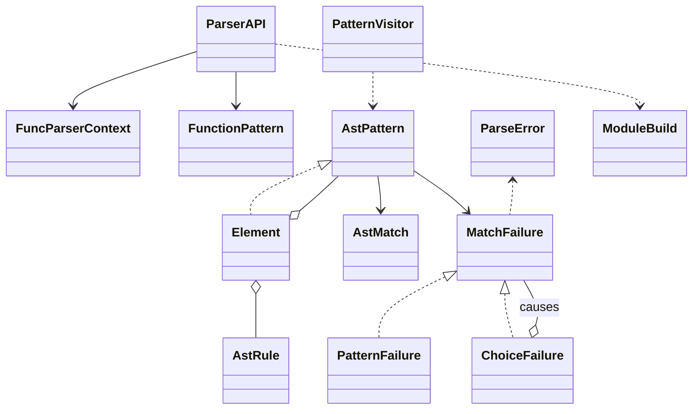
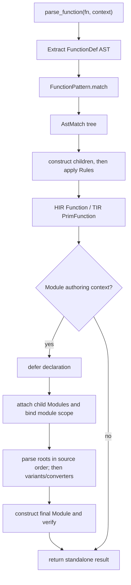
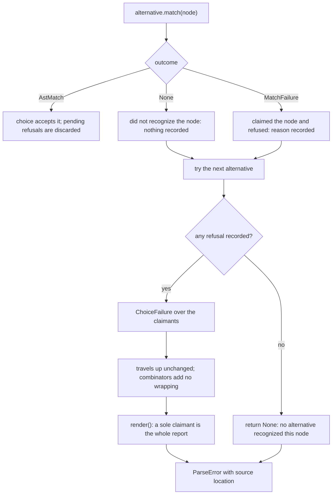

# TileFoundry Spec - Parser

The Parser accepts authored Python functions and produces HIR or TIR through one typed API.

## 1. Public API

`@module` executes its Python class body and finalizes the collected Function declarations,
child Modules, and ordinary methods. Module authoring is two-phase: class execution records
Function, specialization, and converter declarations; finalization attaches all child Modules
and puts them in parser scope before parsing Functions in source order. `@func` produces an HIR
Function; `@prim_func` produces a TIR PrimFunction.
`specialize` and `converter` register variants and weight converters on an existing HIR Function.

```python
def parse_function(
    fn: FunctionType, context: FuncParserContext
) -> hir.Function | tir.PrimFunction: ...
```

- Every parser-authored `Call` reachable from a Function body carries `SourceSpanMetadata` for
  the AST expression that constructed it. A parent match fills only Calls without a span, so it
  cannot replace a more precise child span. Traversal follows `Call` operands and IR `Tuple`
  values, but does not assign source identity to shared lexical `Var` values. Source spans use
  physical source-file coordinates with a one-based start column.
- For `a, b = producer(...)`, detached `TupleGetItem(index=0)` and
  `TupleGetItem(index=1)` lexical values carry the respective target Name spans (`a` and `b`) and
  matching `BindingMetadata`; later reads do not replace that identity. A multi-carry loop's
  derived projections carry the `for` statement span and their carry binding name.

`FuncParserContext` carries the dialect, Function role, closure, topology scope, target, and
optional base/key for one parse. `FunctionRole` is `ROOT`, `VARIANT`, or `CONVERTER`.
`ParseError` is the single authored-source diagnostic type and includes source location and
recursive parse situation. These are the only public parser symbols.

## 2. Syntax and Rules

### 2.1 Syntax

<!-- parser-grammar:start -->
```ebnf
; root: function
; literal: Python ast.Constant syntax, e.g. 1, "bf16", or None
; name: Python variable name; primary: name/attribute base for calls and subscripts
; expression: Python syntax composed from literals, names, primaries, and operators
; runtime-expression: expression lowered to a TileFoundry IR Expr
mesh-axis             ::= identifier
                          | identifier '.' identifier
dim-expr              ::= integer-literal
                          | identifier
                          | primary '.' identifier
                          | dim-expr ('+' | '-' | '*' | '//' | '%') dim-expr
                          | (identifier | primary '.' identifier) '(' (dim-expr (',' dim-expr)*)?
                            ')'
placed-layout         ::= '(' ((expression '@' ('(' mesh-axis (',' mesh-axis)* ')' | mesh-axis) |
                          dim-expr) (',' (expression '@' ('(' mesh-axis (',' mesh-axis)* ')' |
                          mesh-axis) | dim-expr))*)? ')'
shape                 ::= '(' (dim-expr (',' dim-expr)*)? ')'
                          | identifier
                          | primary '.' identifier
tensor-shape-layout   ::= placed-layout
                          | shape
dtype                 ::= string-literal
                          | primary
literal               ::= None
                          | Ellipsis
                          | boolean-literal
                          | integer-literal
                          | float-literal
                          | complex-literal
                          | string-literal
                          | bytes-literal
primary               ::= identifier
                          | primary '.' identifier
sequence              ::= '(' (expression (',' expression)*)? ')'
                          | '[' (expression (',' expression)*)? ']'
                          | '{' (expression (',' expression)*)? '}'
dict                  ::= '{' (expression ':' expression (',' expression ':' expression)*)? '}'
binary-operation      ::= expression ('+' | '-' | '*' | '/' | '//' | '%' | '**') expression
unary-operation       ::= ('+' | '-' | 'not') expression
slice                 ::= (expression)? ':' (expression)? (':' expression)?
subscript             ::= expression '[' expression ']'
expression            ::= literal
                          | primary
                          | sequence
                          | dict
                          | binary-operation
                          | unary-operation
                          | call
                          | slice
                          | subscript
call                  ::= expression '(' ((expression | keyword-name '=' expression) (','
                          (expression | keyword-name '=' expression))*)? ')'
explicit-layout       ::= '(' (tensor-shape-layout | shape) ',' shape ')'
plain-layout          ::= '(' (dim-expr (',' dim-expr)*)? ')'
layout                ::= None
                          | primary
                          | call
                          | explicit-layout
                          | placed-layout
                          | plain-layout
storage               ::= string-literal
                          | primary
tensor-optional-slot  ::= layout
                          | storage
tensor                ::= tensor-head '[' '(' (tensor-shape-layout ',' dtype | tensor-shape-layout
                          ',' dtype ',' tensor-optional-slot | tensor-shape-layout ',' dtype ','
                          tensor-optional-slot ',' tensor-optional-slot) ')' ']'
scalar-type           ::= primary
type-annotation       ::= tensor
                          | scalar-type
signature             ::= (name ':' type-annotation (',' name ':' type-annotation)*)?
return-type           ::= type-annotation
loop-iterator         ::= 'tile' '(' expression ',' expression ')'
                          | 'range' '(' (expression | expression ',' expression | expression ','
                            expression ',' expression) ')'
loop-carry-statement  ::= expression '=' expression
                          | 'for' name 'in' expression ':' loop-carry
                          | statement
loop-carry            ::= (loop-carry-statement (newline loop-carry-statement)*)?
loop-header           ::= 'for' identifier 'in' loop-iterator ':' loop-carry
loop-body             ::= (statement (newline statement)*)?
for                   ::= 'for' name 'in' expression ':' loop-body
mesh-context          ::= ('Mesh' | primary '.' identifier) '(' (expression | ('layout' | 'names')
                            '=' expression) (',' (expression | ('layout' | 'names') '='
                            expression))* ')'
                          | expression
with                  ::= 'with' mesh-context ('as' identifier)? ':' block
op-call               ::= primary '(' ((expression | keyword-name '=' expression) (',' (expression |
                          keyword-name '=' expression))*)? ')'
launch                ::= callee '(' ')'
slice-endpoint-binary ::= index-endpoint dim-op index-endpoint
mesh-coordinate       ::= identifier '.' identifier
index-endpoint        ::= literal
                          | primary
                          | slice-endpoint-binary
                          | mesh-coordinate
                          | runtime-expression
                          | expression
index-slice           ::= (index-endpoint)? ':' (index-endpoint)? (':' index-endpoint)?
subscript-index       ::= '(' ((index-slice | index-endpoint) (',' (index-slice |
                            index-endpoint))*)? ')'
                          | index-slice
                          | index-endpoint
subscript-expression  ::= runtime-expression '[' subscript-index ']'
matmul-expression     ::= runtime-expression '@' runtime-expression
binary-expression     ::= runtime-expression ('+' | '-' | '*' | '/' | '//' | '%') runtime-expression
                          | runtime-expression ('==' | '!=' | '<' | '<=' | '>' | '>=')
                            runtime-expression
                          | runtime-expression ('and' | 'or') runtime-expression
unary-expression      ::= unary-op runtime-expression
name                  ::= identifier
constant              ::= boolean-literal
                          | integer-literal
                          | float-literal
tuple-expression      ::= '(' (runtime-expression (',' runtime-expression)*)? ')'
runtime-expression    ::= op-call
                          | launch
                          | subscript-expression
                          | matmul-expression
                          | binary-expression
                          | unary-expression
                          | mesh-coordinate
                          | name
                          | constant
                          | tuple-expression
                          | tensor
                          | primary '.' identifier
tuple-assignment      ::= '(' identifier (',' identifier)* ')' '=' runtime-expression
where-annotation      ::= 'where' '(' ')'
statement             ::= for
                          | with
                          | tuple-assignment
                          | identifier '=' (runtime-expression | expression)
                          | identifier ':' (where-annotation | type-annotation) ('='
                            (runtime-expression | expression))?
                          | 'return' (runtime-expression)?
                          | runtime-expression
                          | 'pass'
block                 ::= (statement (newline statement)*)?
function              ::= 'def' name '(' signature ')' ('->' return-type)? ':' block
```
<!-- parser-grammar:end -->

### 2.2 Rules

<!-- parser-constraints:start -->
| Owner | Situation | Rule | Statement | Source |
| --- | --- | --- | --- | --- |
| binary_expression, matmul_expression, op_call, unary_expression | expression, slice_endpoint, subscript_index | CallBindingRule | A call must bind its arguments into a Call tuple. | src/tilefoundry/parser/pattern_nodes.py |
| binary_expression, matmul_expression, op_call, unary_expression | expression, slice_endpoint, subscript_index | CallTypeInferenceRule | A call's result type must be inferred from its binding. | src/tilefoundry/parser/pattern_nodes.py |
| dim_expr | dim_expr, layout_extent, layout_shape, tensor_dim_expr, tensor_optional_slot, tensor_shape | ShapeDimRule | A shape dimension must be an integer, DimVar, or expression. | src/tilefoundry/parser/ast_pattern.py |
| dtype | tensor_dtype | CanonicalDTypeRule | A dtype must resolve to a canonical DType. | src/tilefoundry/parser/ast_pattern.py |
| explicit_layout, layout, placed_layout, plain_layout | layout_shape, tensor_optional_slot, tensor_shape | LayoutPositionRule | A layout must be legal for its parser position. | src/tilefoundry/parser/ast_pattern.py |
| explicit_layout, layout, placed_layout, plain_layout | layout_shape, tensor_optional_slot, tensor_shape | LayoutShapeRule | A layout must have a valid non-boolean shape. | src/tilefoundry/parser/ast_pattern.py |
| function | function | FunctionDialectRule | A function kind and constructed value must agree with the active dialect. | src/tilefoundry/parser/pattern_nodes.py |
| function | function | FunctionRegistrationRule | A validated function must be registered exactly once in its owning scope. | src/tilefoundry/parser/pattern_nodes.py |
| function | function | FunctionRoleValidationRule | A root, variant, or converter must satisfy its role before registration. | src/tilefoundry/parser/pattern_nodes.py |
| function | function | FunctionSignatureRule | A function must construct an ordered parameter tuple. | src/tilefoundry/parser/pattern_nodes.py |
| index_slice | subscript_index | TileWindowSliceBoundRule | A tile window cannot be used as a slice bound. | src/tilefoundry/parser/pattern_nodes.py |
| module | module_finalization | ModuleFinalizationRule | A module declaration must contain valid unique members and a resolvable entry. | src/tilefoundry/parser/ast_pattern.py |
| module | module_function | ModuleFunctionRegistrationRule | A validated module function must be recorded in declaration order. | src/tilefoundry/parser/ast_pattern.py |
| module | module_function | ModuleFunctionValidationRule | A module function must satisfy its root, variant, or converter role before mutation. | src/tilefoundry/parser/ast_pattern.py |
| op_call | expression, slice_endpoint, subscript_index | CallVariadicInputFormRule | A variadic call must use one explicit list, tuple, or supported static list comprehension. | src/tilefoundry/parser/pattern_nodes.py |
| shape | layout_shape, layout_strides, tensor_shape | ShapeTupleRule | A shape must construct a tuple of dimensions. | src/tilefoundry/parser/ast_pattern.py |
| storage | tensor_optional_slot | StorageValueRule | Storage must resolve to a StorageKind. | src/tilefoundry/parser/ast_pattern.py |
| tensor | annotation, expression, slice_endpoint, subscript_index, type_annotation | TensorLayoutStorageRule | A tensor type must contain compatible layout and storage values. | src/tilefoundry/parser/ast_pattern.py |
| tensor | annotation, expression, slice_endpoint, subscript_index, type_annotation | TensorPositionRule | A tensor type's storage must be legal for its dialect and position. | src/tilefoundry/parser/ast_pattern.py |
<!-- parser-constraints:end -->

## 3. Implementation Overview

| Component | Responsibility |
| --- | --- |
| Parser API and Context | Receives authored Functions and carries dialect, role, scope, and recursion inputs. |
| Executable Pattern Graph | Composes concrete AST elements into the Function root pattern. |
| Match and Construction | Matches recursively into `AstMatch`, then constructs owner values on return. |
| Ordered Rules | Validates and normalizes each owner value after construction. |
| Module Build | Lets Python execute the class body, collects declarations, resolves child Modules first, then parses Functions in source order and finalizes the Module. |
| Pattern Visitor | Traverses the same graph to render this section's generated grammar and constraints. |
| Refusal | Carries the reason from the pattern that claimed a node and then refused it, so a report names a cause rather than the absence of a match. |


```mermaid
classDiagram
    ParserAPI --> FuncParserContext
    ParserAPI --> FunctionPattern
    AstPattern <|.. Element
    Element o-- AstPattern
    Element o-- AstRule
    AstPattern --> AstMatch
    AstPattern --> MatchFailure
    MatchFailure <|.. PatternFailure
    MatchFailure <|.. ChoiceFailure
    ChoiceFailure o-- MatchFailure : causes
    ParseError <.. MatchFailure
    PatternVisitor ..> AstPattern
    ParserAPI ..> ModuleBuild
```


```mermaid
flowchart TD
    API["parse_function(fn, context)"] --> AST["Extract FunctionDef AST"]
    AST --> ROOT["FunctionPattern.match"]
    ROOT --> TREE["AstMatch tree"]
    TREE --> BACKWARD["construct children, then apply Rules"]
    BACKWARD --> FUNCTION["HIR Function / TIR PrimFunction"]
    FUNCTION --> MODULE{"Module authoring context?"}
    MODULE -->|yes| FINALIZE["defer declaration"]
    FINALIZE --> CHILDREN["attach child Modules and bind module scope"]
    CHILDREN --> ORDERED["parse roots in source order; then variants/converters"]
    ORDERED --> BUILT["construct final Module and verify"]
    BUILT --> RETURN
    MODULE -->|no| RETURN["return standalone result"]
```


```mermaid
flowchart TD
    TRY["alternative.match(node)"] --> OUT{"outcome"}
    OUT -->|"AstMatch"| WIN["choice accepts it; pending refusals are discarded"]
    OUT -->|"MatchFailure"| CLAIM["claimed the node and refused: reason recorded"]
    OUT -->|"None"| PASS["did not recognize the node: nothing recorded"]
    PASS --> NEXT["try the next alternative"]
    CLAIM --> NEXT
    NEXT --> DONE{"any refusal recorded?"}
    DONE -->|no| SILENT["return None: no alternative recognized this node"]
    DONE -->|yes| COLLECT["ChoiceFailure over the claimants"]
    COLLECT --> UP["travels up unchanged; combinators add no wrapping"]
    UP --> RENDER["render(): a sole claimant is the whole report"]
    RENDER --> RAISE["ParseError with source location"]
    SILENT --> RAISE
```

A pattern MUST establish that a node is its own before it refuses with a reason. That claim is
what makes the reason trustworthy: it says no remaining alternative can accept this node, so
the refusal is the author's mistake and not another pattern's turn. A callee resolving to an op
schema is such a claim, and a wrong argument count after it is an error. A callee that does not
resolve is not a claim: it may be a bare name or a foreign namespace that another alternative
owns, so the pattern returns `None` and says nothing. Reasons are never reconstructed from the
AST after the fact; an inspection outside the refusing pattern cannot see which step it failed
at, and becomes a second, divergent copy of that knowledge.

Being last in one choice is not a claim either, because that choice may itself be an
alternative in another. `parse_node` is the single place where no alternative remains, so it
is the only place that MAY describe a node from its shape rather than from a pattern's
statement, and it does so only when the shape says something worth reading.

`None` and a `MatchFailure` differ only for a choice; every other combinator returns either one
unchanged, so a refusal keeps the identity and the wording of the pattern that produced it all
the way to `parse_node`. Nothing is wrapped, filtered, or re-described on the way up. A
`ChoiceFailure` records only the alternatives that claimed the node, which is normally one, and
it renders as that sole claimant. Two claimants mean two patterns claim overlapping shapes; the
report states both rather than choosing between them, because the ambiguity is in the grammar
and not in the report.

Pattern combinators serve both runtime matching and Spec traversal. `AstMatch` separates syntax
matching from object construction, while each Rule reads the recursive context after its owner
value exists. Module class control flow remains Python execution; no Module AST grammar exists.
