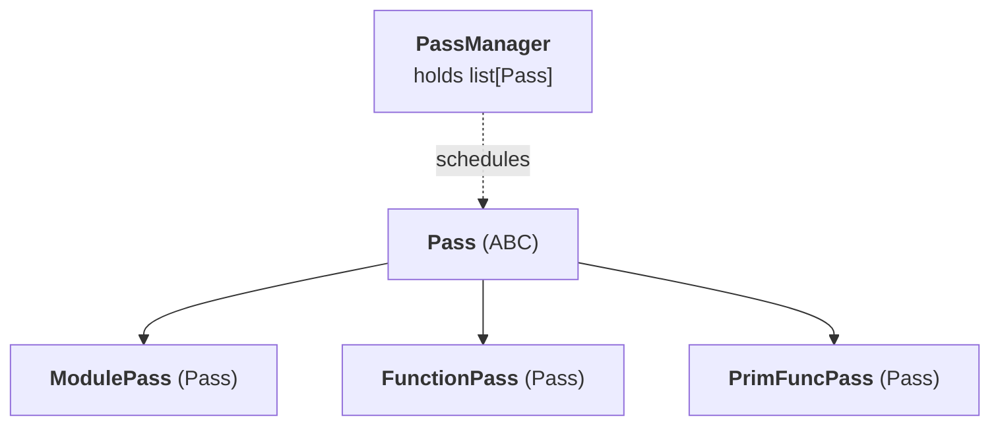

# TileFoundry Spec — passes

The pass framework: `Pass` / `ModulePass` / `FunctionPass` /
`PrimFuncPass` / `PassManager`. A `Pass` is the unit the compiler
schedules over a `Module`; lowering is one stage in this pipeline,
not a free function. After the framework, this spec lists the
implemented passes and their per-pass contracts (HIR → TIR
lowering rules, buffer planning, …).



## 1. Role

A `Pass` abstracts every Module-reading or Module-rewriting compile
step; `PassManager` runs registered passes in registration order. The
pass framework is:

- a linear pipeline — passes run sequentially in registration order;
- three pass granularities: `ModulePass` / `FunctionPass` /
  `PrimFuncPass`;
- explicit registration — passes are added via `PassManager.add(...)`.

## 2. `Pass` base class


```python
from abc import ABC, abstractmethod
from tilefoundry.ir.core import Module

class Pass(ABC):
    """A Module → Module pure function (side-effect logging is
    allowed, but the input Module MUST NOT be mutated — Module is
    a frozen dataclass, so a mutator returns a new instance)."""

    name: str                               # for dump / log
    requires: tuple[str, ...] = ()          # ordered dependency assertion (no scheduling)

    @abstractmethod
    def run(self, module: Module) -> Module: ...
```

- constraints:
  - `run(module)` returns a new `Module`; it does not mutate input.
  - Passes MUST NOT depend on global state. All configuration enters
    through constructor parameters or pass-local attributes.
  - Pass failures raise named exceptions (e.g. `VerifyError`); they
    do not swallow errors.

## 3. Three pass granularities

### 3.1 `ModulePass`

Runs over the whole `Module` and may add / remove / reorder
functions. Examples: module-level inline, dead-function elimination,
HIR → TIR replacement (substitute `tir.PrimFunction` for
`hir.Function`).

```python
class ModulePass(Pass):                             # runs over the whole Module; may add / remove / reorder functions
    @abstractmethod
    def run(self, module: Module) -> Module: ...
```

- constraints:
  - `run` returns a new `Module`; inherits the `Pass` no-mutation / no-global-state
    contract (§2).

### 3.2 `FunctionPass`

Visits each `hir.Function`. The framework supplies a default `run`
that walks `module.functions`, calls `run_function` for HIR
entries, and reassembles the `Module`.

```python
from tilefoundry.ir.hir import Function as HirFunction

class FunctionPass(Pass):                                                       # visits each hir.Function; framework supplies the default run
    @abstractmethod
    def run_function(self, fn: HirFunction, module: Module) -> HirFunction: ...  # visit one HIR function
    def run(self, module: Module) -> Module: ...                                # default reassembles the Module from run_function results
```

- constraints:
  - inherits the `Pass` contract (§2); the default `run` reassembles the `Module`
    from `run_function` results.

### 3.3 `PrimFuncPass`

Same shape as `FunctionPass`, but visits `tir.PrimFunction`. Mirrors
nncase's `PrimFuncPass.cs`.

```python
from tilefoundry.ir.tir import PrimFunction

class PrimFuncPass(Pass):                                                       # visits each tir.PrimFunction (mirrors FunctionPass)
    @abstractmethod
    def run_prim_func(self, fn: PrimFunction, module: Module) -> PrimFunction: ...
    def run(self, module: Module) -> Module: ...   # default mirrors FunctionPass
```

- constraints:
  - inherits the `Pass` contract (§2); same shape as `FunctionPass` over
    `tir.PrimFunction`.

## 4. Transform pass idiom

Transform passes use the visitor / mutator base classes from
[visitor-mutator](./visitor-mutator.md) rather than hand-written
`isinstance` dispatch.

A transform `PrimFuncPass` wraps a `StmtExprMutator` subclass: `run_prim_func`
runs the mutator over `fn.body`, returns `fn` unchanged when the mutator
preserves identity (the returned body is the same object), and otherwise
returns `replace(fn, body=new_body)`. The inner mutator matches on `Evaluate`
and dispatches on `type(stmt.callable)`.

The visit-and-rewrite contract — including the `visit_Evaluate`
entry form for TIR effect Ops — is owned by
[visitor-mutator §7](./visitor-mutator.md).

## 5. `PassManager`

A linear scheduler that runs passes in registration order and
optionally drops per-pass IR dumps when wrapped in a
`tilefoundry.dump.DumpScope`.

```python
from dataclasses import dataclass, field

@dataclass
class PassManager:
    passes: list[Pass] = field(default_factory=list)  # the registered passes, run in registration order

    def add(self, p: Pass) -> "PassManager": ...      # register a pass; returns self for chaining
    def run(self, module: Module) -> Module: ...      # run passes in registration order
```

- constraints:
  - `requires` is an ordering assertion checked before the run, not a topological sort.

`PassManager` does not own a dump destination. When the caller
wraps the run in a `DumpScope` and `DumpFlags.PASS_IR` is enabled,
each pass writes `before.txt` / `after.txt` under
`<scope-root>/{NN}_{pass_name}/`. Without an active scope or with
the flag off, `dump(...)` is a no-op.

## 6. Top-level API

Three public verbs operate on `Module` (no bare `HirFunction` /
`PrimFunction`):

```python
def lower(mod: Module, /, *, target: str, options: CompilerOptions | None = None) -> Module: ...
def build(mod: Module, /, *, target: str | None = None) -> RuntimeModule: ...
def compile(mod: Module, /, *, target: str, options: CompilerOptions | None = None) -> RuntimeModule: ...
def jit(fn_or_mod: Function | Module, /, *, target: str = "cuda", options: CompilerOptions | None = None) -> RuntimeModule: ...
```

`lower` runs the default pipeline (`HirToTirPass → BufferizePass →
…`) and returns a lowered TIR `Module`. Mesh bindings come from
`ShardLayout.mesh` in the HIR body — the verbs do not accept
`cta_mesh` / `thread_mesh` kwargs.

`build` reads `target` from `mod.metadata["target"]` when the
keyword is omitted; an explicit `target` that disagrees with
`mod.metadata` is an error (no silent override). Internally it
runs codegen → toolchain link → loader and returns a
`RuntimeModule` ([runtime](./runtime.md)).

`compile` is `build(lower(mod, ...))`. `jit` accepts a `Module` or
an `hir.Function` (single-function convenience: it normalises into
a `Module` and lifts `Function.topologies` to `Module.topologies`)
and caches on the canonical module text + target + options hash.

### Dirty-scope retype / verify

`typeinfer` and `verify` are not standalone pipeline stages. The
parser already runs eager typeinfer ([parser](./parser.md)), so a
`Module` entering the pipeline has `Expr.type` filled. After each
pass runs, `PassManager` re-runs the relevant analysis on that
pass's **dirty scope**:

- HIR-side: changed `Function`s rerun `typeinfer`.
- TIR-side: changed `PrimFunction`s rerun `verify`, which
  recursively retriggers `typeinfer` on the embedded Expr fields
  and refreshes their `.type`.
- A `ModulePass` whose effect crosses functions (e.g. rewriting an
  `Evaluate(SymbolRef)` callee) MUST report its changed-function set
  or conservatively trigger a whole-module fallback.

Consequence: there is no separate `TypeInferPass`, and `verify` is
not inserted as a public `ModulePass`. Passes own rewrite work; the
unified retype / verify is scheduled by `PassManager`.

## 7. Implemented passes

### 7.1 `HirToTirPass`

```python
class HirToTirPass(ModulePass):                     # replaces every hir.Function with a tir.PrimFunction
    name = "hir_to_tir"
```

- constraints:
  - TIR has no return-tensor form; HIR outputs become trailing params. The
    per-op / mesh / `Reshard` / dispatch lowering rules are in the subsections
    below.

`ModulePass`. Replaces every `hir.Function` with a
`tir.PrimFunction`, materialising the HIR `Function(params) →
tensor` calling convention into the TIR explicit-output-param form
`PrimFunction(params=(inputs..., outputs...), body=...)`. TIR has
no return-tensor form. After this pass, `PassManager` reruns HIR
`typeinfer` / TIR `verify` on the dirty scope.

#### Per-op lowering dispatch

Per-op lowering is **registry-dispatched**, not a hand-written `isinstance`
chain (§4): each HIR op registers its lowering handler keyed by op class
(`register_hir_lowering(OpClass)`), and the pass looks the handler up by
`type(call.target)`. A target-owned op (e.g. the CUDA `Mma`) registers its own
lowering, so the pass core depends on the registry contract, not on importing
target-specific op classes.

#### Mesh structure derivation

`HirToTirPass` MUST NOT fabricate mesh structure. `cta_mesh` and
`thread_mesh` are each `Mesh | None`, derived purely from
`ShardLayout.mesh` references in the body. Each derived mesh wraps
the body in its own `MeshScope`; a missing mesh is silently
skipped (no synthetic `Mesh`).

#### `Reshard` lowering — dual semantics

The rewrite of `Reshard(x, layout, storage)` selects a different
TIR shape based on whether `storage` is provided:

- **No storage** (`storage == ""`): emit a `TensorView(x,
  layout)` — a pure shard tensor view, no allocation, no copy. The
  result is a `Var` carrying the new `ShardLayout` type.
- **With storage** (`storage != ""`): emit
  `dst = AllocTensor(plain_type, storage=...)` followed by
  `Evaluate(Copy, (TensorView(x, layout), dst))` — allocate
  a plain tensor (no `ShardLayout`) and copy from the shard view
  into the plain storage.

#### `Mma_SM80_16x8x16` SSA Op lowering

The HIR `Mma_SM80_16x8x16` value Op lowers to a three-step TIR
sequence:

1. `LetStmt` allocating a per-thread fragment buffer of shape
   `(2, 2)` `f32` (matching the SM80 `CLayout` value-axis extent —
   four elements per lane);
2. `Evaluate(Fill, (r, 0.0))` to zero-initialise the
   accumulator so the underlying PTX `a*b + c` produces `a @ b`
   exactly;
3. `Evaluate(TirMma, (a, b, r))`.

Outer-level `add(acc, mma(a, b))` accumulation patterns lower to a
separate `tir.arith.Binary` downstream.

The cute MMA fragment → `ShardLayout` recipe — the general
arch-specific contract for lowering an MMA SSA Op's A / B / C fragments
to a row-major `ShardLayout` — is owned here. It depends on the cute
atom traits and on the row-major reinterpretation the CUDA target
chooses, so it lives in this lowering pass, not in
[shard](./shard.md). For an arbitrary cute MMA atom:

1. From the cute `MMA_Traits<Atom>::ALayout` / `BLayout` / `CLayout`
   extract the nested
   `Layout<Shape<Shape<...>, Shape<...>>, Stride<Stride<...>, Stride<...>>>`
   — the outer nested shape is the **thread layout**, the inner is the
   **value layout**.
2. Re-derive the per-axis stride under TileFoundry's row-major
   interpretation of the (M, K) / (K, N) / (M, N) tile. Cute is
   column-major by default, so a strict sort by stride is required.
3. Sort all axes (thread + value) by ascending stride to flatten the
   cute nested layout into a TileFoundry flat `Layout(shape, strides)`.
4. For each thread-mesh axis, attach a `Split(tensor_axis)` attr
   pointing at the corresponding axis position in the flattened layout.
   The remaining axes are per-thread *value* axes (no `ShardAttr`);
   their product equals the PTX register count per lane.

Worked example: `SM80_16x8x16_F32BF16BF16F32_TN` with
`Layout(shape=(4, 8), strides=(1, 4))` aligning with cute's
`Shape<_4, _8>` ThrID decomposition.

#### Dispatch lowering

The pass lowers each `Module.functions` entry by its shape
([hir.md §1.1](./hir.md#11-function)):

- A normal function (`variants == ()`) lowers on the default
  single-body path.
- A dispatch prototype (`variants != ()`, `body is None`) lowers
  through the dispatch path:
  1. Each variant lowers to its own `tir.PrimFunction` under the
     mangled symbol `f"{name}${dim_var}${lo}_{hi}"`. Variant params
     keep the original `TensorType` envelope; the dispatched range
     is carried by the variant's `specializations` and the mangled
     symbol, not by narrowed param types.
  2. The prototype emits one entry `tir.PrimFunction` under the
     unmangled `name` whose body is a single `tir.DispatchCall`
     (see [tir.md §1.6](./tir.md#16-dispatchcall)):
     - `subjects = (ShapeOf(param, axis),)` for the canonical
       `(param, axis)` of the dispatch `DimVar`;
     - `case_patterns` carries each variant's pattern in source
       order;
     - `case_calls` is a parallel tuple of `Evaluate(SymbolRef, args)`
       invoking the mangled variants;
     - `fallback = Sequential((Abort(),))`.

A `Call(target=hir_fn)` whose callee is a dispatch prototype
(`variants != ()`) lowers to a `tir.DispatchCall` covering the
**reachable set** — callee variants whose specialization range
intersects the caller-side range carried by the call argument at the
callee's canonical `(param_index, axis)`. The caller-side range is
derived from `call.args[param_index].type.shape[axis]`:

- a static integer `k` → singleton half-open `[k, k+1)`;
- a `DimVar(name, lo, hi)` → caller half-open range `[lo, hi)` read directly
  from the dim;
- any other form → compile-time error.

An empty reachable set is a compile-time error. Coverage and
disjointness of the variants over the dispatch envelope are verified
statically (the partition rule, [hir.md §1.1](./hir.md#11-function)),
so an in-envelope shape always selects exactly one variant. The
`tir.DispatchCall.fallback` (`Abort`) is reached only by an
out-of-envelope shape — a call-contract violation.

Each lowered `PrimFunction` that references `ShapeOf(param, axis)`
gains a hidden scalar parameter named `<param.name>_shape_<axis>` of
`TensorType((), i32)`. The CUDA host wrapper extracts the value from
the runtime tensor's shape; the parameter is invisible at the user
FFI surface (see
[target §6](./target.md#6-dispatch-and-shape-scalar-abi)).

### 7.2 `BufferizePass`

`PrimFuncPass` (or `ModulePass` when crossing `Evaluate(SymbolRef)`
callee boundaries). Runs after `HirToTirPass`, before codegen. The input
is already an explicit-buffer-param `PrimFunction`; this pass does
**not** perform an MLIR-style value → buffer IR conversion.

Responsibility: collect logical-buffer lifetime, assign each
logical buffer a physical offset / size, and write the result back
into the `tir.memory.*` descriptors. Policy: every logical buffer
gets an independent physical allocation; no reuse, pool, or lifetime
overlap. Buffer planning is not a codegen responsibility.

```python
class BufferizePass(PrimFuncPass):                  # assigns each logical buffer a physical offset / size after HirToTirPass
    name = "bufferize"
    requires = ("hir_to_tir",)
```

- constraints:
  - every logical buffer gets an independent physical allocation; no reuse, pool,
    or lifetime overlap. Buffer planning is not a codegen responsibility.

## 8. Directory layout

```
src/tilefoundry/passes/
├── __init__.py              # re-exports Pass / PassManager
├── pass_base.py             # Pass / FunctionPass / PrimFuncPass / ModulePass
├── pass_manager.py          # PassManager
└── transforms/
    ├── __init__.py
    ├── hir_to_tir.py        # HirToTirPass
    └── bufferize.py         # BufferizePass
```

`passes/analysis/` is reserved but currently unused — the analysis
registries (`typeinfer` / `verify` / `costmodel`) live in
[visitor-registry](./visitor-registry.md) and do not move into
`passes/`. Only a standalone analysis pass that needs to run
independently and cache its result (such as an `AliasAnalysisPass`)
lands under `passes/analysis/`.
