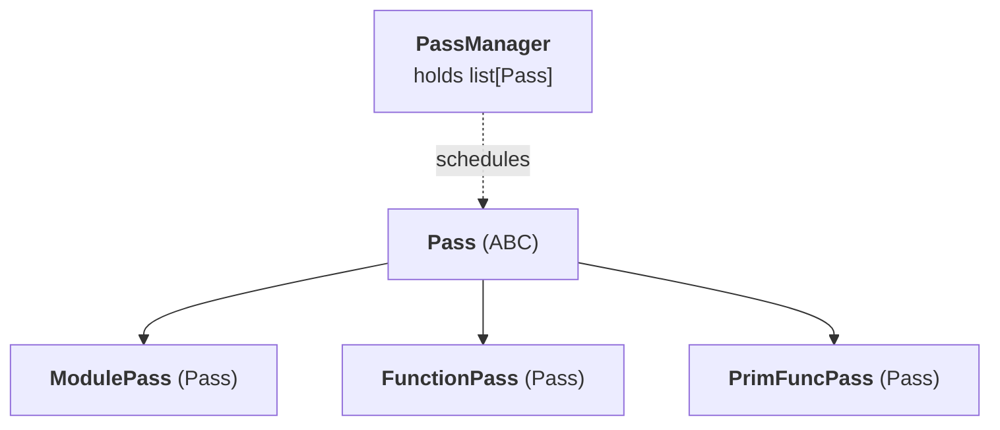

# TileFoundry Spec — passes

The pass framework: `Pass` / `ModulePass` / `FunctionPass` /
`PrimFuncPass` / `PassManager`. A `Pass` is the unit the compiler
schedules over a `Module`; lowering is one stage in this pipeline,
not a free function. After the framework, this spec lists the
implemented passes and their per-pass contracts (HIR → TIR
lowering rules, buffer planning, …).


```mermaid
flowchart TB
    Pass["<b>Pass</b> (ABC)"]
    ModulePass["<b>ModulePass</b> (Pass)"]
    FunctionPass["<b>FunctionPass</b> (Pass)"]
    PrimFuncPass["<b>PrimFuncPass</b> (Pass)"]
    PassManager["<b>PassManager</b><br/>holds list[Pass]"]

    Pass --> ModulePass
    Pass --> FunctionPass
    Pass --> PrimFuncPass
    PassManager -. schedules .-> Pass
```

## 1. Role

A `Pass` abstracts every Module-reading or Module-rewriting compile
step; `PassManager` runs registered passes in registration order. The
pass framework is:

- a linear pipeline — passes run sequentially in registration order;
- three pass granularities: `ModulePass` / `FunctionPass` /
  `PrimFuncPass`;
- explicit registration — passes are added via `PassManager.add(...)`.

## 2. `Pass` base class


```python
from abc import ABC, abstractmethod
from tilefoundry.ir.core import Module

class Pass(ABC):
    """A Module → Module pure function.

    Side-effect logging is allowed, but the input Module MUST NOT be
    mutated — Module is a frozen dataclass, so a mutator returns a new
    instance.

    Attributes:
        name: attribute; Stable dump and log name.
        requires: attribute; Ordered dependency assertion.
    """

    name: str = ""
    requires: tuple[str, ...] = ()

    @abstractmethod
    def run(self, module: Module) -> Module: ...
```

- constraints:
  - `run(module)` returns a new `Module`; it does not mutate input.
  - Passes MUST NOT depend on global state. All configuration enters
    through constructor parameters or pass-local attributes.
  - Pass failures raise named exceptions (e.g. `VerifyError`); they
    do not swallow errors.

## 3. Three pass granularities

### 3.1 `ModulePass`

Runs over the whole `Module` and may add / remove / reorder
functions. Examples: module-level inline, dead-function elimination,
HIR → TIR replacement (substitute `tir.PrimFunction` for
`hir.Function`).

```python
class ModulePass(Pass):
    """Run over a complete Module."""

    @abstractmethod
    def run(self, module: Module) -> Module: ...
```

- constraints:
  - `run` returns a new `Module`; inherits the `Pass` no-mutation / no-global-state
    contract ([§2](#2-pass-base-class)).

### 3.2 `FunctionPass`

Visits each `hir.Function`. The framework supplies a default `run`
that walks `module.functions`, calls `run_function` for HIR
entries, and reassembles the `Module`.

```python
from tilefoundry.ir.hir import Function as HirFunction

class FunctionPass(Pass):
    """Run independently over each HIR Function."""

    @abstractmethod
    def run_function(self, fn: HirFunction, module: Module) -> HirFunction: ...
    def run(self, module: Module) -> Module: ...
```

- constraints:
  - inherits the `Pass` contract ([§2](#2-pass-base-class)); the default `run` reassembles the `Module`
    from `run_function` results.

### 3.3 `PrimFuncPass`

Same shape as `FunctionPass`, but visits `tir.PrimFunction`.

```python
from tilefoundry.ir.tir import PrimFunction

class PrimFuncPass(Pass):
    """Run independently over each TIR PrimFunction."""

    @abstractmethod
    def run_prim_func(self, fn: PrimFunction, module: Module) -> PrimFunction: ...
    def run(self, module: Module) -> Module: ...
```

- constraints:
  - inherits the `Pass` contract ([§2](#2-pass-base-class)); same shape as `FunctionPass` over
    `tir.PrimFunction`.

## 4. Transform pass idiom

Transform passes use the visitor / mutator base classes from
[visitor-mutator](./visitor-mutator.md) rather than hand-written
`isinstance` dispatch.

A transform `PrimFuncPass` wraps a `StmtExprMutator` subclass: `run_prim_func`
runs the mutator over `fn.body`, returns `fn` unchanged when the mutator
preserves identity (the returned body is the same object), and otherwise
returns `replace(fn, body=new_body)`. The inner mutator matches on `Evaluate`
and dispatches on `type(stmt.callable)`.

The visit-and-rewrite contract — including the `visit_Evaluate`
entry form for TIR effect Ops — is owned by
[visitor-mutator §7](./visitor-mutator.md#7-visitor-entry-forms-for-evaluate).

## 5. `PassManager`

A linear scheduler that runs passes in registration order and
optionally drops per-pass IR dumps when wrapped in a
`tilefoundry.dump.DumpScope`.

```python
class PassManager:
    """Ordered pass pipeline.

    Attributes:
        passes: attribute; the registered passes, run in registration order.
    """

    passes: list[Pass] = field(default_factory=list)

    def add(self, p: Pass) -> "PassManager": ...      # register a pass; returns self for chaining
    def run(self, module: Module) -> Module: ...      # run passes in registration order
```

- constraints:
  - `requires` is an ordering assertion checked before the run, not a topological sort.

`PassManager` does not own a dump destination. When the caller
wraps the run in a `DumpScope` and `DumpFlags.PASS_IR` is enabled,
each pass writes `before.txt` / `after.txt` under
`<scope-root>/{NN}_{pass_name}/`. Without an active scope or with
the flag off, `dump(...)` is a no-op.

## 6. Top-level API

Three public verbs operate on `Module` (no bare `HirFunction` /
`PrimFunction`):

```python
class CompilerOptions:
    """Carry deterministic compiler configuration.

    Attributes:
        target: attribute; Constructed compilation Target.
    """

    target: Target

    def canonical_text(self) -> str: ...


def lower(mod: Module, /, *, target: Target | None = None) -> Module: ...
def build(mod: Module, /, *, target: Target | None = None) -> RuntimeModule: ...
def compile(mod: Module, /, *, target: Target | None = None) -> RuntimeModule: ...
```

`lower` runs the default pipeline (`HirToTirPass → BufferizePass →
…`) and returns a lowered TIR `Module`. Mesh bindings come from
`ShardLayout.mesh` in the HIR body — the verbs do not accept
`cta_mesh` / `thread_mesh` kwargs.

`lower` uses the Module-owned Target when present. At an undeclared root it
attaches either the explicit Target instance or `default_target()` before any
pass runs. An explicit Target that disagrees with a declared Module Target is
an error. `build` requires the lowered Module to own its Target and applies the
same explicit-conflict rule. Internally it
runs codegen → toolchain link → loader and returns a
`RuntimeModule` ([runtime](./runtime.md)).

`compile` is `build(lower(mod, ...))`. The `jit` convenience and cache contract
are owned by [runtime §1.3](./runtime.md#13-jit-api).

### Dirty-scope retype / verify

`typeinfer` and `verify` are not standalone pipeline stages. The
parser already runs eager typeinfer ([parser](./parser.md)), so a
`Module` entering the pipeline has `Expr.type` filled. After each
pass runs, `PassManager` re-runs the relevant analysis on that
pass's **dirty scope**:

- HIR-side: changed `Function`s rerun `typeinfer`.
- TIR-side: changed `PrimFunction`s rerun `verify`, which
  recursively retriggers `typeinfer` on the embedded Expr fields
  and refreshes their `.type`.
- A `ModulePass` whose effect crosses functions (e.g. rewriting an
  `Evaluate(SymbolRef)` callee) MUST report its changed-function set
  or conservatively trigger a whole-module fallback.

Consequence: there is no separate `TypeInferPass`, and `verify` is
not inserted as a public `ModulePass`. Passes own rewrite work; the
unified retype / verify is scheduled by `PassManager`.

## 7. Implemented passes

### 7.1 `HirToTirPass`

```python
class HirToTirPass(ModulePass):                     # replaces every hir.Function with a tir.PrimFunction
    name = "hir_to_tir"
```

- constraints:
  - TIR has no return-tensor form; HIR outputs become trailing params. The
    per-op / mesh / `Reshard` / dispatch lowering rules are in the subsections
    below.

`ModulePass`. Replaces every `hir.Function` with a
`tir.PrimFunction`, materialising the HIR `Function(params) →
tensor` calling convention into the TIR explicit-output-param form
`PrimFunction(params=(inputs..., outputs...), body=...)`. TIR has
no return-tensor form. After this pass, `PassManager` reruns HIR
`typeinfer` / TIR `verify` on the dirty scope.

#### Per-op lowering dispatch

Per-op lowering is **registry-dispatched**, not a hand-written `isinstance`
chain ([§4](#4-transform-pass-idiom)): each HIR op registers its lowering handler keyed by op class
(`register_hir_lowering(OpClass)`), and the pass looks the handler up by
`type(call.target)`. A target-owned op (e.g. the CUDA `Mma`) registers its own
lowering, so the pass core depends on the registry contract, not on importing
target-specific op classes.

A handler is a free function `handler(ctx, target, expr) -> Var`, where
`ctx` is the lowering context and `target` is the dispatched `Op`
instance. A handler SHOULD interact with `ctx` only through its public ABI:

- `ctx.lower(expr) -> Var` — recursively lower a nested sub-expression;
- `ctx.fresh(type, hint) -> Var` — a fresh Var name (no binding emitted);
- `ctx.alloc(type, hint) -> Var` — a fresh Var bound to a new `AllocTensor`;
- `ctx.emit(stmt)` — append a raw Stmt to the pending lowered sequence;
- `ctx.emit_bind(var, value)` — append a let-binding `var = value`.

A target-owned op's handler MUST use only this public ABI — it has no
standing to reach into pass-internal state. A core op whose lowering
depends on pass-internal cooperation (dispatch-group resolution, the
reshard cross-CTA sync fence, tuple-carry field lookup) MAY call other
`_Lowerer` methods directly; this is the exception, not the norm.

A unit-stride HIR `Slice` lowers to a `TensorView` at the per-axis absolute
element starts; `InsertSlice` uses the same coordinate convention. Neither
multiplies an already-absolute coordinate by a window extent. A start that is dim
arithmetic over literals and scalar Vars is an address the emitter computes, so
lowering MUST carry it to the coordinate site rather than lower it as a value. A
coordinate that an **op** computes MUST be refused: materializing it produces a
buffer, and a buffer is not a scalar index. A
non-divisible tile loop whose body consumes such a fixed-shape window MUST raise
until a handwritten residual-tail lowering is supplied; a window moved by a
compile-time offset is still that loop's window for this rule.

#### Mesh structure derivation

`HirToTirPass` MUST NOT fabricate mesh structure. `cta_mesh` and
`thread_mesh` are each `Mesh | None`, derived purely from
`ShardLayout.mesh` references in the body. Each derived mesh wraps
the body in its own `MeshScope`; a missing mesh is silently
skipped (no synthetic `Mesh`).

#### `Reshard` lowering — dual semantics

The rewrite of `Reshard(x, layout, storage)` selects a different
TIR shape based on whether `storage` is provided:

- **No storage** (`storage == ""`): emit a `TensorView(x,
  layout)` — a pure shard tensor view, no allocation, no copy. The
  result is a `Var` carrying the new `ShardLayout` type.
- **With storage** (`storage != ""`): emit
  `dst = AllocTensor(plain_type, storage=...)` followed by
  `Evaluate(Copy, (TensorView(x, layout), dst))` — allocate
  a plain tensor (no `ShardLayout`) and copy from the shard view
  into the plain storage.

#### CUDA HIR MMA refusal

`HirToTirPass` MUST reject both `Mma_SM80_16x8x16` and
`Wgmma_SM90_64x128x16` by their concrete HIR Op name before lowering either
operand or emitting allocations, copies, fills, or `TirMma`. Their logical HIR
value/type/cost models are available to evaluation and Analyze only; there is
no HIR compile route.

The independent handwritten `T.cuda.mma` atom and CUDA runtime surface remains
available and is specified by [tir §2.3](./tir.md#23-tir-ops). This pass MUST
NOT translate HIR fragments into that surface, modify its atom layouts, or rely
on CUDA codegen's legacy `atom=None` fallback.

#### Dispatch lowering

The pass lowers each `Module.functions` entry by its shape
([hir.md §1.1](./hir.md#11-function)):

- A normal function (`variants == ()`) lowers on the default
  single-body path.
- A dispatch prototype (`variants != ()`, `body is None`) lowers
  through the dispatch path:
  1. Each variant lowers to its own `tir.PrimFunction` under the
     mangled symbol `f"{name}${dim_var}${lo}_{hi}"`. Variant params
     keep the original `TensorType` envelope; the dispatched range
     is carried by the variant's `specializations` and the mangled
     symbol, not by narrowed param types.
  2. The prototype emits one entry `tir.PrimFunction` under the
     unmangled `name` whose body is a single `tir.DispatchCall`
     (see [tir.md §1.6](./tir.md#16-dispatchcall)):
     - `subjects = (ShapeOf(param, axis),)` for the canonical
       `(param, axis)` of the dispatch `DimVar`;
     - `case_patterns` carries each variant's pattern in source
       order;
     - `case_calls` is a parallel tuple of `Evaluate(SymbolRef, args)`
       invoking the mangled variants;
     - `fallback = Sequential((Abort(),))`.

A `Call(target=hir_fn)` whose callee is a dispatch prototype
(`variants != ()`) lowers to a `tir.DispatchCall` covering the
**reachable set** — callee variants whose specialization range
intersects the caller-side range carried by the call argument at the
callee's canonical `(param_index, axis)`. The caller-side range is
derived from `call.args[param_index].type.shape[axis]`:

- a static integer `k` → singleton half-open `[k, k+1)`;
- a `DimVar(name, lo, hi)` → caller half-open range `[lo, hi)` read directly
  from the dim;
- any other form → compile-time error.

An empty reachable set is a compile-time error. Coverage and
disjointness of the variants over the dispatch envelope are verified
statically (the partition rule, [hir.md §1.1](./hir.md#11-function)),
so an in-envelope shape always selects exactly one variant. The
`tir.DispatchCall.fallback` (`Abort`) is reached only by an
out-of-envelope shape — a call-contract violation.

Each lowered `PrimFunction` that references `ShapeOf(param, axis)`
gains a hidden scalar parameter named `<param.name>_shape_<axis>` of
`TensorType((), i32)`. The CUDA host wrapper extracts the value from
the runtime tensor's shape; the parameter is invisible at the user
FFI surface (see [target](./target.md)).

### 7.2 `BufferizePass`

`PrimFuncPass`. Runs after `HirToTirPass`, before codegen. The input
is already an explicit-buffer-param `PrimFunction`; this pass does
**not** perform an MLIR-style value → buffer IR conversion.

Responsibility: collect logical-buffer lifetimes and run the placement-policy
hook. The independent-allocation policy is already represented by one
`AllocTensor` per logical buffer, so the pass returns the `PrimFunction`
unchanged and does not write placement records into `tir.memory.*` descriptors.

```python
class BufferizePass(PrimFuncPass):
    """Collect lifetimes and validate independent allocation placement.

    Attributes:
        collector: attribute; lifetime collector, defaulted during initialization.
        scheduler: attribute; placement scheduler, defaulted during initialization.
        name: attribute; pass name.
        requires: attribute; required predecessor passes.
    """

    collector: LifetimeCollector = None
    scheduler: BufferScheduler = None
    name: str = "bufferize"
    requires: tuple[str, ...] = ("hir_to_tir",)
```

- constraints:
  - every logical buffer gets an independent physical allocation; no reuse, pool,
    or lifetime overlap. Buffer planning is not a codegen responsibility.
  - The scheduler's placement result is advisory under this policy;
    `run_prim_func` MUST return the input function unchanged.

### 7.3 `insert_default_host_entry`

```python
def insert_default_host_entry(module: Module) -> Module:
    """Return a Module whose entry is host-callable.

    Args:
        module: Lowered Module to normalize.

    Returns:
        The unchanged or host-entry-normalized Module.
    """
    ...
```

- constraints:
  - A CPU entry MUST pass through unchanged.
  - A dispatch entry MUST be retargeted to CPU while its launched variants
    remain device functions.
  - With no CPU entry and exactly one CUDA device function, the transform MUST
    synthesize a CPU entry that mirrors the parameters and launches that
    function. It MUST reject ambiguous device-function sets, a non-entry CPU
    function, or a launch-provided dynamic CTA extent.

## 8. Directory layout

File layout is implementation-owned. Analysis registry ownership is defined by
[visitor-registry](./visitor-registry.md).
