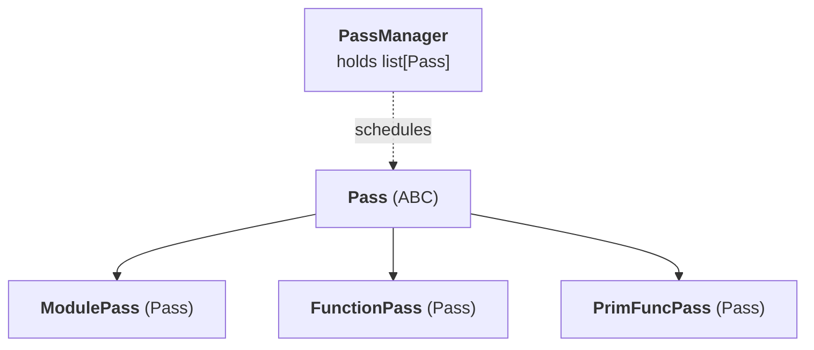

# TileFoundry Spec — passes

The pass framework: `Pass` / `ModulePass` / `FunctionPass` /
`PrimFuncPass` / `PassManager`. A `Pass` is the unit the compiler
schedules over a `Module`; a transform is one stage in this pipeline,
not a free function. After the framework, this spec lists the
implemented passes and their per-pass contracts.


```mermaid
flowchart TB
    Pass["<b>Pass</b> (ABC)"]
    ModulePass["<b>ModulePass</b> (Pass)"]
    FunctionPass["<b>FunctionPass</b> (Pass)"]
    PrimFuncPass["<b>PrimFuncPass</b> (Pass)"]
    PassManager["<b>PassManager</b><br/>holds list[Pass]"]

    Pass --> ModulePass
    Pass --> FunctionPass
    Pass --> PrimFuncPass
    PassManager -. schedules .-> Pass
```

## 1. Role

A `Pass` abstracts every Module-reading or Module-rewriting compile
step; `PassManager` runs registered passes in registration order. The
pass framework is:

- a linear pipeline — passes run sequentially in registration order;
- three pass granularities: `ModulePass` / `FunctionPass` /
  `PrimFuncPass`;
- explicit registration — passes are added via `PassManager.add(...)`.

## 2. `Pass` base class


```python
from abc import ABC, abstractmethod
from tilefoundry.ir.core import Module

class Pass(ABC):
    """A Module → Module pure function.

    Side-effect logging is allowed, but the input Module MUST NOT be
    mutated — Module is a frozen dataclass, so a mutator returns a new
    instance.

    Attributes:
        name: attribute; Stable dump and log name.
        requires: attribute; Ordered dependency assertion.
    """

    name: str = ""
    requires: tuple[str, ...] = ()

    @abstractmethod
    def run(self, module: Module) -> Module: ...
```

- constraints:
  - `run(module)` returns a new `Module`; it does not mutate input.
  - Passes MUST NOT depend on global state. All configuration enters
    through constructor parameters or pass-local attributes.
  - Pass failures raise named exceptions (e.g. `VerifyError`); they
    do not swallow errors.

## 3. Three pass granularities

### 3.1 `ModulePass`

Runs over the whole `Module` and may add / remove / reorder
functions. Examples: module-level inline, dead-function elimination,
synthesizing an entry the module does not yet declare
([§7.3](#73-insert_default_host_entry)).

```python
class ModulePass(Pass):
    """Run over a complete Module."""

    @abstractmethod
    def run(self, module: Module) -> Module: ...
```

- constraints:
  - `run` returns a new `Module`; inherits the `Pass` no-mutation / no-global-state
    contract ([§2](#2-pass-base-class)).

### 3.2 `FunctionPass`

Visits each `hir.Function`. The framework supplies a default `run`
that walks `module.functions`, calls `run_function` for HIR
entries, and reassembles the `Module`.

```python
from tilefoundry.ir.hir import Function as HirFunction

class FunctionPass(Pass):
    """Run independently over each HIR Function."""

    @abstractmethod
    def run_function(self, fn: HirFunction, module: Module) -> HirFunction: ...
    def run(self, module: Module) -> Module: ...
```

- constraints:
  - inherits the `Pass` contract ([§2](#2-pass-base-class)); the default `run` reassembles the `Module`
    from `run_function` results.

### 3.3 `PrimFuncPass`

Same shape as `FunctionPass`, but visits `tir.PrimFunction`.

```python
from tilefoundry.ir.tir import PrimFunction

class PrimFuncPass(Pass):
    """Run independently over each TIR PrimFunction."""

    @abstractmethod
    def run_prim_func(self, fn: PrimFunction, module: Module) -> PrimFunction: ...
    def run(self, module: Module) -> Module: ...
```

- constraints:
  - inherits the `Pass` contract ([§2](#2-pass-base-class)); same shape as `FunctionPass` over
    `tir.PrimFunction`.

## 4. Transform pass idiom

Transform passes use the visitor / mutator base classes from
[visitor-mutator](./visitor-mutator.md) rather than hand-written
`isinstance` dispatch.

A transform `PrimFuncPass` wraps a `StmtExprMutator` subclass: `run_prim_func`
runs the mutator over `fn.body`, returns `fn` unchanged when the mutator
preserves identity (the returned body is the same object), and otherwise
returns `replace(fn, body=new_body)`. The inner mutator matches on `Evaluate`
and dispatches on `type(stmt.callable)`.

The visit-and-rewrite contract — including the `visit_Evaluate`
entry form for TIR effect Ops — is owned by
[visitor-mutator §7](./visitor-mutator.md#7-visitor-entry-forms-for-evaluate).

## 5. `PassManager`

A linear scheduler that runs passes in registration order and
optionally drops per-pass IR dumps when wrapped in a
`tilefoundry.dump.DumpScope`.

```python
class PassManager:
    """Ordered pass pipeline.

    Attributes:
        passes: attribute; the registered passes, run in registration order.
    """

    passes: list[Pass] = field(default_factory=list)

    def add(self, p: Pass) -> "PassManager": ...      # register a pass; returns self for chaining
    def run(self, module: Module) -> Module: ...      # run passes in registration order
```

- constraints:
  - `requires` is an ordering assertion checked before the run, not a topological sort.

`PassManager` does not own a dump destination. When the caller
wraps the run in a `DumpScope` and `DumpFlags.PASS_IR` is enabled,
each pass writes `before.txt` / `after.txt` under
`<scope-root>/{NN}_{pass_name}/`. Without an active scope or with
the flag off, `dump(...)` is a no-op.

## 6. Top-level API

Three public verbs operate on `Module` (no bare `HirFunction` /
`PrimFunction`):

```python
class CompilerOptions:
    """Carry deterministic compiler configuration.

    Attributes:
        target: attribute; Constructed compilation Target.
    """

    target: Target

    def canonical_text(self) -> str: ...


def build(mod: Module, /, *, target: Target | None = None) -> RuntimeModule: ...
def compile(mod: Module, /, *, target: Target | None = None) -> RuntimeModule: ...
```

`build` takes a TIR `Module`, runs the pipeline over it, then codegen →
toolchain link → loader, and returns a `RuntimeModule`
([runtime](./runtime.md)). It requires the Module to own its Target; an
explicit Target that disagrees with the declared one is an error.

`compile` is `build`. The `jit` convenience and cache contract are owned by
[runtime §1.6](./runtime.md#16-compilepy).

### Dirty-scope retype / verify

`typeinfer` and `verify` are not standalone pipeline stages. The
parser already runs eager typeinfer ([parser](./parser.md)), so a
`Module` entering the pipeline has `Expr.type` filled. After each
pass runs, `PassManager` re-runs the relevant analysis on that
pass's **dirty scope**:

- HIR-side: changed `Function`s rerun the existing checks and refresh available
  `RangeMetadata` over the complete function without rewriting `.type`.
- TIR-side: changed `PrimFunction`s rerun `verify`, which
  recursively retriggers `typeinfer` on the embedded Expr fields
  and refreshes their `.type`.
- A `ModulePass` whose effect crosses functions (e.g. rewriting an
  `Evaluate(SymbolRef)` callee) MUST report its changed-function set
  or conservatively trigger a whole-module fallback.

Consequence: there is no separate `TypeInferPass`, and `verify` is
not inserted as a public `ModulePass`. Passes own rewrite work; the
unified retype / verify is scheduled by `PassManager`.

## 7. Implemented passes

### 7.3 `insert_default_host_entry`

```python
class InsertHostEntryPass(ModulePass):
    """Give a device-only module a host-callable entry.

    Attributes:
        name: attribute; Stable dump and log name.
        requires: attribute; Ordered dependency assertion.
    """

    name: str = "insert_host_entry"
    requires: tuple[str, ...] = ()

    def run(self, module: Module) -> Module: ...


def insert_default_host_entry(module: Module) -> Module:
    """Return a Module whose entry is host-callable.

    Args:
        module: Module to normalize.

    Returns:
        The unchanged or host-entry-normalized Module.
    """
    ...
```

- constraints:
  - The pass is the scheduled form of the transform and states no rule of its
    own. It is the one pass `build` ([§6](#6-top-level-api)) registers.
  - A CPU entry MUST pass through unchanged.
  - With no CPU entry and exactly one CUDA device function, the transform MUST
    synthesize a CPU entry that mirrors that function's parameters and launches
    it. One rule covers both device shapes: whether the call reads as a launch
    or as a dispatch follows from the callee's own shape, a lone kernel and a
    specialization prototype taking the same route here.
  - It MUST NOT rewrite the Target any function records. Which target a
    function runs on is what its author wrote.
  - The launch geometry MUST be settled here and written into the `Launch`, so
    nothing downstream derives it again. A prototype states no body of its own,
    so its variants state its geometry and they MUST agree.
  - It MUST reject ambiguous device-function sets, a non-entry CPU function, or
    a launch-provided dynamic CTA extent.

## 8. Directory layout

File layout is implementation-owned. Dispatch registry ownership is defined by
[visitor-registry](./visitor-registry.md).
