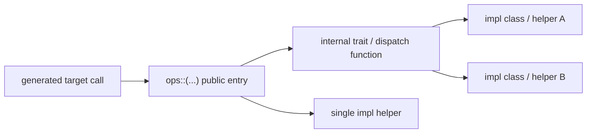

# TileFoundry Spec — Runtime

This spec owns the runtime contract outside the IR compile pipeline. It has
two surfaces:

- the Python-side `RuntimeModule` / launcher ABI used by `build(...)` and
  examples/tests
- the C++ runtime surface included by generated CUDA source

The C++ runtime is built on a vendored `cutlass/include/{cute,cutlass}`
snapshot.

## 1. Python Runtime Surface

### 1.1 `RuntimeModule`

```python
class RuntimeModule:
    name: str                                   # this node's own name
    entry: str                                  # name of the default entry function
    functions: Mapping[str, RuntimeFunction]     # the only implementation form — no evaluator fallback
    weights: Mapping[str, torch.Tensor]          # lazy, cached-per-name view over `resource`
    states: dict[str, torch.Tensor]              # allocated at construction from `state_specs`
    modules: tuple["RuntimeModule", ...]         # child nodes, addressed by name
    resource: RuntimeResource | None             # checkpoint access backing weights/states
    source: str | None                           # optional — generated source text (compiled path)
    kernels: tuple[KernelInfo, ...]               # optional — kernel metadata (compiled path)
    launch_config: LaunchConfig | None            # optional — launch geometry (compiled path)
    def __call__(self, *acts): ...               # dispatch to getattr(self, self.entry)(*acts)
    def __getattr__(self, name): ...              # function name → bound call; child name → RuntimeModule
    def walk(self): ...                          # yields (path, node) for self + every nested child
```

- constraints:
  - two construction paths:
    - **compiled**: `tilefoundry.build` / `compile` / `jit` → codegen →
      `LinkedModule` → `runtime.loader.load_linked_module` constructs a
      single-function `RuntimeModule` with no `resource` / `weights` /
      `states` (§1.1.2).
    - **handwritten**: direct construction — a `RuntimeFunction` wraps a
      plain torch/triton callable, and a `RuntimeResource` supplies
      weights/states by name (§1.4).
  - constructor: `RuntimeModule(name, entry, functions, *, resource=None,
    weight_names=(), state_specs=None, modules=(), device=None, source=None,
    kernels=(), launch_config=None)`.
  - `weights` is lazily populated and cached per name from `resource`, one
    entry per name in `weight_names` (typically an IR `Module.weights` key
    set).
  - `states` is eagerly allocated at construction from `state_specs` (an IR
    `Module.states`-shaped mapping): for each declared name, a tensor of
    that (bare) name loaded from `resource` becomes the initial value if
    present, else a zero tensor of the declared shape/dtype is allocated on
    `device`.
  - `device` is a `tilefoundry.target.base.Device` (e.g. `H200SXM()`); it
    selects the torch device (`"cuda"` for a device whose class lives under
    `tilefoundry.target.cuda`, else `"cpu"`) used only for zero-filled state
    allocation — `None` is fine whenever no state needs zero-filling.
  - `__getattr__` resolves, in order: a `functions` name → a bound callable
    (below); else a `modules` child name → that child `RuntimeModule`; else
    `AttributeError`. A dunder/private name always raises `AttributeError`.
  - the bound callable for `functions[name]` resolves each
    `RuntimeFunction.type.params` entry from `weights` / `states` by name
    when declared; the rest fill positionally from the caller's activation
    arguments, in declaration order. Callers only ever pass activation
    arguments positionally — weights/states are never passed positionally.
    `RuntimeModule` itself only ever fills by name; it does **not** decide
    auto-alloc vs. pre-alloc — that stays `RuntimeFunction`'s call (§1.2).
    So the activation count must exactly match one of two legal counts:
    - `N_in` — the unresolved (non-weight/state) slots of
      `params[:input_count]` (the input segment) — assembly stops there and
      `RuntimeFunction` auto-allocs the output(s) (`output_count > 0`).
    - `N_in + output_count` — every unresolved slot across the *whole*
      param list — assembly covers every param and `RuntimeFunction`
      pre-allocs (uses the given output(s)).
    Any other activation count raises `ValueError` naming both `N_in` and
    `N_in + output_count`. (`output_count == 0` collapses the two counts
    into one — the value-returning handwritten-`fn` path is unaffected.)
  - `RuntimeModule` never runs the HIR evaluator; every `functions` entry
    must already be a concrete `RuntimeFunction`.

### 1.1.1 `RuntimeFunction`

Each function implementation is wrapped as a `RuntimeFunction`:

```python
class RuntimeFunction:
    type: CallableType                # the calling convention
    fn: Callable                      # the wrapped implementation
    def __call__(self, *args): ...    # see below
```

- constraints:
  - constructor: `RuntimeFunction(type, fn)`.
  - `type.output_count == 0`: `fn` is a value-returning callable (e.g. a
    handwritten torch/triton implementation) — `__call__(*args)` calls
    `fn(*args)` and returns its result directly; no out-param ABI applies.
  - `type.output_count > 0`: `fn` is a compiled out-param entry —
    `__call__` auto-allocates outputs when `len(args) == type.input_count`,
    otherwise uses the provided output tensors (pre-alloc); see §1.2.
  - `signature` is a deprecated read-only alias for `type`.

`CallableType` carries `params`, `input_count`, `output_count` — set by
codegen from the lowered IR metadata for a compiled function, or by
`callable_type_of(fn)` for a HIR `Function` (one `ParamABI` per declared
parameter, a static dim as its `int` value and a dynamic dim as `-1`,
`output_count=0`).

### 1.1.2 Internal Pipeline

```
Module (IR) → codegen: per-target LinkableModule… → LinkedModule (.so + metadata)
LinkedModule → load → RuntimeModule (fully-loaded, public, callable)
```

`LinkedModule` is a codegen product
([codegen §4.3](./codegen.md#43-linkedmodule)); the loader that turns it into a
`RuntimeModule` is owned here. The loader and `LinkedModule` are not public API;
only `RuntimeModule` is. `load_linked_module` constructs
`RuntimeModule(name=linked.entry.name, entry=linked.entry.name,
functions={linked.entry.name: RuntimeFunction(type=linked.entry, fn=entry_callable)},
source=linked.source, kernels=linked.kernels, launch_config=linked.launch_config)`
— the compiled path never has a `resource` / `weights` / `states`.

Codegen owns producing the `LinkedModule` and its `source / kernels / entry /
launch_config` metadata; this spec owns their runtime meaning and the load-time
ABI constraints.

### 1.2 Calling Convention

`RuntimeFunction.__call__(*args)` behavior is keyed on `type.output_count`:

- **`output_count == 0`**: calls `fn(*args)` and returns its result directly
  — the value-returning convention a handwritten torch/triton
  implementation uses. None of the out-param rules below apply.
- **`output_count > 0`** — out-param ABI:
  - **Auto-alloc**: `len(args) == type.input_count` — allocates output tensors
    from the first input's device/dtype, calls entry, returns result(s).
  - **Pre-alloc**: `len(args) == len(type.params)` — uses provided output tensors,
    returns same output(s). All outputs must be provided; partial outputs raise
    `TypeError`.
  - **Return**: single output → bare tensor; multiple outputs → `tuple` of tensors.

Auto-alloc is torch-only; non-torch inputs raise `TypeError`.
Output metadata (dtype, shape) comes from `CallableType.output_params` (set by
codegen from lowered IR, NOT guessed at runtime).

### 1.2 `jit()` API

```python
def jit(fn_or_mod: Function | Module, *, target: str = "cuda", options: CompilerOptions | None = None) -> RuntimeModule:
    """Compile *fn_or_mod* and return the callable runtime module.

    Args:
        fn_or_mod: a hir.Function or Module (normalized to a Module).
        target: the back-end target.
        options: optional CompilerOptions.

    Returns:
        The callable RuntimeModule.
    """
```

- constraints:
  - accepts only TileFoundry IR (`Function` / `Module`); raw Python functions
    raise `TypeError`; the full input contract is stated below.

`tilefoundry.jit(fn_or_mod, *, target="cuda", options=None)` is the JIT
entry point.  It accepts a `hir.Function` or `Module`, normalizes to a
`Module`, compiles with cache, and returns a callable `RuntimeModule`.

**Input contract**:
- Only TileFoundry IR objects (`Function` / `Module`) accepted.
- Raw Python functions raise `TypeError` — use `@func` first.
- Topology is declared on `Module` or single-function `@func(topologies=...)`.
- Mesh layout is expressed in the DSL with lexical `with Mesh(...) as mesh` scopes.
- `jit()` has no `cta_mesh` / `thread_mesh` parameters.

**Pipeline**: `jit()` reuses the existing `lower()` → `build()` pipeline
(`compile()`).  It auto-wraps bare `Function` inputs into a `Module` and
lifts `Function.topologies` into the module topology namespace.

**Cache**: in-process dict cache keyed by
`sha256(canonical_module_text + target_text + canonical_options_text)`.
`canonical_module_text` includes functions, module/function topology
declarations, and `with Mesh` scopes. No Python object identity and no
dedicated `cta_mesh` / `thread_mesh` key fields participate in the key.
`jit.cache_clear()` evicts; `jit.cache_info()` returns `{"size": N}`.

### 1.3 Launcher ABI

`tilefoundry.build(mod)` internally runs codegen and links the artifact (see
[codegen](./codegen.md)), then loads it and binds the entry; these are
implementation details. Users interact only with `RuntimeModule.__call__` /
`RuntimeFunction.__call__`.

Load contract:

- codegen produces the `LinkedModule` artifact
  ([codegen §4.3](./codegen.md#43-linkedmodule))
- loading uses `tvm_ffi.load_module(...)`
- entry binding uses the symbol named by `RuntimeModule.entry`
- callable arguments are DLPack-compatible tensors; `torch.Tensor` is one
  supported caller-side provider but is not the semantic contract itself

Generated host wrappers export entry symbols with TVM FFI:

```cpp
TVM_FFI_DLL_EXPORT_TYPED_FUNC(<entry_symbol>, <entry_function>);
```

The exported function accepts flattened input/output tensor arguments. HIR
functions may be written as `Function(params) -> tensor`, but by the runtime
boundary the TIR/codegen surface is explicit input/output parameters.

### 1.3 `launch_config`

```python
class LaunchConfig:      # launch geometry metadata (grid / block dims)
    grid: tuple[int, ...]    # grid dims, derived from CTA-level topology
    block: tuple[int, ...]   # block dims, derived from thread-level topology
```

- constraints:
  - metadata only, not a runtime scheduler; records the launch shape the
    generated kernel was compiled for.

`launch_config` is derived from the outer `MeshScope` topology information in
the lowered TIR/codegen input.

- CTA-level topology determines CUDA grid dimensions.
- thread-level topology determines CUDA block dimensions.
- absent topology levels use backend defaults only if the codegen spec says
  they are legal for that target.

`launch_config` is metadata, not a runtime scheduler. It records the launch
shape the generated kernel was compiled for.

### 1.4 `RuntimeResource`

```python
class RuntimeResource(Protocol):
    def load(self, name: str) -> torch.Tensor: ...
    def subtree(self, prefix: str) -> "RuntimeResource": ...
```

- constraints:
  - `load(name)` returns the tensor for *name*; raises `KeyError` if absent.
  - `subtree(prefix)` returns a view scoped under `f"{prefix}."`, so a child
    `RuntimeModule` addresses its own weights/states by their bare
    (unprefixed) name — `RuntimeModule.__init__` never sees a dotted name.

Two implementations:

```python
class DictResource:
    def __init__(self, data: Mapping[str, torch.Tensor], prefix: str = "") -> None: ...

class SafetensorsResource:
    def __init__(self, ckpt_dir: str, prefix: str = "", device: str = "cuda") -> None: ...
```

- constraints:
  - `DictResource` — in-memory / test double over a flat, dot-prefixed
    `{"layer0.w": tensor, ...}` mapping; `subtree` only extends the prefix
    each `load` name is joined onto.
  - `SafetensorsResource` — reads a repacked safetensors checkpoint
    directory (N shard files + `model.safetensors.index.json`'s
    `weight_map`); `load` opens at most one shard handle per shard file
    (mmap'd via `safetensors.safe_open`, shared across `subtree` views) and
    reads only the requested tensor, placed on *device*.

### 1.5 `check` / `bench`

```python
class Gate:                                     # pass/fail thresholds for check()
    rel_l2_max: float = 1e-3
    cosine_min: float = 0.999

class Report:                                   # result of check() / bench()
    metrics: Mapping[str, float]
    passed: bool | None = None                  # None for bench() — no gate

def check(candidate: Callable, reference: Callable, inputs: tuple, gate: Gate = Gate()) -> Report: ...
def bench(fn: Callable, inputs: tuple, iters: int = 100, *, device: Device) -> Report: ...
```

- constraints:
  - `check` runs `candidate(*inputs)` and `reference(*inputs)`, computes
    `rel_l2` / cosine similarity between the two results, and sets
    `passed = rel_l2 <= gate.rel_l2_max and cosine >= gate.cosine_min`.
    `metrics = {"rel_l2": ..., "cosine": ...}`.
  - `bench` times `fn(*inputs)` over `iters` calls after a few untimed
    warmup calls. A `device` whose class lives under `tilefoundry.target.cuda`
    times with `torch.cuda.Event`s (synchronized before/after); any other
    `device` times with `time.perf_counter()`. `metrics = {"mean_ms": ...,
    "iters": ...}`; `passed` is always `None`.
  - neither helper is specific to `RuntimeModule`: *candidate* / *reference*
    / *fn* may be a `RuntimeModule` bound method, a raw torch callable, or
    an evaluator closure — anything callable on *inputs*.

## 2. C++ Runtime Surface

Generated CUDA source includes the umbrella runtime header:

```cpp
#include <tilefoundry/runtime.h>
```

`runtime.h` selects the target-specific runtime by a build-injected target
macro (exactly one of `TILEFOUNDRY_TARGET_CUDA` / `TILEFOUNDRY_TARGET_CPU`). The CUDA
runtime surface — topology, mesh, sharding, storage, and op declarations — lives
under `tilefoundry/runtime/cuda/runtime.cuh` (the CPU surface under
`tilefoundry/runtime/cpu/runtime.h`); the include tree is target-first
(`runtime/<target>/…`), no intermediate `target/` segment. Generated code MUST
include only the umbrella header and MUST NOT include target subheaders directly.

### 2.1 `TopologyScope`

```cpp
/**
 * @brief A fixed enumeration of program topology levels.
 */
enum class TopologyScope {
  cta,          ///< maps to blockIdx
  thread,       ///< maps to threadIdx
  scope_count,  ///< a sentinel
};
```

- constraints: none — a fixed enumeration of program topology levels

### 2.2 Topology Metadata

```cpp
/**
 * @brief Shape of topology level T (e.g. program_shape<cta>() → grid dims).
 * @tparam T the topology level
 */
template <TopologyScope T> auto program_shape() noexcept;

/**
 * @brief Size of topology level T.
 * @tparam T the topology level
 */
template <TopologyScope T> auto program_dim() noexcept;

/**
 * @brief Linearized scalar runtime id of T (current execution instance).
 * @tparam T the topology level
 */
template <TopologyScope T> auto program_id() noexcept;
```

- constraints:
  - static vs dynamic (launch-provided CTA) behavior and the emission rule are
    stated below ([target §7](./target.md#7-program-shape-and-dynamic-cta)).

For a static topology level, `program_shape<T>()` and `program_dim<T>()` are
compile-time constants. For a launch-provided (dynamic) CTA count, no constexpr
`program_shape<cta>` is emitted and `program_dim<cta>()` resolves to the
launch-provided grid extent at runtime; the emission rule is owned by
[target §7](./target.md#7-program-shape-and-dynamic-cta). `program_id<T>()` is
always a runtime query returning the current execution instance id.

### 2.3 `tilefoundry::Mesh`

```cpp
/**
 * @brief A device mesh: a CuTe layout whose axes map to program topology levels.
 */
template <class MeshLayout, TopologyScope... Topos>
struct Mesh {
  MeshLayout mesh_layout;                                        ///< a CuTe-compatible layout type
  static constexpr auto topologies = cute::make_tuple(Topos...); ///< sparse TopologyScope list this mesh uses (type-level, not runtime state)
  auto local_index() const noexcept;                             ///< full mesh coordinate for this execution instance
};
```

- constraints:
  - Axes-to-topology mapping: axes are partitioned into contiguous groups, matched
    from the **end** of `mesh_layout.shape` backwards, in **reverse** `topologies`
    tuple order. For each topology, greedily consume consecutive trailing axes
    until their product equals that topology's device count.
  - `local_index()` — for each topology in `topologies`, calls `program_id<T>()`
    to get the runtime id, converts each runtime id to sub-coordinates via
    `idx2crd(id, sub_shape, sub_stride)`, and concatenates into a full mesh
    coordinate (CuTe coord / int-tuple).
  - for each topology `T` in `topologies`, the product of its assigned axes'
    extents equals the device count of `T`

### 2.4 `tilefoundry::ShardLayout`

```cpp
/**
 * @brief A plain layout / attrs / mesh aggregate.
 */
template <class Layout, class Attrs, class Mesh>
struct ShardLayout {
  Layout layout;   ///< the underlying CuTe layout
  Attrs attrs;     ///< shard attributes, ordered by mesh axis
  Mesh mesh;       ///< the bound device domain
};
```

- constraints: none — a plain layout / attrs / mesh aggregate

### 2.5 `tilefoundry::shard` — Shard Attributes

```cpp
namespace tilefoundry::shard {
  template <int Axis> struct S {};         // Split along axis
  struct B {};                             // Broadcast (replicate)
  template <class Reduction> struct P {};  // Partial reduction
  struct Dynamic {};                       // Dynamic / data-dependent
}
```

- constraints: none — compile-time shard-attribute tags

Shorthand: `S<Axis>` = Split, `B` = Broadcast, `P<Reduction>` = Partial.

### 2.6 `tilefoundry::ShardTensor`

```cpp
/**
 * @brief A CuTe tensor/view paired with its runtime shard layout.
 */
template <class Engine_, class GlobalLayout_, class ShardLayout_>
struct ShardTensor {
  using engine_type = Engine_;
  using global_layout_type = GlobalLayout_;
  using shard_layout_type = ShardLayout_;
  Engine_ engine;             ///< CuTe tensor/view (gmem/smem/rmem); raw pointer rejected
  ShardLayout_ shard_layout;  ///< runtime shard-layout value (dynamic dims carry real extents)
  auto data();                ///< underlying pointer of the wrapped cute tensor
  auto data() const;
};
```

- constraints:
  - `engine` must be a full cute tensor/view, never a raw pointer (residency
    lives on the engine type); `data()` drops the residency tag. The full
    residency / raw-pointer rules are stated below.

`engine` holds the **full cute tensor/view, not a raw pointer**. The
gmem / smem / rmem **residency category** lives on the cute engine *type*;
a raw `T*` loses it (cute mis-classifies a bare pointer as `rmem` even for
a gmem tensor), which would break residency-aware projection in `local()`
and residency dispatch in `copy()`. `make_shard_tensor` therefore rejects
raw pointers at compile time.

`data()` mirrors `cute::Tensor::data()` so a `ShardTensor` and a plain cute
tensor can be accessed uniformly. Because it returns a raw pointer, it
**drops the residency tag** and MUST only be used where residency no longer
matters (e.g. the per-thread MMA register fragment); residency-aware paths
use `local()` instead.

### 2.7 `tilefoundry::make_shard_tensor`

```cpp
/**
 * @brief Factory: bind a global layout and a shard layout onto a CuTe tensor.
 * @param tensor a CuTe tensor / view (raw pointers rejected at compile time)
 * @param global_layout the global layout to bind
 * @param shard_layout the shard layout to bind
 */
template <class T, class GL, class SL>
auto make_shard_tensor(T const& tensor, GL global_layout, SL shard_layout)
  -> ShardTensor<T, GL, SL>;
```

- constraints:
  - Factory. `T` must be a CuTe tensor/view; raw pointers rejected at compile time.

### 2.8 `tilefoundry::copy` — Shard-aware Overloads

```cpp
/**
 * @brief Copy the full tensor, shard → plain.
 * @param src the shard-tensor source
 * @param dst the plain destination tensor
 */
template <class T, class GL, class SL, class DT>
void copy(ShardTensor<T, GL, SL> const& src, DT& dst);

/**
 * @brief Copy the full tensor, plain → shard.
 * @param src the plain source tensor
 * @param dst the shard-tensor destination
 */
template <class ST, class T, class GL, class SL>
void copy(ST const& src, ShardTensor<T, GL, SL>& dst);
```

- constraints:
  - Copies the full tensor between a shard tensor and a plain tensor.

### 2.10 `local()`

```cpp
/**
 * @brief Project t to this execution instance's local view.
 * @param t the shard tensor to project
 */
template <class E, class GL, class SL>
auto local(ShardTensor<E, GL, SL> const& t) noexcept;
```

- constraints:
  - Returns the cute `Tensor` view this execution instance owns on `t`.

#### 2.10.1 Inputs

Let `t: ShardTensor`, `sl = t.shard_layout`, `S = sl.layout.strides`,
`A = sl.attrs`, and `coord = sl.mesh.local_index()`
([§2.3](#23-tilefoundrymesh)).

- `t.engine` is the per-instance cute tensor / view; `t.engine.data()`
  is the base ptr the current instance already holds.
- `sl.layout.shape` is the canonical layout shape
  ([shard §7.1.1](./shard.md#711-layoutshape)).
- `S` is storage-physical
  ([shard §7.1.2](./shard.md#712-layoutstrides)).

#### 2.10.2 Computation

    offset = Σ_{m : A[m] = Split(k)}  coord[m] · S[k]
    ptr    = t.engine.data() + offset
    shape' = shard_layout_local_shape(sl)
    return cute::make_tensor(ptr, Layout(shape', S))

- `A[m] ∈ {Broadcast, Partial}` contributes `0` to `offset`.
- `A[m] = Dynamic` MUST have been resolved before `local()`; otherwise
  the call is ill-formed.

#### 2.10.3 Single path across storages

For every `A[m] = Split(k)`, by shard §7.1.2:

    S[k] = 0  ⇒  contribution = 0
    S[k] > 0  ⇒  contribution = coord[m] · S[k]

The formula is therefore one path across gmem / smem / rmem; no
storage-specific branching is required.

### 2.9 Tensor And Storage

```cpp
/**
 * @brief A CuTe tensor: an engine plus a layout.
 * @tparam Engine the CuTe engine / iterator / pointer category
 * @tparam Layout a CuTe layout or tilefoundry::ShardLayout
 */
template <class Engine, class Layout>
class cute::Tensor;
```

- constraints:
  - when `Layout` is `ShardLayout`, the tensor has distributed semantics

| storage | C++ |
|---------|-----|
| `"gmem"` | `T*` / `cute::gmem_ptr<T>` |
| `"smem"` | `cute::smem_ptr<T>` |
| `"rmem"` | register-resident engine |

## 3. Runtime Ops

Codegen targets one public namespace function per runtime op/family:

```cpp
tilefoundry::ops::<op>(...)   // one public namespace function per runtime op / family
```



**Runtime-owned dispatch.** Where an op has more than one implementation tier
(selected by scope or by operand layout), the runtime exposes exactly **one**
public entry — never one op per tier. The active tier is derived at **compile
time** from the operand `ShardLayout`s, together with any codegen-static geometry
passed as template parameters, through a template trait, and is selected inside
the entry (`if constexpr`). Codegen emits one uniform call per op and never
selects a tier, computes a per-tier parameter, or carries the selection on the
TIR op. `ops::reduce` ([§3.5](#35-tilefoundryopsreduce-reduction-family))
derives its reduction level from the operand shard layouts and `ops::sync`
([§3.4](#34-tilefoundryopssync-mesh-scoped-barrier)) derives its participant
predicate from the barrier geometry; both are instances of this principle. A
target runtime implementation MAY select an internal optimized load/store path
(such as a wider vector copy) behind this single entry without changing the
public entry or its observable result. The
codegen side is
[codegen §3](./codegen.md#3-runtime-owned-op-dispatch).

Elementwise ops (`cast`, `copy_n`, `clamp`, `unary` — including `relu`, which
has no dedicated `ops::relu` entry) route through the shared
`unary_impl::Unary<Op>` skeleton parameterised by a functor tag (e.g.
`relu_op`, `identity_op`, `clamp_op`); codegen always calls the family's one
public entry with the tag as an argument.

**Annotation convention.** `ops::*` public entries, their internal impl
functors, and op tags MUST be annotated `__device__` (their bodies are
device-only). `CUTE_HOST_DEVICE` MUST be reserved for tensor-view / layout
helpers genuinely capable of host compilation (e.g. `local()`,
`make_shard_tensor`, `tilefoundry::copy`).

### 3.1 `cute::copy`

```cpp
/**
 * @brief Copy data from src to dst.
 * @param src the source tensor
 * @param dst the destination tensor
 */
template <class SrcTensor, class DstTensor>
void copy(SrcTensor const& src, DstTensor& dst);
```

- constraints:
  - copies data from `src` to `dst`
  - `size(src) == size(dst)`
  - source and destination dtypes are compatible

### 3.2 `cute::fill`

```cpp
/**
 * @brief Fill tensor with scalar val.
 * @param tensor the destination tensor
 * @param val the scalar fill value
 */
template <class Tensor, class Value>
void fill(Tensor& tensor, Value val);
```

- constraints:
  - fills `tensor` with scalar `val`

### 3.3 `tilefoundry::shard_partition`

```cpp
/**
 * @brief Project tensor to the current device coordinate's local view.
 * @param tensor a tensor whose layout() is a ShardLayout
 */
template <class Tensor>
auto shard_partition(Tensor const& tensor);
```

- constraints:
  - extracts `mesh` from `tensor.layout()`
  - calls `mesh.local_index()` to get the current device coordinate
  - projects the tensor to the local view at that coordinate
  - returns a `cute::Tensor` with plain CuTe layout
  - `tensor.layout()` is a `ShardLayout`

### 3.4 `tilefoundry::ops::sync` (mesh-scoped barrier)

```cpp
/**
 * @brief Mesh-scoped barrier.
 * @tparam Kind compile-time barrier kind; selects CTA, warp, named-barrier, or grid behavior
 * @tparam Base compile-time participant geometry
 * @tparam Count compile-time participant geometry
 * @tparam Mask compile-time participant geometry
 * @tparam BarId compile-time named-barrier id
 * @param grid_bar optional two-word global counter pair used only by grid barriers
 */
template <SyncKind Kind, int Base = 0, int Count = 0, unsigned Mask = 0u, int BarId = 0>
__device__ void sync(unsigned int* grid_bar = nullptr);
```

- constraints:
  - Codegen emits only `sync`; it does not call lower-level barrier helpers.
  - Grid barriers require every CTA of the launch to be co-resident and to
    execute the barrier.
  - A grid barrier's counter pair is zero-initialized before first use and is
    owned by the generated module.

### 3.5 `tilefoundry::ops::reduce` (reduction family)

```cpp
/**
 * @brief Reduce src into dst along Axes.
 * @tparam Op compile-time combine tag (sum, mean, max, absmax)
 * @tparam Axes compile-time reduced logical axes
 * @param src source operand; sharded operands carry ShardLayout
 * @param dst destination operand; sharded operands carry ShardLayout
 * @param ws optional shared-memory workspace; no_workspace keeps the reduce within one warp
 */
template <class Op, class Axes, class Src, class Dst, class Ws = no_workspace>
__device__ void reduce(Src const& src, Dst& dst, Ws&& ws = {});
```

- constraints:
  - `reduce` is the only public runtime reduce entry; tier names and helper
    functions are internal.
  - Sharded operands derive the active tier and warp grouping from `(src, dst)`
    shard layouts inside the runtime.
  - Plain operands derive extents from the operand rank and size inside the
    runtime.
  - A reduction whose reduced axis crosses CTA boundaries is not supported.

### 3.6 `tilefoundry::ops::copy_async` (async gmem→smem staging)

```cpp
/**
 * @brief Async staging copy; fast path stages a gmem source into an smem destination.
 * @param src per-thread projected source operand
 * @param dst per-thread projected destination operand
 */
template <class TSrc, class TDst>
__device__ void copy_async(TSrc const& src, TDst& dst);
```

- constraints:
  - The call is non-blocking; generated code orders later reads through
    `cp_async_commit` and `cp_async_wait`.
  - Runtime implementation details such as vector width, tail handling, and
    architecture fallback live in code comments, not this spec entry.
