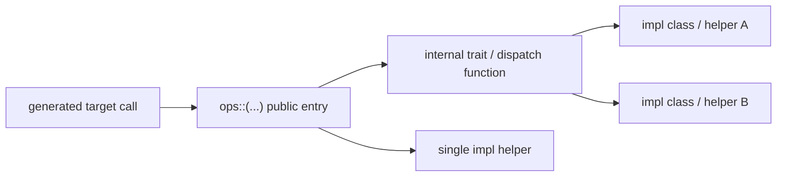

# TileFoundry Spec — Runtime

This spec owns the runtime contract outside the IR compile pipeline. It has
two surfaces:

- the Python-side `RuntimeModule` / launcher ABI used by `build(...)` and
  examples/tests
- the C++ runtime surface included by generated CUDA source

The C++ runtime is built on a vendored `cutlass/include/{cute,cutlass}`
snapshot.

## 1. Python Runtime Surface

### 1.1 `RuntimeModule`

`RuntimeModule` is the result object of `tilefoundry.build(mod)`,
`tilefoundry.compile(mod)`, and `tilefoundry.jit(fn_or_mod)`. It is directly
callable:

```python
# AOT (full compile pipeline)
rm = tilefoundry.compile(mod, target="cuda", options=...)
out = rm(a)

# JIT (thin convenience wrapper with cache)
rt = tilefoundry.jit(mod_or_fn, target="cuda", options=...)
out = rt(a)
```

| field / property | meaning |
|---|---|
| `source` | generated target source string, e.g. CUDA `.cu` text |
| `kernels` | kernel metadata keyed by generated kernel name |
| `entry` | name of the default entry function (`str`) |
| `launch_config` | launch metadata (grid/block dims) |
| `functions` | mapping of function name → `RuntimeFunction` callable |
| `entry_function` | `functions[entry]` — the default `RuntimeFunction` |
| `__call__(*args)` | delegates to `entry_function(*args)` |

### 1.1.1 `RuntimeFunction`

Each compiled function is wrapped as a `RuntimeFunction`:

```python
class RuntimeFunction:
    type: CallableType   # calling convention: params + input/output counts
    # __call__(*args):
    #   auto-alloc: len(args) == type.input_count → alloc outputs, return result(s)
    #   pre-alloc:  len(args) == len(type.params)  → use provided outs, return outs
```

`CallableType` carries `params`, `input_count`, `output_count` — set by
codegen from the lowered IR metadata.

### 1.1.2 Internal Pipeline

```
Module (IR) → codegen: per-target LinkableModule… → LinkedModule (.so + metadata)
LinkedModule → load → RuntimeModule (fully-loaded, public, callable)
```

`LinkedModule` is a codegen product
([codegen §4.3](./codegen.md#43-linkedmodule)); the loader that turns it into a
`RuntimeModule` is owned here. The loader and `LinkedModule` are not public API;
only `RuntimeModule` is.

Codegen owns producing the `LinkedModule` and its `source / kernels / entry /
launch_config` metadata; this spec owns their runtime meaning and the load-time
ABI constraints.

### 1.2 Calling Convention

`RuntimeFunction.__call__(*args)` enforces:

- **Auto-alloc**: `len(args) == type.input_count` — allocates output tensors
  from the first input's device/dtype, calls entry, returns result(s).
- **Pre-alloc**: `len(args) == len(type.params)` — uses provided output tensors,
  returns same output(s). All outputs must be provided; partial outputs raise
  `TypeError`.
- **Return**: single output → bare tensor; multiple outputs → `tuple` of tensors.

Auto-alloc is torch-only; non-torch inputs raise `TypeError`.
Output metadata (dtype, shape) comes from `CallableType.output_params` (set by
codegen from lowered IR, NOT guessed at runtime).

### 1.2 `jit()` API

`tilefoundry.jit(fn_or_mod, *, target="cuda", options=None)` is the JIT
entry point.  It accepts a `hir.Function` or `Module`, normalizes to a
`Module`, compiles with cache, and returns a callable `RuntimeModule`.

```python
from tilefoundry import jit

cta = Topology("cta", 128)
thread = Topology("thread", 8 * 32)

@func(topologies=(cta, thread))
def fn(x: Tensor[(32,128), "f32"]):
    with Mesh(topology="cta", layout=Layout(shape=(128,), strides=(1,))) as cta_mesh:
        ...

rt = jit(fn, target="cuda")
out = rt(a)  # callable
```

**Input contract**:
- Only TileFoundry IR objects (`Function` / `Module`) accepted.
- Raw Python functions raise `TypeError` — use `@func` first.
- Topology is declared on `Module` or single-function `@func(topologies=...)`.
- Mesh layout is expressed in the DSL with lexical `with Mesh(...) as mesh` scopes.
- `jit()` has no `cta_mesh` / `thread_mesh` parameters.

**Pipeline**: `jit()` reuses the existing `lower()` → `build()` pipeline
(`compile()`).  It auto-wraps bare `Function` inputs into a `Module` and
lifts `Function.topologies` into the module topology namespace.

**Cache**: in-process dict cache keyed by
`sha256(canonical_module_text + target_text + canonical_options_text)`.
`canonical_module_text` includes functions, module/function topology
declarations, and `with Mesh` scopes. No Python object identity and no
dedicated `cta_mesh` / `thread_mesh` key fields participate in the key.
`jit.cache_clear()` evicts; `jit.cache_info()` returns `{"size": N}`.

### 1.3 Launcher ABI

`tilefoundry.build(mod)` internally runs codegen and links the artifact (see
[codegen](./codegen.md)), then loads it and binds the entry; these are
implementation details. Users interact only with `RuntimeModule.__call__` /
`RuntimeFunction.__call__`.

Load contract:

- codegen produces the `LinkedModule` artifact
  ([codegen §4.3](./codegen.md#43-linkedmodule))
- loading uses `tvm_ffi.load_module(...)`
- entry binding uses the symbol named by `RuntimeModule.entry`
- callable arguments are DLPack-compatible tensors; `torch.Tensor` is one
  supported caller-side provider but is not the semantic contract itself

Generated host wrappers export entry symbols with TVM FFI:

```cpp
TVM_FFI_DLL_EXPORT_TYPED_FUNC(<entry_symbol>, <entry_function>);
```

The exported function accepts flattened input/output tensor arguments. HIR
functions may be written as `Function(params) -> tensor`, but by the runtime
boundary the TIR/codegen surface is explicit input/output parameters.

### 1.3 `launch_config`

`launch_config` is derived from the outer `MeshScope` topology information in
the lowered TIR/codegen input.

- CTA-level topology determines CUDA grid dimensions.
- thread-level topology determines CUDA block dimensions.
- absent topology levels use backend defaults only if the codegen spec says
  they are legal for that target.

`launch_config` is metadata, not a runtime scheduler. It records the launch
shape the generated kernel was compiled for.

## 2. C++ Runtime Surface

Generated CUDA source includes the umbrella runtime header:

```cpp
#include <tilefoundry/runtime.h>
```

`runtime.h` selects the target-specific runtime by a build-injected target
macro (exactly one of `TILEFOUNDRY_TARGET_CUDA` / `TILEFOUNDRY_TARGET_CPU`). The CUDA
runtime surface — topology, mesh, sharding, storage, and op declarations — lives
under `tilefoundry/runtime/cuda/runtime.cuh` (the CPU surface under
`tilefoundry/runtime/cpu/runtime.h`); the include tree is target-first
(`runtime/<target>/…`), no intermediate `target/` segment. Generated code MUST
include only the umbrella header and MUST NOT include target subheaders directly.

### 2.1 `TopologyScope`

```cpp
enum class TopologyScope { cta, thread, scope_count };
```

- `cta` maps to `blockIdx`
- `thread` maps to `threadIdx`
- `scope_count` is a sentinel

### 2.2 Topology Metadata

```cpp
template <TopologyScope T>
auto program_shape() noexcept;  // shape of topology level T

template <TopologyScope T>
auto program_dim() noexcept;    // size of topology level T

template <TopologyScope T>
auto program_id() noexcept;     // linearized runtime id of T
```

- `program_shape<T>()` returns the shape of topology level `T` (e.g.
  `program_shape<cta>()` → grid dims).
- `program_dim<T>()` returns the size of `T`.
- `program_id<T>()` returns a **linearized** scalar runtime id for `T`
  (`program_id<cta>()` → linearized block index; `program_id<thread>()` →
  linearized thread index).

For a static topology level, `program_shape<T>()` and `program_dim<T>()` are
compile-time constants. For a launch-provided (dynamic) CTA count, no constexpr
`program_shape<cta>` is emitted and `program_dim<cta>()` resolves to the
launch-provided grid extent at runtime; the emission rule is owned by
[codegen §6](./codegen.md#6-program-shape-and-dynamic-cta). `program_id<T>()` is
always a runtime query returning the current execution instance id.

### 2.3 `tilefoundry::Mesh`

```cpp
template <class MeshLayout, TopologyScope... Topos>
struct Mesh {
    MeshLayout mesh_layout;
    static constexpr auto topologies = cute::make_tuple(Topos...);
};
```

- `MeshLayout` is a CuTe-compatible layout type
- `Topos...` are compile-time `TopologyScope` values encoding the sparse topology list; only the topology levels this mesh actually uses are included
- `topologies` is a `static constexpr` tuple — type-level information, not runtime state

Axes-to-topology mapping: axes are partitioned into contiguous groups, matched from the **end** of `mesh_layout.shape` backwards, in **reverse** `topologies` tuple order. For each topology, greedily consume consecutive trailing axes until their product equals that topology's device count.

```cpp
auto local_index() const noexcept;
```

- for each topology in `topologies`, calls `program_id<T>()` to get the runtime id
- converts each runtime id to sub-coordinates via `idx2crd(id, sub_shape, sub_stride)`
- concatenates into a full mesh coordinate (CuTe coord / int-tuple)

Constraint:

- for each topology `T` in `topologies`, the product of its assigned axes'
  extents equals the device count of `T`

### 2.4 `tilefoundry::ShardLayout`

```cpp
template <class Layout, class Attrs, class Mesh>
struct ShardLayout {
    Layout layout;
    Attrs attrs;
    Mesh mesh;
};
```

- `layout` is the underlying CuTe layout
- `attrs` are shard attributes, ordered by mesh axis
- `mesh` is the bound device domain

### 2.5 `tilefoundry::shard` — Shard Attributes

```cpp
namespace tilefoundry::shard {
template <int Axis> struct S {};  // Split along axis
struct B {};                       // Broadcast (replicate)
template <class Reduction> struct P {};  // Partial reduction
struct Dynamic {};                 // Dynamic / data-dependent
}
```

Shorthand: `S<Axis>` = Split, `B` = Broadcast, `P<Reduction>` = Partial.

### 2.6 `tilefoundry::ShardTensor`

```cpp
template <class Engine_, class GlobalLayout_, class ShardLayout_>
struct ShardTensor {
  using engine_type = Engine_;
  using global_layout_type = GlobalLayout_;
  using shard_layout_type = ShardLayout_;
  Engine_ engine;             // CuTe tensor/view (gmem/smem/rmem); raw pointer rejected
  ShardLayout_ shard_layout;  // runtime shard-layout value (dynamic dims carry real extents)
  auto data();                // underlying pointer of the wrapped cute tensor
  auto data() const;
};
```

`engine` holds the **full cute tensor/view, not a raw pointer**. The
gmem / smem / rmem **residency category** lives on the cute engine *type*;
a raw `T*` loses it (cute mis-classifies a bare pointer as `rmem` even for
a gmem tensor), which would break residency-aware projection in `local()`
and residency dispatch in `copy()`. `make_shard_tensor` therefore rejects
raw pointers at compile time.

`data()` mirrors `cute::Tensor::data()` so a `ShardTensor` and a plain cute
tensor can be accessed uniformly. Because it returns a raw pointer, it
**drops the residency tag** and MUST only be used where residency no longer
matters (e.g. the per-thread MMA register fragment); residency-aware paths
use `local()` instead.

### 2.7 `tilefoundry::make_shard_tensor`

```cpp
template <class T, class GL, class SL>
auto make_shard_tensor(T const& tensor, GL global_layout, SL shard_layout)
  -> ShardTensor<T, GL, SL>;
```

Factory. `T` must be a CuTe tensor/view; raw pointers rejected at compile time.

### 2.8 `tilefoundry::copy` — Shard-aware Overloads

```cpp
// shard → plain
template <class T, class GL, class SL, class DT>
void copy(ShardTensor<T, GL, SL> const& src, DT& dst);

// plain → shard
template <class ST, class T, class GL, class SL>
void copy(ST const& src, ShardTensor<T, GL, SL>& dst);
```

Copies the full tensor between a shard tensor and a plain tensor.

### 2.10 `local()`

```cpp
template <class E, class GL, class SL>
auto local(ShardTensor<E, GL, SL> const& t) noexcept;
```

Returns the cute `Tensor` view this execution instance owns on `t`.

#### 2.10.1 Inputs

Let `t: ShardTensor`, `sl = t.shard_layout`, `S = sl.layout.strides`,
`A = sl.attrs`, and `coord = sl.mesh.local_index()`
([§2.3](#23-tilefoundrymesh)).

- `t.engine` is the per-instance cute tensor / view; `t.engine.data()`
  is the base ptr the current instance already holds.
- `sl.layout.shape` is the canonical cute shape
  ([shard §7.1.1](./shard.md#711-layoutshape)).
- `S` is storage-physical
  ([shard §7.1.2](./shard.md#712-layoutstrides)).

#### 2.10.2 Computation

    offset = Σ_{m : A[m] = Split(k)}  coord[m] · S[k]
    ptr    = t.engine.data() + offset
    shape' = shard_layout_local_shape(sl)
    return cute::make_tensor(ptr, Layout(shape', S))

- `A[m] ∈ {Broadcast, Partial}` contributes `0` to `offset`.
- `A[m] = Dynamic` MUST have been resolved before `local()`; otherwise
  the call is ill-formed.

#### 2.10.3 Single path across storages

For every `A[m] = Split(k)`, by shard §7.1.2:

    S[k] = 0  ⇒  contribution = 0
    S[k] > 0  ⇒  contribution = coord[m] · S[k]

The formula is therefore one path across gmem / smem / rmem; no
storage-specific branching is required.

### 2.9 Tensor And Storage

```cpp
cute::Tensor<Engine, Layout>
```

- `Engine` is the CuTe engine / iterator / pointer category
- `Layout` is a CuTe layout or `tilefoundry::ShardLayout`
- when `Layout` is `ShardLayout`, the tensor has distributed semantics

| storage | C++ |
|---------|-----|
| `"gmem"` | `T*` / `cute::gmem_ptr<T>` |
| `"smem"` | `cute::smem_ptr<T>` |
| `"rmem"` | register-resident engine |

## 3. Runtime Ops

Codegen targets one public namespace function per runtime op/family:

```text
tilefoundry::ops::<op>(...)
```



**Runtime-owned dispatch.** Where an op has more than one implementation tier
(selected by scope or by operand layout), the runtime exposes exactly **one**
public entry — never one op per tier. The active tier is derived at **compile
time** from the operand `ShardLayout`s, together with any codegen-static geometry
passed as template parameters, through a template trait, and is selected inside
the entry (`if constexpr`). Codegen emits one uniform call per op and never
selects a tier, computes a per-tier parameter, or carries the selection on the
TIR op. `ops::reduce` ([§3.5](#35-tilefoundryopsreduce-reduction-family))
derives its reduction level from the operand shard layouts and `ops::sync`
([§3.4](#34-tilefoundryopssync-mesh-scoped-barrier)) derives its participant
predicate from the barrier geometry; both are instances of this principle. The
codegen side is
[codegen §3.1](./codegen.md#31-runtime-owned-op-dispatch).

### 3.1 `cute::copy`

```cpp
template <class SrcTensor, class DstTensor>
void copy(SrcTensor const& src, DstTensor& dst);
```

Semantics:

- copies data from `src` to `dst`

Preconditions:

- `size(src) == size(dst)`
- source and destination dtypes are compatible

### 3.2 `cute::fill`

```cpp
template <class Tensor, class Value>
void fill(Tensor& tensor, Value val);
```

Semantics:

- fills `tensor` with scalar `val`

### 3.3 `tilefoundry::shard_partition`

```cpp
template <class Tensor>
auto shard_partition(Tensor const& tensor);
```

Semantics:

- extracts `mesh` from `tensor.layout()`
- calls `mesh.local_index()` to get the current device coordinate
- projects the tensor to the local view at that coordinate
- returns a `cute::Tensor` with plain CuTe layout

Preconditions:

- `tensor.layout()` is a `ShardLayout`

### 3.4 `tilefoundry::ops::sync` (mesh-scoped barrier)

```text
template <SyncKind Kind, int Base = 0, int Count = 0, unsigned Mask = 0u,
          int BarId = 0>
__device__ void sync(unsigned int* grid_bar = nullptr);
```

- kind: runtime func
- fields:
  - Kind: compile-time barrier kind; selects CTA, warp, named-barrier, or grid
    behavior inside the runtime entry
  - Base / Count / Mask / BarId: compile-time participant geometry
  - grid_bar: optional two-word global counter pair used only by grid barriers
- constraints:
  - Codegen emits only `sync`; it does not call lower-level barrier helpers.
  - Grid barriers require every CTA of the launch to be co-resident and to
    execute the barrier.
  - A grid barrier's counter pair is zero-initialized before first use and is
    owned by the generated module.

### 3.5 `tilefoundry::ops::reduce` (reduction family)

```text
template <class Op, class Axes, class Src, class Dst, class Ws = no_workspace>
__device__ void reduce(Src const& src, Dst& dst, Ws&& ws = {});
```

- kind: runtime func
- fields:
  - Op: compile-time combine tag (`sum`, `mean`, `max`, `absmax`)
  - Axes: compile-time reduced logical axes
  - src / dst: source and destination operands; sharded operands carry
    `ShardLayout`
  - ws: optional shared-memory workspace value; `no_workspace` means the reduce
    stays within one warp
- constraints:
  - `reduce` is the only public runtime reduce entry; tier names and helper
    functions are internal.
  - Sharded operands derive the active tier and warp grouping from `(src, dst)`
    shard layouts inside the runtime.
  - Plain operands derive extents from the operand rank and size inside the
    runtime.
  - A reduction whose reduced axis crosses CTA boundaries is not supported.

### 3.6 `tilefoundry::ops::copy_async` (async gmem→smem staging)

```text
template <class TSrc, class TDst>
__device__ void copy_async(TSrc const& src, TDst& dst);
```

- kind: runtime func
- fields:
  - src / dst: per-thread projected operands; the supported fast path stages
    global source data into shared destination storage
- constraints:
  - The call is non-blocking; generated code orders later reads through
    `cp_async_commit` and `cp_async_wait`.
  - Runtime implementation details such as vector width, tail handling, and
    architecture fallback live in code comments, not this spec entry.

### 3.7 Wide-load fast path in `copy()`

The shard-aware `copy()` selects a 128-bit vector-load fast path from the
operands alone, per the runtime-owned dispatch principle
([§3](#3-runtime-ops)): one `copy()` entry, no codegen-visible selection. It is
taken only when all of the following hold, and otherwise the copy falls back to
the scalar element loop with identical results:

- the source is gmem-resident (`cute::is_gmem` on the `ShardTensor` engine);
- the destination local view is a static, rank-1, contiguous fragment whose
  contiguous run is at least 128 bits wide —
  `cute::max_common_vector(dst, dst) × cute::sizeof_bits<value_type> ≥ 128`,
  where `value_type` is the cute view element type, not the `ShardTensor` engine
  type;
- at runtime the source base address is 16-byte aligned and the fragment is
  contiguous (the gmem local view is dynamic-int, so contiguity is checked with
  address arithmetic — pure ALU, no memory access).

When taken, each 128-bit run is loaded as a vector into registers and scattered
into the destination; the remaining sub-128-bit tail uses the element loop. A
non-gmem source, a sub-128-bit run, an unaligned base, or a strided source all
fall back to the scalar loop.
