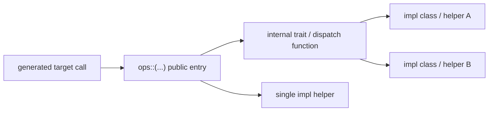

# TileFoundry Spec — Runtime

This spec owns the runtime contract outside the IR compile pipeline. It has
two surfaces:

- the Python-side `RuntimeModule` / launcher ABI used by `build(...)` and
  examples/tests
- the C++ runtime surface included by generated CUDA source

The C++ runtime is built on a vendored `cutlass/include/{cute,cutlass}`
snapshot.

## 1. Python Runtime Surface

### 1.1 `RuntimeModule`

An ir `Module` (the semantic definition — @func bodies the evaluator runs) and
a `RuntimeModule` (the runtime instance — kernel bodies) are twins: same
`name`, same child tree, same `entry`. `@runtime_module` / `@runtime_func`
(`tilefoundry.runtime.decorator`, below) build one twin mechanically from the
other, validated one-to-one at decoration time; the correspondence is
additionally held by a numerical gate (below) — a `RuntimeModule` never runs
the HIR evaluator.

```python
class RuntimeModule:
    name: str                                    # mirrors the ir Module node name
    entry: str | None                            # mirrors the ir Module entry (metadata)
    modules: tuple["RuntimeModule", ...]         # children, registered explicitly in __init__
    def __init__(self, name, entry=None, modules=()): ...
    def forward(self, *args): ...                # subclass-written orchestration — forward IS the step
    def __call__(self, *args): ...               # delegates to forward
    def load(self, resource): ...                # weight resolution, recursive over children
```

- constraints:
  - the base class is authored like a `torch.nn.Module`: subclass it, build
    the child tree in `__init__` (children registered via `modules=`), write
    the composition in `forward`. Function bodies are `RuntimeFunction`
    attributes called from `forward`. `@runtime_module` (below) generates
    this subclass mechanically from a semantic `Module` and is the normal
    authoring path; a direct subclass remains available for special cases
    (e.g. `CompiledModule`, §1.1.3).
  - `load(resource)` (base class): recurses into each child with
    `resource.subtree(child.name)`; the base class itself resolves nothing.
    Weight prefixes follow module paths, matching ir attribute addressing.
    Lifecycle: construct (structure) → `load` (materialize) → call. A
    `RuntimeModule` does **not** run `prepare`; it loads straight from the
    directory the semantic side prepared (§1.1.2).
  - correspondence contract: the twin `RuntimeModule` and the semantic
    `Module` both have a `forward`, and on the same inputs the two must agree
    — `measure.check` comparing them (§1.6), default gate cosine >= 0.999, is
    that contract.
  - the base class itself holds no weights or resource, and never runs the
    HIR evaluator.
  - two origins: compiled — `tilefoundry.build` / `compile` / `jit` →
    `LinkedModule` → the loader binds a `CompiledModule` (a `RuntimeModule`,
    not a `RuntimeFunction`) (§1.1.3); handwritten — a `@runtime_module`
    class (below), loading from a prepared checkpoint directory via a
    `RuntimeResource` (§1.5).

#### `@runtime_module` / `@runtime_func`

`@runtime_module(sem)` is a class decorator taking the semantic `Module`
instance; it returns a `RuntimeModule` subclass whose instances are *sem*'s
runtime twin — same function names, same child tree, same entry.
`@runtime_func` tags a plain method as a kernel body: same call signature as
the semantic `@func` of the same name, weight params included.

```python
# example
@runtime_module(attention_sem)
class Attention:
    @runtime_func                                    # weight params included, in the
    def mla_kv_update(self, hidden, gamma_kv, w_kv,  # semantic @func's own order
                      cos_pos, sin_pos, kv_cache0, cur_pos, s):
        ...  # a real kernel body, e.g. a torch / triton / CUDA implementation

    moe = SomeMoeRuntimeClass  # a @runtime_module class, not an instance
```

- constraints:
  - decoration-time validation is **strictly one-to-one**: the
    `@runtime_func` name set (a tagged method, or a `RuntimeFunction`
    instance class attribute — a heavy kernel that owns its own compilation
    state, standing in for a `@runtime_func`) MUST equal `sem`'s function
    name set, and the child-attribute name set MUST equal `sem`'s child
    module name set; missing *or* extra either MUST be rejected.
  - a child attribute is a `RuntimeModule` **subclass**, not an instance
    (typically another `@runtime_module` result); the generated `__init__`
    builds one instance per `sem.modules` entry via `child_cls(ir=<that
    child's ir Module>)`, so a child class MUST accept the `ir=` constructor
    keyword (every `@runtime_module` result already does).
  - weights are filled by name at call time from what `load` bound, so a
    kernel method's caller passes only activations — the same call shape the
    semantic side's attribute-access callable answers with
    ([core-ir §1.1](./core-ir.md#11-function-access)).
  - orchestration methods (`forward` / `init_caches` / …) are reused from the
    semantic `Module.methods` verbatim and are never rewritten on the
    runtime side: inside them, `self.<fn>` / `self.<child>` resolve to the
    runtime twin's own kernels / children, which is what lets one method
    body serve both sides. Absent an own `forward`, the generated class runs
    `sem.methods["forward"]` if present, else calls the entry function by
    name — the runtime mirror of `Module.forward` (§1.1.2).

### 1.1.1 `RuntimeFunction`

`RuntimeFunction` is the **base class** for a node's function body; a body
subclasses it and overrides `__call__`. A handwritten torch / triton / CUDA
implementation takes whatever it needs (converted weights, caches) at
construction and returns its value(s) directly. `RuntimeFunction.type` is the
ABI contract below: an `EntryABI` built of `ParamABI` records.

```python
class ParamABI:
    name: str                       # parameter name
    type: TensorType                # dtype / shape / storage / layout all come from here

class EntryABI:
    name: str                       # entry / function name
    params: tuple[ParamABI, ...]    # ALL parameters (inputs + outputs), declaration order
    output_count: int = 0           # trailing count of output parameters

class RuntimeFunction:
    type: EntryABI                  # the ABI (entry_abi_of(ir_func))
    def __init__(self, type): ...
    def __call__(self, *acts): ...  # subclass overrides — launch, positional activations
```

- constraints:
  - the base `__call__` raises; every usable body is a subclass. Agents may
    write any subclass whose `__call__` runs (torch / triton / CUDA / …).
  - `ParamABI` reuses the IR type system instead of restating it: dtype /
    shape / storage / layout all come from `type` (a `TensorType`); a dynamic
    dim is whatever `type.shape` carries (e.g. a `DimVar`) — there is no
    separate dynamic-dim sentinel.
  - `EntryABI.params` lists ALL parameters (inputs + outputs) in declaration
    order; `output_count` is the trailing count of output parameters.
    `input_count` is `len(params) - output_count`; `input_params` /
    `output_params` are the corresponding leading / trailing slices of
    `params`.
  - `param_abi_of(var)` is the single `ParamABI`-derivation site, shared by
    codegen's host-entry ABI derivation (`codegen/cuda/emit.py`) and
    `entry_abi_of` below.
  - `entry_abi_of(fn)` derives an `EntryABI` for a HIR `Function`: one
    `ParamABI` per declared parameter, `output_count=0` (a value-returning
    implementation, not an out-param entry). The compiled-entry `EntryABI`
    (`output_count` possibly nonzero) is set by codegen from lowered IR
    instead ([codegen §4.3](./codegen.md#43-linkedmodule)).

### 1.1.2 Weight converter and `prepare` / `forward`

A weight's converter is registered **per weight**, not per module:
`@<compute_fn>.converter("<weight_name>")` decorates a throwaway `def` and
registers it on the base function's `converters`
([parser §2.7](./parser.md#27-module-authoring-surface)). Its parameters are
the raw-checkpoint names, annotated like any `@func` parameter; it returns
exactly the one declared `ConstTensor`'s shape / dtype. A weight needing no
transform has no converter. Two converters registered for the same weight
name is an error.

`load`, `forward`, and `prepare` are **methods on the ir `Module`** — the same
authoring surface as its `RuntimeModule` twin, which also has a `forward`:

```python
class Module:      # tilefoundry.ir.core.module
    def load(self, resource: RuntimeResource) -> None: ...
    def forward(self, *acts): ...                                              # __call__ = forward
    def prepare(self, raw: RuntimeResource, out_dir: str, *, device="cpu") -> None: ...
```

- constraints:
  - `Module.prepare` (semantic side, offline, once): walk the tree; for each
    declared weight, fetch its converter's parameters from `raw` by their
    own (raw) names — a one-to-many alias is assembled here via
    `torch.stack` (`prepare`'s only reshaping) — run the converter through
    the evaluator, then strictly validate the result's shape and dtype
    against the weight's declared `ConstTensor` type. A weight with no
    converter is validated the same way against its raw (or stacked) value,
    unchanged. Output: one safetensors shard plus
    `model.safetensors.index.json`, keyed by clean, dot-joined module paths
    (e.g. `layer0.attention.w_kv`). Plain directory — no content-hash cache /
    manifest. The runtime twin never prepares; both twins `load` straight
    from the directory this writes.
  - `Module.load(resource)`: bind this node's `weights`
    ([core-ir §1](./core-ir.md#1-module)) by name from `resource`, then
    recurse into each child under `resource.subtree(child.name)` — the
    semantic-side counterpart of the `RuntimeModule` twin's own `load`
    (§1.1).
  - state is the caller's: a tensor that must survive across steps (e.g. a KV
    cache) is an ordinary `Tensor` param passed in and returned, and a step MUST
    NOT mutate one it was given. Sharding such a tensor is therefore the same
    mechanism as for any other — its own `TensorType.layout` — rather than a
    second description for an opaque state object.
  - `Module.forward(*acts)` (`__call__` is `forward`): run a registered
    `forward` orchestration method (`Module.methods`) if the class body
    defined one, else the entry `@func` — with `ConstTensor` params filled
    by name from what `load` already bound and every other param
    positional. Reaching one function directly (rather than the whole step)
    is `mod.<function_name>(*acts)`
    ([core-ir §1.1](./core-ir.md#11-function-access)). `check` compares the
    semantic and runtime forwards (§1.6). A multi-node composition is
    chained by the caller, one `forward` (or one named function call) per
    node.

### 1.1.3 Internal Pipeline (compiled origin)

```
Module (IR) → codegen: per-target LinkableModule… → LinkedModule (.so + metadata)
LinkedModule → load → CompiledModule (fully-loaded, public, callable RuntimeModule)
```

`LinkedModule` is a codegen product
([codegen §4.3](./codegen.md#43-linkedmodule)); the loader that turns it into a
`CompiledModule` is owned here. The loader and `LinkedModule` are not public
API; only `CompiledModule` (a `RuntimeModule`) is. `load_linked_module` returns
`CompiledModule(type=linked.entry, fn=entry_callable)`; `name` / `entry` are
both `linked.entry.name`. Its `forward` implements the out-param calling
convention directly (§1.2) — there is no separate function-body object it
delegates to. The compiled path has no `resource` / `weights` / `states`
(weights are ordinary entry arguments), so its `load` is the inherited no-op.

### 1.2 Calling Convention (`CompiledModule`)

`CompiledModule.forward(*args)` uses the out-param ABI (`type.output_count`
trailing params are outputs):

- **Auto-alloc**: `len(args) == type.input_count` — allocates output tensors
  from the first input's device/dtype, calls the entry, returns result(s).
- **Pre-alloc**: `len(args) == len(type.params)` — uses provided output tensors,
  returns same output(s). All outputs must be provided; partial → `TypeError`.
- **Return**: single output → bare tensor; multiple outputs → `tuple`.

Auto-alloc is torch-only; non-torch inputs raise `TypeError`. Output metadata
(dtype, shape) comes from `EntryABI.output_params` — each `ParamABI.type`
carries them (set by codegen from lowered IR, NOT guessed at runtime). This
convention is specific to `CompiledModule`; other `RuntimeModule.forward`
implementations are not bound by it.

### 1.3 `jit()` API

```python
def jit(fn_or_mod: Function | Module, *, target: str = "cuda", options: CompilerOptions | None = None) -> RuntimeModule:
    """Compile *fn_or_mod* and return the callable runtime module.

    Args:
        fn_or_mod: a hir.Function or Module (normalized to a Module).
        target: the back-end target.
        options: optional CompilerOptions.

    Returns:
        The callable RuntimeModule.
    """
```

- constraints:
  - accepts only TileFoundry IR (`Function` / `Module`); raw Python functions
    raise `TypeError`; the full input contract is stated below.

`tilefoundry.jit(fn_or_mod, *, target="cuda", options=None)` is the JIT
entry point.  It accepts a `hir.Function` or `Module`, normalizes to a
`Module`, compiles with cache, and returns a callable `RuntimeModule`.

**Input contract**:
- Only TileFoundry IR objects (`Function` / `Module`) accepted.
- Raw Python functions raise `TypeError` — use `@func` first.
- Topology is declared on `Module` or single-function `@func(topologies=...)`.
- Mesh layout is expressed in the DSL with lexical `with Mesh(...) as mesh` scopes.
- `jit()` has no `cta_mesh` / `thread_mesh` parameters.

**Pipeline**: `jit()` reuses the existing `lower()` → `build()` pipeline
(`compile()`).  It auto-wraps bare `Function` inputs into a `Module` and
lifts `Function.topologies` into the module topology namespace.

**Cache**: in-process dict cache keyed by
`sha256(canonical_module_text + target_text + canonical_options_text)`.
`canonical_module_text` includes functions, module/function topology
declarations, and `with Mesh` scopes. No Python object identity and no
dedicated `cta_mesh` / `thread_mesh` key fields participate in the key.
`jit.cache_clear()` evicts; `jit.cache_info()` returns `{"size": N}`.

### 1.4 Launcher ABI

`tilefoundry.build(mod)` internally runs codegen and links the artifact (see
[codegen](./codegen.md)), then loads it and binds the entry; these are
implementation details. Users interact only with `RuntimeModule.__call__` /
`RuntimeFunction.__call__`.

Load contract:

- codegen produces the `LinkedModule` artifact
  ([codegen §4.3](./codegen.md#43-linkedmodule))
- loading uses `tvm_ffi.load_module(...)`
- entry binding uses the symbol named by `RuntimeModule.entry`
- callable arguments are DLPack-compatible tensors; `torch.Tensor` is one
  supported caller-side provider but is not the semantic contract itself

Generated host wrappers export entry symbols with TVM FFI:

```cpp
TVM_FFI_DLL_EXPORT_TYPED_FUNC(<entry_symbol>, <entry_function>);
```

The exported function accepts flattened input/output tensor arguments. HIR
functions may be written as `Function(params) -> tensor`, but by the runtime
boundary the TIR/codegen surface is explicit input/output parameters.

Launch geometry (grid / block extents) is derived internally by
`codegen/cuda/emit.py::_derive_launch_config` and embedded into the generated
host entry (or supplied by an authored `launch(...)`); it is never carried as
metadata past codegen.

### 1.5 `RuntimeResource`

Checkpoint aliasing is a base capability of every resource, not a wrapper
class: both implementations below take an `alias={canonical: raw}` table,
resolved by the same lookup order.

```python
class RuntimeResource(Protocol):
    def load(self, name: str) -> torch.Tensor: ...
    def load_group(self, name: str) -> "tuple[torch.Tensor, ...] | None": ...
    def subtree(self, seg: str) -> "RuntimeResource": ...
```

- constraints:
  - `load(name)` returns the tensor for *name*; raises `KeyError` if absent,
    and MUST raise `TypeError` (naming `load_group`) if *name* resolves to a
    tuple-valued (one-to-many) alias.
  - `load_group(name)` returns the tuple of raw tensors for a one-to-many
    alias entry (e.g. per-expert weight shards, in declared order), or
    `None` when *name* has no tuple-valued alias — the ordinary, one-to-one
    case.
  - `subtree(seg)` returns a view scoped under one more path *segment*
    (`seg` is itself alias-resolved), so a child `RuntimeModule` addresses
    its own weights by their bare (unprefixed) name — `RuntimeModule.__init__`
    never sees a dotted name.
  - the resource only looks names up and returns tensors; it never stacks,
    casts, or reshapes — assembling a one-to-many group into one tensor is
    `prepare`'s job (§1.1.2), via `torch.stack`.

An `alias` entry renames one path *segment* or *leaf* **within the current
scope**, joined onto the caller's already-accumulated prefix: lookup order is
a path-qualified key (`f"{prefix}{name}"`) first, then a bare `name` entry,
then identity (`f"{prefix}{name}"` unchanged). A bare entry therefore serves
every instance at that level uniformly (e.g. `{"gamma_kv": "kv_norm.weight"}`
fires under every layer); a per-instance name (one real decoder layer, one
per-expert shard group) needs one literal entry per instance instead. A
tuple value is the one-to-many group `load_group` reads; `subtree`'s own
segment resolution rejects a tuple-valued hit (a subtree segment MUST
resolve to one name).

Two implementations:

```python
class DictResource:
    def __init__(
        self, data: Mapping[str, torch.Tensor], prefix: str = "",
        alias: "Mapping[str, str | tuple[str, ...]] | None" = None,
    ) -> None: ...

class SafetensorsResource:
    def __init__(
        self, ckpt_dir: str, prefix: str = "", device: str = "cuda",
        alias: "Mapping[str, str | tuple[str, ...]] | None" = None,
    ) -> None: ...
```

- constraints:
  - `DictResource` — in-memory / test double over a flat, dot-prefixed
    `{"layer0.w": tensor, ...}` mapping; `subtree` only extends the prefix
    each `load` / `load_group` name is joined onto, carrying `alias` down to
    every child view.
  - `SafetensorsResource` — reads a repacked safetensors checkpoint
    directory (N shard files + `model.safetensors.index.json`'s
    `weight_map`); `load` / `load_group` open at most one shard handle per
    shard file (mmap'd via `safetensors.safe_open`, shared across `subtree`
    views) and read only the requested tensor(s), placed on *device*.

### 1.6 `check` / `bench`

```python
class Gate:                                     # pass/fail thresholds for check()
    rel_l2_max: float = 1e-3
    cosine_min: float = 0.999

class Report:                                   # result of check() / bench()
    metrics: Mapping[str, float]
    passed: bool | None = None                  # None for bench() — no gate

def check(candidate: Callable, reference: Callable, inputs: tuple, gate: Gate = Gate()) -> Report: ...
def bench(fn: Callable, inputs: tuple, iters: int = 100, *, device: Device) -> Report: ...
```

- constraints:
  - `check` runs `candidate(*inputs)` and `reference(*inputs)`, computes
    `rel_l2` / cosine similarity between the two results, and sets
    `passed = rel_l2 <= gate.rel_l2_max and cosine >= gate.cosine_min`.
    `metrics = {"rel_l2": ..., "cosine": ...}`.
  - a result MAY be a bare tensor or an arbitrarily nested tuple of tensors
    (e.g. `forward`'s `(logits, past_key_values)`). `check` flattens both
    results, MUST reject a candidate whose flattened structure, shape or dtype
    differs from the reference's, and gates on the **worst** per-leaf
    `rel_l2` / cosine — so one bad element of a tuple cannot be averaged away.
  - `bench` times `fn(*inputs)` over `iters` calls after a few untimed
    warmup calls. A `device` whose class lives under `tilefoundry.target.cuda`
    times with `torch.cuda.Event`s (synchronized before/after); any other
    `device` times with `time.perf_counter()`. `metrics = {"mean_ms": ...,
    "iters": ...}`; `passed` is always `None`.
  - neither helper is specific to `RuntimeModule`: *candidate* / *reference*
    / *fn* may be a `RuntimeModule` bound method, a raw torch callable, or
    an evaluator closure — anything callable on *inputs*.

## 2. C++ Runtime Surface

Generated CUDA source includes the umbrella runtime header:

```cpp
#include <tilefoundry/runtime.h>
```

`runtime.h` selects the target-specific runtime by a build-injected target
macro (exactly one of `TILEFOUNDRY_TARGET_CUDA` / `TILEFOUNDRY_TARGET_CPU`). The CUDA
runtime surface — topology, mesh, sharding, storage, and op declarations — lives
under `tilefoundry/runtime/cuda/runtime.cuh` (the CPU surface under
`tilefoundry/runtime/cpu/runtime.h`); the include tree is target-first
(`runtime/<target>/…`), no intermediate `target/` segment. Generated code MUST
include only the umbrella header and MUST NOT include target subheaders directly.

### 2.1 `TopologyScope`

```cpp
/**
 * @brief A fixed enumeration of program topology levels.
 */
enum class TopologyScope {
  cta,          ///< maps to blockIdx
  thread,       ///< maps to threadIdx
  scope_count,  ///< a sentinel
};
```

- constraints: none — a fixed enumeration of program topology levels

### 2.2 Topology Metadata

```cpp
/**
 * @brief Shape of topology level T (e.g. program_shape<cta>() → grid dims).
 * @tparam T the topology level
 */
template <TopologyScope T> auto program_shape() noexcept;

/**
 * @brief Size of topology level T.
 * @tparam T the topology level
 */
template <TopologyScope T> auto program_dim() noexcept;

/**
 * @brief Linearized scalar runtime id of T (current execution instance).
 * @tparam T the topology level
 */
template <TopologyScope T> auto program_id() noexcept;
```

- constraints:
  - static vs dynamic (launch-provided CTA) behavior and the emission rule are
    stated below ([target §7](./target.md#7-program-shape-and-dynamic-cta)).

For a static topology level, `program_shape<T>()` and `program_dim<T>()` are
compile-time constants. For a launch-provided (dynamic) CTA count, no constexpr
`program_shape<cta>` is emitted and `program_dim<cta>()` resolves to the
launch-provided grid extent at runtime; the emission rule is owned by
[target §7](./target.md#7-program-shape-and-dynamic-cta). `program_id<T>()` is
always a runtime query returning the current execution instance id.

### 2.3 `tilefoundry::Mesh`

```cpp
/**
 * @brief A device mesh: a CuTe layout whose axes map to program topology levels.
 */
template <class MeshLayout, TopologyScope... Topos>
struct Mesh {
  MeshLayout mesh_layout;                                        ///< a CuTe-compatible layout type
  static constexpr auto topologies = cute::make_tuple(Topos...); ///< sparse TopologyScope list this mesh uses (type-level, not runtime state)
  auto local_index() const noexcept;                             ///< full mesh coordinate for this execution instance
};
```

- constraints:
  - Axes-to-topology mapping: axes are partitioned into contiguous groups, matched
    from the **end** of `mesh_layout.shape` backwards, in **reverse** `topologies`
    tuple order. For each topology, greedily consume consecutive trailing axes
    until their product equals that topology's device count.
  - `local_index()` — for each topology in `topologies`, calls `program_id<T>()`
    to get the runtime id, converts each runtime id to sub-coordinates via
    `idx2crd(id, sub_shape, sub_stride)`, and concatenates into a full mesh
    coordinate (CuTe coord / int-tuple).
  - for each topology `T` in `topologies`, the product of its assigned axes'
    extents equals the device count of `T`

### 2.4 `tilefoundry::ShardLayout`

```cpp
/**
 * @brief A plain layout / attrs / mesh aggregate.
 */
template <class Layout, class Attrs, class Mesh>
struct ShardLayout {
  Layout layout;   ///< the underlying CuTe layout
  Attrs attrs;     ///< shard attributes, ordered by mesh axis
  Mesh mesh;       ///< the bound device domain
};
```

- constraints: none — a plain layout / attrs / mesh aggregate

### 2.5 `tilefoundry::shard` — Shard Attributes

```cpp
namespace tilefoundry::shard {
  template <int Axis> struct S {};         // Split along axis
  struct B {};                             // Broadcast (replicate)
  template <class Reduction> struct P {};  // Partial reduction
  struct Dynamic {};                       // Dynamic / data-dependent
}
```

- constraints: none — compile-time shard-attribute tags

Shorthand: `S<Axis>` = Split, `B` = Broadcast, `P<Reduction>` = Partial.

### 2.6 `tilefoundry::ShardTensor`

```cpp
/**
 * @brief A CuTe tensor/view paired with its runtime shard layout.
 */
template <class Engine_, class GlobalLayout_, class ShardLayout_>
struct ShardTensor {
  using engine_type = Engine_;
  using global_layout_type = GlobalLayout_;
  using shard_layout_type = ShardLayout_;
  Engine_ engine;             ///< CuTe tensor/view (gmem/smem/rmem); raw pointer rejected
  ShardLayout_ shard_layout;  ///< runtime shard-layout value (dynamic dims carry real extents)
  auto data();                ///< underlying pointer of the wrapped cute tensor
  auto data() const;
};
```

- constraints:
  - `engine` must be a full cute tensor/view, never a raw pointer (residency
    lives on the engine type); `data()` drops the residency tag. The full
    residency / raw-pointer rules are stated below.

`engine` holds the **full cute tensor/view, not a raw pointer**. The
gmem / smem / rmem **residency category** lives on the cute engine *type*;
a raw `T*` loses it (cute mis-classifies a bare pointer as `rmem` even for
a gmem tensor), which would break residency-aware projection in `local()`
and residency dispatch in `copy()`. `make_shard_tensor` therefore rejects
raw pointers at compile time.

`data()` mirrors `cute::Tensor::data()` so a `ShardTensor` and a plain cute
tensor can be accessed uniformly. Because it returns a raw pointer, it
**drops the residency tag** and MUST only be used where residency no longer
matters (e.g. the per-thread MMA register fragment); residency-aware paths
use `local()` instead.

### 2.7 `tilefoundry::make_shard_tensor`

```cpp
/**
 * @brief Factory: bind a global layout and a shard layout onto a CuTe tensor.
 * @param tensor a CuTe tensor / view (raw pointers rejected at compile time)
 * @param global_layout the global layout to bind
 * @param shard_layout the shard layout to bind
 */
template <class T, class GL, class SL>
auto make_shard_tensor(T const& tensor, GL global_layout, SL shard_layout)
  -> ShardTensor<T, GL, SL>;
```

- constraints:
  - Factory. `T` must be a CuTe tensor/view; raw pointers rejected at compile time.

### 2.8 `tilefoundry::copy` — Shard-aware Overloads

```cpp
/**
 * @brief Copy the full tensor, shard → plain.
 * @param src the shard-tensor source
 * @param dst the plain destination tensor
 */
template <class T, class GL, class SL, class DT>
void copy(ShardTensor<T, GL, SL> const& src, DT& dst);

/**
 * @brief Copy the full tensor, plain → shard.
 * @param src the plain source tensor
 * @param dst the shard-tensor destination
 */
template <class ST, class T, class GL, class SL>
void copy(ST const& src, ShardTensor<T, GL, SL>& dst);
```

- constraints:
  - Copies the full tensor between a shard tensor and a plain tensor.

### 2.10 `local()`

```cpp
/**
 * @brief Project t to this execution instance's local view.
 * @param t the shard tensor to project
 */
template <class E, class GL, class SL>
auto local(ShardTensor<E, GL, SL> const& t) noexcept;
```

- constraints:
  - Returns the cute `Tensor` view this execution instance owns on `t`.

#### 2.10.1 Inputs

Let `t: ShardTensor`, `sl = t.shard_layout`, `S = sl.layout.strides`,
`A = sl.attrs`, and `coord = sl.mesh.local_index()`
([§2.3](#23-tilefoundrymesh)).

- `t.engine` is the per-instance cute tensor / view; `t.engine.data()`
  is the base ptr the current instance already holds.
- `sl.layout.shape` is the canonical layout shape
  ([shard §7.1.1](./shard.md#711-layoutshape)).
- `S` is storage-physical
  ([shard §7.1.2](./shard.md#712-layoutstrides)).

#### 2.10.2 Computation

    offset = Σ_{m : A[m] = Split(k)}  coord[m] · S[k]
    ptr    = t.engine.data() + offset
    shape' = shard_layout_local_shape(sl)
    return cute::make_tensor(ptr, Layout(shape', S))

- `A[m] ∈ {Broadcast, Partial}` contributes `0` to `offset`.
- `A[m] = Dynamic` MUST have been resolved before `local()`; otherwise
  the call is ill-formed.

#### 2.10.3 Single path across storages

For every `A[m] = Split(k)`, by shard §7.1.2:

    S[k] = 0  ⇒  contribution = 0
    S[k] > 0  ⇒  contribution = coord[m] · S[k]

The formula is therefore one path across gmem / smem / rmem; no
storage-specific branching is required.

### 2.9 Tensor And Storage

```cpp
/**
 * @brief A CuTe tensor: an engine plus a layout.
 * @tparam Engine the CuTe engine / iterator / pointer category
 * @tparam Layout a CuTe layout or tilefoundry::ShardLayout
 */
template <class Engine, class Layout>
class cute::Tensor;
```

- constraints:
  - when `Layout` is `ShardLayout`, the tensor has distributed semantics

| storage | C++ |
|---------|-----|
| `"gmem"` | `T*` / `cute::gmem_ptr<T>` |
| `"smem"` | `cute::smem_ptr<T>` |
| `"rmem"` | register-resident engine |

## 3. Runtime Ops

Codegen targets one public namespace function per runtime op/family:

```cpp
tilefoundry::ops::<op>(...)   // one public namespace function per runtime op / family
```


```mermaid
flowchart LR
    Codegen["generated target call"] --> Entry["ops::<op>(...) public entry"]
    Entry --> Dispatch["internal trait / dispatch function"]
    Dispatch --> ImplA["impl class / helper A"]
    Dispatch --> ImplB["impl class / helper B"]
    Entry --> SimpleImpl["single impl helper"]
```

**Runtime-owned dispatch.** Where an op has more than one implementation tier
(selected by scope or by operand layout), the runtime exposes exactly **one**
public entry — never one op per tier. The active tier is derived at **compile
time** from the operand `ShardLayout`s, together with any codegen-static geometry
passed as template parameters, through a template trait, and is selected inside
the entry (`if constexpr`). Codegen emits one uniform call per op and never
selects a tier, computes a per-tier parameter, or carries the selection on the
TIR op. `ops::reduce` ([§3.5](#35-tilefoundryopsreduce-reduction-family))
derives its reduction level from the operand shard layouts and `ops::sync`
([§3.4](#34-tilefoundryopssync-mesh-scoped-barrier)) derives its participant
predicate from the barrier geometry; both are instances of this principle. A
target runtime implementation MAY select an internal optimized load/store path
(such as a wider vector copy) behind this single entry without changing the
public entry or its observable result. The
codegen side is
[codegen §3](./codegen.md#3-runtime-owned-op-dispatch).

Elementwise ops (`cast`, `copy_n`, `clamp`, `unary` — including `relu`, which
has no dedicated `ops::relu` entry) route through the shared
`unary_impl::Unary<Op>` skeleton parameterised by a functor tag (e.g.
`relu_op`, `identity_op`, `clamp_op`); codegen always calls the family's one
public entry with the tag as an argument.

**Annotation convention.** `ops::*` public entries, their internal impl
functors, and op tags MUST be annotated `__device__` (their bodies are
device-only). `CUTE_HOST_DEVICE` MUST be reserved for tensor-view / layout
helpers genuinely capable of host compilation (e.g. `local()`,
`make_shard_tensor`, `tilefoundry::copy`).

### 3.1 `cute::copy`

```cpp
/**
 * @brief Copy data from src to dst.
 * @param src the source tensor
 * @param dst the destination tensor
 */
template <class SrcTensor, class DstTensor>
void copy(SrcTensor const& src, DstTensor& dst);
```

- constraints:
  - copies data from `src` to `dst`
  - `size(src) == size(dst)`
  - source and destination dtypes are compatible

### 3.2 `cute::fill`

```cpp
/**
 * @brief Fill tensor with scalar val.
 * @param tensor the destination tensor
 * @param val the scalar fill value
 */
template <class Tensor, class Value>
void fill(Tensor& tensor, Value val);
```

- constraints:
  - fills `tensor` with scalar `val`

### 3.3 `tilefoundry::shard_partition`

```cpp
/**
 * @brief Project tensor to the current device coordinate's local view.
 * @param tensor a tensor whose layout() is a ShardLayout
 */
template <class Tensor>
auto shard_partition(Tensor const& tensor);
```

- constraints:
  - extracts `mesh` from `tensor.layout()`
  - calls `mesh.local_index()` to get the current device coordinate
  - projects the tensor to the local view at that coordinate
  - returns a `cute::Tensor` with plain CuTe layout
  - `tensor.layout()` is a `ShardLayout`

### 3.4 `tilefoundry::ops::sync` (mesh-scoped barrier)

```cpp
/**
 * @brief Mesh-scoped barrier.
 * @tparam Kind compile-time barrier kind; selects CTA, warp, named-barrier, or grid behavior
 * @tparam Base compile-time participant geometry
 * @tparam Count compile-time participant geometry
 * @tparam Mask compile-time participant geometry
 * @tparam BarId compile-time named-barrier id
 * @param grid_bar optional two-word global counter pair used only by grid barriers
 */
template <SyncKind Kind, int Base = 0, int Count = 0, unsigned Mask = 0u, int BarId = 0>
__device__ void sync(unsigned int* grid_bar = nullptr);
```

- constraints:
  - Codegen emits only `sync`; it does not call lower-level barrier helpers.
  - Grid barriers require every CTA of the launch to be co-resident and to
    execute the barrier.
  - A grid barrier's counter pair is zero-initialized before first use and is
    owned by the generated module.

### 3.5 `tilefoundry::ops::reduce` (reduction family)

```cpp
/**
 * @brief Reduce src into dst along Axes.
 * @tparam Op compile-time combine tag (sum, mean, max, absmax)
 * @tparam Axes compile-time reduced logical axes
 * @param src source operand; sharded operands carry ShardLayout
 * @param dst destination operand; sharded operands carry ShardLayout
 * @param ws optional shared-memory workspace; no_workspace keeps the reduce within one warp
 */
template <class Op, class Axes, class Src, class Dst, class Ws = no_workspace>
__device__ void reduce(Src const& src, Dst& dst, Ws&& ws = {});
```

- constraints:
  - `reduce` is the only public runtime reduce entry; tier names and helper
    functions are internal.
  - Sharded operands derive the active tier and warp grouping from `(src, dst)`
    shard layouts inside the runtime.
  - Plain operands derive extents from the operand rank and size inside the
    runtime.
  - A reduction whose reduced axis crosses CTA boundaries is not supported.

### 3.6 `tilefoundry::ops::copy_async` (async gmem→smem staging)

```cpp
/**
 * @brief Async staging copy; fast path stages a gmem source into an smem destination.
 * @param src per-thread projected source operand
 * @param dst per-thread projected destination operand
 */
template <class TSrc, class TDst>
__device__ void copy_async(TSrc const& src, TDst& dst);
```

- constraints:
  - The call is non-blocking; generated code orders later reads through
    `cp_async_commit` and `cp_async_wait`.
  - Runtime implementation details such as vector width, tail handling, and
    architecture fallback live in code comments, not this spec entry.
