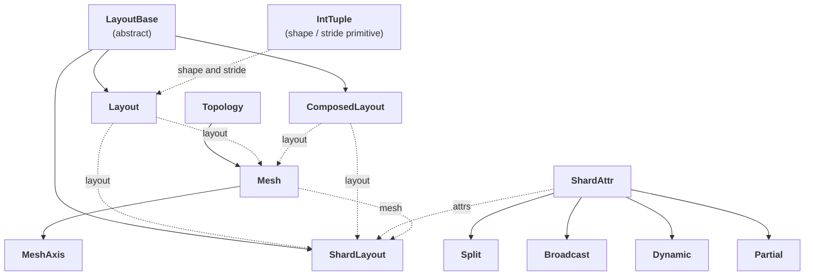

# TileFoundry Spec — Shard / Layout System



`TensorType.layout` ([types §2](./types.md#2-tensortype)) carries
any `LayoutBase`. Pure-layout invariants and shard-binding
invariants live with the construct they constrain. Enforcement is
dispatched by [visitor-registry](./visitor-registry.md); concrete
checks live in [tir §1.3](./tir.md#13-primfunction) (TIR side) and
[hir §1.3](./hir.md#13-op) (HIR side).

---

## 1. `IntTuple`

The primitive building block, following the standard `shape` / `stride`
convention. It is not just a flat tuple — nested tuples are allowed:

```python
IntTuple = int | tuple[IntTuple, ...]    # entry: an `int`, a symbolic/dynamic dim (`ShapeDim`), `None` (launch-provided extent), or a nested `IntTuple`
```

- constraints:
  - admits both a unique flat `int`-tuple view and a unique nested-structure view;
    the `shape` / `strides` of `Layout` and `ShardLayout` are `IntTuple`.

Flatten-equivalence: every `IntTuple` admits both a unique flat
`int`-tuple view and a unique nested-structure view. The `shape` and
`strides` of `Layout` and `ShardLayout` are `IntTuple`.

A `shape` / `stride` entry is not restricted to a static `int`: it may be a
symbolic / dynamic dim (a `DimVar` or dim `Expr` — a `ShapeDim`), or `None`
for a launch-provided (dynamic-CTA) extent (`Layout(shape=(None,),
strides=(1,))`). Consumers that need a concrete integer — `Mesh.__getitem__`
and `T.sync` participation (tir.md §1.5) — require static `int` entries and
**fail closed** on a symbolic / dynamic one rather than guessing.

---

## 2. `Layout` hierarchy

`TensorType.layout` is not a free-form slot; it accepts only objects in
the `Layout` hierarchy:

```python
class LayoutBase: ...                    # abstract base
class Layout(LayoutBase): ...            # concrete `LayoutBase` member
class ComposedLayout(LayoutBase): ...    # concrete `LayoutBase` member
class ShardLayout(LayoutBase): ...       # concrete `LayoutBase` member
```

- constraints:
  - `TensorType.layout` accepts only objects in this hierarchy; the common contract
    below applies to every legal layout object.

Common contract — every legal layout object MUST satisfy:

- a stable domain shape (`domain(layout)`),
- a coord-to-physical mapping (`layout(coord) → physical index / offset`),
- a stable domain-axis numbering (`range(rank(layout))`),
- **injective mapping** — overlapping / aliasing layouts are not
  permitted; distinct domain coords MUST NOT map to the same physical
  element. Extending to non-injective cases (padding / broadcast
  layouts) requires a separate RFC.

An object that does not satisfy these conditions cannot enter
`TensorType.layout`.

---

## 3. `Layout` (pure, primitive)

The Layout primitive mirrors pycute/CuTe's shape-stride algebra:

```python
class Layout(LayoutBase):
    shape: IntTuple                 # layout-domain shape (entries `ShapeDim | None`)
    stride: IntTuple | None = None  # step rule from domain to physical index; whole tuple `None` = un-materialized
```

- constraints:
  - the pure primitive layout; it has no `offset` field. Field meanings and
    semantics below.

Field meanings:

- `shape` — the layout-domain shape (flat or nested). When a `Layout`
  sits inside `ShardLayout.layout`, this describes the **global,
  unsharded** layout shape — i.e., the shape *before* mesh
  dividing. The per-thread local layout shape is derived from
  `layout.shape` ÷ mesh extents per `Split` (see §7).
- `stride` — the step rule from layout domain to physical index. When
  not explicitly given, it defaults to `prefix_product(shape)` (a
  row-major prefix-product convention). When a `Layout` sits inside `ShardLayout.layout`,
  `stride[k]` is the **storage-physical** step on the engine attached
  to that `ShardTensor` (see §7).

Semantics:

```python
idx = crd2idx(coord, shape, stride)
```

The primitive `Layout` has **no** `offset` field. `offset` belongs to
`ComposedLayout` and MUST NOT leak down into the primitive.

---

## 4. `ComposedLayout`

The composition `make_composed_layout(inner, offset, outer)`:

```python
class ComposedLayout(LayoutBase):
    inner: LayoutBase   # applied last (output-side layout)
    offset: int         # intermediate scalar offset (a property of the composition)
    outer: LayoutBase   # applied first (input / domain-side layout)
```

- constraints:
  - `idx = inner(offset + outer(coord))`; inherits domain shape and axis numbering
    from `outer`.

Field meanings:

- `outer` — applied **first** (the input / domain-side layout)
- `offset` — the intermediate scalar offset (a property of the
  composition object, not of the primitive `Layout`)
- `inner` — applied **last** (the output-side layout)

Minimum semantics:

```python
idx = inner(offset + outer(coord))
```

A `ComposedLayout` inherits its domain shape and axis numbering from
`outer`. Therefore, when an outer `ShardLayout` binds a
`ComposedLayout`, a `Split(k)` attr still references the stable domain
axis exposed by `outer`.

---

## 5. `Mesh`

```python
class Topology:                            # device-domain description
    name: str
    num_devices: int

class Mesh:                                # the parallel device domain
    topology: Topology
    layout: Layout | ComposedLayout        # a plain `Layout` (un-sliced) or a `ComposedLayout` (a constant `m[...]` slice)
    names: tuple[str, ...] | None = None

class MeshAxis:                            # single-axis object via `mesh.x` / `mesh.axes[i]`
    mesh: Mesh
    index: int
    size: int
```

- constraints:
  - a compile-time constant that does not enter the IR graph; describes the device
    domain, not a tensor layout object. A slice never becomes an IR/SSA value.

Field meanings:

- `topology` — device-domain description (`name` + `num_devices`)
- `layout` — the mesh's own shape / strides (a `Layout`); a constant slice
  (`m[...]`) replaces it with a `ComposedLayout` recording the sub-box
  (tir.md §1.5)
- `names` — optional human-readable names (`cta.x`, `cta.y`, …)
- `MeshAxis` — single-axis object retrieved via `mesh.x` / `mesh.y` /
  `mesh.axes[i]`, used by parser static evaluation
  ([hir](./hir.md) §4)

`Mesh` describes the parallel device domain; it is not a tensor layout
object.

---

## 6. `ShardAttr`

```python
class Split:                          # binds the current mesh axis to the layout's `axis`-th layout domain axis
    axis: int

class Broadcast: ...                  # the value is replicated across this mesh axis

class Dynamic: ...                    # the distribution policy is not yet resolved

class Partial:                        # an un-reduced partial value (`sum` / `max` / `min`)
    reduction: str = "sum"
```

- constraints:
  - each entry of `ShardLayout.attrs` describes one mesh axis by its tuple
    position; per-attr semantics and surface sugar below.

Each entry of `ShardLayout.attrs` describes one **mesh axis** (by its
position in the tuple); the attr says what that mesh axis does. `Split`
binds a mesh axis to a layout axis (placement); `Broadcast` and `Partial`
are **value states** on a mesh axis and carry no layout axis.

Field meanings:

- `Split(axis)` — the current mesh axis is bound to the underlying
  layout's `axis`-th layout domain axis (i.e., `layout.shape[axis]`).
  `axis` MUST satisfy `0 <= axis < rank(flatten(domain(layout)))`.
  Across a single `ShardLayout.attrs`, an underlying-layout axis MAY
  be bound by at most one mesh axis: two `Split` attrs sharing the
  same `axis` are illegal. Since `layout.shape` is the **global
  unsharded shape** (§7), the binding constraint is
  `mesh.shape[mesh_axis_position] | layout.shape[axis]`
  (mesh extent must divide the global layout extent). The per-thread
  local extent on this layout dim is then
  `layout.shape[axis] // mesh.shape[mesh_axis_position]`.
- `Broadcast` — the current mesh axis does not participate in
  splitting; the value is replicated across this mesh axis.
- `Dynamic` — the distribution policy of the current mesh axis is not
  yet resolved. `Dynamic` MAY appear during analysis / intermediate
  inference but MUST be resolved to `Split` or `Broadcast` before
  final lowering.
- `Partial(reduction)` — the current mesh axis carries an **un-reduced
  partial value**: the full result over this mesh axis is the
  `reduction` (`sum` / `max` / `min`) of the per-shard values, and a
  subsequent allreduce over this mesh axis is required to obtain it.
  A `Partial` carries no layout axis — it is a value state on the mesh
  axis given by its position in `attrs`. How a `Partial` propagates,
  resolves, and must not be silently lost is part of relation-driven
  propagation (§9).

Surface syntax sugar:

- `S(i)` ≡ `Split(axis=i)`
- `P()` / `P("sum")` ≡ `Partial(reduction="sum")`
- omitted mesh axes are `Broadcast`

---

## 7. `ShardLayout`

`ShardLayout` is the distributed binding layer; it does not introduce
a new layout-algebra primitive, it binds an underlying layout's domain
axes to mesh axes.

```python
class ShardLayout(LayoutBase):
    layout: LayoutBase                                        # the underlying `Layout` / `ComposedLayout` being bound
    attrs: tuple[Split | Broadcast | Dynamic | Partial, ...]  # per-mesh-axis attributes, ordered by mesh axis
    mesh: Mesh                                                # the device-domain `Mesh`
```

- constraints:
  - the distributed binding layer; binds an underlying layout's domain axes to mesh
    axes without a new layout-algebra primitive. Sub-field contracts in §7.1–§7.5.

The distribution-changing transformation (redistribute / sharding) is
itself an IR op (`hir.sharding.Reshard`, see [hir](./hir.md) §2.5).

### 7.1 `layout`

The underlying `Layout` / `ComposedLayout`. `Layout` /
`ComposedLayout` (§3, §4) own the layout algebra; `ShardLayout` does
not redefine it.

When a `Layout` sits inside `ShardLayout.layout`, its `shape` and
`stride` carry **additional, narrower semantics** beyond the plain
§3 meaning — they describe the *distributed* form of the tensor, not a
free-standing primitive layout. These narrower meanings are defined in
§7.1.1 and §7.1.2 and refine (not replace) the §3 contract.

#### 7.1.1 `layout.shape`

Let `sl: ShardLayout`, `T: TensorType`, and `G = sl.layout.shape`.

- `G` is the canonical / unsharded layout-domain shape; it MUST NOT
  encode per-instance extents.
- `rank(G)` MAY differ from `rank(T.shape)`.
- `size(G) == size(T.shape)` MUST hold.
- For any `Split(k)` in `sl.attrs`, `0 <= k < rank(G)` MUST hold.
  `Partial` / `Broadcast` carry no layout axis.
- `Split(k)` indexes into `G`; it MUST NOT refer to `T.shape` axes or
  mesh axes.
- For every mesh axis `a` with `sl.attrs[a] = Split(k)`,
  `G[k] == sl.mesh.shape[a]` MUST hold. Equivalently, `local_shape(sl)[k] == 1`
  on every `Split`-bound layout dim. Surface sugar `N @ m.a` with
  `N > mesh_extent(a)` is canonicalized at parse time into a
  factorised form (`(mesh_extent(a) @ m.a, N // mesh_extent(a))`); the
  factorised residual axis enters the IR as a non-`Split` layout dim. See
  [parser §1.5](./parser.md#15-layout-sugar).
- `local_shape(sl)[k] = G[k] / sl.mesh.shape[a] = 1` iff some mesh axis
  `a` has `sl.attrs[a] = Split(k)`.
- `local_shape(sl)[k] = G[k]` otherwise.
- The canonical regroup rule (§8) defines how `T.shape` aligns with
  `G`.

#### 7.1.2 `layout.strides`

Let `sl: ShardLayout`, `S = sl.layout.strides`, and let `engine(i)`
denote the `ShardTensor.engine` seen by instance index `i` along the
relevant mesh axis.

- `S` MAY be `None`. `S is None` ⇒ "un-materialized": the layout
  strides have not yet been fixed; the layout's `shape` /
  partition is determined but the per-axis stride form is deferred
  to `Reshard` typeinfer
  ([hir.md §1.3](./hir.md#13-op)). Surface
  sugar `(N @ m.a, ...)` always emits `S is None`; verbose
  `((shape), (strides))` always emits a concrete `S`. After
  `Reshard` typeinfer has run on a value, `S` reachable from that
  value MUST be a concrete tuple (the un-materialized form is an
  intermediate-only signal).
- `S == ()` is a concrete rank-0 layout (`shape == ()`), not the
  `None` sentinel; the empty tuple is never overloaded to mean
  un-materialized.
- When `S` is a concrete tuple, `S[k]` is the element step along
  layout dim `k` on the physical storage held by
  `ShardTensor.engine`; it MUST NOT be an abstract global stride.
- For every mesh axis `a` with `sl.attrs[a] = Split(k)`,
  `S[k] ∈ {0} ∪ ℤ_{>0}` MUST hold.
- `S[k] == 0` ⇒ mesh axis `a` contributes `0` to intra-engine offset
  on dim `k`. Typical: allocator gives each instance a distinct
  `engine(i)`.
- `S[k] > 0` ⇒ mesh axis `a` contributes `i · S[k]` elements to
  intra-engine offset on dim `k`. Typical: `engine(i)` shares one
  base ptr across instances.
- For layout dims `k` with no `Split` binding, `S[k]` follows §3
  semantics, evaluated on the engine's physical storage.
- Layouts requiring more than one stride per `Split` axis (cyclic /
  interleaved) MUST be rejected by `ShardLayout` construction.

### 7.2 `attrs`

Per-mesh-axis attributes (`Split | Broadcast | Dynamic | Partial`),
ordered by mesh axis. `len(attrs)` MUST equal `rank(mesh)`.

A `Split(k)` substitutes the current `mesh_coord` into layout dim `k` of
`layout`, producing the local projection on the current device. See
§6 for individual `ShardAttr` semantics.

### 7.3 `mesh`

The device-domain `Mesh` ([§5](#5-mesh)).

### 7.4 Reshard preserves logical shape

`Reshard` is the IR op that swaps a tensor's `layout` / `storage` and
**preserves `TensorType.shape`**. A `(1, 1536)` logical tensor MAY
reshard to a `ShardLayout` with `layout.shape=(1, 8, 192)`; the output
`TensorType.shape` is still `(1, 1536)`. Logical-shape rewrites
(transpose / flatten / true reshape) go through `hir.tensor.Reshape`,
not `Reshard`.

### 7.5 Example

Logical tensor `(2, 1536)` reshards via surface sugar
`(2 @ m.x, 12 @ m.y, 128 @ m.t)` with `mesh=(x=2, y=4, t=32)`. Parser
canonicalization (§7.1.1, parser §1.5) expands `12 @ m.y` into
`(4 @ m.y, 3)` and `128 @ m.t` into `(32 @ m.t, 4)` and emits
`Layout(shape=(2, 4, 3, 32, 4), strides=None)` — un-materialized
because the user wrote sugar (§7.1.2, §7.6). Reshard typeinfer then
materializes `strides` via the direction rule (§7.6); the resulting
form depends on the `(src.storage, dst.storage)` pair.

For `reshard(a:gmem, ..., storage='rmem')` (high → low, per-instance
default):

```
layout = Layout(shape=(2, 4, 3, 32, 4), strides=(0, 0, 4, 0, 1))
attrs  = (Split(0), Split(1), Broadcast, Split(3), Broadcast)
mesh   = Mesh(layout=Layout(shape=(2, 4, 32), ...))
```

`shard_layout_local_shape(sl)` yields `(1, 1, 3, 1, 4)`. Each `Split`
axis has `local_shape = 1` by construction, so §2.10's offset sum
reduces to `0` and every mesh instance receives its own engine
holding `3 × 4 = 12` elements laid out in C-order.

For `reshard(a:rmem, ..., storage='gmem')` (low → high, shared
default), the same sugar materializes to C-order strides over the
canonical global shape — `strides = (1536, 384, 128, 4, 1)` — so the
8 warps write to disjoint offsets of a single underlying gmem
buffer.

A reshard whose user-provided layout strides are non-default (e.g. an
SM80 mma fragment) bypasses this materialization step: the layout
already has a concrete `strides` tuple, so the `Reshard` typeinfer
rule ([hir.md §1.3](./hir.md#13-op)) preserves
it verbatim.

---

## 8. Layout propagation

`ShardLayout` here is the data model that the analysis services read and
produce. Logical-shape-to-layout-domain interpretation and relation-driven
shard propagation are owned by [analysis §3](./analysis.md#3-shard-propagation):
logical shape → layout domain in
[analysis §3.1](./analysis.md#31-logical-shape-to-layout-domain), and
relation-driven propagation in
[analysis §3.2](./analysis.md#32-relation-driven-shard-propagation).
