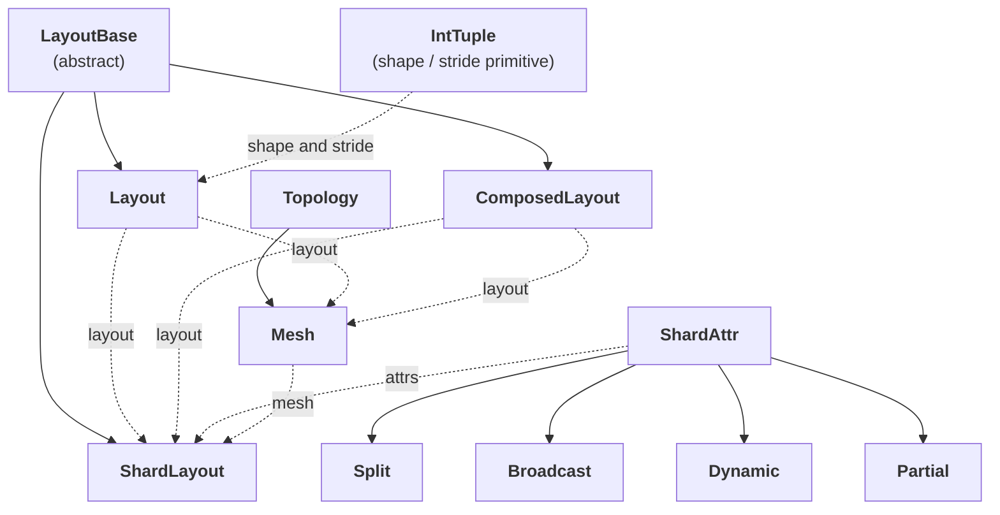

# TileFoundry Spec — Shard / Layout System


```mermaid
flowchart TB
    LayoutBase["<b>LayoutBase</b><br/>(abstract)"]
    Layout["<b>Layout</b>"]
    ComposedLayout["<b>ComposedLayout</b>"]
    ShardLayout["<b>ShardLayout</b>"]

    IntTuple["<b>IntTuple</b><br/>(shape / stride primitive)"]

    Topology["<b>Topology</b>"]
    Mesh["<b>Mesh</b>"]

    ShardAttr["<b>ShardAttr</b>"]
    Split["<b>Split</b>"]
    Broadcast["<b>Broadcast</b>"]
    Dynamic["<b>Dynamic</b>"]
    Partial["<b>Partial</b>"]

    LayoutBase --> Layout
    LayoutBase --> ComposedLayout
    LayoutBase --> ShardLayout

    IntTuple -. shape and stride .-> Layout

    Topology --> Mesh
    Layout -. layout .-> Mesh
    ComposedLayout -. layout .-> Mesh

    ShardAttr --> Split
    ShardAttr --> Broadcast
    ShardAttr --> Dynamic
    ShardAttr --> Partial

    Layout -. layout .-> ShardLayout
    ComposedLayout -. layout .-> ShardLayout
    ShardAttr -. attrs .-> ShardLayout
    Mesh -. mesh .-> ShardLayout
```

`TensorType.layout` ([types §2](./types.md#2-tensortype)) carries
any `LayoutBase`. Pure-layout invariants and shard-binding
invariants live with the construct they constrain. Enforcement is
dispatched by [visitor-registry](./visitor-registry.md); concrete
checks live in [tir §1.3](./tir.md#13-primfunction) (TIR side) and
[hir §1.3](./hir.md#13-op) (HIR side).

---

## 1. `IntTuple`

The primitive building block, taken from pycute's `shape` / `stride`
convention. It is not just a flat tuple — nested tuples are allowed:

```python
IntTuple = ShapeDim | tuple[IntTuple, ...]    # entry: a static or symbolic extent, or a nested `IntTuple`
```

- constraints:
  - admits both a unique flat `int`-tuple view and a unique nested-structure view;
    the `shape` / `strides` of `Layout` and `ShardLayout` are `IntTuple`.

A `shape` / `stride` entry is not restricted to a static `int`: it may be a
symbolic / dynamic dim (a `DimVar` or dim `Expr` — a `ShapeDim`). `None` is not
a shape extent; only the complete `Layout.strides` field may be `None` while
strides are not materialized. Consumers that need a concrete integer —
`Mesh.__getitem__` and `T.sync` participation ([tir §1.5](./tir.md#15-sync)) —
require static `int` entries and **fail closed** on a symbolic / dynamic one
rather than guessing.

Dimension substitution traverses a tensor's logical shape and layout together.
For a `ShardLayout` it also traverses the bound `Mesh`: the Mesh layout and each
`Topology.size` are geometry of the same program and MUST receive the same
binding. A consumer that needs fixed geometry MUST reject any residual `DimVar`
or dimension expression before asking `size` or `product` for a position count.

---

## 2. `Layout` hierarchy

`TensorType.layout` is not a free-form slot; it accepts only objects in
the `Layout` hierarchy:

```python
class LayoutBase:
    """Provide the abstract base for legal tensor layouts."""


class Layout(LayoutBase):
    """Provide a primitive coordinate-to-offset layout."""


class ComposedLayout(LayoutBase):
    """Provide a composition of two layout mappings."""


class ShardLayout(LayoutBase):
    """Bind a layout domain to a device mesh."""
```

- constraints:
  - `TensorType.layout` accepts only objects in this hierarchy; the common contract
    below applies to every legal layout object.

Common contract — every legal layout object MUST satisfy:

- a stable domain shape exposed as `shape`,
- a coord-to-physical mapping (`layout(coord) → physical index / offset`),
- a stable domain-axis numbering exposed as `domain_rank`, where
  `domain_rank == rank(flatten(shape))`,
- **injective mapping** — overlapping / aliasing layouts are not
  permitted; distinct domain coords MUST NOT map to the same physical
  element. Extending to non-injective cases (padding / broadcast
  layouts) requires a separate RFC.

An object that does not satisfy these conditions cannot enter
`TensorType.layout`.

---

## 3. `Layout` (pure, primitive)

Mirrors `pycute.layout.Layout`:

```python
class Layout(LayoutBase):
    """Describe a primitive coordinate-to-offset mapping.

    Attributes:
        shape: attribute; Layout-domain shape.
        strides: attribute; Per-domain-axis step rule, or None when unmaterialized.
    """

    shape: IntTuple
    strides: IntTuple | None = None
```

- constraints:
  - the pure primitive layout; it has no `offset` field. Field meanings and
    semantics below.

Field meanings:

- `shape` — the layout-domain shape (flat or nested). When a `Layout`
  sits inside `ShardLayout.layout`, this describes the **global,
  unsharded** layout shape — i.e., the shape *before* mesh
  dividing. The per-thread local layout shape is derived from
  `layout.shape` ÷ mesh extents per `Split` (see [§7](#7-shardlayout)).
- `strides` — the step rule from layout domain to physical index. When
  not explicitly given, it defaults to `prefix_product(shape)` in the
  pycute style. When a `Layout` sits inside `ShardLayout.layout`,
  `strides[k]` is the **storage-physical** step on the engine attached
  to that `ShardTensor` (see [§7](#7-shardlayout)).

Semantics:

```python
idx = crd2idx(coord, shape, strides)
```

The primitive `Layout` has **no** `offset` field. `offset` belongs to
`ComposedLayout` and MUST NOT leak down into the primitive.

---

## 4. `ComposedLayout`

Mirrors CuTeDSL `make_composed_layout(inner, offset, outer)`:

```python
class ComposedLayout(LayoutBase):
    """Describe a composition of two layout mappings.

    Attributes:
        inner: attribute; Output-side layout applied last, or identity.
        offset: attribute; Intermediate scalar offset.
        outer: attribute; Domain-side layout applied first, or identity.
    """

    inner: LayoutBase | None
    offset: int
    outer: LayoutBase | None
```

- constraints:
  - `idx = apply(inner, offset + apply(outer, coord))`, where
    `apply(None, value) == value`.
  - `shape` and `domain_rank` come from `outer` when it is present, otherwise
    from `inner`; a composition with no explicit domain has `shape == ()`.
  - either non-`None` component MAY be any `LayoutBase`, including a
    `ShardLayout` that preserves an earlier distribution.

Field meanings:

- `outer` — applied **first** (the input / domain-side layout); `None`
  applies the identity mapping
- `offset` — the intermediate scalar offset (a property of the
  composition object, not of the primitive `Layout`)
- `inner` — applied **last** (the output-side layout); `None` applies
  the identity mapping

A `ComposedLayout` normally inherits its domain shape and axis numbering
from `outer`. When `outer=None`, the identity mapping contributes no explicit
domain, so the composition inherits them from `inner`. Therefore, when an
outer `ShardLayout` binds a `ComposedLayout`, a `Split(k)` attr still
references the composition's stable `shape` / `domain_rank` contract.

---

## 5. `Mesh`

```python
class Topology:
    """Describe one parallel-resource level.

    Attributes:
        name: attribute; Stable topology-level name.
        size: attribute; Explicit static or symbolic extent.
    """

    name: str
    size: ShapeDim

class Mesh:
    """Record a parallel device domain and its logical positions.

    Attributes:
        topologies: attribute; Ordered topology sequence.
        layout: attribute; Mesh layout or constant sliced layout.
        names: attribute; Human-readable layout-axis names.
    """

    topologies: tuple[Topology, ...]
    layout: Layout | ComposedLayout
    names: tuple[str, ...] = ()

    def __getitem__(self, key) -> Mesh: ...
```

- constraints:
  - a compile-time constant that does not enter the IR graph; describes the device
    domain, not a tensor layout object. A slice never becomes an IR/SSA value.

Field meanings:

- `topologies` — the ordered device-domain descriptions (`name` + `size`)
- `layout` — the mesh's own shape / strides (a `Layout`); a constant slice
  (`m[...]`) replaces it with a `ComposedLayout` recording the sub-box
  ([tir §1.5](./tir.md#15-sync))
- `names` — optional human-readable names (`cta.x`, `cta.y`, …)

`Mesh` describes the parallel device domain; it is not a tensor layout
object.

`Mesh` MAY carry more than one `Topology` (e.g. `warp(4) x thread(32)`); the
full sequence is always `topologies`.

- constraints:
  - `Topology` construction rejects a `None` size. `Mesh` construction rejects
    a `None` entry in its layout shape. Beyond that explicit-extent check,
    `Mesh` is a frozen record: it performs no construction-time normalization
    or position-consistency check. Its `topologies` field is a
    `tuple[Topology, ...]`; helpers such as `make_mesh` construct that tuple for
    handwritten Python.
  - The author surface is `with Mesh(("cta",), layout=(128,)) as cta:`. The
    parser resolves the non-empty tuple of declared topology names to the
    `Topology` tuple before it constructs the record. A bare string and the
    `topology=` keyword are not Mesh author forms.
  - `states_consistent_positions(mesh)` is true when the product of topology
    sizes equals `size(mesh.layout)`. Mesh-scope verification asserts this
    predicate; Mesh construction and slicing do not, so a derived slice
    remains a record of its parent scope.
  - A Mesh naming several levels segments its layout axes between them, left to
    right in the order it names them: a level takes axes until their extents
    multiply to exactly its own `Topology.size`. An axis that straddles a
    boundary MUST be refused rather than divided, because a level boundary
    cannot assign the positions of an axis it runs through. Every axis MUST
    belong to one level.
  - The layout of the positions one level has is the axes up to and including
    that level's segment, with their strides divided by the product of the sizes
    of the levels below it; a stride that division does not divide exactly MUST
    be refused. A Mesh naming one level states its own layout and is not
    projected. A Mesh naming several MUST NOT also be sliced.
  - Nested single-level Mesh scopes compose to exactly that shape: the axes join
    outermost first and each outer stride is scaled by the positions below it.
    A value distributed at two levels at once may therefore be written either
    way, and both state one placement.
  - A reader that asks for a position count by topology name reads
    `size(mesh.layout)`. It accepts a Mesh with one topology only; a
    multi-topology Mesh is rejected rather than projecting its layout onto a
    guessed level.
  - A reader that asks for an exact participant set at a selected topology level
    MUST take that level's projected layout as above, and MUST refuse a Mesh
    that names no such level. For a plain `Layout`, the set is
    `{apply(layout, c) | 0 <= c < size(layout)}`. For a sliced `ComposedLayout`,
    it is `{image(layout, c) | 0 <= c < size(layout.outer)}`.
  - That image MUST be static, positive, inverse-projectable, duplicate-free,
    and contained in `[0, selected_topology.size)`. A plain Mesh MUST cover the
    complete selected domain. A strict subdomain MUST use a sliced Mesh so its
    offset is retained rather than collapsed to an extent.
  - `Mesh` exposes neither a primary `topology` nor `topology_domain()`, and
    it has no attribute-style axis API. In layout sugar, `m.axis` is parser
    syntax resolved to the pair `(mesh, layout_axis_index)`, not a Mesh
    attribute.

---

## 6. `ShardAttr`

```python
class ShardAttr:
    """Provide the base for per-mesh-axis sharding attributes."""


class Split(ShardAttr):
    """Bind a mesh axis to a layout-domain axis.

    Attributes:
        axis: attribute; Layout-domain axis index.
    """

    axis: int

class Broadcast(ShardAttr):
    """Mark the value replicated across this mesh axis."""

class Dynamic(ShardAttr):
    """Mark the distribution policy unresolved on this mesh axis."""

class Partial(ShardAttr):
    """Mark an unreduced partial value.

    Attributes:
        reduction: attribute; Reduction required to obtain the full value.
    """

    reduction: str = "sum"


def S(axis: int) -> Split:
    """Build a split attribute.

    Args:
        axis: Layout-domain axis index.

    Returns:
        The split attribute.
    """
    ...


def P(reduction: str = "sum") -> Partial:
    """Build a partial attribute.

    Args:
        reduction: Required reduction.

    Returns:
        The partial attribute.
    """
    ...


def B() -> Broadcast:
    """Build a broadcast attribute.

    Returns:
        The broadcast attribute.
    """
    ...
```

- constraints:
  - each entry of `ShardLayout.attrs` describes one mesh axis by its tuple
    position; per-attr semantics and surface sugar below.

Each entry of `ShardLayout.attrs` describes one **mesh axis** (by its
position in the tuple); the attr says what that mesh axis does. `Split`
binds a mesh axis to a layout axis (placement); `Broadcast` and `Partial`
are **value states** on a mesh axis and carry no layout axis.

Field meanings:

- `Split(axis)` — the current mesh axis is bound to the underlying
  layout's `axis`-th layout domain axis (i.e., `layout.shape[axis]`).
  `axis` MUST satisfy `0 <= axis < rank(flatten(domain(layout)))`.
  Multiple mesh axes MAY bind the same layout axis. Each static mesh extent
  must divide the remaining extent in mesh-axis order, and the local extent is
  `layout.shape[axis] // product(mesh extents bound to axis)`. The canonical
  constructor normally factorizes such bindings into distinct layout
  positions, but `shard_layout_local_shape` also accepts and composes the
  unfactorized form.
- `Broadcast` — the current mesh axis does not participate in
  splitting; the value is replicated across this mesh axis.
- `Dynamic` — the distribution policy of the current mesh axis is not
  yet resolved. `Dynamic` MAY appear during analysis / intermediate
  inference but MUST be resolved to `Split` or `Broadcast` before
  final lowering.
- `Partial(reduction)` — the current mesh axis carries an **un-reduced
  partial value**: the full result over this mesh axis is the
  `reduction` (`sum` / `max` / `min`) of the per-shard values, and a
  subsequent allreduce over this mesh axis is required to obtain it.
  A `Partial` carries no layout axis — it is a value state on the mesh
  axis given by its position in `attrs`. How a `Partial` propagates,
  resolves, and must not be silently lost is part of relation-driven
  propagation
([semantic-analysis §3.2](./semantic-analysis.md#32-relation-driven-shard-propagation)).

Surface syntax sugar:

- `S(i)` ≡ `Split(axis=i)`
- `P()` / `P("sum")` ≡ `Partial(reduction="sum")`
- `B()` ≡ `Broadcast()`
- omitted mesh axes are `Broadcast`

---

## 7. `ShardLayout`

`ShardLayout` is the distributed binding layer; it does not introduce
a new layout-algebra primitive, it binds an underlying layout's domain
axes to mesh axes.

```python
class ShardLayout(LayoutBase):
    """Bind a layout domain to a device mesh.

    Attributes:
        layout: attribute; Underlying layout-family member.
        attrs: attribute; Shard attributes in mesh-axis order.
        mesh: attribute; Device-domain mesh.
    """

    layout: LayoutBase
    attrs: tuple[ShardAttr, ...]
    mesh: Mesh
```

- constraints:
  - the distributed binding layer; binds an underlying layout's domain axes to mesh
    axes without a new layout-algebra primitive. Sub-field contracts in [§7.1](#71-layout)–[§7.5](#75-example).

The distribution-changing transformation (redistribute / sharding) is
itself an IR op (`hir.sharding.Reshard`, see [hir §1.3](./hir.md#13-op)).

### 7.1 `layout`

The underlying `LayoutBase`. `Layout` / `ComposedLayout` ([§3](#3-layout-pure-primitive), [§4](#4-composedlayout)) own
the layout algebra; `ShardLayout` binds their stable `shape` and
`domain_rank` to a mesh without redefining that algebra. Nested stage
layouts remain represented through the `LayoutBase` hierarchy.

When a `Layout` sits inside `ShardLayout.layout`, its `shape` and
`stride` carry **additional, narrower semantics** beyond the plain
[§3](#3-layout-pure-primitive) meaning — they describe the *distributed* form of the tensor, not a
free-standing primitive layout. These narrower meanings are defined in
[§7.1.1](#711-layoutshape) and [§7.1.2](#712-layoutstrides) and refine (not replace) the [§3](#3-layout-pure-primitive) contract.

#### 7.1.1 `layout.shape`

Let `sl: ShardLayout`, `T: TensorType`, and `G = sl.layout.shape`.

- `G` is the canonical / unsharded layout-domain shape; it MUST NOT
  encode per-instance extents.
- `rank(G)` MAY differ from `rank(T.shape)`.
- `size(G) == size(T.shape)` MUST hold.
- For any `Split(k)` in `sl.attrs`, `0 <= k < rank(G)` MUST hold.
  `Partial` / `Broadcast` carry no layout axis.
- `Split(k)` indexes into `G`; it MUST NOT refer to `T.shape` axes or
  mesh axes.
- For every mesh axis `a` with `sl.attrs[a] = Split(k)`,
  `G[k] == sl.mesh.layout.shape[a]` MUST hold. Equivalently, `local_shape(sl)[k] == 1`
  on every `Split`-bound layout dim. Surface sugar `N @ m.a` with
  `N > mesh_extent(a)` is canonicalized at parse time into a
  factorised form (`(mesh_extent(a) @ m.a, N // mesh_extent(a))`); the
  factorised residual axis enters the IR as a non-`Split` layout dim. See
  [parser §2.1](./parser.md#21-syntax).
- `local_shape(sl)[k] = G[k] / sl.mesh.layout.shape[a] = 1` iff some mesh axis
  `a` has `sl.attrs[a] = Split(k)`.
- `local_shape(sl)[k] = G[k]` otherwise.
- The canonical regroup rule ([§8](#8-layout-propagation)) defines how `T.shape` aligns with
  `G`.

#### 7.1.2 `layout.strides`

Let `sl: ShardLayout`, `S = sl.layout.strides`, and let `engine(i)`
denote the `ShardTensor.engine` seen by instance index `i` along the
relevant mesh axis.

- `S` MAY be `None`. `S is None` ⇒ "un-materialized": the layout
  strides have not yet been fixed; the layout's `shape` /
  partition is determined but the per-axis stride form is deferred
  to `Reshard` typeinfer
  ([hir.md §1.3](./hir.md#13-op)). Surface
  sugar `(N @ m.a, ...)` always emits `S is None`; verbose
  `((shape), (strides))` always emits a concrete `S`. After
  `Reshard` typeinfer has run on a value, `S` reachable from that
  value MUST be a concrete tuple (the un-materialized form is an
  intermediate-only signal).
- `S == ()` is a concrete rank-0 layout (`shape == ()`), not the
  `None` sentinel; the empty tuple is never overloaded to mean
  un-materialized.
- When `S` is a concrete tuple, `S[k]` is the element step along
  layout dim `k` on the physical storage held by
  `ShardTensor.engine`; it MUST NOT be an abstract global stride.
- For every mesh axis `a` with `sl.attrs[a] = Split(k)`,
  `S[k] ∈ {0} ∪ ℤ_{>0}` MUST hold.
- `S[k] == 0` ⇒ mesh axis `a` contributes `0` to intra-engine offset
  on dim `k`. Typical: allocator gives each instance a distinct
  `engine(i)`.
- `S[k] > 0` ⇒ mesh axis `a` contributes `i · S[k]` elements to
  intra-engine offset on dim `k`. Typical: `engine(i)` shares one
  base ptr across instances.
- For layout dims `k` with no `Split` binding, `S[k]` follows [§3](#3-layout-pure-primitive)
  semantics, evaluated on the engine's physical storage.
- Layouts requiring more than one stride per `Split` axis (cyclic /
  interleaved) MUST be rejected by `ShardLayout` construction.

### 7.2 `attrs`

Per-mesh-axis attributes (`Split | Broadcast | Dynamic | Partial`),
ordered by mesh axis. `len(attrs)` MUST equal `rank(mesh)`.

A `Split(k)` substitutes the current `mesh_coord` into layout dim `k` of
`layout`, producing the local projection on the current device. See
[§6](#6-shardattr) for individual `ShardAttr` semantics.

### 7.3 `mesh`

The device-domain `Mesh` ([§5](#5-mesh)).

### 7.4 Reshard preserves logical shape

`Reshard` is the IR op that swaps a tensor's `layout` / `storage` and
**preserves `TensorType.shape`**. A `(1, 1536)` logical tensor MAY
reshard to a `ShardLayout` with `layout.shape=(1, 8, 192)`; the output
`TensorType.shape` is still `(1, 1536)`. Logical-shape rewrites
(transpose / flatten / true reshape) go through `hir.tensor.Reshape`,
not `Reshard`.

### 7.5 Example

Logical tensor `(2, 1536)` reshards via surface sugar
`(2 @ m.x, 12 @ m.y, 128 @ m.t)` with `mesh=(x=2, y=4, t=32)`. Parser
canonicalization ([§7.1.1](#711-layoutshape), [parser §2.1](./parser.md#21-syntax)) expands `12 @ m.y` into
`(4 @ m.y, 3)` and `128 @ m.t` into `(32 @ m.t, 4)` and emits
`Layout(shape=(2, 4, 3, 32, 4), strides=None)` — un-materialized
because the user wrote sugar ([§7.1.2](#712-layoutstrides)). Reshard typeinfer
then materializes `strides` via the direction rule; the resulting
form depends on the `(src.storage, dst.storage)` pair.

For `reshard(a:gmem, ..., storage='rmem')` (high → low, per-instance
default):

```
# example
layout = Layout(shape=(2, 4, 3, 32, 4), strides=(0, 0, 4, 0, 1))
attrs  = (Split(0), Split(1), Broadcast, Split(3), Broadcast)
mesh   = Mesh((Topology("thread", 256),), Layout(shape=(2, 4, 32), ...))
```

`shard_layout_local_shape(sl)` yields `(1, 1, 3, 1, 4)`. Each `Split`
axis has `local_shape = 1` by construction, so
[runtime §2.10.2](./runtime.md#2102-computation)'s offset sum
reduces to `0` and every mesh instance receives its own engine
holding `3 × 4 = 12` elements laid out in C-order.

For `reshard(a:rmem, ..., storage='gmem')` (low → high, shared
default), the same sugar materializes to C-order strides over the
canonical global shape — `strides = (1536, 384, 128, 4, 1)` — so the
8 warps write to disjoint offsets of a single underlying gmem
buffer.

A reshard whose user-provided cute strides are non-default (e.g. an
SM80 mma fragment) bypasses this materialization step: the layout
already has a concrete `strides` tuple, so the `Reshard` typeinfer
rule ([hir.md §1.3](./hir.md#13-op)) preserves
it verbatim.

---

## 8. Layout propagation

`ShardLayout` here is the data model that the analysis services read and
produce. Logical-shape-to-layout-domain interpretation and relation-driven
shard propagation are owned by [semantic-analysis §3](./semantic-analysis.md#3-shard-propagation):
logical shape → layout domain in
[semantic-analysis §3.1](./semantic-analysis.md#31-logical-shape-to-layout-domain), and
relation-driven propagation in
[semantic-analysis §3.2](./semantic-analysis.md#32-relation-driven-shard-propagation).

A static-offset tensor view is represented as
`ComposedLayout(inner=None, outer=ShardLayout(...))`. `shard_layout_of(layout)`
MUST return the direct `ShardLayout` or that outer carrier and MUST return
`None` for other compositions. Services that inspect distribution rather than
addressing use this projection. The `ComposedLayout.offset` remains a property
of the input view; propagation derives a fresh result `ShardLayout` and does not
copy that displacement to a materialized consumer.

---

## 9. Layout construction and mesh-scope projection

```python
class NotProjectable(ValueError):
    """Report that a layout cannot serve as a mesh execution scope."""


def prefix_product(shape: tuple[int, ...]) -> tuple[int, ...]:
    """Return exclusive prefix-product strides.

    Args:
        shape: Static flat shape.

    Returns:
        Column-major natural strides.
    """
    ...


def c_order_strides(shape: tuple, *, mul=None) -> tuple:
    """Return row-major contiguous strides.

    Args:
        shape: Flat shape.
        mul: Optional multiplication operation for symbolic entries.

    Returns:
        C-order strides.
    """
    ...


def try_c_order_strides(shape: tuple) -> tuple[int, ...] | None:
    """Return static C-order strides when possible.

    Args:
        shape: Candidate flat shape.

    Returns:
        Static strides, or None for a symbolic or dynamic shape.
    """
    ...


def canonical_shard_layout(
    logical_shape: tuple, mesh: Mesh, attrs: tuple[ShardAttr, ...]
) -> ShardLayout:
    """Build the canonical factorized sharding layout.

    Args:
        logical_shape: Logical tensor shape.
        mesh: Device mesh.
        attrs: Shard attributes naming logical axes.

    Returns:
        The canonical sharding layout.
    """
    ...


def shard_layout_local_shape(
    sl: ShardLayout, *, require_static: bool = True
) -> tuple:
    """Project a global sharding layout to its local shape.

    Args:
        sl: Sharding layout to project.
        require_static: Whether unresolved local extents are rejected.

    Returns:
        The per-shard shape. In strict mode every extent is static.
    """
    ...


def is_inverse_projectable(layout: Layout) -> bool:
    """Return whether a layout admits the supported inverse projection.

    Args:
        layout: Primitive layout to inspect.

    Returns:
        Whether it is injective and compact-ordered.
    """
    ...


def left_inverse(layout: Layout | ComposedLayout):
    """Build the supported CuTe left inverse.

    Args:
        layout: Layout to invert.

    Returns:
        Its left-inverse layout.
    """
    ...


def right_inverse(layout: Layout | ComposedLayout):
    """Build the supported CuTe right inverse.

    Args:
        layout: Layout to invert.

    Returns:
        Its right-inverse layout.
    """
    ...


def image(scope: ComposedLayout, coord: int) -> int:
    """Map a domain coordinate into a mesh execution scope.

    Args:
        scope: Admissible composed mesh scope.
        coord: Flat domain coordinate.

    Returns:
        Runtime thread index.
    """
    ...


def project(scope: ComposedLayout, t: int) -> tuple[int, ...] | None:
    """Project a runtime thread into a mesh execution scope.

    Args:
        scope: Admissible composed mesh scope.
        t: Runtime thread index.

    Returns:
        The multidimensional coordinate, or None when outside the scope.
    """
    ...


def contains(scope: ComposedLayout, t: int) -> bool:
    """Return whether a runtime thread participates in a mesh scope.

    Args:
        scope: Admissible composed mesh scope.
        t: Runtime thread index.

    Returns:
        Whether the thread participates.
    """
    ...
```

- constraints:
  - `canonical_shard_layout` MUST factor each logical axis split by one or more
    static mesh axes in mesh-axis order, remap each `Split` to its factor, and
    append a non-unit residual factor. It MUST reject indivisible or
    unrepresentable dynamic multi-axis splits.
  - `shard_layout_local_shape` MUST multiply the divisors of multiple `Split`
    attributes that name the same layout axis. Equal symbolic split and mesh
    extents produce local extent one; other symbolic split relations MUST be
    rejected as undecidable. An unconsumed symbolic extent MAY pass through
    only when `require_static=False`; strict mode MUST reject it.
  - `try_c_order_strides` MUST return `None` unless every shape entry is a
    non-boolean integer.
  - Mesh-scope projection MUST accept only an identity inner mapping and an
    inverse-projectable primitive outer layout; other layouts MUST raise
    `NotProjectable` rather than guess a projection.
  - `project` MUST return `None` for an index outside the scope or outside the
    outer layout's round-tripping image; `contains` MUST report the same test as
    a boolean.
