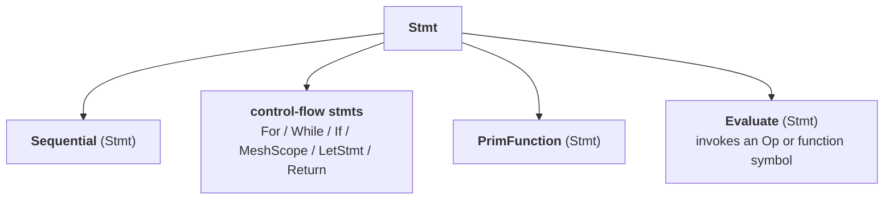

# TileFoundry Spec — tir (`@prim_func` imperative IR)

TIR is the imperative target IR. A `@tilefoundry.prim_func` body parses
into TIR; the lowering pass `HirToTirPass` ([passes](./passes.md))
also produces TIR. TIR has no value return; effect-form Ops carry
the work, structural Stmts carry control flow.

- **Container**: `tir.PrimFunction(name, params, body, output_count)`.
  `body` is a `Sequential`; the function returns no value.
- **Stmt tree**: function bodies are nested Stmts only. Exprs appear
  inside Stmt fields (e.g. `LetStmt.value`, `For.start`).
- **Effect Ops** (`Copy`, `Fill`, `Mma`, `ReLU`, `RMSNorm`, `Reduce`)
  are value-class Ops registered with `@register_op`; in Stmt
  position they are invoked as `Evaluate(op, args)`
  ([§1.4](#14-evaluate)).
- **Value Ops** (`AllocTensor`, `MemorySpan`, `PtrOf`, `TensorView`)
  are anchored by `LetStmt` so their result `Var` has stable
  identity.
- **No HIR Ops** reach TIR; HIR-to-TIR rewriting is owned by the
  pass layer.

## 1. TIR Stmt hierarchy

### 1.1 `Stmt`

```python
class Stmt:
    loc: str | None = None    # optional debug location; not load-bearing for semantics
```

- constraints:
  - the abstract base of every TIR Stmt subclass; HIR has no `Stmt`.

`Stmt` is the abstract base of every TIR Stmt subclass. HIR has no
`Stmt`. `loc` is a debug surface; it is not load-bearing for
semantics.



### 1.2 Structural Stmts (`tir.stmts`)

```python
class Sequential(Stmt):
    body: tuple[Stmt, ...]            # a Stmt sequence (__iter__ / __len__ / __getitem__ provided)

class LetStmt(Stmt):
    var: Var                          # binds var to value; let chains nest body
    value: Expr
    body: Sequential

class For(Stmt):
    induction_var: Var                # counted loop
    start: Expr
    stop: Expr
    step: Expr
    body: Sequential

class While(Stmt):                    # control flow
    cond: Expr
    body: Sequential

class If(Stmt):                       # control flow
    cond: Expr
    then_body: Sequential
    else_body: Sequential

class MeshScope(Stmt):
    mesh: Mesh                        # scopes a mesh binding over body
    binding: Var
    body: Sequential

class Return(Stmt):
    ...                               # @prim_func has no value return
```

- constraints:
  - the structural (control-flow / binding) Stmt family; bodies are `Sequential`.

- `MeshScope.mesh` carries the `Mesh` object; the `binding` `Var`
  scopes the mesh inside `body`.

### 1.3 `PrimFunction`

```python
class PrimFunction(Stmt):
    name: str                         # the function name
    params: tuple[Var, ...]           # parameter Vars (the trailing output_count are outputs)
    body: Sequential                  # the function body
    output_count: int = 1             # number of trailing output params
```

- constraints:
  - itself a `Stmt`, not a separate top-level node; returns no value.
    `verify_prim_function` enforces the rules below.

`PrimFunction` is itself a `Stmt`, not a separate top-level node;
it sits inside the TIR Stmt tree along with everything else.

`tir.verify.verify_prim_function(fn, *, module_fns=())` enforces:

- **Param homogeneity**. All parameters' layouts MUST be uniformly
  `ShardLayout` or uniformly non-`ShardLayout`; mixing is rejected.
- **Fresh `Var` identity**. The same `Var` object MUST NOT be bound
  by more than one `LetStmt` / `For` / `MeshScope` across the
  function. Parameters seed the bound set.
- **`LetStmt` typing**. `LetStmt.var.type` MUST equal the typeinfer
  of `LetStmt.value`.
- **`AllocTensor` placement**. `Call(AllocTensor, ...)` MAY only
  appear directly as `LetStmt.value`. Nesting it inside any other
  Expr is rejected.
- **`MeshScope` mesh in scope**. Any embedded `ShardLayout` MUST
  reference a mesh on the active `MeshScope` stack or a parameter's
  `ShardLayout.mesh`.
- **`Evaluate.callable`**. When `callable` is a `SymbolRef`
  ([§2.1](#21-symbolref)), module-level resolution MUST find exactly one
  `PrimFunction` of that name in the enclosing `Module`, `args` length
  MUST match the resolved callee's `params`, and the `SymbolRef.type`
  MUST equal the resolved callee's `CallableType`. When `callable` is
  an `Op`, the per-Op verifier registered via
  `@register_verify_stmt(Op)` runs.

### 1.4 `Evaluate`

```python
class Evaluate(Stmt):
    callable: Op | SymbolRef    # an effect-form Op or a SymbolRef callee
    args: tuple[Expr, ...]      # the callable's operands in ParamDef / parameter order
```

- constraints:
  - TIR's single Stmt-position wrapper for a no-result invocation; verify and
    lowering dispatch on `type(callable)`.

`Evaluate` is TIR's single Stmt-position wrapper for a callable
invocation that has no result value. The `callable` is one of:

- an effect-form `Op` (e.g. `tir.memory.Copy`, `tir.cuda.nn.Mma`,
  `tir.tensor.Reduce`, `tir.Launch` [§2.3](#launch)). `args` are
  the Op's operands in `ParamDef` order; the per-Op verifier
  registered via `@register_verify_stmt(Op)` runs.
- a `SymbolRef` ([§2.1](#21-symbolref)) — a reference to a callee
  `PrimFunction` in the enclosing `Module`. `args` follow the callee's
  parameter order, the final `output_count` positions binding output
  buffers; the callee is resolved uniquely at module level
  ([§1.3](#13-primfunction)).

Verify and lowering MUST dispatch on `type(callable)`. The per-Op
verify / codegen handlers are keyed by `Op` type and receive the Op
together with `args`; an `Op` callable carries no result, so its
`Call` form is unit-typed.

The value-producing counterpart is the `Call(Op, args)` Expr
([core-ir.md §2.1](./core-ir.md#21-call)): it has a non-`Unit` result
type and is anchored by `LetStmt`. `Evaluate` is the unit-typed,
Stmt-position form and the only Stmt-position invocation wrapper.

**Effect Op vs. control Stmt.** A callable that is a single
unconditional invocation — an effect `Op` or a function `SymbolRef` —
is expressed as `Evaluate(callable, args)`. A construct that carries
its own control flow stays a first-class `Stmt`, not an `Evaluate`
callable: `DispatchCall` ([§1.6](#16-dispatchcall)) is a first-match
`if`/`else` over patterns with a fallback, and `Abort`
([§1.7](#17-abort)) is a terminator. Their nested function invocations
are themselves `Evaluate(SymbolRef, args)`.

### 1.5 `Sync`

`Sync` is a mesh-scoped barrier. It is an **effect-form op** (`tir.sync.Sync`),
authored `T.sync(m)`, and appears in Stmt position wrapped by `Evaluate`
([§1.4](#14-evaluate)) like any other effect op. The surface is **only**
`T.sync(m)` / `T.sync(m[slice])` — there is no `m.sync()` receiver form.

```python
class Sync(Op):
    """Effect form; mesh-scoped barrier op ``tir.sync.Sync``, authored ``T.sync(m)``.

    Attributes:
        mesh: attribute; the (possibly sliced) mesh the barrier synchronizes.
    """

    mesh: Mesh
```

- constraints:
  - a mesh-scoped barrier; in Stmt position it is wrapped by `Evaluate`. The
    participant set, barrier mapping, and named-barrier id rules are below.

#### `mesh` — the participating threads

- `mesh` is the (possibly sliced) mesh `Sync` synchronizes. `T.sync(m)`
  synchronizes the whole mesh; `T.sync(m[1:3, :])` synchronizes the constant
  sub-mesh selected by the slice.
- A **mesh slice is a compile-time descriptor.** `m[...]` is evaluated at parse
  time via `Mesh.__getitem__` into a sub-`Mesh` whose `layout` is a
  **`ComposedLayout`** recording the participating sub-box (the affine "mesh
  scope" case `image(c) = offset + outer(c)`): the selected per-axis extents
  over the parent strides in `outer`, the slice origin (linear thread index of
  the first participant) in `offset`, identity `inner`. An un-sliced mesh's
  `layout` is a plain `Layout`. A sliced mesh is still a `Mesh`; the slice never
  becomes an IR/SSA value.
- The **participant set** is derived through the existing layout algebra
  (`shard.md`): the participating linear thread indices are `offset +
  outer(coord)` over `outer`'s domain (the plain `layout` at `offset 0` for an
  un-sliced mesh); `base` is the minimum, `count = size(outer)`, and the block
  domain is the product of the topology extents. `classify` / `participation`
  are the single source of truth shared by verify and codegen.
- **Legal-slice verification.** A sliced mesh is accepted only if its
  `ComposedLayout` `layout` reconstructs as a constant slice of an enclosing
  full mesh `e`: same strides, per-axis sub-extents bounded by `e`'s shape, an
  offset that decomposes into in-range per-axis starts, and the **full topology
  tuple** + names equal — the proof rebuilds `e[key]` and compares, so a forged
  slice cannot pass. A full mesh (plain-`Layout` `layout`) is accepted only by
  equality with an enclosing mesh.

#### Supported slices and the barrier mapping

The participant set MUST be a single contiguous thread interval `[base,
base+count)`. Verify MUST reject (never broaden or split):

- a non-contiguous slice (e.g. a lane subset spanning warps);
- a cross-warp range that is not warp-aligned (`base` and `count` not both
  multiples of 32);
- a dynamic / inconsistent / unsupported-topology mesh.

A valid participant set maps to exactly one hardware barrier:

| participant set | barrier |
|---|---|
| whole block, more than one warp (`base==0`, `count==domain`) | `__syncthreads()` |
| whole block that is one warp | `__syncwarp()` |
| a contiguous lane subset within one warp | `__syncwarp(mask)` under a participant predicate |
| a warp-aligned contiguous multi-warp subset | a named `bar.sync <id>, <count>` under a participant predicate |
| the full mesh over the `cta` topology (all CTAs of the grid) | the grid-wide software barrier ([`runtime.md §3`](runtime.md)) |

Codegen MUST guard the `__syncwarp(mask)` and `bar.sync` cases with the
participant predicate `base <= tid < base+count` (`tid =
program_id<thread>()`): a non-participant thread MUST NOT execute the barrier,
and every participant MUST execute the same id and count.

The first four rows synchronize threads **within one block**; their participant
set is the contiguous thread interval above. A mesh whose topologies are all the
`cta` topology instead synchronizes **CTAs across the grid** — `program_id<cta>`
ranges over the launch's blocks — and maps to the grid-wide software barrier.
Only the **full** cta mesh participates: a cta slice (a subset of CTAs) has no
supported barrier and MUST be rejected at verify. The grid barrier's correctness
requires every CTA of the launch to be co-resident; that co-residency is the
launch's occupancy contract, not something the barrier can enforce. The
grid-barrier device helper and its counter protocol are specified in
[`runtime.md §3`](runtime.md).

#### Named-barrier id allocation

A sub-CTA `bar.sync` MUST carry a named-barrier id, allocated implicitly during
codegen, per kernel. Id `0` is reserved for the whole-CTA barrier; sub-CTA syncs
draw ids from `1..15`. Each emitted `bar.sync` MUST take the next free id; a
sync op node emits once, so a loop body reuses its id. A kernel requiring more
than 15 distinct named barriers MUST error; an id MUST NOT be reused across
distinct sync sites.

#### Design rationale

A barrier's scope is a compile-time constant — *which* threads take part — so
the mesh, and any slice of it, is a compile-time descriptor rather than an SSA
value, and the barrier kind is derived from that set by one shared routine so
verify and codegen cannot disagree.

### 1.6 `DispatchCall`

`tir.DispatchCall` is a first-class TIR Stmt that implements
pattern-based first-match dispatch over a tuple of `Expr` subjects.
It is the lowered form of an HIR dispatch prototype
([hir.md §1.1](./hir.md#11-function)) and of any sub-call
to a dispatch-prototype callee.

```python
class DispatchCall(Stmt):
    callee_name: str                                  # unmangled dispatcher name (debug / printer)
    subjects: tuple[Expr, ...]                        # one Expr per dispatch axis
    case_patterns: tuple[tuple[Pattern, ...], ...]    # parallel case table: patterns
    case_calls: tuple[Evaluate, ...]                  # parallel case table: Evaluate(SymbolRef, args)
    fallback: Sequential                              # the Sequential taken when no case matches
```

- constraints:
  - a control Stmt (not an `Evaluate` callable) implementing first-match dispatch;
    source order is part of the IR contract. Verifier rules below.

`DispatchCall` is a control Stmt, not an `Evaluate` callable
([§1.4](#14-evaluate)); each `case_calls[i]` is an
`Evaluate(SymbolRef, args)` invoking that case's specialized callee.

Semantics: the i-th `case_patterns` matches against `subjects` by
position; the first `i` whose every pattern matches runs
`case_calls[i]` and the op completes. If no case matches, `fallback`
runs. Source order is part of the IR contract — printers and viewers
MUST preserve it.

#### Verifier rules

The verifier requires:

- `len(subjects) == 1`.
- `subjects[0]` is a `tir.ShapeOf(param, axis)`.
- `len(case_patterns) == len(case_calls)`.
- Each `case_patterns[i]` has length `== len(subjects) == 1`.
- Each `case_patterns[i][0]` is a `DimVarRangePat`
  ([core-ir.md §3.1](./core-ir.md#31-dimvarrangepat)).
- `fallback` is exactly `Sequential((Abort(),))` — a length-1 body
  containing one `Abort`.

`subjects` carries a canonical ordering so the IR is deterministic
across compiles: ordered by axis kind, then by canonical name of the
matched key. A single dispatch axis makes this ordering trivial.

### 1.7 `Abort`

```python
class Abort(Stmt):
    message: str = ""    # a debug surface; carries no semantics
```

- constraints:
  - a terminating Stmt on believed-unreachable paths (notably `DispatchCall.fallback`).

- `Abort` is terminating. It exists in code paths the compiler
  believes are unreachable (notably `DispatchCall.fallback`).
- The CUDA emitter renders `Abort` as `__trap();` in device contexts
  and `assert(false);` in host contexts so a runtime hit is loud
  rather than silent.
- `message` is a debug surface; it does not carry semantics.

### 1.8 `@intrinsic` — user-defined effect Stmts

```python
# example
@intrinsic
def <name>(<param>: Expr, ...) -> None: ...    # decorated function's signature defines the synthesized Stmt subclass; its body becomes the verifier
```

- constraints:
  - synthesises a Stmt subclass, registers the body as its verifier, and wires
    parser dispatch under the snake-case name; parameters are annotated `Expr` and
    the return annotation is `None`.

`tilefoundry.ir.tir.intrinsic.intrinsic` synthesises a Stmt subclass
from the decorated function's signature, registers the function
body as the Stmt's verifier, and wires the parser dispatch entry
under the function's snake-case name. Parameters MUST be annotated
`Expr`; the return annotation MUST be `None`.

## 2. TIR Expr and callable constructs

### 2.1 `SymbolRef`

```python
class SymbolRef(Expr):
    name: str                       # canonical name of the callee PrimFunction (may be a mangled specialization name)
    nested: tuple[str, ...] = ()    # empty — the Module holds only top-level functions
    # type: CallableType — the resolved callee's CallableType, set at construction
```

- constraints:
  - a leaf `Expr` naming a callee as an `Evaluate` / `Launch` target; resolution
    is module-level and unique. Per-field rules below.

`SymbolRef` is a leaf `Expr` naming a callee `PrimFunction` as a call
target: the `callable` of an `Evaluate(SymbolRef, args)`
([§1.4](#14-evaluate)) function invocation and `args[0]` of a `Launch`
([§2.3](#launch)).

#### `name`
- MUST be the canonical name of a `PrimFunction` in the enclosing
  `Module` ([core-ir.md §1](./core-ir.md#1-module)), exactly as stored
  in `PrimFunction.name`. It MAY be a generated / mangled
  specialization name.

#### `nested`
- MUST be empty: the `Module` holds only top-level functions, so a
  non-empty `nested` is rejected.

#### `type`
- MUST be the resolved callee's IR-level `CallableType`
  ([types §7](./types.md#7-callabletype)): `parameters` are the callee
  `params` types in order; `return_type` is `UnitType`
  ([types §6](./types.md#6-unittype)) — a TIR `PrimFunction` returns
  no value, its outputs are trailing params ([§1.4](#14-evaluate)).
- MUST be set at construction from the callee in hand; a `SymbolRef`
  with a deferred or unresolved type MUST NOT enter constructed IR.
  `Expr` is frozen and verify MUST NOT mutate IR, so verify only
  checks `type` against the resolved callee ([§1.3](#13-primfunction)) —
  it never back-fills.

Resolution is module level: a unique lookup over the `Module`
([core-ir.md §1](./core-ir.md#1-module)) MUST map `name` to exactly
one `PrimFunction`; zero or more than one match is an error.
Specialization variants each carry a distinct canonical
`PrimFunction.name`, so a `SymbolRef` to a variant resolves
unambiguously; the unmangled dispatcher name lives on
`DispatchCall.callee_name` ([§1.6](#16-dispatchcall)), not on a
`SymbolRef`. Local typeinfer does not resolve a `SymbolRef`; it
carries its `type` directly.

### 2.2 `ShapeOf`

```python
class ShapeOf(Expr):
    param: Var    # a parameter Var of the enclosing PrimFunction
    axis: int     # a valid axis index of param.type
```

- constraints:
  - `type` is a rank-0 `i32` `TensorType` (scalar); it is the runtime-extent ABI
    for a dynamic tensor dimension. Per-field and ABI rules below.

- `ShapeOf.type` is rank-0 `TensorType` of dtype `i32` (a scalar).
- `param` MUST resolve to a parameter `Var` of the enclosing
  `PrimFunction`; `axis` MUST be a valid axis index of `param.type`.
- The CUDA emitter lowers `ShapeOf(param, axis)` to a kernel scalar
  parameter named `f"{param.name}_shape_{axis}"`. The host wrapper
  reads the value from the runtime tensor's shape and forwards it to
  the kernel.

The `<param>_shape_<axis>` i32 scalar is the runtime-extent ABI for a
dynamic tensor dimension, independent of how the `PrimFunction` was
produced:

- A device (CUDA) `PrimFunction` whose body references a dynamic tensor
  dimension (a `DimVar` axis of a tensor parameter) MUST carry the
  corresponding hidden `<param>_shape_<axis>` i32 scalar parameter, in
  addition to the tensor parameter. The dimension maps to the first
  tensor parameter / axis in which it occurs.
- A CPU host entry MUST NOT expose such a scalar at its user-facing
  surface — it reads the extent from its tensor argument's runtime shape
  and forwards it ([§2.3](#launch)).

### 2.3 TIR Ops

Value Ops MUST be anchored by `LetStmt.value` — their result `Var` is the only
handle. Effect Ops appear in Stmt position as `Evaluate(op, args)`
([§1.4](#14-evaluate)). Each Op's full contract lives here, in its catalog entry
below; code carries only a one-line purpose docstring
([SPEC-RULES](../SPEC-RULES.md)).

- `TensorType.storage` is a `StorageKind` (`gmem` / `smem` / `rmem` / `host` /
  `tmem`) or `None` ([types §2](./types.md)). `storage=None` is rank-0-only,
  reserved for shape-element tensors. A memory-resident TIR tensor MUST carry a
  concrete level; the unmaterialized `umat` ([types §2](./types.md)) is an
  HIR-only value and MUST already be materialized to a concrete level by the
  time `HirToTirPass` produces TIR — it never appears in TIR.
- `Reshard` does not appear in TIR; HIR-side `Reshard` is lowered
  into `LetStmt(AllocTensor)` + `Evaluate(Copy, ...)` chains
  during `HirToTirPass` ([passes](./passes.md)).

#### Memory Ops (`tir.memory.*`)

##### AllocTensor
```python
class AllocTensor(Op):
    """Value form; allocate a tensor, anchored by ``LetStmt.value``.

    Attributes:
        tensor_type: attribute; the allocated tensor's result type.
    """

    tensor_type: TensorType
```
- constraints:
  - allocate a tensor; a value Op anchored by `LetStmt.value`.

##### MemorySpan
```python
class MemorySpan(Op):
    """Value form; re-interpret a memory region as a typed tensor.

    Attributes:
        x: input; the memory region being re-interpreted.
    """

    x: Tensor
```
- constraints:
  - re-interpret a memory region as a typed tensor; a value Op.

##### PtrOf
```python
class PtrOf(Op):
    """Value form; take the device address of a tensor.

    Attributes:
        x: input; the tensor whose device address is taken.
    """

    x: Tensor
```
- constraints:
  - take the device address of a tensor for downstream view ops; a value Op.

##### TensorView
```python
class TensorView(Op):
    """Value form; derive a sub-view of a tensor.

    Attributes:
        memory: input; the base tensor (may be a ``PtrOf`` result).
        layout: attribute; the sub-view descriptor — a plain ``Layout`` or a
            ``ShardLayout`` placed over ``memory``.
        shape: attribute; optional logical-shape override (reshape).
    """

    memory: Tensor
    layout: object
    shape: tuple | None = None
```
- constraints:
  - derive a sub-view of a tensor; a value Op.

##### Copy
```python
class Copy(Op):
    """Effect form; byte-equivalent copy between two tensors.

    Attributes:
        source: input; copy source.
        destination: input; copy destination.
    """

    source: Tensor
    destination: Tensor
```
- constraints:
  - byte-equivalent copy between two tensors.

##### Fill
```python
class Fill(Op):
    """Effect form; broadcast a scalar value into a tensor.

    Attributes:
        tensor: input; destination tensor.
        value: input; rank-0 scalar broadcast into ``tensor``.
    """

    tensor: Tensor
    value: Tensor
```
- constraints:
  - broadcast a scalar value into a tensor.

#### NN Ops (`tir.nn.*`)

##### Mma
```python
class Mma(Op):
    """Effect form; matrix-multiply-accumulate ``acc += lhs @ rhs``.

    Attributes:
        acc: input; accumulator fragment.
        lhs: input; left-hand operand fragment.
        rhs: input; right-hand operand fragment.
        atom: attribute; optional compile-time ``MmaAtom``, absent ⇒ bare-Mma
            per-target path.
    """

    acc: Tensor
    lhs: Tensor
    rhs: Tensor
    atom: MmaAtom | None = None
```
- constraints:
  - matrix-multiply-accumulate `acc += lhs @ rhs`; per-target PTX lowering lives in
    [target](./target.md), the atom calling convention in
    [§2.3](#mma-atom-and-the-hand-written-calling-convention).

##### ReLU
```python
class ReLU(Op):
    """Effect form; pointwise ``max(src, 0)`` written into ``dst``.

    Attributes:
        src: input; input tensor.
        dst: input; destination tensor.
    """

    src: Tensor
    dst: Tensor
```
- constraints:
  - pointwise `max(x, 0)`.

##### RMSNorm
```python
class RMSNorm(Op):
    """Effect form; fused RMS normalisation written into ``dst``.

    Attributes:
        src: input; input tensor, reduced over its last axis.
        dst: input; normalised-output tensor.
        weight: input; 1-D scale multiplied onto the normalised output.
        eps: attribute; epsilon applied with rsqrt.
    """

    src: Tensor
    dst: Tensor
    weight: Tensor
    eps: float
```
- constraints:
  - fused RMS normalisation.

#### Tensor Ops (`tir.tensor.*`)

##### Reduce

```python
class Reduce(Op):
    """Effect form; generic axis reduction dispatched by the ``kind`` tag.

    Attributes:
        src: input; reduction source.
        dst: input; reduction destination.
        workspace: input; optional staging buffer sized by lowering.
        axes: attribute; reduced-axis tuple.
        kind: attribute; ``ReduceKind`` tag.
    """

    src: Tensor
    dst: Tensor
    workspace: Tensor | None = None
    axes: tuple
    kind: ReduceKind
```
- constraints:
  - `Reduce` carries no dispatch parameter; runtime selects the strategy.
  - `workspace` is present only when lowering sizes cross-warp staging.
  - All forms lower to the single public runtime entry
    `tilefoundry::ops::reduce<Op, Axes>(src, dst[, workspace])`.
  - Plain and sharded runtime extents/tiers are derived inside the runtime.

#### Generic kind-tagged effect Ops (`tir.arith`)

`Binary` / `Unary` are effect-form Ops that dispatch on a kind enum rather than
per-op classes; they appear as `Evaluate(op, args)`. `BinaryKind` /
`UnaryKind` / `ReduceKind` are compiler-wide tag enums shared across HIR and
TIR; lowering preserves the kind value without re-mapping.

##### Binary
```python
class Binary(Op):
    """Effect form; pointwise binary operation ``dst = lhs <kind> rhs``.

    Attributes:
        lhs: input; left-hand operand.
        rhs: input; right-hand operand.
        dst: input; destination operand.
        kind: attribute; ``BinaryKind`` tag.
    """

    lhs: Tensor
    rhs: Tensor
    dst: Tensor
    kind: BinaryKind
```
- constraints:
  - Lowers to the binary runtime family without per-kind TIR classes.

##### Unary
```python
class Unary(Op):
    """Effect form; pointwise unary operation ``dst = <kind>(src)``.

    Attributes:
        src: input; input operand.
        dst: input; destination operand.
        kind: attribute; ``UnaryKind`` tag, including rsqrt.
    """

    src: Tensor
    dst: Tensor
    kind: UnaryKind
```
- constraints:
  - Lowers to the unary runtime family without per-kind TIR classes.

#### `Launch`

Effect Op for a host-side launch of a device kernel (CPU entry only, no value);
the callee `SymbolRef` and grid/block extents flow through the `Evaluate` args,
the non-grid/block launch config through the Op attributes.

```python
class Launch(Op):
    """Effect form; host launch of a device kernel, producing no value.

    Attributes:
        cluster: attribute; optional cluster extents.
        dynamic_smem: attribute; dynamic shared-memory byte count.
        stream: attribute; optional stream handle.
        attrs: attribute; remaining ``LaunchAttrs`` launch configuration.
    """

    cluster: tuple | None = None
    dynamic_smem: int = 0
    stream: object | None = None
    attrs: LaunchAttrs = LaunchAttrs()

# Evaluate(Launch(...), (SymbolRef(callee), grid_x, grid_y, grid_z, block_x, block_y, block_z, *forwarded_args))
```

- constraints:
  - appears only in a CPU (host) entry body; grid/block extents are launch config,
    not kernel parameters. Per-arg / per-attribute rules below.

`Launch` appears only in a CPU (host) entry body, as `Evaluate(Launch(...),
args)` with `args = (SymbolRef(callee), grid_x, grid_y, grid_z, block_x,
block_y, block_z, *forwarded_args)`:

- **callee**: `args[0]` MUST be a `SymbolRef` ([§2.1](#21-symbolref)) resolving to
  a device `PrimFunction` with a CUDA target.
- **grid / block**: `args[1:7]` are the grid then block extents in the fixed
  order `grid_x, grid_y, grid_z, block_x, block_y, block_z`. Each is an `Expr`
  — a `Constant` for a static extent, a `ShapeOf` ([§2.2](#22-shapeof)) for a
  launch-provided (dynamic) one, or a dim-arithmetic `Call` over those. They are
  launch configuration, not kernel parameters: the device observes geometry
  through `gridDim` / `blockIdx` (the codegen `program_dim` / `program_shape`
  accessors), never as arguments.
- **forwarded args**: the remaining `args` bind the callee's host-visible
  parameters in declaration order. They MUST NOT include the hidden
  `<param>_shape_<axis>` scalar parameters ([§2.2](#22-shapeof)) — the host fills
  those from a tensor argument's runtime shape.
- **attributes**: `cluster`, `dynamic_smem`, `stream`, and `attrs` carry the
  non-grid/block launch configuration. A `cluster` / `stream` / `attrs` value
  the active CUDA target does not support MUST be rejected in target lowering.

#### MMA atom and the hand-written calling convention

A hand-written kernel issues an MMA through an explicit **atom** — a
realized instruction descriptor — instead of the bare `Mma` op whose
fragment layouts the per-target lowering chooses
([hir §1.3](./hir.md#irhirnn), [passes](./passes.md)). An MMA atom fixes a
concrete hardware instruction, so the whole MMA surface is **target-owned**:
the `Mma` op and the `MmaOpSpec` / `MmaAtom` descriptors
(`tilefoundry.ir.tir.cuda.nn`, mirroring the CuTe `MMA_Op` → `MMA_Atom`
layering), the concrete instructions, and their fragment layouts all live
under `tilefoundry.ir.tir.cuda.nn.mma` / `mma_atom`, following IR's dialect-first
layout `ir/{dialect}/{target}/{category}`.

##### `MmaOpSpec`

A named, fully-specified MMA instruction (the CuTe `MMA_Op` analog).

```python
class MmaOpSpec:
    name: str                         # uniquely identifies the instruction; the other fields mirror it
    shape_mnk: tuple[int, int, int]   # the instruction's static (M, N, K)
    dtype_a: DType                    # lhs operand element type
    dtype_b: DType                    # rhs operand element type
    dtype_c: DType                    # accumulator element type
    operand_layout: str               # source operand order string (e.g. "TN")
```

- constraints:
  - a fully-specified MMA instruction descriptor carrying no fragment-layout
    knowledge. Per-field rules below.

###### `name`

- MUST uniquely identify the instruction. dtype / shape / source layout
  are fixed by it; the remaining fields mirror the name so verify and
  codegen do not re-parse the string.

###### `shape_mnk`

- MUST be the instruction's `(M, N, K)` tuple; every entry MUST be a
  static int.

###### `dtype_a`

- MUST be the `lhs` operand element type (`DType`).

###### `dtype_b`

- MUST be the `rhs` operand element type (`DType`); it MAY differ from
  `dtype_a`.

###### `dtype_c`

- MUST be the accumulator element type (`DType`); it MAY differ from the
  operand types (e.g. `f32` accumulation over `bf16` operands).

###### `operand_layout`

- MUST encode the source operand order as a string, e.g. `"TN"` (A
  row-major, B col-major). An `MmaOpSpec` MUST NOT carry fragment-layout
  knowledge.

##### `MmaAtom`

The realized atom for an `op` (the CuTe `MMA_Atom` analog), built by
`T.cuda.mma.atom(op=...)`
([parser §2.6](./parser.md#26-platform-sub-namespaces)).

```python
class MmaAtom:
    op: MmaOpSpec         # the MmaOpSpec this atom realizes
    A: ShardLayout        # lhs fragment ShardLayout contract
    B: ShardLayout        # rhs fragment ShardLayout contract
    C: ShardLayout        # accumulator fragment ShardLayout contract
    required_scope: Mesh  # the thread-participation contract, carried as its own Mesh
```

- constraints:
  - the realized atom for an `op`; fragment layouts are returned as-is and not
    rebound onto the caller's mesh. Per-field rules below.

###### `op`

- MUST be the `MmaOpSpec` this atom realizes.

###### `A`

- MUST be the `lhs` operand fragment `ShardLayout` contract — the
  lane→value layout the instruction reads. It MUST be returned **as-is**
  at a use site and MUST NOT be rebound onto the caller's mesh.

###### `B`

- MUST be the `rhs` operand fragment `ShardLayout` contract; the same
  as-is / no-rebind rule as `A` applies.

###### `C`

- MUST be the accumulator fragment `ShardLayout` contract; the same
  as-is / no-rebind rule as `A` applies.

###### `required_scope`

- MUST be the thread-participation contract the atom needs, carried as
  its own `Mesh` (for the SM80 `16x8x16` instruction, 32 lanes arranged
  as a `(4, 8)` thread mesh). It MUST NOT be the caller's mesh; the
  caller's enclosing scope MUST be checked against it at verify (below).

##### Calling convention

Load, compute, and store are **three separate** effect statements under
an enclosing `MeshScope` ([§1.2](#12-structural-stmts-tirstmts)); `T.mma` is
verify-only and MUST NOT fuse the loads or the store.

```python
atom = T.cuda.mma.atom(op=T.cuda.mma.SM80_16x8x16_F32BF16BF16F32_TN)
with Mesh(Topology("thread", 32), Layout(shape=(4, 8), strides=(1, 4))) as warp:
    a_frag = T.alloc_tensor(TensorType(..., layout=atom.A, storage=rmem))
    acc    = T.alloc_tensor(TensorType(..., layout=atom.C, storage=rmem))
    T.copy(T.tensor_view(a, layout=atom.A), a_frag)   # load
    T.fill(acc, 0.0)
    T.mma(acc, a_frag, b_frag, atom=atom)             # compute
    T.copy(acc, T.tensor_view(c, layout=atom.C))      # store
```

- The author allocates each register fragment with the matching
  `atom.A/B/C` layout and fills it with its own `T.copy`. The
  accumulator is initialised with `Fill` and then read-modify-written.
- `atom` is a compile-time attribute on the `Mma` Op
  ([parser §2.6](./parser.md#26-platform-sub-namespaces)), not a runtime
  operand. When absent, lowering takes the bare-`Mma` per-target path.

##### Verify

A `T.mma` carrying an `atom` MUST satisfy:

- **operand contracts**: `acc.layout == atom.C`, `lhs.layout == atom.A`,
  `rhs.layout == atom.B`.
- **scope**: some mesh on the active `MeshScope` stack provides the
  atom's required thread scope —
  `mesh_scope_matches_required_scope(mesh, atom.required_scope)`. The
  match is identity- and name-independent (mesh object identity, the
  binding-var name, and axis names are not compared); it holds iff:
  - the two meshes share the same program topology level — a `cta`
    scope is never a `thread` / warp scope, even when its layout carries
    the same shape;
  - both topology domains (the product of the topology extents) are
    statically known;
  - each mesh is self-consistent (`topology domain == layout extent`),
    and the enclosing mesh is inverse-projectable;
  - the thread-value decomposition matches **exactly** — same layout
    shape and strides. A flat lane layout cannot host the atom's
    multi-axis fragment `Split` and is rejected.

Per-target PTX emission dispatches on the atom ([target](./target.md)).

#### Async copy Ops (`tir.async.*`)

Non-blocking `cp.async` gmem→smem staging for warp-specialized pipelines: a
producer issues copies, groups them, and a consumer waits on the group queue.

##### CopyAsync

```python
class CopyAsync(Op):
    """Effect form; async gmem→smem copy, non-blocking.

    Attributes:
        source: input; gmem staging source.
        destination: input; smem staging destination.
    """

    source: Tensor
    destination: Tensor
```
- constraints:
  - Lowers to `tilefoundry::ops::copy_async(src, dst)`.
  - A later read of `dst` is ordered by `CpAsyncCommit` followed by
    `CpAsyncWait`.

##### CpAsyncCommit

```python
class CpAsyncCommit(Op):
    """Effect form; close the current in-flight async-copy group."""
```
- constraints:
  - Later `CpAsyncWait` counts committed groups.

##### CpAsyncWait

```python
class CpAsyncWait(Op):
    """Effect form; wait until at most ``n`` committed groups remain in flight.

    Attributes:
        n: attribute; most-recent committed groups allowed to remain in flight.
    """

    n: int = 0
```
- constraints:
  - `n` is a non-negative compile-time count.
  - `n = 0` drains every outstanding committed group.
