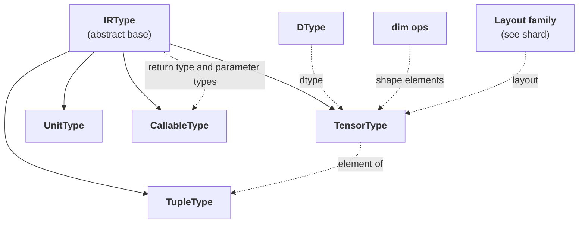

# TileFoundry Spec — Type System



## 1. `IRType`

```python
class IRType:
    """Abstract base of every TileFoundry IR type."""
```

`IRType` is the abstract base. Every `core_ir.Expr.type` is one of
its derivations: `TensorType` / `TupleType` / `UnitType` /
`CallableType`.

---

## 2. `TensorType`

```python
@dataclass(frozen=True)
class TensorType(IRType):
    shape: tuple[ShapeDim, ...]  # ShapeDim = int | DimVar | Expr
    dtype: DType                 # f32 / f16 / bf16 / i32 / i64 / bool / ...
    layout: Layout | ShardLayout | ComposedLayout    # see shard
    storage: StorageKind | None  # gmem / smem / rmem / host / tmem, or None
```

**Key**:
- Each `shape` element is a `ShapeDim` — one of: a raw Python
  `int` (static dim), a `DimVar` `Op` instance (bounded named
  symbolic dim placed directly into `shape`), or a dim-arithmetic
  `Expr` (a `Call` over `DimAdd` / `DimMul` / ... whose leaves are
  `Constant(int)` / `DimVar` / `DimConst`).
- `shape` is the tensor's **logical shape**; it is invariant under
  sharding, storage, and per-shard physical layout.
- A *scalar* is `TensorType(shape=(), ...)` — a rank-0 tensor. There
  is no separate `Scalar` type.
- `layout` is a member of the `Layout` family
  (`Layout` / `ComposedLayout` / `ShardLayout`); see [shard](./shard.md).
- `storage` is a `StorageKind` (`gmem` / `smem` / `rmem` / `host` / `tmem` /
  `umat`) or `None`. A concrete level (`gmem` / `smem` / `rmem` / `host` /
  `tmem`) is the value's **abstract result residency** — where the result tensor
  logically lives — not the transient register/ALU staging any individual step
  happens to use. `umat` marks an **unmaterialized** (placement-polymorphic)
  value: one present in the abstract IR that has not yet been committed to a
  concrete residency. A source value literal carries `storage=umat`. An
  unmaterialized value MUST be resolved to a concrete residency (or otherwise
  materialized) before codegen consumes it. `None` is unchanged — a tensor with
  no memory space (a shape-element scalar), distinct from `umat`.

**Constraints**:
- For plain `Layout` / `ComposedLayout`, `len(shape)` MUST equal the
  layout's logical axis count; for `ComposedLayout` this is the
  outer-layout's axis count after expansion.
- For `ShardLayout`, `TensorType.shape` remains the logical shape;
  `ShardLayout.layout.shape` is the sharding-internal / per-shard
  layout shape and need not match `shape` axis-by-axis. `Reshard`
  preserves the logical shape; logical-shape rewrites go through
  `hir.tensor.Reshape`.
- `Layout` / `ComposedLayout` MUST describe an injective mapping
  ([shard §8.7](./shard.md)). Padding-style non-injective layouts are
  not supported.
- A rank-0 tensor is well-formed. A rank-0 tensor with `storage=None` is the
  shape-element form; a rank-0 tensor with a memory `StorageKind` is an
  ordinary scalar holding one element.

Enforcement is owned by [tir §4](./tir.md) / [hir §1.3](./hir.md);
dispatch is described in
[visitor-registry](./visitor-registry.md).

---

## 3. `DType`

```python
class DType(enum.Enum):
    f32 = "f32"
    f16 = "f16"
    bf16 = "bf16"
    i32 = "i32"
    i64 = "i64"
    bool = "bool"
    # extended on demand
```

`DType` is a value enumeration, independent of `layout` / `storage`.

---

## 4. `dim.*` — symbolic shape dimensions

`shape` elements are values of the `ShapeDim` family (see §2's
field declaration: `ShapeDim = int | DimVar | Expr`):

- a plain Python `int` for fully static dims;
- a `DimVar(name, lo, hi)` value type (`core_ir.dim.DimVar`) for
  bounded dynamic dims; and
- a `core_ir.dim.*` `Expr` (e.g. `DimAdd` / `DimMul`) for derived
  dim expressions, returning a rank-0 integer `Expr` of dtype
  `i64` and `storage=None`.

The family covers:

- `DimConst(value: int)` — integer literal.
- `DimVar(name: str, lo: int, hi: int)` — a bounded named shape
  symbol (`"M"` / `"N"` / `"K"` / ...). The **half-open** envelope
  `[lo, hi)` lives on the dim itself: `lo` is inclusive and `hi` is
  exclusive, so `hi` is one past the maximum runtime value the dim
  may take (the dim ranges over `lo .. hi-1`). `DimVar` MUST validate
  `name` non-empty and `lo < hi`; a single-point envelope is
  `[k, k+1)` (a fixed dim known symbolically). Identity is canonical per
  `(name, lo, hi)`: every construction of `DimVar("N", a, b)`
  returns the same object (via a per-`(name, lo, hi)` cache), so
  identical entries compare equal across Ops. A second
  `DimVar("N", a', b')` with `(a', b') != (a, b)` simply produces
  a distinct canonical object; within a single function signature
  same-name `DimVar`s MUST agree on bounds, and HIR
  `verify_function` raises a `VerifyError` otherwise.
- Arithmetic: `DimAdd` / `DimSub` / `DimMul` / `DimFloorDiv` /
  `DimMod` / `DimMin` / `DimMax`, each taking two rank-0 integer
  `Expr` inputs.

These rank-0 shape-element tensors MUST use `storage=None` and carry no
runtime memory.

**Construction-time folding.** Producers of arithmetic dim Calls
(typeinfer rules, parser slice / range sugar, etc.) MUST route
construction through `simplify_dim(op_cls, args)`. When every
entry of `args` is an `int`-valued `Constant`, `simplify_dim`
returns a folded `Constant` directly; otherwise it returns the
canonical `Call(target=op_cls(), args=args)` unchanged. This
keeps the IR free of all-`Constant` arithmetic chains and lets
downstream consumers (printer, viewer, codegen) read the literal
value without inspecting nested arithmetic. Two cases preserve
the original `Call` even when all args are `Constant`:
`DimFloorDiv` / `DimMod` with a zero divisor (so verify can flag
the error) and Constants whose payload is not `int` (e.g.
`bool`). No algebraic identity folding (`x + 0` → `x`, `x * 1`
→ `x`) is performed at construction time; future passes own that
optimisation.

---

## 5. `TupleType`

```python
@dataclass(frozen=True)
class TupleType(IRType):
    """Result type of a multi-output Op. Nested TupleType is uncommon."""
    fields: tuple[IRType, ...]
```

- A multi-output Op (e.g. [hir](./hir.md) `tensor.Split`) has
  `Call.type: TupleType` whose fields correspond to the outputs. A
  single-output Op has `Call.type: TensorType`. The typeinfer rule
  decides; see [visitor-registry §4](./visitor-registry.md).
- `TupleType` MUST NOT appear as the input type of any other Op. A
  tuple is consumed only via the `tuple_get_item` Op
  ([core-ir](./core-ir.md)). The exception for tuple-of-`Expr` formal
  parameters (e.g. `Concat`, `Stack`) is owned by
  [hir §1.3](./hir.md).

---

## 6. `UnitType`

```python
@dataclass(frozen=True)
class UnitType(IRType):
    """Result type of an effect-form Call; no payload."""
```

`UnitType` is the result type of an effect-form Op (such as
`tir.cuda.nn.Mma`, `tir.memory.Copy`), which produces no value its
consumers can read; in Stmt position such an Op appears as
`Evaluate(op, args)` ([tir §2.2](./tir.md#22-evaluate)). The
effect-form vs value-form classification is owned by
[core-ir §2.3](./core-ir.md).

---

## 7. `CallableType`

```python
@dataclass(frozen=True)
class CallableType(IRType):
    """IR-level type of a callable Expr (e.g. ``hir.Function``)."""
    return_type: IRType
    parameters: tuple[IRType, ...]
```

- `CallableType` is the type of any Expr that represents a callable
  value. Today the only producer is [hir §1.1](./hir.md) `Function`.
- `parameters` is a tuple of parameter **types**; parameter names
  are not part of the type. Names live on `Function.params`
  (`Var.name`) at the IR level.
- The host-ABI counterpart in
  [runtime §1.1](./runtime.md#11-runtimemodule) is a separate
  construct (also named `CallableType` in `tilefoundry.runtime.module`)
  that carries `ParamABI` records with dtype / shape / storage /
  output_count for the loader. The two live in different layers
  and are disambiguated by import path; do not conflate them.
