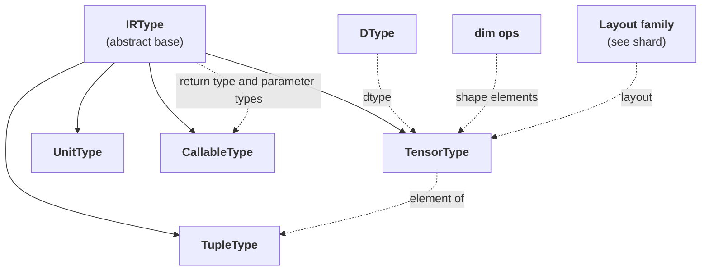

# TileFoundry Spec — Type System



## 1. `IRType`

```python
class IRType:      # abstract base; concrete IR types derive from it
    ...
```

- constraints:
  - every `core_ir.Expr.type` is one of its derivations (`TensorType` /
    `TupleType` / `UnitType` / `CallableType`).

`IRType` is the abstract base. Every `core_ir.Expr.type` is one of
its derivations: `TensorType` / `TupleType` / `UnitType` /
`CallableType`.

---

## 2. `TensorType`

```python
# ShapeDim = int | DimVar | Expr — a static int, a bounded `DimVar` Op, or a dim-arithmetic `Expr` (see §4)
class TensorType(IRType):
    shape: tuple[ShapeDim, ...]                      # logical shape; invariant under sharding / storage / layout
    dtype: DType                                     # element dtype
    layout: LayoutBase | None                        # member of the Layout family, or no assigned layout (see shard)
    storage: StorageKind | None                      # abstract result residency, or umat / None
```

- constraints:
  - A *scalar* is `TensorType(shape=(), ...)` — a rank-0 tensor. There
    is no separate `Scalar` type.
  - `layout` is either `None` or one member of the `LayoutBase` hierarchy
    defined by [shard §2](./shard.md#2-layout-hierarchy).
  - `storage` is a `StorageKind` (`gmem` / `smem` / `rmem` / `host` / `tmem` /
    `umat`) or `None`. A concrete level (`gmem` / `smem` / `rmem` / `host` /
    `tmem`) is the value's **abstract result residency** — where the result tensor
    logically lives — not the transient register/ALU staging any individual step
    happens to use. `umat` marks an **unmaterialized** (placement-polymorphic)
    value: one present in the abstract IR that has not yet been committed to a
    concrete residency. A source value literal carries `storage=umat`. An
    unmaterialized value MUST be resolved to a concrete residency (or otherwise
    materialized) before codegen consumes it. `None` is unchanged — a tensor with
    no memory space (a shape-element scalar), distinct from `umat`.
  - For plain `Layout` / `ComposedLayout`, `len(shape)` MUST equal
    `layout.domain_rank`; consumers use this common contract rather than
    inspecting a `ComposedLayout` component.
  - For `ShardLayout`, `TensorType.shape` remains the logical shape;
    `ShardLayout.layout.shape` is the sharding-internal / per-shard
    layout shape and need not match `shape` axis-by-axis. `Reshard`
    preserves the logical shape; logical-shape rewrites go through
    `hir.tensor.Reshape`.
  - `Layout` / `ComposedLayout` MUST describe an injective mapping
    ([shard §8.7](./shard.md)). Padding-style non-injective layouts are
    not supported.
  - A rank-0 tensor is well-formed. A rank-0 tensor with `storage=None` is the
    shape-element form; a rank-0 tensor with a memory `StorageKind` is an
    ordinary scalar holding one element.

Enforcement is owned by [tir §1.3](./tir.md#13-primfunction) / [hir §1.3](./hir.md);
dispatch is described in
[visitor-registry](./visitor-registry.md).

### 2.1 Recursive local projection

```python
def local_type_of(type: IRType) -> IRType: ...
```

- constraints:
  - `local_type_of` MUST recursively project every tensor leaf and rebuild
    `TupleType` structure.
  - A resolved nested `ShardLayout` MUST be applied exactly once per layer.
  - The result MUST remain an ordinary IR Type and MUST NOT introduce a
    schedule-specific tensor type.
  - Unresolved layouts and local extents that are not concrete positive
    integers MUST raise at the projection boundary.

### `StorageKind` and `resolve_storage`

`StorageKind` is the type-system vocabulary for abstract tensor residency.
Target lowering decides whether a concrete level is supported by the active
target; storage resolution does not perform target capability validation.

```python
class StorageKind(IntEnum):
    """Memory-space level (backend-generic)."""

    HOST = 1
    GMEM = 2
    SMEM = 3
    RMEM = 4
    TMEM = 5
    UMAT = 6

    def __str__(self) -> str: ...


def resolve_storage(value: "str | StorageKind | None") -> "StorageKind | None":
    """Normalize a surface storage specification."""
    ...
```

- constraints:
  - `StorageKind` is defined and owned by `ir/types/storage.py`.
  - The member values and `str` spellings are `HOST=1` / `host`,
    `GMEM=2` / `gmem`, `SMEM=3` / `smem`, `RMEM=4` / `rmem`,
    `TMEM=5` / `tmem`, and `UMAT=6` / `umat`.
  - `resolve_storage` MUST pass through `None` and a `StorageKind` instance.
    It MUST accept exactly the canonical strings `host`, `gmem`, `smem`,
    `rmem`, and `tmem`, and MUST reject other strings and non-storage values.
  - `UMAT` is an IR-internal unmaterialized value and MUST NOT be accepted as
    a surface string.
  - The storage vocabulary is closed at the IR type boundary. It MUST NOT
    provide target-specific registration or capability validation.

---

## 3. `DType`

```python
class DType:
    """Describe an element type.

    Attributes:
        name: Canonical DSL spelling.
        bit_width: Logical number of bits per element.
    """

    name: str
    bit_width: int


class FloatDType(DType):
    """Describe a floating-point element type.

    Attributes:
        exponent_bits: Number of exponent bits.
        mantissa_bits: Number of explicit mantissa bits.
    """

    exponent_bits: int
    mantissa_bits: int


class IntegerDType(DType):
    """Describe an integer element type.

    Attributes:
        signed: Whether the integer representation is signed.
    """

    signed: bool


class BoolDType(DType):
    """Describe the boolean element type."""
```

The canonical descriptors are:

| Surface | Descriptor class | `bit_width` | Family-specific facts |
| --- | --- | ---: | --- |
| `DType.f32` | `FloatDType` | 32 | `exponent_bits=8`, `mantissa_bits=23` |
| `DType.f16` | `FloatDType` | 16 | `exponent_bits=5`, `mantissa_bits=10` |
| `DType.bf16` | `FloatDType` | 16 | `exponent_bits=8`, `mantissa_bits=7` |
| `DType.fp8e4m3` | `FloatDType` | 8 | `exponent_bits=4`, `mantissa_bits=3` |
| `DType.f8e8m0` | `FloatDType` | 8 | `exponent_bits=8`, `mantissa_bits=0` |
| `DType.f4e2m1` | `FloatDType` | 4 | `exponent_bits=2`, `mantissa_bits=1` |
| `DType.i32` | `IntegerDType` | 32 | `signed=True` |
| `DType.i64` | `IntegerDType` | 64 | `signed=True` |
| `DType.bool` | `BoolDType` | 1 | none |

- constraints:
  - `DType` MUST be an immutable descriptor hierarchy, not an `enum.Enum`.
  - Each surface value MUST be a process-lifetime singleton whose `name` equals
    the attribute spelling after `DType.`.
  - The table above is the complete built-in set. The type system MUST NOT
    expose custom registration or Enum-style `.value`, `__members__`, indexing,
    or iteration surfaces.
  - Descriptor equality and hashing MUST use the complete descriptor fields.
  - `DType` is independent of `layout` and `storage`.
  - `fp8e4m3` is the canonical fp8 spelling; no alternate fp8 spelling (e.g.
    `f8e4m3`) exists.
  - `fp8e4m3`, `f8e8m0`, and `f4e2m1` are low-precision dtypes: logical element
    types whose values enter and leave a computation through `Cast`. Type
    inference treats them like any other element type.
  - The evaluator supports `Cast` to and from `fp8e4m3` and `f8e8m0`; `f4e2m1`
    has no evaluator `Cast`, so evaluating a `Cast` targeting `f4e2m1` raises an
    unsupported-dtype error.

---

## 4. `dim.*` — symbolic shape dimensions

`shape` elements are values of the `ShapeDim` family (see §2's
field declaration: `ShapeDim = int | DimVar | Expr`):

- a plain Python `int` for fully static dims;
- a `DimVar(name, lo, hi)` value type (`core_ir.dim.DimVar`) for
  bounded dynamic dims; and
- a `core_ir.dim.*` `Expr` (e.g. `DimAdd` / `DimMul`) for derived
  dim expressions, returning a rank-0 integer `Expr` of dtype
  `i64` and `storage=None`.

The family covers:

- `DimConst(value: int)` — integer literal.
- `DimVar(name: str, lo: int, hi: int)` — a bounded named shape
  symbol (`"M"` / `"N"` / `"K"` / ...). The **half-open** envelope
  `[lo, hi)` lives on the dim itself: `lo` is inclusive and `hi` is
  exclusive, so `hi` is one past the maximum runtime value the dim
  may take (the dim ranges over `lo .. hi-1`). `DimVar` MUST validate
  `name` non-empty and `lo < hi`; a single-point envelope is
  `[k, k+1)` (a fixed dim known symbolically). Identity is canonical per
  `(name, lo, hi)`: every construction of `DimVar("N", a, b)`
  returns the same object (via a per-`(name, lo, hi)` cache), so
  identical entries compare equal across Ops. A second
  `DimVar("N", a', b')` with `(a', b') != (a, b)` simply produces
  a distinct canonical object; within a single function signature
  same-name `DimVar`s MUST agree on bounds, and HIR
  `verify_function` raises a `VerifyError` otherwise.
- Arithmetic: `DimAdd` / `DimSub` / `DimMul` / `DimFloorDiv` /
  `DimMod` / `DimMin` / `DimMax`, each taking two rank-0 integer
  `Expr` inputs.

These rank-0 shape-element tensors MUST use `storage=None` and carry no
runtime memory.

**Construction-time folding.** Producers of arithmetic dim Calls
(typeinfer rules, parser slice / range sugar, etc.) MUST route
construction through `simplify_dim(op_cls, args)`. When every
entry of `args` is an `int`-valued `Constant`, `simplify_dim`
returns a folded `Constant` directly; otherwise it returns the
canonical `Call(target=op_cls(), args=args)` unchanged. This
keeps the IR free of all-`Constant` arithmetic chains and lets
downstream consumers (printer, viewer, codegen) read the literal
value without inspecting nested arithmetic. Two cases preserve
the original `Call` even when all args are `Constant`:
`DimFloorDiv` / `DimMod` with a zero divisor (so verify can flag
the error) and Constants whose payload is not `int` (e.g.
`bool`). No algebraic identity folding (`x + 0` → `x`, `x * 1`
→ `x`) is performed at construction time; future passes own that
optimisation.

---

## 5. `TupleType`

```python
class TupleType(IRType):
    fields: tuple[IRType, ...]    # the tuple's field types; result type of a multi-output Op (nested TupleType is uncommon)
```

- constraints:
  - A multi-output Op (e.g. [hir](./hir.md) `tensor.Split`) has
    `Call.type: TupleType` whose fields correspond to the outputs. A
    single-output Op has `Call.type: TensorType`. The typeinfer rule
    decides; see [visitor-registry §4](./visitor-registry.md).
  - `TupleType` MUST NOT appear as the input type of any other Op. A
    tuple is consumed only via the `tuple_get_item` Op
    ([core-ir](./core-ir.md)). The exception for tuple-of-`Expr` formal
    parameters (e.g. `Concat`, `Stack`) is owned by
    [hir §1.3](./hir.md).

---

## 6. `UnitType`

```python
class UnitType(IRType):    # no payload; result type of an effect-form Op
    ...
```

- constraints:
  - the result type of an effect-form Op; produces no readable value and
    appears in Stmt position as `Evaluate(op, args)`.

`UnitType` is the result type of an effect-form Op (such as
`tir.cuda.nn.Mma`, `tir.memory.Copy`), which produces no value its
consumers can read; in Stmt position such an Op appears as
`Evaluate(op, args)` ([tir §1.4](./tir.md#14-evaluate)). The
effect-form vs value-form classification is owned by
[core-ir §2.3](./core-ir.md).

---

## 7. `CallableType`

```python
class CallableType(IRType):
    return_type: IRType                # the callable's result type
    parameters: tuple[IRType, ...]     # parameter types (names are not part of the type)
```

- constraints:
  - `CallableType` is the type of any Expr that represents a callable
    value. Today the only producer is [hir §1.1](./hir.md) `Function`.
  - `parameters` is a tuple of parameter **types**; parameter names
    are not part of the type. Names live on `Function.params`
    (`Var.name`) at the IR level.
  - The host-ABI counterpart in
    [runtime §1.1](./runtime.md#11-runtimemodule) is a separate
    construct (also named `CallableType` in `tilefoundry.runtime.module`)
    that carries `ParamABI` records with dtype / shape / storage /
    output_count for the loader. The two live in different layers
    and are disambiguated by import path; do not conflate them.
