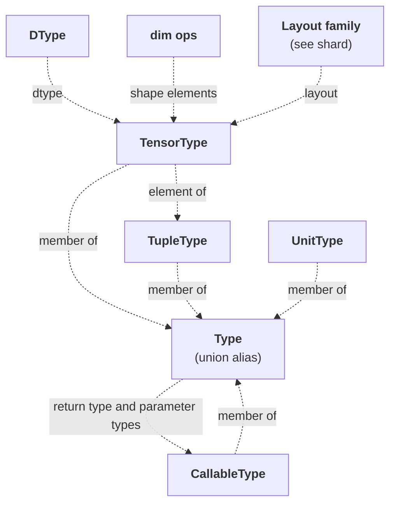

# TileFoundry Spec — Type System


```mermaid
flowchart TB
    Type["<b>Type</b><br/>(union alias)"]
    TensorType["<b>TensorType</b>"]
    TupleType["<b>TupleType</b>"]
    UnitType["<b>UnitType</b>"]
    CallableType["<b>CallableType</b>"]

    DType["<b>DType</b>"]
    dim["<b>dim ops</b>"]
    Layout["<b>Layout family</b><br/>(see shard)"]

    TensorType -. member of .-> Type
    TupleType -. member of .-> Type
    UnitType -. member of .-> Type
    CallableType -. member of .-> Type

    DType -. dtype .-> TensorType
    dim -. shape elements .-> TensorType
    Layout -. layout .-> TensorType

    TensorType -. element of .-> TupleType
    Type -. return type and parameter types .-> CallableType
```

## 1. `Type`

```python
Type = TensorType | TupleType | UnitType | CallableType
```

---

## 2. `TensorType`

```python
class TensorType:
    """Describe a tensor's logical type.

    Attributes:
        shape: attribute; Logical shape, invariant under sharding, storage, and layout.
        dtype: attribute; Element dtype.
        layout: attribute; Layout-family member, or no assigned layout.
        storage: attribute; Abstract result residency, unmaterialized residency, or None.
    """

    shape: tuple[ShapeDim, ...]
    dtype: DType
    layout: LayoutBase | None
    storage: StorageKind | None

    def scalar(
        dtype: DType,
        layout: LayoutBase | None = None,
        storage: StorageKind | None = StorageKind.RMEM,
    ) -> "TensorType": ...

    def meta_scalar(dtype: DType = DType.i64) -> "TensorType": ...
```

- constraints:
  - A *scalar* is `TensorType(shape=(), ...)` — a rank-0 tensor. There
    is no separate `Scalar` type.
  - `layout` is either `None` or one member of the `LayoutBase` hierarchy
    defined by [shard §2](./shard.md#2-layout-hierarchy).
  - `storage` is a `StorageKind` (`gmem` / `smem` / `rmem` / `host` / `tmem` /
    `umat`) or `None`. A concrete level (`gmem` / `smem` / `rmem` / `host` /
    `tmem`) is the value's **abstract result residency** — where the result tensor
    logically lives — not the transient register/ALU staging any individual step
    happens to use. `umat` marks an **unmaterialized** (placement-polymorphic)
    value: one present in the abstract IR that has not yet been committed to a
    concrete residency. A source value literal carries `storage=umat`. An
    unmaterialized value MUST be resolved to a concrete residency (or otherwise
    materialized) before codegen consumes it. `None` is unchanged — a tensor with
    no memory space (a shape-element scalar), distinct from `umat`.
  - For plain `Layout` / `ComposedLayout`, `layout.shape` MUST have the same rank
    and logical extents as `shape`; the layout describes the value whose type
    carries it. Consumers use this common contract rather than inspecting a
    `ComposedLayout` component.
  - For `ShardLayout`, `TensorType.shape` remains the logical shape;
    `ShardLayout.layout.shape` is the sharding-internal / per-shard
    layout shape and need not match `shape` axis-by-axis. `Reshard`
    preserves the logical shape; logical-shape rewrites go through
    `hir.tensor.Reshape`.
  - `Layout` / `ComposedLayout` MUST describe an injective mapping
    ([shard §2](./shard.md#2-layout-hierarchy)). Padding-style non-injective layouts are
    not supported.
  - A rank-0 tensor is well-formed. A rank-0 tensor with `storage=None` is the
    shape-element form; a rank-0 tensor with a memory `StorageKind` is an
    ordinary scalar holding one element.

Enforcement is owned by [tir §1.3](./tir.md#13-primfunction) / [hir §1.3](./hir.md#13-op);
dispatch is described in
[visitor-registry](./visitor-registry.md).

### 2.1 Recursive local projection

```python
def local_type_of(
    type: Type, *, level: str, topologies: tuple[Topology, ...]
) -> Type:
    """Project every tensor leaf to what one unit of a topology level holds.

    Args:
        type: Type to project.
        level: Topology level whose unit is being projected.
        topologies: Ordered declared topology levels with resolved extents.

    Returns:
        The recursively projected type.
    """
    ...
```

- constraints:
  - `local_type_of` MUST recursively project every tensor leaf and rebuild
    `TupleType` structure.
  - A `Split` at `level` or a coarser topology level MUST divide; a finer
    `Split`, `Broadcast`, and `Partial` MUST NOT divide.
  - Each resolved nested `ShardLayout` MUST be applied exactly once per layer.
    Every mesh axis MUST state its own extent, and local projection MUST use
    that extent without substituting a target or topology capacity. A stated
    static extent that does not divide the split dimension MUST raise. A
    symbolic tensor axis or mesh extent MUST be bound before local projection.
  - Every axis of a Mesh carrying one topology MUST be read at that topology
    level. A Mesh carrying multiple topologies remains a valid Mesh, but local
    projection MUST reject it when asking for a position count by topology name
    rather than assign one of its layout axes to a guessed level
    ([shard §5](./shard.md#5-mesh)).
  - The result MUST remain an ordinary IR Type and MUST NOT introduce a
    schedule-specific tensor type.
  - Unresolved layouts and local extents that are not concrete non-negative
    integers MUST raise at the projection boundary.

### 2.2 Logical size

```python
def numel(type: Type) -> int:
    """Return the logical element count over all tensor leaves.

    Args:
        type: Type to measure.

    Returns:
        The logical element count.
    """
    ...

def tensor_bytes(type: Type) -> int:
    """Return the logical byte size over all tensor leaves.

    Args:
        type: Type to measure.

    Returns:
        The logical byte size.
    """
    ...
```

- constraints:
  - Both MUST sum over the tensor leaves of a `TupleType` and MUST report `0`
    for a type with no tensor leaf.
  - Both MUST reject a symbolic or negative extent rather than skip it: a size
    that silently drops a dimension reads as a smaller tensor rather than as an
    unknown one. Both MUST report `0` for a concrete zero extent.
  - `tensor_bytes` MUST round a sub-byte dtype up to whole bytes per leaf,
    because a leaf is addressed on its own.
  - These MUST be the logical size the type states, so they MUST be the same
    number for every backend and MUST NOT live in a target package.

### `StorageKind` and `resolve_storage`

`StorageKind` is the type-system vocabulary for abstract tensor residency.
Target lowering decides whether a concrete level is supported by the active
target; storage resolution does not perform target capability validation.

```python
class StorageKind(IntEnum):
    """Memory-space level (backend-generic)."""

    HOST = 1
    GMEM = 2
    SMEM = 3
    RMEM = 4
    TMEM = 5
    UMAT = 6

    def __str__(self) -> str: ...


def resolve_storage(value: "str | StorageKind | None") -> "StorageKind | None":
    """Normalize a surface storage specification."""
    ...
```

- constraints:
  - `StorageKind` is defined and owned by `ir/types/storage.py`.
  - The member values and `str` spellings are `HOST=1` / `host`,
    `GMEM=2` / `gmem`, `SMEM=3` / `smem`, `RMEM=4` / `rmem`,
    `TMEM=5` / `tmem`, and `UMAT=6` / `umat`.
  - `resolve_storage` MUST pass through `None` and a `StorageKind` instance.
    It MUST accept exactly the canonical strings `host`, `gmem`, `smem`,
    `rmem`, and `tmem`, and MUST reject other strings and non-storage values.
  - `UMAT` is an IR-internal unmaterialized value and MUST NOT be accepted as
    a surface string.
  - The storage vocabulary is closed at the IR type boundary. It MUST NOT
    provide target-specific registration or capability validation.

---

## 3. `DType`

```python
class DType:
    """Describe an element type.

    Attributes:
        name: attribute; Canonical DSL spelling.
        bit_width: attribute; Logical number of bits per element.
    """

    name: str
    bit_width: int


class FloatDType(DType):
    """Describe a floating-point element type.

    Attributes:
        exponent_bits: attribute; Number of exponent bits.
        mantissa_bits: attribute; Number of explicit mantissa bits.
    """

    exponent_bits: int
    mantissa_bits: int


class IntegerDType(DType):
    """Describe an integer element type.

    Attributes:
        signed: attribute; Whether the integer representation is signed.
    """

    signed: bool


class BoolDType(DType):
    """Describe the boolean element type."""
```

The canonical descriptors are:

| Surface | Descriptor class | `bit_width` | Family-specific facts |
| --- | --- | ---: | --- |
| `DType.f32` | `FloatDType` | 32 | `exponent_bits=8`, `mantissa_bits=23` |
| `DType.f16` | `FloatDType` | 16 | `exponent_bits=5`, `mantissa_bits=10` |
| `DType.bf16` | `FloatDType` | 16 | `exponent_bits=8`, `mantissa_bits=7` |
| `DType.fp8e4m3` | `FloatDType` | 8 | `exponent_bits=4`, `mantissa_bits=3` |
| `DType.f8e8m0` | `FloatDType` | 8 | `exponent_bits=8`, `mantissa_bits=0` |
| `DType.f4e2m1` | `FloatDType` | 4 | `exponent_bits=2`, `mantissa_bits=1` |
| `DType.i32` | `IntegerDType` | 32 | `signed=True` |
| `DType.i64` | `IntegerDType` | 64 | `signed=True` |
| `DType.bool` | `BoolDType` | 1 | none |

- constraints:
  - `DType` MUST be an immutable descriptor hierarchy, not an `enum.Enum`.
  - Each surface value MUST be a process-lifetime singleton whose `name` equals
    the attribute spelling after `DType.`.
  - The table above is the complete built-in set. The type system MUST NOT
    expose custom registration or Enum-style `.value`, `__members__`, indexing,
    or iteration surfaces.
  - `DType.from_name(name)` is the single string → descriptor resolution
    surface. It MUST reject an unknown name and name the valid set in the
    diagnostic; every string-accepting surface (annotations, sugar, `Tensor[...]`)
    MUST resolve through it.
  - Descriptor equality and hashing MUST use the complete descriptor fields.
  - `DType` is independent of `layout` and `storage`.
  - `fp8e4m3` is the canonical fp8 spelling; no alternate fp8 spelling (e.g.
    `f8e4m3`) exists.
  - `fp8e4m3`, `f8e8m0`, and `f4e2m1` are low-precision dtypes: logical element
    types whose values enter and leave a computation through `Cast`. Type
    inference treats them like any other element type.
  - The evaluator supports `Cast` to and from `fp8e4m3` and `f8e8m0`; `f4e2m1`
    has no evaluator `Cast`, so evaluating a `Cast` targeting `f4e2m1` raises an
    unsupported-dtype error.

---

## 4. `dim.*` — symbolic shape dimensions

`shape` elements are values of the `ShapeDim` family:

- a plain Python `int` for fully static dims;
- a `DimVar(name, lo, hi)` value type (`core_ir.dim.DimVar`) for
  bounded dynamic dims; and
- a `core_ir.dim.*` `Expr` (e.g. `DimAdd` / `DimMul`) for derived
  dim expressions, returning a rank-0 integer `Expr` of dtype
  `i64` and `storage=None`. This rank-0 meta-scalar type
  (`shape=()`, `layout=EMPTY_LAYOUT`, `storage=None`) has exactly one
  constructor, `TensorType.meta_scalar(dtype)`.

```python
ShapeDim = int | DimVar | Expr


class DimConst(Op):
    """Produce a constant symbolic dimension.

    Attributes:
        value: attribute; Integer dimension value.
    """

    value: int


class DimVar(Op):
    """Produce a bounded named symbolic dimension.

    Attributes:
        name: attribute; Non-empty symbolic name.
        lo: attribute; Inclusive lower bound.
        hi: attribute; Exclusive upper bound.
    """

    name: str
    lo: int
    hi: int


class DimAdd(Op):
    """Produce the sum of two dimensions.

    Attributes:
        a: input; Left operand.
        b: input; Right operand.
    """

    a: Expr
    b: Expr


class DimSub(Op):
    """Produce the difference of two dimensions.

    Attributes:
        a: input; Left operand.
        b: input; Right operand.
    """

    a: Expr
    b: Expr


class DimMul(Op):
    """Produce the product of two dimensions.

    Attributes:
        a: input; Left operand.
        b: input; Right operand.
    """

    a: Expr
    b: Expr


class DimFloorDiv(Op):
    """Produce the floor quotient of two dimensions.

    Attributes:
        a: input; Dividend.
        b: input; Divisor.
    """

    a: Expr
    b: Expr


class DimMod(Op):
    """Produce the remainder of two dimensions.

    Attributes:
        a: input; Dividend.
        b: input; Divisor.
    """

    a: Expr
    b: Expr


class DimMin(Op):
    """Produce the minimum of two dimensions.

    Attributes:
        a: input; Left operand.
        b: input; Right operand.
    """

    a: Expr
    b: Expr


class DimMax(Op):
    """Produce the maximum of two dimensions.

    Attributes:
        a: input; Left operand.
        b: input; Right operand.
    """

    a: Expr
    b: Expr


def simplify_dim(op_cls: type[Op], args: tuple) -> Expr:
    """Build or constant-fold a dimension operation.

    Args:
        op_cls: Dimension operation class to construct.
        args: Operation operands.

    Returns:
        A folded constant or the canonical call.
    """
    ...


def is_dim_expr(value) -> bool:
    """Return whether a value is a valid dimension expression.

    Args:
        value: Candidate value.

    Returns:
        Whether the value belongs to the dimension-expression family.
    """
    ...


def dim_min(a, b) -> Expr:
    """Build a symbolic minimum.

    Args:
        a: Left dimension.
        b: Right dimension.

    Returns:
        The folded constant or symbolic minimum.
    """
    ...


def dim_max(a, b) -> Expr:
    """Build a symbolic maximum.

    Args:
        a: Left dimension.
        b: Right dimension.

    Returns:
        The folded constant or symbolic maximum.
    """
    ...


def ceildiv(a, b) -> Expr:
    """Build symbolic ceiling division.

    Args:
        a: Dividend dimension.
        b: Divisor dimension.

    Returns:
        The folded constant or symbolic ceiling quotient.
    """
    ...
```

- constraints:
  - Rank-0 shape-element tensors MUST use `storage=None` and carry no runtime
    memory.
  - Construction sites MUST use `TensorType.meta_scalar(dtype)` instead of
    restating its field tuple, so structural type equality holds across layers.
  - `DimVar` MUST use a non-empty `name` and plain integer `lo` and `hi` bounds
    satisfying `lo < hi`. Its envelope is half-open, `[lo, hi)`; `[k, k+1)` is
    the fixed symbolic dimension `k`.
  - `DimVar` identity MUST be canonical per `(name, lo, hi)`. Same-name
    dimensions in one function signature MUST agree on bounds.
  - Producers of arithmetic dimension calls MUST route construction through
    `simplify_dim`.
  - `simplify_dim` MUST fold two integer-valued constant operands, except
    division or modulo by zero; otherwise it MUST retain the canonical call.
    It MUST NOT perform algebraic identity folding.
  - `is_dim_expr` MUST accept non-boolean integers, `DimVar`, integer-valued
    `Constant`, and recursively valid calls to the seven dimension arithmetic
    operations, and MUST reject other values.
  - `ceildiv(a, b)` MUST compose the existing add, subtract, and floor-divide
    operations; it does not introduce a distinct Op.

---

## 5. `TupleType`

```python
class TupleType:
    """Describe a tuple of result types.

    Attributes:
        fields: attribute; Field types in result order.
    """

    fields: tuple[TensorType | "TupleType", ...]
```

- constraints:
  - A multi-output Op (e.g. [hir](./hir.md) `tensor.Split`) has
    `Call.type: TupleType` whose fields correspond to the outputs. A
    single-output Op has `Call.type: TensorType`. The typeinfer rule
    decides; see [visitor-registry §4](./visitor-registry.md#4-instance-1--typeinfer).
  - `TupleType` MUST NOT appear as the input type of any other Op. A
    tuple is consumed only via the `tuple_get_item` Op
    ([core-ir](./core-ir.md)). The exception for tuple-of-`Expr` formal
    parameters (e.g. `Concat`, `Stack`) is owned by
    [hir §1.3](./hir.md#13-op).

---

## 6. `UnitType`

```python
class UnitType:
    """Describe the empty result type of an effect-form Op."""
```

- constraints:
  - the result type of an effect-form Op; produces no readable value and
    appears in Stmt position as `Evaluate(op, args)`.

---

## 7. `CallableType`

```python
class CallableType:
    """Describe the type of a callable expression.

    Attributes:
        return_type: attribute; Callable result type.
        parameters: attribute; Parameter types in declaration order.
    """

    return_type: Type
    parameters: tuple[Type, ...]
```

- constraints:
  - `CallableType` is the type of any Expr that represents a callable
    value. Today the only producer is [hir §1.1](./hir.md#11-function) `Function`.
  - `parameters` is a tuple of parameter **types**; parameter names
    are not part of the type. Names live on `Function.params`
    (`Var.name`) at the IR level.
  - The host-ABI counterpart in
    [runtime §1.1.1](./runtime.md#111-runtimefunction) is a separate
    construct — `EntryABI` in `tilefoundry.runtime.function` — whose
    `ParamABI` records are `(name, type: TensorType)`: dtype / shape /
    storage / layout are reached through `type` rather than restated. The
    two live in different layers and are disambiguated by import path; do
    not conflate them.

---

## 8. Tensor type convenience constructors

```python
def make_tensor_type(
    shape: tuple,
    dtype: DType = DType.f32,
    storage: str | StorageKind | None = "gmem",
    layout: object = None,
) -> TensorType:
    """Build a plain tensor type.

    Args:
        shape: Logical tensor shape.
        dtype: Element dtype.
        storage: Abstract tensor residency.
        layout: Optional unsharded layout.

    Returns:
        The tensor type.
    """
    ...


def make_shard_tensor_type(
    shape: tuple,
    dtype: DType = DType.f32,
    storage: str | StorageKind | None = "gmem",
    mesh: Mesh | None = None,
    attrs: tuple = (),
) -> TensorType:
    """Build a canonical sharded tensor type.

    Args:
        shape: Logical tensor shape.
        dtype: Element dtype.
        storage: Abstract tensor residency.
        mesh: Optional sharding mesh.
        attrs: Shard attributes in mesh-axis order.

    Returns:
        The plain or canonically sharded tensor type.
    """
    ...
```

- constraints:
  - `make_tensor_type` MUST preserve `shape` as a tuple and pass the remaining
    fields to `TensorType`.
  - `make_shard_tensor_type` MUST return a plain tensor type when `mesh` is
    `None` or `attrs` is empty; otherwise it MUST build the layout through
    `canonical_shard_layout`.

## 9. Callable type projection

```python
def callable_type_for(params, return_type: Type) -> CallableType:
    """Project parameters and a return type into a callable type.

    Args:
        params: Parameter values whose types are projected.
        return_type: Callable result type.

    Returns:
        The callable type.
    """
    ...


def callable_type_for_prim_function(fn) -> CallableType:
    """Project a TIR primitive function into a callable type.

    Args:
        fn: Primitive function to project.

    Returns:
        The callable type with a unit result.
    """
    ...
```

- constraints:
  - `callable_type_for` MUST preserve parameter order and project only each
    parameter's `.type`; parameter names are not part of `CallableType`.
  - `callable_type_for_prim_function` MUST use `UnitType` as the return type.
