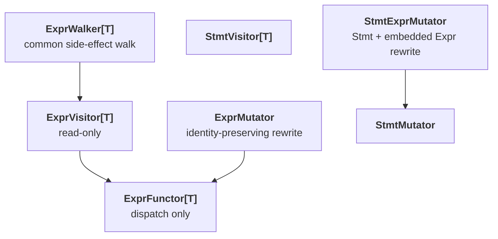

# TileFoundry Spec — IR Visitor / Mutator

The IR traversal / rewrite framework: `ExprFunctor[T]` /
`ExprVisitor[T]` / `ExprWalker[T]` / `ExprMutator` / `StmtVisitor[T]` /
`StmtMutator` / `StmtExprMutator`.
A shared compiler facility, owned by neither analysis nor any
specific pass.


```mermaid
flowchart TB
    ExprFunctor["<b>ExprFunctor[T]</b><br/>dispatch only"]
    ExprVisitor["<b>ExprVisitor[T]</b><br/>read-only"]
    ExprWalker["<b>ExprWalker[T]</b><br/>common side-effect walk"]
    ExprMutator["<b>ExprMutator</b><br/>identity-preserving rewrite"]
    StmtVisitor["<b>StmtVisitor[T]</b>"]
    StmtMutator["<b>StmtMutator</b>"]
    StmtExprMutator["<b>StmtExprMutator</b><br/>Stmt + embedded Expr rewrite"]

    ExprVisitor --> ExprFunctor
    ExprWalker --> ExprVisitor
    ExprMutator --> ExprFunctor
    StmtExprMutator --> StmtMutator
```

## 1. Role

Visitors and mutators are the standard base classes for **recursive
IR traversal and recursive IR rewrite**. Logic that needs to "walk
the IR and collect" or "walk the IR and emit new IR" inherits from
these classes; manual `isinstance` dispatch is not the convention.

- **Visitor** — read-only traversal. Returns a user-defined `T`.
  Used for aggregation / collection / verification.
- **Mutator** — recursive rewrite. Returns the same node kind
  (`Expr → Expr`, `Stmt → Stmt`). Used for lowering / simplification
  / structural rewrite.

The base classes only define traversal scaffolding. Business logic
is injected by overriding `visit_<ClassName>` in subclasses.

## 2. Dispatch convention

`visit_<ClassName>` static dispatch (no `singledispatch`):

- `visit_Call(self, call: Call) -> T` for `Call`,
- `visit_Var(self, var: Var) -> T` for `Var`,
- `visit_For(self, stmt: For) -> Stmt` for the `For` Stmt subclass,
- `visit_Evaluate(self, stmt: Evaluate) -> Stmt` for `Evaluate`,
- and so on.

`visit(node)` looks up `visit_<type(node).__name__>` on the subclass and calls
it, falling back to `default_visit(node)` when no such override exists.

- **Most-specific wins.** `Call` is a subclass of `Expr`, but with
  both `visit_Call` and `visit_Expr` defined, `visit_Call` wins —
  dispatch keys on the runtime class name.
- **Fallback to `default_visit(node)`.** `ExprFunctor.default_visit` raises
  `NotImplementedError`; a visitor or mutator must explicitly implement a
  node's behavior or call its child traversal/rebuild helper.
- **No Op-level dispatch lives here.** A `Call(target=Add)` is
  caught by `visit_Call`; per-Op dispatch is the analysis registry's
  responsibility ([visitor-registry](./visitor-registry.md)).

## 3. `ExprVisitor[T]`

Read-only Expr-tree traversal. `T` is user-chosen (`None` for
side-effect collection, `set[Var]` for free-var analysis, etc.).

```python
class ExprFunctor(Generic[T]):                     # dispatch only; no memo
    def visit(self, expr: Expr) -> T: ...          # dispatch to visit_<Type> else default_visit
    def default_visit(self, expr: Expr) -> T: ... # raises NotImplementedError

class ExprVisitor(ExprFunctor[T]):                 # read-only Expr traversal; T is user-chosen
    def dispatch_visit(self, expr: Expr) -> T: ...  # memoized single dispatch point
    def visit_operands(self, expr: Expr) -> None: ... # visits _expr_children(expr)
    def clear(self) -> None: ...                   # clears memo and root
```

- constraints:
  - `ExprVisitor` memoizes by `id(expr)` at `dispatch_visit`; each value keeps
    the original `Expr` alive together with the result to prevent id reuse.
  - `visit_operands` uses the fixed class-match table `_expr_children` in
    `ir/visitor.py`, not the dataclass-field walker `child_exprs` in
    `ir/core/expr.py`. It visits value children only and excludes binding-site
    Vars, including `GridRegionExpr.carried_args` and Function parameters.
  - `_expr_children` raises `AssertionError` for an unknown `Expr` subclass;
    it does not silently return an empty tuple.
  - The explicit `visit_function_body` entry supplies the root Function
    (`root_function` or the first Function passed to that helper) before
    applying `can_visit_function_body`. `visit_other_functions=True` allows
    that explicit entry to visit other Function bodies. This gate does not
    apply to `visit_operands`: when its `_expr_children` result is a
    `hir.Function`, it visits that Function's body unconditionally, preserving
    the existing recursive traversal behavior. The specialization walk is a
    future caller for the explicit gate.

`_expr_children(expr)` enumerates child Exprs of any Expr node by
fixed field order. The mapping is module-local and is the single
table that grows whenever a new Expr subclass appears:

| Node | Child Exprs |
|---|---|
| `Var` | `()` |
| `Constant` | `()` |
| `SymbolRef` | `()` |
| `Tuple` | `elements` |
| `Call` | `args` |
| `GridRegionExpr` | `init_args`, `body`, `yield_values` (binding-site Vars are excluded) |
| `hir.Function` | `body` (parameter binding-site Vars are excluded) |

The `GridRegionExpr` row intentionally excludes `carried_args`; passes that
collect dimension variables from carried bindings must enumerate that field
explicitly. `child_exprs` remains the broader dataclass-field helper for
module ownership and is not the visitor traversal contract.

Example — collect every `Var`:

```python
# example
class VarCollector(ExprVisitor[None]):
    def __init__(self) -> None:
        self.vars: set[Var] = set()
    def visit_Var(self, var: Var) -> None:
        self.vars.add(var)
```

`ExprWalker[T]` is the shared side-effect traversal layer for the standard
Expr shapes. It supplies no-op leaves for `Var`, `Constant`, `SymbolRef`, and
`ShapeOf`, and operand traversal for `Tuple`, `GridRegionExpr`, and
`hir.Function`. A side-effect pass inherits it and overrides only the node
types where it collects or derives state; all of those defaults use the same
memo and `_expr_children` contract.

## 4. `ExprMutator`

Recursive Expr rewrite returning the same node kind. Core invariant:
**when no child changed, return the original node** (identity
preservation).

```python
class ExprMutator(ExprFunctor[Expr]):                  # identity-preserving Expr rewrite
    def visit(self, expr: Expr) -> Expr: ...          # dispatch to visit_<Type> else default_visit
    def default_visit(self, expr: Expr) -> Expr: ...  # recurse/rebuild children; preserve identity
```

- constraints:
  - When no child changed, `default_visit` returns the original node (identity
    preservation).

`_rebuild_expr(expr, new_children)` constructs a new Expr of the
same subclass while preserving non-child fields (`type`, `source`).

Identity preservation matters for three reasons:

1. **Structural sharing.** Untouched subtrees stay shared with the
   input IR; downstream passes avoid rebuilding equivalent state.
2. **Change detection.** A pass can decide whether to retrigger
   downstream work via `new_expr is old_expr`.
3. **Cache validity.** `typeinfer` / cost caches keyed on Expr
   identity remain valid for unchanged nodes.

An Expr visitor `visit_Call` override that needs recursive children MUST call
`visit_operands(call)`. An Expr mutator override that needs the generic
identity-preserving rebuild MUST call `default_visit(call)`; it may return the
original node directly only after it has explicitly handled the children.

## 5. `StmtVisitor[T]` / `StmtMutator`

Same shape as the Expr family, but for the Stmt tree.

```python
class StmtVisitor(Generic[T]):                     # read-only Stmt-tree traversal
    def visit(self, stmt: Stmt) -> T: ...          # dispatch to visit_<Type> else generic_visit
    def generic_visit(self, stmt: Stmt) -> T: ...  # recurse child Stmts

class StmtMutator:                                    # identity-preserving Stmt rewrite
    def visit(self, stmt: Stmt) -> Stmt: ...          # dispatch to visit_<Type> else generic_visit
    def generic_visit(self, stmt: Stmt) -> Stmt: ...  # recurse child Stmts; invariant identical to ExprMutator
```

- constraints:
  - `StmtMutator`'s identity-preservation invariant is identical to `ExprMutator`.
  - `StmtVisitor` / `StmtMutator` do not descend into Expr fields embedded in
    Stmts; those are visited only through `StmtExprMutator` ([§6](#6-stmtexprmutator)).

`_stmt_children(stmt)` enumerates child Stmts only (Expr fields
come back via `StmtExprMutator`):

| Stmt | Child Stmts |
|---|---|
| `Sequential` | `body` |
| `PrimFunction` | `(body,)` |
| `For` / `While` | `(body,)` |
| `If` | `(then_body, else_body)` |
| `MeshScope` | `(body,)` |
| `LetStmt` | `(body,)` |
| `DispatchCall` | `case_calls`, then `fallback` |
| `Return` | `()` |
| `Evaluate` | `()` (leaf in the Stmt tree; its Expr fields are `args`, plus `callable` when `callable` is a `SymbolRef`) |
| `Abort` | `()` |

`StmtVisitor` / `StmtMutator` do **not** descend into Expr fields
embedded in Stmts — `For.start` / `For.stop` / `For.step` /
`While.cond` / `If.cond` / `LetStmt.value` / `Evaluate.args` (and
`Evaluate.callable` when it is a `SymbolRef`) are visited only when
`StmtExprMutator` is used ([§6](#6-stmtexprmutator)).

## 6. `StmtExprMutator`

Composite: rewrite the Stmt tree **and** descend into the Expr
fields embedded in Stmts. This is the most common combination
(every lowering / simplification / structural rewrite needs it).

```python
class StmtExprMutator(StmtMutator):                   # rewrite Stmts, and the Exprs embedded in their Expr-typed fields
    def visit_stmt(self, stmt: Stmt) -> Stmt: ...     # rewrite the Stmt tree via StmtMutator
    def visit_expr(self, expr: Expr) -> Expr: ...     # rewrite embedded value Exprs; shares ExprMutator's rewrite helper
    def generic_visit(self, stmt: Stmt) -> Stmt: ...  # StmtMutator recurse, then rewrite each Stmt's Expr fields
```

- constraints:
  - The rewrite scope is **embedded value Exprs**, not binding `Var`s.

`_rewrite_stmt_exprs(stmt, fn)` enumerates the Expr fields of each
Stmt subclass, applies `fn` with identity preservation, and rebuilds
when needed:

| Stmt | Expr fields |
|---|---|
| `LetStmt` | `value` (`var` is a `Var` and is not rewritten) |
| `For` | `start`, `stop`, `step` (`induction_var` is a `Var` and is not rewritten) |
| `While` | `cond` |
| `If` | `cond` |
| `Return` | (none — `@prim_func` has no value return) |
| `Evaluate` | `args` (and `callable` when it is a `SymbolRef`) |
| `MeshScope` / `Sequential` | (none) |

`α-renaming` and similar `Var`-rewriting passes use `StmtMutator`
directly to rebuild Stmts; they do not reuse `StmtExprMutator`.

## 7. Visitor entry forms for `Evaluate`

The TIR effect-form Ops (e.g. `Copy` / `Fill` / `Mma` / `ReLU` /
`RMSNorm` / `Reduce`) are `Op` subclasses, not `Stmt` subclasses; in
Stmt position they appear as `Evaluate(callable=op, args)` so the
invocation can sit in `Sequential` body position. Passes and visitors
MUST match on `Evaluate` and dispatch on `type(callable)`:

a `visit_Evaluate(self, stmt)` override branches on `type(stmt.callable)`
(e.g. `Copy`).

`StmtVisitor` / `StmtMutator` recognise `Evaluate` as a
leaf-in-stmt-tree — `_stmt_children(Evaluate)` is empty.
`StmtExprMutator` exposes `Evaluate`'s `args` (and its `callable` when
that is a `SymbolRef`) as Expr fields, so Expr-level rewrites still
reach them. A value-form `Call` to a TIR effect-form Op in Stmt
position, instead of `Evaluate(op, args)`, is malformed IR
([tir §1.4](./tir.md#14-evaluate)).

## 8. Implementation location

- Public exports: `ExprFunctor`, `ExprVisitor`, `ExprWalker`, `ExprMutator`, `StmtVisitor`,
  `StmtMutator`, `StmtExprMutator`, `walk_prim_function`,
  `rewrite_prim_function`.
- The four child-enumeration / rebuild tables
  (`_expr_children`, `_rebuild_expr`, `_stmt_children`,
  `_rewrite_stmt_exprs`) are module-private. Adding a new Expr or
  Stmt subclass requires extending the relevant tables in this
  single file; downstream IR node files are not affected.

## 9. PrimFunction helpers

```python
def walk_prim_function(visitor: StmtVisitor, pf: PrimFunction) -> None: ...
def rewrite_prim_function(
    mutator: StmtMutator,
    pf: PrimFunction,
) -> PrimFunction: ...
```

- constraints:
  - `walk_prim_function` visits `pf.body`; it does not visit the
    `PrimFunction` wrapper itself.
  - `rewrite_prim_function` rewrites `pf.body` and returns the original
    `PrimFunction` when the body is identity-unchanged. Otherwise it returns a
    copy with the rewritten `Sequential` body.
