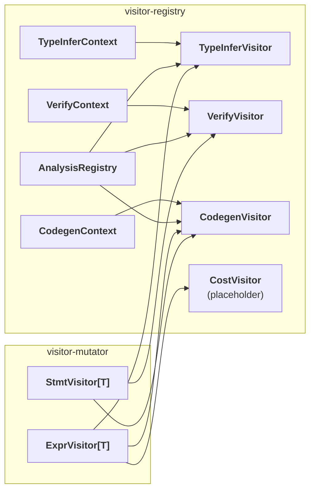

# TileFoundry Spec — Visitor Registry

The derived-visitor pattern: every `analysis` / `verify` / `codegen`
walker is the same template — **base visitor + custom Context +
per-class registry**. This spec defines the template and its four
instances (`typeinfer` / `verify` / `codegen_<target>` / `cost`).

The settled split:

- **`typeinfer`** dispatches on any Expr-producing `Op`'s `Call` —
  HIR value Ops plus TIR-owned Expr Ops (`tir.memory.AllocTensor` /
  `tir.memory.{PtrOf,MemorySpan,TensorView}` / `tir.scalar.*`). It
  fills / refreshes `Expr.type`.
- **`verify`** dispatches on TIR `Stmt` (control-flow / binding /
  `Evaluate`) plus cross-function invariants (`Evaluate(SymbolRef)`
  callee resolution, mesh scope, layout homogeneity). A Stmt verify
  rule MAY recursively retrigger `typeinfer` on embedded Expr fields.

Concrete per-node verify / typeinfer / emit rules belong with the
node owner ([tir](./tir.md) / [hir](./hir.md) / [parser](./parser.md)
/ [target](./target.md)). This spec defines **how** rules are
plugged into the dispatch chain, not **what** the rules say.



## 1. Role

[visitor-mutator](./visitor-mutator.md) defines the **traversal**
scaffold (how to recurse the IR). This spec defines the **dispatch**
scaffold (after recursing to a node, how to look up the per-class
business handler and call it).

Any "walk the IR and run analysis / rewrite / emit" job follows the
same template:

1. inherit a `Visitor` / `Mutator` base,
2. carry a custom `Context` (mutable state + caches + helpers),
3. inside `visit_<ClassName>` consult an `AnalysisRegistry` to find
   the handler and invoke `fn(node, ctx)`.

### 1.1 Registry is not a property of `StmtVisitor` / `ExprVisitor`

`StmtVisitor` / `ExprVisitor` know nothing about any registry — they
are pure traversal scaffolds (see
[visitor-mutator](./visitor-mutator.md)). The behaviour
"a `Stmt` subclass consults `verify_stmt_registry`" is wired into
`VerifyVisitor` explicitly, not granted to every `StmtVisitor`
subclass automatically.

```python
# StmtVisitor itself does not consult any registry:
class StmtVisitor(Generic[T]):
    def generic_visit(self, stmt): ...   # pure recursion, no registry lookup

# VerifyVisitor is the derived class that holds a registry reference:
class VerifyVisitor(StmtVisitor[None]):
    def __init__(self, ctx: VerifyContext, registry=verify_stmt_registry):
        self.ctx = ctx
        self.registry = registry          # explicit binding point

    def generic_visit(self, stmt: Stmt) -> None:
        fn = self.registry.lookup(type(stmt))
        if fn is not None:
            fn(stmt, self.ctx)
        super().generic_visit(stmt)
```

`@register_verify_stmt(Copy)` writes a handler into
`verify_stmt_registry`; `VerifyVisitor.generic_visit` reads from the
**same module-level `AnalysisRegistry` instance**. That shared
reference is the only thing pairing the two — swap the registry and
you swap the analysis.

### 1.2 Two ways to write a visitor

- **Fixed-logic visitor.** Inherit `ExprVisitor` / `StmtVisitor` and
  hand-write `visit_Call` / `visit_For` / … overrides. No registry
  needed. Use this for "rules pinned to one place, no third-party
  extension expected" passes (e.g. a one-shot rewrite).
- **Extensible visitor.** Define a `Context` + `AnalysisRegistry` +
  `register_*` decorator, and have the visitor consult its own
  registry inside `generic_visit`. Use this when third-party code
  should be able to plug in handlers per node class
  (`typeinfer` / `verify` / `codegen` are all this shape).

Registry is opt-in; it only matters when third-party extension is a
goal. The four-step recipe for building a brand-new extensible
analysis is in [§10](#10-defining-a-new-extensible-analysis).

## 2. Core contract

Two node shapes can be registry-dispatched:

- **Op (value-producing).** Used via `Call(target=Op, args)`. The Op
  subclass is the registry key; handler signature is
  `(call: Call, ctx) -> T`.
- **Stmt (effect-producing).** A direct `Stmt` subclass — control
  flow, binding, `Evaluate`, user `@intrinsic`. The Stmt subclass is
  the registry key; handler signature is `(stmt: Stmt, ctx) -> T`.

A given analysis registry keys exactly one of the two. The four
instances split as follows:

| Instance | Op-branch handler | Stmt-branch handler | Notes |
|---|---|---|---|
| **typeinfer** | `(Call, TypeInferContext) -> TensorType \| TupleType` | — | Value-producing only |
| **verify** | — | `(Stmt, VerifyContext) -> None` | Effect-side constraints; for `Evaluate(op, args)`, dispatch keys on the Op class — see [§4](#4-instance-2--verify) |
| **codegen_\<target\>** | `(Call, CodegenContext) -> str` | `(Stmt, CodegenContext) -> None` | Both sides are emitted |
| **cost** (placeholder) | `(Call, CostContext) -> Cost` | `(Stmt, CostContext) -> Cost` (optional) | Not implemented in MVP |

Generic control-flow / binding Stmts (`For` / `If` / `While` /
`LetStmt` / `Sequential` / `MeshScope` / `Return`) are handled by
the visitor base's `generic_visit` recursion and are not routed
through any registry — their semantic rules are owned by
[tir](./tir.md) / [hir](./hir.md), not by this spec.

## 3. `AnalysisRegistry`

All four instances share one registry implementation. It is a
class-keyed dict with a duplicate-registration guard.

```python
from typing import Callable, Generic, TypeVar
from tilefoundry.ir.core import Op
from tilefoundry.ir.tir import Stmt

Key = TypeVar("Key")            # type[Op] or type[Stmt]

class AnalysisRegistry(Generic[Key]):
    """Class → handler dict. Double registration raises;
    lookup miss returns None."""

    def __init__(self, name: str):
        self.name = name
        self._map: dict[Key, Callable] = {}

    def register(self, cls: Key, fn: Callable) -> None:
        if cls in self._map:
            raise RuntimeError(f"{self.name}: {cls.__name__} already registered")
        self._map[cls] = fn

    def lookup(self, cls: Key) -> Callable | None:
        return self._map.get(cls)

    def has(self, cls: Key) -> bool:
        return cls in self._map
```

Invariants:

- A registry MUST raise on double registration of the same class;
  subclasses do not inherit a parent's handler. Each concrete
  `Op` / `Stmt` subclass either registers itself explicitly or is
  caught by the visitor's `generic_visit` fallback.
- `lookup` returns `None` on a miss. The caller decides whether a
  miss is an error or a fallback. `VerifyVisitor` falls back to
  `generic_visit` on a miss (an unregistered Stmt simply has no
  custom verify rule); `TypeInferContext` raises (every Op call
  MUST have a typeinfer rule).

## 4. Instance 1 — `typeinfer`

Context:

```python
from dataclasses import dataclass, field
from tilefoundry.ir.core import Module, Expr, Call, Var, Constant, Tuple
from tilefoundry.ir.types import TensorType, TupleType

@dataclass
class TypeInferContext:
    module: Module
    cache: dict[Expr, TensorType | TupleType] = field(default_factory=dict)

    def type_of(self, expr: Expr) -> TensorType | TupleType:
        """Lazy compute + cache; supports recursive child queries."""
        if expr not in self.cache:
            self.cache[expr] = self._compute(expr)
        return self.cache[expr]

    def _compute(self, expr: Expr) -> TensorType | TupleType:
        if isinstance(expr, Constant):
            return _constant_type(expr.value)
        if isinstance(expr, Var):
            return expr.type
        if isinstance(expr, Call):
            fn = typeinfer_registry.lookup(type(expr.target))
            if fn is None:
                self.error(expr, f"no typeinfer registered for {type(expr.target).__name__}")
            return fn(expr, self)
        if isinstance(expr, Tuple):
            return TupleType(fields=tuple(self.type_of(f) for f in expr.fields))
        raise AssertionError(f"unreachable Expr subclass {type(expr).__name__}")

    def error(self, node, msg: str): ...   # see §7
```

Registry + decorator:

```python
typeinfer_registry: AnalysisRegistry[type[Op]] = AnalysisRegistry("typeinfer")

def register_typeinfer(op_cls: type[Op]):
    def decorator(fn):
        typeinfer_registry.register(op_cls, fn)
        return fn
    return decorator
```

Handler signature: `(call: Call, ctx: TypeInferContext) -> TensorType | TupleType`.

```python
# src/tilefoundry/ir/hir/math/binary.py
@register_typeinfer(Binary)
def _(call: Call, ctx: TypeInferContext) -> TensorType:
    lhs = ctx.type_of(call.args[0])
    rhs = ctx.type_of(call.args[1])
    if lhs.dtype != rhs.dtype:
        ctx.error(call, "dtype mismatch")
    return TensorType(
        shape=_broadcast(lhs.shape, rhs.shape),
        dtype=lhs.dtype,
        layout=_merge_layout(lhs.layout, rhs.layout),
        storage=_merge_storage(lhs.storage, rhs.storage),
    )
```

Visitor:

```python
from tilefoundry.ir.visitor import ExprVisitor

class TypeInferVisitor(ExprVisitor[TensorType | TupleType]):
    """Walks an HIR Function body, delegates to ctx.type_of for each Expr,
    fills Expr.type along the way."""
    def __init__(self, ctx: TypeInferContext): self.ctx = ctx
    def visit_Call(self, call: Call): return self.ctx.type_of(call)
    def visit_Var(self, var: Var):    return var.type
```

Lifecycle: parser builds a `TypeInferContext` and runs eager
typeinfer at parse time (see [parser](./parser.md)). A `Module`
entering the pass pipeline already has every `Expr.type` filled.
There is no "first TypeInferPass". When a transform changes the
expression structure and needs to recompute types, it calls
`typeinfer_registry.lookup(...)` directly (see
[passes](./passes.md)).

### 4.1 Forward relation service — `type_relation`

A second registry exposes each op's access relation as a **forward**
service that typeinfer consumes. Its result carrier is:

```python
@dataclass(frozen=True)
class AccessRelationResult:
    domain: isl.set
    maps: tuple[isl.map, ...]
```

#### `domain`

The op's bounded iteration domain as an `isl.set`. Static iteration
extents are constant constraints (`0 <= i < N`); a dynamic extent is an
isl parameter (one per `DimVar`). The domain's rank is fixed and is read
from the input types.

#### `maps`

One access `isl.map` per boundary value, in boundary order — inputs
first, then outputs — each mapping the iteration domain to that tensor's
index space. The carrier holds **no** tensor shape: the output shape is
typeinfer-side data, not part of the relation (see
[analysis §1.1](./analysis.md#11-relation-derived-type-behavior)).

Registry + decorator:

```python
type_relation_registry: AnalysisRegistry[type[Op]] = AnalysisRegistry("type_relation")

def register_type_relation(op_cls: type[Op]):
    def decorator(fn):
        type_relation_registry.register(op_cls, fn)
        return fn
    return decorator
```

Handler signature:
`(call: Call, input_types: tuple[Type, ...], ctx: TypeInferContext) -> AccessRelationResult`.

The handler MUST read only `input_types` and the op's attributes. It MUST
NOT read the Call's own output type (`ctx.type_of(call)`), so the builder
runs before the output type exists and typeinfer can call it without a
cycle. `build_relation(call, input_types, ctx)` looks the handler up and
returns its result, or `None` when the op has no registered builder.

## 5. Instance 2 — `verify`

Context (extends `TypeInferContext` to share the type-of cache):

```python
@dataclass
class VerifyContext(TypeInferContext):
    """Verify shares typeinfer's cache and adds a mesh-scope stack."""
    mesh_stack: list = field(default_factory=list)
```

Registry + decorator:

```python
verify_stmt_registry: AnalysisRegistry[type] = AnalysisRegistry("verify_stmt")

def register_verify_stmt(cls: type):
    def decorator(fn):
        verify_stmt_registry.register(cls, fn)
        return fn
    return decorator
```

Handler signature: `(node, ctx: VerifyContext) -> None`. Failure
routes through `ctx.error(node, msg)` which raises `VerifyError`.

**`Evaluate(op, args)` dispatch.** TIR effect-form Ops
(`Copy` / `Fill` / `Mma` / `ReLU` / `RMSNorm` / `Reduce`) appear in
Stmt position as `Evaluate(callable=op, args)`. The verify path keys
on the Op class, not on `Evaluate` itself: `register_verify_stmt`
takes the **Op class**, and `VerifyVisitor.generic_visit` —
together with `tir.verify._walk_stmt` — detects `Evaluate` and
dispatches `verify_stmt_registry.lookup(type(stmt.callable))`. The
registry key is the Op class; the handler input shape is owned by the
registry implementation. The stable IR shape is `Evaluate(op, args)`;
the stable IR does not wrap a value-form `Call` inside `Evaluate`. See
[visitor-mutator §7](./visitor-mutator.md)
for the matching visitor entry-form contract and
[tir §2.2](./tir.md#22-evaluate) for the wrapper definition.

```python
# src/tilefoundry/ir/tir/memory/copy.py
@register_verify_stmt(Copy)
def _(call: Call, ctx: VerifyContext) -> None:
    src = ctx.type_of(call.args[0])
    dst = ctx.type_of(call.args[1])
    if src.shape != dst.shape:
        ctx.error(call, "shape mismatch in Copy")
    if src.dtype != dst.dtype:
        ctx.error(call, "dtype mismatch in Copy")
```

Per-stmt rules (shape / dtype / layout constraints) belong in
[tir](./tir.md).

Visitor:

```python
from tilefoundry.ir.visitor import StmtVisitor

class VerifyVisitor(StmtVisitor[None]):
    """Recursively walks PrimFunction.body; per Stmt subclass tries the registry.
    The registry is injected via __init__, not baked into StmtVisitor (§1.1)."""

    def __init__(self, ctx: VerifyContext, registry: AnalysisRegistry = verify_stmt_registry):
        self.ctx = ctx
        self.registry = registry

    def generic_visit(self, stmt: Stmt) -> None:
        fn = self.registry.lookup(type(stmt))
        if fn is not None:
            fn(stmt, self.ctx)
        # Unregistered Stmts (control flow / LetStmt / Sequential / …) just
        # recurse via the base class. Adding a custom verify rule for one of
        # them is a register_verify_stmt call away.
        super().generic_visit(stmt)

    def visit_MeshScope(self, stmt):
        self.ctx.mesh_stack.append(stmt.mesh)
        try:
            super().generic_visit(stmt)
        finally:
            self.ctx.mesh_stack.pop()
```

**Unregistered semantics.** A Stmt subclass without
`register_verify_stmt` does not error — `VerifyVisitor` simply
recurses through it. Generic control-flow / binding Stmts use this
fallback; their semantic constraints (e.g. `For.step != 0`,
`If.cond` is `bool`, `LetStmt` binding rules) are owned by
[tir](./tir.md) and registered there, not in this spec.

## 6. Instance 3 — `codegen_<target>`

Context (skeleton; per-target fields live in [target](./target.md)):

```python
@dataclass
class CodegenContext:
    module: Module
    output: list[str]           # accumulated code fragments
    symbol_table: dict          # Var → emitted identifier
    indent: int = 0
    # target-specific fields owned by target.md
```

Registry per target:

```python
codegen_cuda_registry: AnalysisRegistry[type] = AnalysisRegistry("codegen_cuda")
codegen_cpu_registry:  AnalysisRegistry[type] = AnalysisRegistry("codegen_cpu")

def register_codegen_cuda(cls: type[Op] | type[Stmt]):
    def decorator(fn):
        codegen_cuda_registry.register(cls, fn)
        return fn
    return decorator
```

Each target has its own registry. Keys may be `type[Op]` (TIR-owned
Expr Op handlers — `tir.memory.AllocTensor` /
`tir.memory.{PtrOf,MemorySpan,TensorView}` / `tir.scalar.*`) or
`type[Stmt]` (Stmt handlers).

Handler signatures:

- Op-branch: `(call: Call, ctx: CodegenContext) -> str` — returns a
  target code fragment (used as a sub-expression by an outer Stmt
  emitter).
- Stmt-branch: `(stmt: Stmt, ctx: CodegenContext) -> None` — emits
  one or more lines into `ctx.output`.

```python
# src/tilefoundry/codegen/cuda/tir/scalar/relu.py
@register_codegen_cuda(TirScalarReLU)
def _(call: Call, ctx: CodegenContext) -> str:
    x = ctx.emit_expr(call.args[0])
    return f"tilefoundry::ReLUOp{{}}({x})"

# src/tilefoundry/codegen/cuda/tir/memory/copy.py
@register_codegen_cuda(Copy)
def _(stmt: Copy, ctx: CodegenContext) -> None:
    src = ctx.emit_expr(stmt.source)
    dst = ctx.emit_expr(stmt.destination)
    ctx.emit_line(f"cute::copy({src}, {dst});")
```

Visitor:

```python
class CodegenVisitor:
    """Combines the StmtVisitor + ExprVisitor sides; routes per node class
    through the per-target registry."""

    def __init__(self, ctx: CodegenContext, target: str):
        self.ctx = ctx
        self.registry = _codegen_registry_for(target)

    def emit_stmt(self, stmt: Stmt) -> None:
        fn = self.registry.lookup(type(stmt))
        if fn is not None:
            fn(stmt, self.ctx); return
        self._emit_default_stmt(stmt)   # control flow, default emit owned by target.md

    def emit_expr(self, expr: Expr) -> str:
        if isinstance(expr, Call):
            fn = self.registry.lookup(type(expr.target))
            if fn is None:
                raise RuntimeError(f"no codegen for Op {type(expr.target).__name__} on target")
            return fn(expr, self.ctx)
        return self._emit_default_expr(expr)
```

User extension path — adding a new Stmt `MyIntrinsic`:

1. `ir/tir/<cat>/my_intrinsic.py`: define `MyIntrinsic(Stmt)` and
   `@register_verify_stmt(MyIntrinsic)`.
2. `codegen/cuda/tir/<cat>/my_intrinsic.py`:
   `@register_codegen_cuda(MyIntrinsic)`.
3. For a new target (cpu, …): add the corresponding
   `@register_codegen_cpu(MyIntrinsic)` in
   `codegen/cpu/tir/<cat>/my_intrinsic.py`.

The visitor / pass pipeline / parser do not change.

## 7. Instance 4 — `cost` (placeholder)

The interface mirrors `typeinfer` / `codegen` but **MVP registers no
handlers**.

```python
@dataclass
class Cost:
    flops: int
    bytes: int

@dataclass
class CostContext(TypeInferContext): ...

costmodel_registry: AnalysisRegistry[type[Op]] = AnalysisRegistry("costmodel")

def register_costmodel(op_cls: type[Op]):
    def decorator(fn):
        costmodel_registry.register(op_cls, fn)
        return fn
    return decorator

class CostVisitor(ExprVisitor[Cost]):
    ...
```

Only the interface signature is reserved for future extension.
Cost-based decision rules are not in scope here.

## 8. Shared helpers

### 8.1 `ctx.error`

`TypeInferContext` and every Context that inherits it provides a
single error helper:

```python
def error(self, node: Expr | Stmt, msg: str):
    if isinstance(node, Call):
        name = node.target.__class__.__name__
    else:
        name = node.__class__.__name__
    raise VerifyError(f"{name}: {msg}\n  at {getattr(node, 'source', '<unknown>')}")
```

Handlers MUST surface constraint failures via `ctx.error(node, msg)`;
hand-rolled `raise` is not the convention. This keeps the error
format stable.

### 8.2 Other helpers

`_constant_type` / `_broadcast` / `_merge_layout` /
`_merge_storage` are implementation-side helpers. They live next to
the Op files that use them (`ir/types/`, op modules) and are not
constrained by this spec.

## 9. Registration timing — import-time side effects

`@register_*` decorators are import-time side effects.
`ir/hir/__init__.py`, `ir/tir/__init__.py`, and
`codegen/<target>/__init__.py` perform a recursive walk so every
submodule is imported and every `@register_*` runs:

```python
# src/tilefoundry/ir/hir/__init__.py
import pkgutil, importlib

def _auto_import(pkg_name: str):
    pkg = importlib.import_module(pkg_name)
    for _, modname, _ in pkgutil.walk_packages(pkg.__path__, pkg_name + "."):
        importlib.import_module(modname)

_auto_import("tilefoundry.ir.hir")              # fires HIR @register_typeinfer / @register_op
_auto_import("tilefoundry.codegen.cuda.tir")    # fires CUDA @register_codegen_cuda
```

`import tilefoundry` triggers the walk once; every registry is fully
populated. Re-imports are idempotent (Python caches the module;
`AnalysisRegistry.register` does not re-run the import-time body).

## 10. Defining a new extensible analysis

When adding a per-node-class extensible analysis (say "alias
analysis on top of typeinfer", or "emit for a new target"), follow
the four-step recipe.

### Step 1 — define a Context

```python
@dataclass
class AliasContext(TypeInferContext):
    alias_sets: dict[Var, set[Var]] = field(default_factory=dict)
```

### Step 2 — declare a registry + decorator

```python
from tilefoundry.visitor_registry import AnalysisRegistry

alias_registry: AnalysisRegistry[type[Op]] = AnalysisRegistry("alias")

def register_alias(op_cls: type[Op]):
    def deco(fn):
        alias_registry.register(op_cls, fn)
        return fn
    return deco
```

Pick `type[Op]` for an analysis that walks `Call`s, `type[Stmt]` for
one that walks effect Stmts; declare both registries if both are
needed.

### Step 3 — derive a Visitor that holds the registry explicitly

```python
from tilefoundry.ir.visitor import ExprVisitor

class AliasVisitor(ExprVisitor[None]):
    def __init__(self, ctx: AliasContext, registry: AnalysisRegistry = alias_registry):
        self.ctx = ctx
        self.registry = registry        # explicit binding

    def visit_Call(self, call: Call) -> None:
        fn = self.registry.lookup(type(call.target))
        if fn is not None:
            fn(call, self.ctx)
        super().generic_visit(call)
```

### Step 4 — register handlers in the Op files

```python
# src/tilefoundry/ir/hir/tensor/reshape.py
@register_alias(Reshape)
def _(call: Call, ctx: AliasContext) -> None:
    src = call.args[0]
    ctx.alias_sets.setdefault(src, {src}).add(call)
```

These four steps are what every existing instance
(typeinfer / verify / codegen) is doing. A new analysis is **peer**
to them — no existing visitor / registry / dispatch code changes.

The contract: callers own their `AnalysisRegistry`, their `Visitor`
subclass (built on
[visitor-mutator](./visitor-mutator.md)), and their `Context`
dataclass. Composition is explicit; there is no hidden
framework-side magic that auto-binds them.
