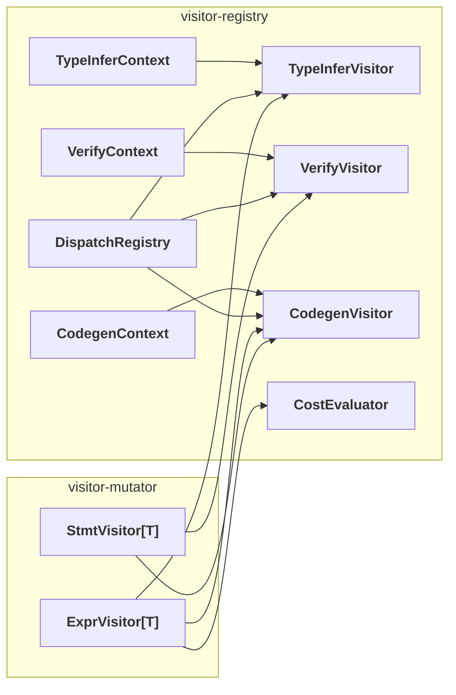

# TileFoundry Spec — Visitor Registry

The derived-visitor pattern: every `analysis` / `verify` / `codegen`
walker is the same template — **base visitor + custom Context +
per-class registry**. This spec defines the template and its four
instances (`typeinfer` / `verify` / `codegen` / `cost`).

The settled split:

- **`typeinfer`** dispatches on any Expr-producing `Op`'s `Call` —
  HIR value Ops plus TIR-owned Expr Ops (`tir.memory.AllocTensor` /
  `tir.memory.{PtrOf,MemorySpan,TensorView}` / `tir.scalar.*`). It
  fills / refreshes `Expr.type`.
- **`verify`** dispatches on TIR `Stmt` (control-flow / binding /
  `Evaluate`) plus cross-function invariants (`Evaluate(SymbolRef)`
  callee resolution, mesh scope, layout homogeneity). A Stmt verify
  rule MAY recursively retrigger `typeinfer` on embedded Expr fields.

Concrete per-node verify / typeinfer / emit rules belong with the
node owner ([tir](./tir.md) / [hir](./hir.md) / [parser](./parser.md)
/ [target](./target.md)). This spec defines **how** rules are
plugged into the dispatch chain, not **what** the rules say.


```mermaid
flowchart LR
    subgraph framework["visitor-mutator"]
        ExprVis["<b>ExprVisitor[T]</b>"]
        StmtVis["<b>StmtVisitor[T]</b>"]
    end

    subgraph registry["visitor-registry"]
        Reg["<b>DispatchRegistry</b>"]
        TypeVis["<b>TypeInferVisitor</b>"]
        VerifyVis["<b>VerifyVisitor</b>"]
        CodegenVis["<b>CodegenVisitor</b>"]
        CostVis["<b>CostEvaluator</b>"]
        TICtx["<b>TypeInferContext</b>"]
        VCtx["<b>VerifyContext</b>"]
        CCtx["<b>CodegenContext</b>"]
    end

    ExprVis --> TypeVis
    StmtVis --> VerifyVis
    StmtVis --> CodegenVis
    ExprVis --> CodegenVis
    ExprVis --> CostVis

    Reg --> TypeVis
    Reg --> VerifyVis
    Reg --> CodegenVis

    TICtx --> TypeVis
    VCtx --> VerifyVis
    CCtx --> CodegenVis
```

## 1. Role

[visitor-mutator](./visitor-mutator.md) defines the **traversal**
scaffold (how to recurse the IR). This spec defines the **dispatch**
scaffold (after recursing to a node, how to look up the per-class
business handler and call it).

Any "walk the IR and run analysis / rewrite / emit" job follows the
same template:

1. inherit a `Visitor` / `Mutator` base,
2. carry a custom `Context` (mutable state + caches + helpers),
3. inside `visit_<ClassName>` consult a `DispatchRegistry` to find
   the handler and invoke `fn(node, ctx)`.

### 1.1 Registry is not a property of `StmtVisitor` / `ExprVisitor`

`StmtVisitor` / `ExprVisitor` know nothing about any registry — they
are pure traversal scaffolds (see
[visitor-mutator](./visitor-mutator.md)). The behaviour
"a `Stmt` subclass consults `verify_stmt_registry`" is wired into
`VerifyVisitor` explicitly, not granted to every `StmtVisitor`
subclass automatically.

The canonical `StmtVisitor` interface and its pure-recursion contract are
owned by [visitor-mutator §5](./visitor-mutator.md#5-stmtvisitort--stmtmutator).
`VerifyVisitor`, defined in [§5](#5-instance-2--verify), is the derived class
that adds an explicit registry binding point.

`@register_verify_stmt(Copy)` writes a handler into
`verify_stmt_registry`; `VerifyVisitor.generic_visit` reads from the
**same module-level `DispatchRegistry` instance**. That shared
reference is the only thing pairing the two — swap the registry and
you swap the analysis.

### 1.2 Two ways to write a visitor

- **Fixed-logic visitor.** Inherit `ExprVisitor` / `StmtVisitor` and
  hand-write `visit_Call` / `visit_For` / … overrides. No registry
  needed. Use this for "rules pinned to one place, no third-party
  extension expected" passes (e.g. a one-shot rewrite).
- **Extensible visitor.** Define a `Context` + `DispatchRegistry` +
  `register_*` decorator, and have the visitor consult its own
  registry inside `generic_visit`. Use this when third-party code
  should be able to plug in handlers per node class
  (`typeinfer` / `verify` / `codegen` are all this shape).

Registry is opt-in; it only matters when third-party extension is a
goal. The four-step recipe for building a brand-new extensible
analysis is in [§10](#10-defining-a-new-extensible-analysis).

## 2. Core contract

Two node shapes can be registry-dispatched:

- **Op (value-producing).** Used via `Call(target=Op, args)`. The Op
  subclass is the registry key; handler signature is
  `(call: Call, ctx) -> T`.
- **Stmt (effect-producing).** A direct `Stmt` subclass — control
  flow, binding, `Evaluate`, user `@intrinsic`. The Stmt subclass is
  the registry key; handler signature is `(stmt: Stmt, ctx) -> T`.

A registry that asks about a node alone keys exactly one of the two.
Code generation asks about more than the node, so its key carries the
class alongside the other two things the answer depends on
([§6](#6-instance-3--codegen)). The instances split as follows:

| Instance | Op-branch handler | Stmt-branch handler | Notes |
|---|---|---|---|
| **typeinfer** | `(Call, TypeInferContext) -> Type` | — | Call result typing, including `UnitType` for effect Ops |
| **verify** | — | `(Stmt, VerifyContext) -> None` | Effect-side constraints; for `Evaluate(op, args)`, dispatch keys on the Op class — see [§5](#5-instance-2--verify) |
| **codegen** | `(Call, CodegenContext) -> str` | `(Stmt, CodegenContext) -> None` | Both sides are emitted; the key also carries the target and the position — see [§6](#6-instance-3--codegen) |
| **cost** | `(Call, CostContext) -> Cost` | `(Stmt, CostContext) -> Cost` (optional) | Recursive-local logical work |

Generic control-flow / binding Stmts (`For` / `If` / `While` /
`LetStmt` / `Sequential` / `MeshScope` / `Return`) are handled by
the visitor base's `generic_visit` recursion and are not routed
through any registry — their semantic rules are owned by
[tir](./tir.md) / [hir](./hir.md), not by this spec.

## 3. `DispatchRegistry`

Every instance shares one registry implementation: a key → handler dict
with a duplicate-registration guard. What the key is depends on the
question the instance answers, which is why the class is named for the
dispatch and not for any one of its users.

```python
class DispatchRegistry[Key]:
    """Key → handler map. Double registration raises; lookup miss returns None."""

    def __init__(self, name: str) -> None: ...
    def register(self, key: Key, fn: Callable) -> None: ...
    def lookup(self, key: Key) -> Callable | None: ...
    def has(self, key: Key) -> bool: ...
    def decorator(self) -> Callable[[type], Callable[[Callable], Callable]]: ...
```

- constraints:
  - A registry MUST raise on double registration of the same key;
    subclasses do not inherit a parent's handler. Each concrete
    `Op` / `Stmt` subclass either registers itself explicitly or is
    caught by the visitor's `generic_visit` fallback.
  - `decorator` returns the conventional `register_X(cls)` form for a
    registry whose key is a class alone. An instance whose key is wider
    states its own registration function ([§6](#6-instance-3--codegen)).
  - `lookup` returns `None` on a miss. The caller decides whether a
    miss is an error or a fallback. `VerifyVisitor` falls back to
    `generic_visit` on a miss (an unregistered Stmt simply has no
    custom verify rule); `TypeInferContext` raises (every Op call
    MUST have a typeinfer rule).

## 4. Instance 1 — `typeinfer`

Context:

```python
@dataclass(frozen=True)
class FunctionScope:
    """Where a walk is reading: one Module tree, and whose body it is in.

    Attributes:
        module: attribute; the Module tree the walk answers questions within.
        function: attribute; the Function whose body the walk is reading.
    """

    module: Module
    function: Function


@dataclass
class TypeInferContext:
    """Walk location and type-inference memo state."""

    scope: FunctionScope | None = None
    current_mesh: Mesh | None = None
    memo: dict[int, tuple[Expr, Type]] = field(default_factory=dict, repr=False, compare=False)
    instantiated_memo: dict[tuple[int, tuple[Type, ...]], Type] = field(
        default_factory=dict, repr=False, compare=False
    )

    def child_for(self, callee: Function) -> Module | None: ...
    def scope_for(self, callee: Function) -> FunctionScope | None: ...
    def for_callee(self, callee: Function) -> TypeInferContext: ...
    def type_of(self, expr: Expr) -> Type: ...
    def local_type_of(self, expr: Expr) -> Type: ...
    def error(self, node: Expr | Stmt, msg: str) -> NoReturn: ...
```

`FunctionScope` is the whole of what a walk states about where it is. A
`Function` carries no execution context and one object is reachable from more
than one program, so anything answered about the body being read — which Module
owns it, what a call in it may reach — is answered within the tree the walk was
given ([core-ir §1](./core-ir.md#1-module)). A walk given no scope answers
nothing of that kind rather than guessing.

- constraints:
  - `scope` MUST be the only context state describing where a walk is reading,
    and the pair MUST be reachable from the package root together, since one is
    how the other is constructed.
  - Crossing a Function boundary uses `dataclasses.replace` so a context
    subclass retains its analysis-specific state.
  - `memo` is the current scope's identity-pinned type table. Crossing a
    Function boundary creates a fresh context table; a region keeps its scope
    and seeds a nested visitor table from the enclosing one.
  - `instantiated_memo` is the traversal-wide Function-call result table,
    keyed by `(id(callee), argument_types)`. Crossing a Function boundary MUST
    preserve the same table object. It stores Types only and never introduces
    a derived Function into the IR.
  - The two tables have opposite lifetimes: `memo` is replaced at a Function
    boundary, while `instantiated_memo` is shared by the complete traversal.
  - `type_of` only looks up `memo` and otherwise returns `expr.type`; it never
    starts a traversal or infers a type on demand.
  - `local_type_of` is the same read in a context without a topology window;
    contexts with a window override it to project the read type.

Registry + decorator:

```python
typeinfer_registry: DispatchRegistry[type[Op]]   # module-level registry keyed by type[Op]
def register_typeinfer(op_cls: type[Op]): ...     # decorator: register a typeinfer handler for one Op class
```

- constraints:
  - handler signature is `(call: Call, ctx: TypeInferContext) -> Type | TypeInferResults`.
    A bare `Type` states no value range; the decorator normalizes it to
    `TypeInferResults(type)` without changing the other registries.

```python
# example
# a typeinfer handler pins the (call, ctx) -> type shape:
@register_typeinfer(Binary)
def _(call: Call, ctx: TypeInferContext) -> TensorType: ...
```

Visitor:

`TypeInferVisitor` and `inference_type` live in
`tilefoundry.visitor_registry.typeinfer`. Verification, code-generation, and
cost-evaluation visitors remain in `tilefoundry.visitor_registry.visitors`.

```python
class TypeInferVisitor(ExprVisitor[Type]):
    def __init__(self, *, memo=None, owns_body=True, ranges=False): ...
    def visit(self, expr: Expr, ctx: TypeInferContext) -> Type: ...
    def visit_leaf_Var(self, var: Var, operands, ctx): ...
    def visit_leaf_Constant(self, c: Constant, operands, ctx): ...
    def visit_leaf_Call(self, call: Call, arg_types, ctx): ...
    def visit_leaf_Tuple(self, tup: Tuple, field_types, ctx): ...
    def visit_LoopRegion(self, region, ctx): ...
    def visit_MeshRegion(self, region, ctx): ...
    def visit_leaf_ShapeOf(self, shape_of: ShapeOf, operands, ctx) -> Type: ...

def inference_type(expr: Expr, ctx: TypeInferContext | None = None, *, ranges=False) -> Type: ...
```

- constraints:
  - one `visit_leaf_<Kind>` rule per `Expr` subclass reachable from a `hir.Function`
    body or a tir `Expr` field — there is no `isinstance` fallback. An `Expr`
    subclass with no rule raises via `ctx.error` in `default_visit_leaf` rather
    than trusting a possibly-stale `Expr.type` field.
  - `visit_leaf_Call` branches on its target. An `Op` looks up
    `typeinfer_registry.lookup(type(target))`; an unregistered Op routes through
    `ctx.error`. Handlers read operand types through `ctx.type_of`, which sees
    the current scope's memo bindings. A `Function` binds parameters into a new visitor memo and walks
    its body in a replaced child context ([hir §1.1](./hir.md#11-function)); repeated calls to the same
    callee with equal argument types reuse the result in `instantiated_memo`.
  - `visit_leaf_Tuple` derives a structural `TupleType` directly from its
    already-derived operands, never the Tuple node's stamped `.type`.
  - `visit_LoopRegion` derives init values outside the region, then seeds a
    new visitor with induction and phi bindings before body/yields are visited
    ([hir §1.2](./hir.md#12-loopregion)). It overrides the complete node
    visit; the base has no per-kind operand hook.
  - `visit_MeshRegion` composes the region mesh with the enclosing HIR
    `current_mesh`, checks the resulting topology, and visits the body in a
    replaced child context. The region result type is the body's type.
  - `visit_leaf_ShapeOf` returns the node's declared rank-0 i32 type.
  - `inference_type` creates a fresh non-owning visitor and returns the inferred
    type without writing it to `expr.type` by default. With `ranges=True`, it
    replaces or removes each `RangeMetadata` over the complete tree without
    rewriting stored types. Partial parser inference never writes ranges.

Lifecycle: parser builds a `TypeInferContext` and infers each newly built call
at parse time (see [parser](./parser.md)). Once a complete HIR Function is
formed, and after a pass replaces one, whole-function inference refreshes its
available ranges. Analysis does the same after cloning its complete view. This
range-only refresh deliberately leaves the existing type lifecycle unchanged.
The visitor and its context share the current scope's memo;
`type_of` is a constant-time lookup used to expose bindings to handlers.

### 4.1 Access relation service — `access_relation`

One registry over the Op classes says where each Op reads and writes, and every
reader asks it. Typeinfer asks it to derive the result's Type, the loop
footprint asks it for the bytes one authored loop touches, and the movement
family asks it how much crossed each boundary. There is no second registry and
no fallback: a boundary nobody can price is a boundary nobody can measure.

```python
class AffineAccess:
    """One boundary's relation, together with what its parameters are.

    Attributes:
        relation: attribute; Which coordinates of its own value it reaches.
        parameters: attribute; Each isl parameter name paired with the operand element or dimension it is.
    """

    relation: "isl.map"
    parameters: tuple[tuple[str, object], ...] = ()

class BoundaryRelation:
    """One boundary, as the coordinates it reaches and nothing else.

    Attributes:
        pattern: attribute; The relation from the Op's iteration space to that value's coordinates.
    """

    pattern: AffineAccess

class AccessRelations:
    """One `BoundaryRelation` per boundary value, in boundary order."""

    inputs: tuple[BoundaryRelation, ...]
    outputs: tuple[BoundaryRelation, ...]

def coordinates_of(call, ctx) -> AccessRelations: ...
def relations_of(call, ctx) -> AccessRelations: ...
```

Registry + decorator:

```python
access_relation_registry: DispatchRegistry     # keyed by type[Op]
def register_access_relation(op_cls: type): ...
```

- constraints:
  - A handler has the shape `(call, ctx) -> AccessRelations`. It MUST NOT read
    the Call's own Type: typeinfer asks it in order to derive that Type, so a
    handler that asked back would be asking for its own answer. It MAY read its
    operands' Types, its Op's attributes, and the values its parameters bind.
  - `AffineAccess` is the only carrier. A boundary MUST NOT take a bare
    `isl.map` or `isl.multi_aff`: those say where a boundary reaches and nothing
    about what its parameters stand for, so whoever restricts one guesses.
    Construction MUST refuse them, and every helper that builds a boundary hands
    one over already stated. A function handed to `AffineAccess` is kept as the
    relation it is.
  - Every `BoundaryRelation.pattern` is a relation from the Op's **whole
    iteration space** to the coordinates that boundary reaches, stated in the
    axes the value was written in. Every boundary of one Op shares that space; a
    boundary MAY be partial in it, which is one relation empty somewhere rather
    than a second space. There is no separate domain field: what an Op walks is
    the union of its boundary domains.
  - A coordinate an Op only learns at run time is a **parameter** of the
    relation, paired in `parameters` with the operand element or dimension it
    is, so whoever restricts the relation binds it rather than guessing. A
    parameter nobody binds is a hole and MUST be refused; one name MUST be one
    value across the whole Op.
  - `inputs` has one entry per input arg in argument order; `outputs` has one
    per output, which for a `TupleType` result is one per field. `coordinates_of`
    holds the input count, each input image's rank against the supplied Type,
    the shared iteration arity, boundedness once parameters are bound, and
    parameter closure -- all before any Type is derived. `relations_of` adds
    what needs the derived Type: one boundary per output field, at that field's
    rank in this view.
  - How much a boundary moves MUST NOT be a second field. It is what the
    relation reaches over the coordinates its Op iterates, counted from the
    relation's own image; reaching the same element from many coordinates is one
    element moved, so an inner iteration axis costs nothing. A projection or a
    count that cannot be derived MUST fail closed rather than fall back on a
    stated number.
  - `relations_of` carries every boundary from logical axes onto the positions
    the reader addresses, by composing with the layout the value ended up with,
    and holds every boundary to the iterations this participant performs. A
    value nobody divided is addressed whole by every participant, so leaving one
    boundary unheld would charge one participant what all of them read.

## 5. Instance 2 — `verify`

Context (extends `TypeInferContext` with the TIR traversal scope cache):

```python
@dataclass
class VerifyContext(TypeInferContext):   # inherits scope / current_mesh / child_for
    """TIR verification context with its statement-walk scope cache.

    Attributes:
        mesh_scope: attribute; active TIR mesh-scope tuple maintained during
            the verification walk.
    """

    mesh_scope: tuple = ()
```

- constraints:
  - `current_mesh` is the HIR execution region used by type inference and is a
    single composed `Mesh | None` value. TIR verification uses the independent
    `mesh_scope` tuple as a traversal cache; it MUST NOT write the HIR field.

Registry + decorator:

```python
verify_stmt_registry: DispatchRegistry[type]   # module-level registry keyed by Stmt/Op class
def register_verify_stmt(cls: type): ...        # decorator: register a verify handler keyed on the Stmt/Op class
```

- constraints:
  - handler signature is `(node, ctx: VerifyContext) -> None`; failure routes
    through `ctx.error(node, msg)`, which raises `VerifyError`.

**`Evaluate(op, args)` dispatch.** TIR effect-form Ops
(`Copy` / `Fill` / `Mma` / `ReLU` / `RMSNorm` / `Reduce`) appear in
Stmt position as `Evaluate(callable=op, args)`. The verify path keys
on the Op class, not on `Evaluate` itself: `register_verify_stmt`
takes the **Op class**, and `VerifyVisitor.generic_visit` —
together with `tir.verify._walk_stmt` — detects `Evaluate` and
dispatches `verify_stmt_registry.lookup(type(stmt.callable))`. The
registry key is the Op class; the handler input shape is owned by the
registry implementation. The stable IR shape is `Evaluate(op, args)`;
the stable IR does not wrap a value-form `Call` inside `Evaluate`. See
[visitor-mutator §7](./visitor-mutator.md#7-visitor-entry-forms-for-evaluate)
for the matching visitor entry-form contract and
[tir §1.4](./tir.md#14-evaluate) for the wrapper definition.

```python
# example
# a verify handler keys on the Op class and returns None:
@register_verify_stmt(Copy)
def _(call: Call, ctx: VerifyContext) -> None: ...
```

Per-stmt rules (shape / dtype / layout constraints) belong in
[tir](./tir.md).

Visitor:

```python
class VerifyVisitor(StmtVisitor[None]):
    def __init__(self, ctx: VerifyContext, registry: DispatchRegistry = verify_stmt_registry): ...   # ctx + injected verify registry
    def generic_visit(self, stmt: Stmt) -> None: ...   # try the registry, fall back to base recursion on a miss
    def visit_MeshScope(self, stmt): ...               # push/pop mesh_scope around recursion
```

- constraints:
  - recurses `PrimFunction.body`; per Stmt subclass tries the registry, falling
    back to `generic_visit` on a miss. The registry is injected via `__init__`,
    not baked into `StmtVisitor` (see [§1.1](#11-registry-is-not-a-property-of-stmtvisitor--exprvisitor)).

**Unregistered semantics.** A Stmt subclass without
`register_verify_stmt` does not error — `VerifyVisitor` simply
recurses through it. Generic control-flow / binding Stmts use this
fallback; their semantic constraints (e.g. `For.step != 0`,
`If.cond` is `bool`, `LetStmt` binding rules) are owned by
[tir](./tir.md) and registered there, not in this spec.

## 6. Instance 3 — `codegen`

The concrete `CodegenContext` interface is owned by
[codegen §2.3](./codegen.md#23-codegencontext). This section owns only the
registry-dispatch contract that consumes that context.

One registry, shared by every target. A generated line depends on three things
at once — whose language it is written in, which position of a call it is
written at, and which class is being asked about — so all three are the key:

```python
class Role(Enum):
    """Which position of a call a code-generation handler answers for.

    Attributes:
        EMIT: attribute; the node is written where it stands.
        CALLEE: attribute; the parameters a function declares.
        CALLER: attribute; the arguments a scope supplies for them.
    """

    EMIT = "emit"
    CALLEE = "callee"
    CALLER = "caller"


codegen_registry: DispatchRegistry[tuple[type[Target], Role, type]]


def register_codegen(
    target: type[Target], role: Role, cls: type
) -> Callable[[Callable], Callable]: ...
```

- constraints:
  - There is one code-generation registry. A target is a dimension of its key,
    never a registry of its own: a translation unit that writes a call to a
    function of another target MUST reach that target's answer without
    importing its code generator.
  - The target a key names is the one whose language the answer is written in.
    For a call that is the **callee's**: how a call to it is spelled is its own
    convention, and the calling scope fills in only the names it already holds.
  - `EMIT` keys on a node class: `type[Op]` for an Op reached through its
    `Call`, or `type[Stmt]`. `CALLEE` and `CALLER` key on a signature class
    ([codegen §4.4](./codegen.md#44-signatures)); they read one signature from
    opposite ends, which is why they are one key apart rather than two
    registries apart.
  - A lookup miss is an error naming the whole key. Codegen has no fallback
    emission: a node or signature nothing answers for MUST NOT be written.

Handler signatures:

- `EMIT`: `(node, ctx: CodegenContext) -> None` — writes its lines through
  `ctx.emit`, and reaches its operands through the context rather than
  returning a fragment. `node` is the `Call` for an Op, the Stmt itself
  otherwise.
- `CALLEE`: `(signature: Signature, ctx: CodegenContext) -> tuple[str, ...]` —
  the C++ parameters this one logical parameter declares. Any derived name it
  invents there is its own and is never parsed back.
- `CALLER`: `(signature: Signature, ctx: CodegenContext) -> tuple[str, ...]` —
  the arguments the writing scope passes for it, in the order and count the
  callee declared.

```python
# example
# one handler per (target, position, class):
@register_codegen(CudaTarget, Role.EMIT, ReLU)
def _(call: Call, ctx: CudaCodegenContext) -> None: ...
@register_codegen(CudaTarget, Role.EMIT, For)
def _(node: For, ctx: CudaCodegenContext) -> None: ...
@register_codegen(CudaTarget, Role.CALLEE, TensorSignature)
def _(sig: TensorSignature, ctx: CodegenContext) -> tuple[str, ...]: ...
```

Visitor:

```python
class CodegenVisitor:
    """Dispatch a node to the handler that writes it, for a caller holding a registry."""

    def __init__(self, ctx, registry: DispatchRegistry, *, target: type): ...
    def emit_stmt(self, stmt: Stmt) -> None: ...   # Stmt-side entry
    def emit_expr(self, expr: Expr) -> None: ...   # Op-side entry, through the Call
```

- constraints:
  - the two entries exist because a Stmt is reached by its own class and an Op
    through the `Call` carrying it; `target` is the key's first dimension, not
    diagnostic text. A leaf `Expr` has no emission of its own and raises.

User extension path — adding a new Stmt `MyIntrinsic`:

1. `ir/tir/<cat>/my_intrinsic.py`: define `MyIntrinsic(Stmt)` and
   `@register_verify_stmt(MyIntrinsic)`.
2. `codegen/cuda/tir/<cat>/my_intrinsic.py`:
   `@register_codegen(CudaTarget, Role.EMIT, MyIntrinsic)`.
3. For a new target (cpu, …): register the same class against that target in
   `codegen/cpu/tir/<cat>/my_intrinsic.py`.

The visitor / pass pipeline / parser do not change.

## 7. Instance 4 — `cost`

Cost evaluation is a recursive-local analysis. A handler receives selected
candidate Types through `CostContext`; it does not select hardware resources.

```python
@dataclass
class TrafficBytes:
    """Per-operand traffic.

    Attributes:
        read: attribute; bytes read from the operand.
        write: attribute; bytes written to the operand.
        total_bytes: attribute; derived read-only traffic in both directions.
    """

    read: int = 0
    write: int = 0

    def total_bytes(self) -> int: ...

@dataclass
class Cost:
    """Leaf-local work for one selected candidate.

    Attributes:
        flops: attribute; logical floating-point work grouped by compute dtype.
        traffic: attribute; per-operand traffic in argument order, with the
            result last.
        service: attribute; results asked for that are not floating point,
            grouped by the kind of service the machine provides.
        bytes: attribute; derived read-only traffic over every operand.
    """

    flops: Mapping[DType, int]
    traffic: tuple[TrafficBytes, ...]
    service: Mapping[str, int]

    def bytes(self) -> int: ...

class CostContext(TypeInferContext):
    """Selected candidate types used for recursive-local costing.

    Attributes:
        selected_types: attribute; selected ``id(expr)`` to ``Type`` mapping.
        selected_output_type: attribute; selected output type, when supplied.
        topology_level: attribute; topology window to project through, or None for types as written.
        topologies: attribute; ordered topology levels with resolved extents.
    """

    selected_types: Mapping[int, Type] = field(default_factory=dict)
    selected_output_type: Type | None = None
    topology_level: str | None = None
    topologies: tuple[Topology, ...] = ()

    def local_type_of(self, expr: Expr) -> Type: ...  # read expr.type, then project
    def local_output_type(self, call: Call) -> Type: ...

cost_evaluator_registry: DispatchRegistry[type[Op]]
def register_cost_evaluator(op_cls: type[Op]): ...

class CostEvaluator(ExprWalker[Cost]):
    def __init__(self, registry: DispatchRegistry = cost_evaluator_registry): ...
    def visit_Call(self, call: Call, ctx: CostContext) -> Cost: ...
```

- constraints:
  - every required primitive Op MUST have one registered evaluator; a missing
    evaluator MUST fail with the Op name and source location.
  - the evaluators MUST be owned by this layer and MUST be installed when the
    package is imported. The work an Op asks for follows from its own semantics
    and its operand types, so it is the same on every backend; registering them
    from a target package would make one backend's presence decide whether any
    consumer can cost a program at all.
  - `flops` MUST group leaf-local floating-point work by compute `DType`. Work
    that is not floating point MUST NOT appear there under the dtype of its
    result: a comparison producing `bool` is not `bool` FLOPs, and pricing it as
    such puts work on a pipe it never went down.
  - `service` MUST group that work by the kind of service the machine provides,
    named for the operation rather than for a machine: `integer`, `predicate`,
    `select`, `special`. A comparison MUST record
    `predicate`, a selection MUST record `select`, an operation over whole
    numbers MUST record `integer`, and an operation the machine answers on its
    special-function unit -- `rsqrt`, `exp`, `log`, `exp2`, `log2` -- MUST
    record `special` rather than one FLOP each: that unit publishes its own
    rate, a fraction of the float pipe's, so counting them as arithmetic prices
    them too fast.
    Counts MUST be non-negative integers and MUST NOT be booleans. An operation
    MUST record its work once, under `flops` or under `service` but not both.
    An evaluator MUST NOT invent a kind no target states a rate for, because a
    consumer that cannot price a kind refuses rather than substituting zero.
  - `TrafficBytes.total_bytes` and `Cost.bytes` MUST be read-only derived
    properties and MUST NOT be accepted as constructor fields.
  - `traffic` MUST carry exactly one `TrafficBytes` per operand of the call, in
    argument order with the result last. Only which of its directions is nonzero
    is read: a nonzero `read` says that boundary is read and a nonzero `write`
    says it is written. `bytes` is derived: every operand's traffic in either
    direction.
  - an evaluator MUST NOT name a memory level. Which level an operand's bytes
    move at follows from that operand's Type, and is the consumer's to read;
    reporting a length that disagrees with the call's operand count MUST fail
    naming the call and both counts.
  - an evaluator says which way each boundary moves and whether the operation
    materialises anything; **how much** crosses is not its answer. A consumer
    takes every amount from the Op's access relations
    ([§4.1](#41-access-relation-service--access_relation)) in the window it is
    asking about, and an Op with no registered relation MUST fail closed rather
    than have its evaluator's number read as the amount.
  - so an operation that only re-describes or re-indexes existing elements
    reports no direction on those boundaries and moves nothing, while the
    numbers that place a window are read like any other operand: a `Reshape`
    moves nothing, a `Slice` moves nothing of its tensor source or result and
    reads the numbers placing it, and a `Transpose` reads and writes because its
    evaluator materialises the permutation.
  - With no `topology_level`, `CostContext.local_type_of` MUST return the selected
    Type as written. With one, it MUST apply `local_type_of` using the context's
    topology hierarchy and MUST reject unresolved or non-concrete local extents
    at the point where the evaluator requires them.

## 8. Shared helpers

### 8.1 `ctx.error`

```python
def error(self, node: Expr | Stmt, msg: str) -> NoReturn: ...   # node: the offending Expr/Stmt (class name used in the message); msg: the constraint-failure message; raises VerifyError with a stable format
```

- constraints:
  - provided by `TypeInferContext` and every Context that inherits it; raises
    `VerifyError` with a stable format.

### 8.2 Other helpers

Local helper implementation is not part of this contract.

## 9. Registration timing — import-time side effects

`@register_*` decorators are import-time side effects.
`ir/hir/__init__.py`, `ir/tir/__init__.py`, and
`codegen/<target>/__init__.py` perform a recursive walk so every
submodule is imported and every `@register_*` runs.

`import tilefoundry` triggers the walk once; every registry is fully
populated. Re-imports are idempotent (Python caches the module;
`DispatchRegistry.register` does not re-run the import-time body).

## 10. Defining a new extensible analysis

When adding a per-node-class extensible analysis (say "liveness
analysis on top of typeinfer", or "emit for a new target"), follow
the four-step recipe.

### Step 1 — define a Context

```python
# example
@dataclass
class LivenessContext(TypeInferContext):
    live_sets: dict[Var, set[Var]] = field(default_factory=dict)
```

### Step 2 — declare a registry + decorator

```python
# example
liveness_registry: DispatchRegistry[type[Op]]   # the new analysis's registry
def register_liveness(op_cls: type[Op]): ...     # decorator: register a handler for one Op class
```

Pick `type[Op]` for an analysis that walks `Call`s, `type[Stmt]` for
one that walks effect Stmts; declare both registries if both are
needed.

### Step 3 — derive a Visitor that holds the registry explicitly

```python
# example
class AliasVisitor(ExprVisitor[None]):
    def __init__(self, registry: DispatchRegistry = liveness_registry): ...
    def visit_Call(self, call: Call, ctx: LivenessContext) -> None: ...
```

### Step 4 — register handlers in the Op files

```python
# example
# a liveness handler keys on the Op class and returns None:
@register_liveness(Reshape)
def _(call: Call, ctx: LivenessContext) -> None: ...
```

These four steps are what the extensible instances in this spec are doing.
A new analysis is **peer**
to them — no existing visitor / registry / dispatch code changes.

The contract: callers own their `DispatchRegistry`, their `Visitor`
subclass (built on
[visitor-mutator](./visitor-mutator.md)), and their `Context`
dataclass. Composition is explicit; there is no hidden
framework-side magic that auto-binds them.
