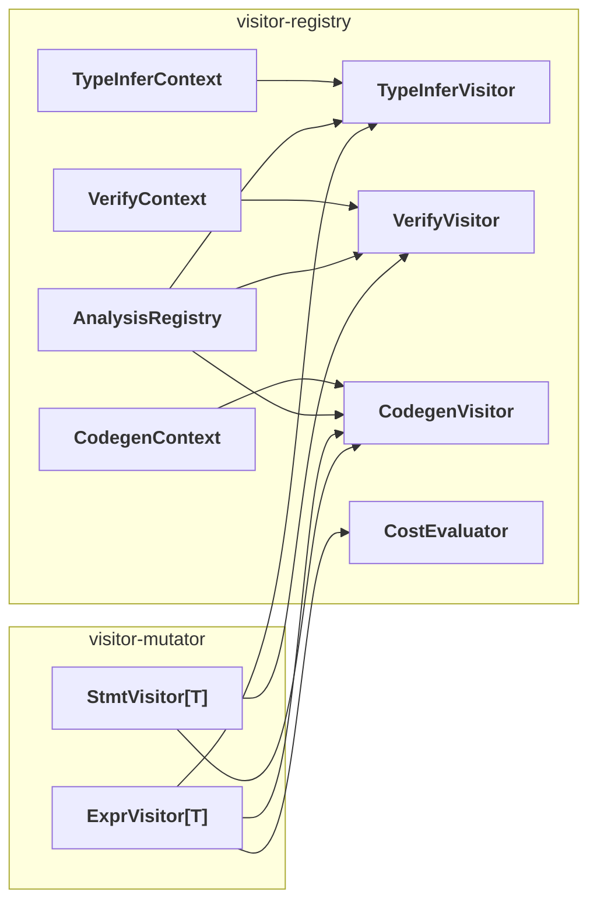

# TileFoundry Spec — Visitor Registry

The derived-visitor pattern: every `analysis` / `verify` / `codegen`
walker is the same template — **base visitor + custom Context +
per-class registry**. This spec defines the template and its five
instances (`typeinfer` / `verify` / `codegen_<target>` / `cost` /
`hir_lowering`).

The settled split:

- **`typeinfer`** dispatches on any Expr-producing `Op`'s `Call` —
  HIR value Ops plus TIR-owned Expr Ops (`tir.memory.AllocTensor` /
  `tir.memory.{PtrOf,MemorySpan,TensorView}` / `tir.scalar.*`). It
  fills / refreshes `Expr.type`.
- **`verify`** dispatches on TIR `Stmt` (control-flow / binding /
  `Evaluate`) plus cross-function invariants (`Evaluate(SymbolRef)`
  callee resolution, mesh scope, layout homogeneity). A Stmt verify
  rule MAY recursively retrigger `typeinfer` on embedded Expr fields.

Concrete per-node verify / typeinfer / emit rules belong with the
node owner ([tir](./tir.md) / [hir](./hir.md) / [parser](./parser.md)
/ [target](./target.md)). This spec defines **how** rules are
plugged into the dispatch chain, not **what** the rules say.


```mermaid
flowchart LR
    subgraph framework["visitor-mutator"]
        ExprVis["<b>ExprVisitor[T]</b>"]
        StmtVis["<b>StmtVisitor[T]</b>"]
    end

    subgraph registry["visitor-registry"]
        Reg["<b>AnalysisRegistry</b>"]
        TypeVis["<b>TypeInferVisitor</b>"]
        VerifyVis["<b>VerifyVisitor</b>"]
        CodegenVis["<b>CodegenVisitor</b>"]
        CostVis["<b>CostEvaluator</b>"]
        TICtx["<b>TypeInferContext</b>"]
        VCtx["<b>VerifyContext</b>"]
        CCtx["<b>CodegenContext</b>"]
    end

    ExprVis --> TypeVis
    StmtVis --> VerifyVis
    StmtVis --> CodegenVis
    ExprVis --> CodegenVis
    ExprVis --> CostVis

    Reg --> TypeVis
    Reg --> VerifyVis
    Reg --> CodegenVis

    TICtx --> TypeVis
    VCtx --> VerifyVis
    CCtx --> CodegenVis
```

## 1. Role

[visitor-mutator](./visitor-mutator.md) defines the **traversal**
scaffold (how to recurse the IR). This spec defines the **dispatch**
scaffold (after recursing to a node, how to look up the per-class
business handler and call it).

Any "walk the IR and run analysis / rewrite / emit" job follows the
same template:

1. inherit a `Visitor` / `Mutator` base,
2. carry a custom `Context` (mutable state + caches + helpers),
3. inside `visit_<ClassName>` consult an `AnalysisRegistry` to find
   the handler and invoke `fn(node, ctx)`.

### 1.1 Registry is not a property of `StmtVisitor` / `ExprVisitor`

`StmtVisitor` / `ExprVisitor` know nothing about any registry — they
are pure traversal scaffolds (see
[visitor-mutator](./visitor-mutator.md)). The behaviour
"a `Stmt` subclass consults `verify_stmt_registry`" is wired into
`VerifyVisitor` explicitly, not granted to every `StmtVisitor`
subclass automatically.

The canonical `StmtVisitor` interface and its pure-recursion contract are
owned by [visitor-mutator §5](./visitor-mutator.md#5-stmtvisitort--stmtmutator).
`VerifyVisitor`, defined in [§5](#5-instance-2--verify), is the derived class
that adds an explicit registry binding point.

`@register_verify_stmt(Copy)` writes a handler into
`verify_stmt_registry`; `VerifyVisitor.generic_visit` reads from the
**same module-level `AnalysisRegistry` instance**. That shared
reference is the only thing pairing the two — swap the registry and
you swap the analysis.

### 1.2 Two ways to write a visitor

- **Fixed-logic visitor.** Inherit `ExprVisitor` / `StmtVisitor` and
  hand-write `visit_Call` / `visit_For` / … overrides. No registry
  needed. Use this for "rules pinned to one place, no third-party
  extension expected" passes (e.g. a one-shot rewrite).
- **Extensible visitor.** Define a `Context` + `AnalysisRegistry` +
  `register_*` decorator, and have the visitor consult its own
  registry inside `generic_visit`. Use this when third-party code
  should be able to plug in handlers per node class
  (`typeinfer` / `verify` / `codegen` are all this shape).

Registry is opt-in; it only matters when third-party extension is a
goal. The four-step recipe for building a brand-new extensible
analysis is in [§10](#10-defining-a-new-extensible-analysis).

## 2. Core contract

Two node shapes can be registry-dispatched:

- **Op (value-producing).** Used via `Call(target=Op, args)`. The Op
  subclass is the registry key; handler signature is
  `(call: Call, ctx) -> T`.
- **Stmt (effect-producing).** A direct `Stmt` subclass — control
  flow, binding, `Evaluate`, user `@intrinsic`. The Stmt subclass is
  the registry key; handler signature is `(stmt: Stmt, ctx) -> T`.

A given analysis registry keys exactly one of the two. The four
instances split as follows:

| Instance | Op-branch handler | Stmt-branch handler | Notes |
|---|---|---|---|
| **typeinfer** | `(Call, TypeInferContext) -> Type` | — | Call result typing, including `UnitType` for effect Ops |
| **verify** | — | `(Stmt, VerifyContext) -> None` | Effect-side constraints; for `Evaluate(op, args)`, dispatch keys on the Op class — see [§5](#5-instance-2--verify) |
| **codegen_\<target\>** | `(Call, CodegenContext) -> str` | `(Stmt, CodegenContext) -> None` | Both sides are emitted |
| **cost** | `(Call, CostContext) -> Cost` | `(Stmt, CostContext) -> Cost` (optional) | Recursive-local logical work |
| **hir_lowering** | `(lowerer, Op, Call) -> Var` | — | HIR-to-TIR lowering; see [§11](#11-instance-5--hir_lowering) |

Generic control-flow / binding Stmts (`For` / `If` / `While` /
`LetStmt` / `Sequential` / `MeshScope` / `Return`) are handled by
the visitor base's `generic_visit` recursion and are not routed
through any registry — their semantic rules are owned by
[tir](./tir.md) / [hir](./hir.md), not by this spec.

## 3. `AnalysisRegistry`

All four instances share one registry implementation. It is a
class-keyed dict with a duplicate-registration guard.

```python
class AnalysisRegistry(Generic[Key]):          # Key = type[Op] or type[Stmt]
    def __init__(self, name: str): ...
    def register(self, cls: Key, fn: Callable) -> None: ...   # raises on duplicate
    def lookup(self, cls: Key) -> Callable | None: ...        # None on miss
    def has(self, cls: Key) -> bool: ...
```

- constraints:
  - A registry MUST raise on double registration of the same class;
    subclasses do not inherit a parent's handler. Each concrete
    `Op` / `Stmt` subclass either registers itself explicitly or is
    caught by the visitor's `generic_visit` fallback.
  - `lookup` returns `None` on a miss. The caller decides whether a
    miss is an error or a fallback. `VerifyVisitor` falls back to
    `generic_visit` on a miss (an unregistered Stmt simply has no
    custom verify rule); `TypeInferContext` raises (every Op call
    MUST have a typeinfer rule).

## 4. Instance 1 — `typeinfer`

Context:

```python
@dataclass(frozen=True)
class FunctionScope:
    """Where a walk is reading: one Module tree, and whose body it is in.

    Attributes:
        module: attribute; the Module tree the walk answers questions within.
        function: attribute; the Function whose body the walk is reading.
    """

    module: Module
    function: Function


@dataclass
class TypeInferContext:
    """Walk-local type cache, mesh scope, and elaboration cache.

    Attributes:
        scope: attribute; where the walk is reading, or ``None`` when it was
            given no scope.
        cache: attribute; memoized ``id(expr)`` to inferred ``Type``.
        mesh_scope: attribute; enclosing mesh scope tuple.
        elaboration_cache: attribute; memoized specialization instances.
    """

    scope: FunctionScope | None = None
    cache: dict[int, Type] = field(default_factory=dict)
    mesh_scope: tuple = ()
    elaboration_cache: dict[tuple, Any] = field(default_factory=dict)

    def type_of(self, expr: Expr) -> Type: ...
    def error(self, node: Expr | Stmt, msg: str) -> NoReturn: ...
```

`FunctionScope` is the whole of what a walk states about where it is. A
`Function` carries no execution context and one object is reachable from more
than one program, so anything answered about the body being read — which Module
owns it, what a call in it may reach — is answered within the tree the walk was
given ([core-ir §1](./core-ir.md#1-module)). A walk given no scope answers
nothing of that kind rather than guessing.

- constraints:
  - `scope` MUST be the only context state describing where a walk is reading,
    and the pair MUST be reachable from the package root together, since one is
    how the other is constructed.
  - A walk-visible query answering a question about one construct — which Module
    a particular kind of callee belongs to, how a particular call binds its
    arguments ([hir §1.1](./hir.md#11-function)) — MUST NOT be added to the
    context; such a question is resolved by whoever asks it, from `scope`.
  - `type_of` is a walk-local cache only — it holds no dispatch rule of its
    own. A cache miss delegates to `TypeInferVisitor(self).visit(expr)`
    (below), whose `visit_Call` is what consults
    `typeinfer_registry.lookup(type(target))`; an unregistered Op call
    routes through `ctx.error`.

Registry + decorator:

```python
typeinfer_registry: AnalysisRegistry[type[Op]]   # module-level registry keyed by type[Op]
def register_typeinfer(op_cls: type[Op]): ...     # decorator: register a typeinfer handler for one Op class
```

- constraints:
  - handler signature is `(call: Call, ctx: TypeInferContext) -> Type`.

```python
# example
# a typeinfer handler pins the (call, ctx) -> type shape:
@register_typeinfer(Binary)
def _(call: Call, ctx: TypeInferContext) -> TensorType: ...
```

Visitor:

```python
class TypeInferVisitor(ExprVisitor[Type]):
    def __init__(self, ctx: TypeInferContext): ...   # ctx carries the cache and helpers
    def visit_Var(self, var: Var): ...               # return the Var's type
    def visit_Constant(self, c: Constant): ...       # the node's own declared type
    def visit_Call(self, call: Call): ...            # typeinfer_registry.lookup(type(call.target))
    def visit_Tuple(self, tup: Tuple): ...            # structural: TupleType over each element's type
    def visit_GridRegionExpr(self, grid): ...         # carry/body — hir §1.2
    def visit_ShapeOf(self, shape_of: ShapeOf) -> Type: ...
```

- constraints:
  - one `visit_<Kind>` rule per `Expr` subclass reachable from a `hir.Function`
    body or a tir `Expr` field — there is no `isinstance` fallback. An `Expr`
    subclass with no rule raises via `ctx.error` in `generic_visit` rather than
    trusting a possibly-stale `Expr.type` field.
  - `visit_Call` is the sole registry-dispatch point: it looks up
    `typeinfer_registry.lookup(type(call.target))` and invokes the handler: an
    unregistered `Op` call routes through `ctx.error`.
  - `visit_Tuple` derives a structural `TupleType` from `ctx.type_of` of each
    element — never the `Tuple` node's own stamped `.type`.
  - `visit_ShapeOf` returns the node's declared rank-0 i32 type.
  - `hir.Function` is itself a valid `Call.target` ([§4](#4-instance-1--typeinfer) above): its registered
    typeinfer handler elaborates the callee under the call's actual argument
    types ([hir §1.1](./hir.md#11-function)) rather than reading the target's
    own `.type`.

Lifecycle: parser builds a `TypeInferContext` and runs eager
typeinfer at parse time (see [parser](./parser.md)). A `Module`
entering the pass pipeline already has every `Expr.type` filled.
There is no "first TypeInferPass". When a transform changes the
expression structure and needs to recompute types, it calls
`typeinfer_registry.lookup(...)` directly (see
[passes](./passes.md)).

### 4.1 Forward relation service — `type_relation`

A second registry exposes each op's access relation as a **forward**
service that typeinfer consumes. Its result carrier is:

```python
@dataclass
class AccessRelationResult:
    domain: isl.set             # the op's bounded iteration domain as an isl.set
    maps: tuple[isl.map, ...]   # one access isl.map per boundary value, in boundary order (inputs then outputs)
    param_map: dict             # domain's isl parameter name -> the ShapeDim it stands for; this Call's own data, never shared
```

- constraints:
  - the carrier holds **no** tensor shape; the output shape is typeinfer-side
    data (see [semantic-analysis §1.1](./semantic-analysis.md#11-relation-derived-type-behavior)).

#### `domain`

The op's bounded iteration domain as an `isl.set`. Static iteration
extents are constant constraints (`0 <= i < N`); a bare `DimVar` extent is
a same-name isl parameter bound to its own `[lo, hi)`. Any other
`ShapeDim` expression binds to a fresh opaque isl parameter instead — its
arithmetic structure never enters isl, only its value range does — keyed
so the same expression always binds to the same parameter. The domain's
rank is fixed and is read from the input types.

#### `param_map`

Maps each of `domain`'s isl parameter names back to the `ShapeDim` it
stands for. Built once alongside `domain` and carried on this result —
never module-level state, so it is safe across concurrent or repeated
relation builds. The output-shape derivation that consumes `domain` reads
`param_map` to resolve a recovered isl expression back to a `ShapeDim`.

#### `maps`

One access `isl.map` per boundary value, in boundary order — inputs
first, then outputs — each mapping the iteration domain to that tensor's
index space. The carrier holds **no** tensor shape: the output shape is
typeinfer-side data, not part of the relation (see
[semantic-analysis §1.1](./semantic-analysis.md#11-relation-derived-type-behavior)).

Registry + decorator:

```python
type_relation_registry: AnalysisRegistry[type[Op]]     # forward relation registry keyed by type[Op]
def register_type_relation(op_cls: type[Op]): ...       # decorator: register a type_relation handler for one Op class
```

Handler signature:
`(call: Call, input_types: tuple[Type, ...], ctx: TypeInferContext) -> AccessRelationResult`.

The handler MUST read only `input_types` and the op's attributes. It MUST
NOT read the Call's own output type (`ctx.type_of(call)`), so the builder
runs before the output type exists and typeinfer can call it without a
cycle. `build_relation(call, input_types, ctx)` looks the handler up and
returns its result, or `None` when the op has no registered builder.

### 4.2 Per-boundary relation service — `access_relation`

A second, independent registry over the same Op classes. Where `type_relation`
([§4.1](#41-forward-relation-service--type_relation)) returns one iteration domain plus one map per boundary and drives
typeinfer, this one classifies each boundary on its own and admits a boundary
the affine framework cannot express at all.

```python
AccessRelation = Union["isl.multi_aff", "isl.map", OpaqueRelation]

class OpaqueRelation:
    """Marker for a boundary the affine framework cannot express."""

OPAQUE: OpaqueRelation      # the single instance

class AccessRelations:
    """One relation per boundary value, in boundary order."""

    inputs: tuple[AccessRelation, ...]
    outputs: tuple[AccessRelation, ...]
```

Registry + decorator:

```python
access_relation_registry: AnalysisRegistry     # keyed by type[Op]
def register_access_relation(op_cls: type): ...
```
- constraints:
  - The canonical carrier is `isl.multi_aff`. An `isl.map` is allowed where the
    relation is reduction-like or otherwise many-to-one.
  - A boundary whose access pattern is data-dependent, or otherwise outside
    `isl.multi_aff` / `isl.map`, MUST carry `OPAQUE` rather than an
    approximation. `OpaqueRelation` is a distinct type from either isl carrier
    so a consumer can never read "opaque" as "identity".
  - `OpaqueRelation` is a singleton: every construction returns the same
    instance, and it round-trips through pickling as that instance.
  - `inputs` has one entry per input arg in argument order; `outputs` has one
    per output.

The two registries are peers, not layers: a given Op MAY register with either,
both, or neither. The polyhedral model ([analysis §1](./analysis.md#1-polyhedral-model))
reads only [§4.1](#41-forward-relation-service--type_relation)'s forward relation, so an Op it must cover needs a
`type_relation` regardless of what it registers here.

## 5. Instance 2 — `verify`

Context (extends `TypeInferContext` to share the type-of cache):

```python
@dataclass
class VerifyContext(TypeInferContext):   # inherits scope / cache / type_of
    """Type inference context extended with the active mesh stack.

    Attributes:
        mesh_stack: attribute; active mesh-scope stack maintained during the
            verification walk.
    """

    mesh_stack: list = field(default_factory=list)
```

- constraints:
  - shares typeinfer's type-of cache; adds a mesh-scope stack.

Registry + decorator:

```python
verify_stmt_registry: AnalysisRegistry[type]   # module-level registry keyed by Stmt/Op class
def register_verify_stmt(cls: type): ...        # decorator: register a verify handler keyed on the Stmt/Op class
```

- constraints:
  - handler signature is `(node, ctx: VerifyContext) -> None`; failure routes
    through `ctx.error(node, msg)`, which raises `VerifyError`.

**`Evaluate(op, args)` dispatch.** TIR effect-form Ops
(`Copy` / `Fill` / `Mma` / `ReLU` / `RMSNorm` / `Reduce`) appear in
Stmt position as `Evaluate(callable=op, args)`. The verify path keys
on the Op class, not on `Evaluate` itself: `register_verify_stmt`
takes the **Op class**, and `VerifyVisitor.generic_visit` —
together with `tir.verify._walk_stmt` — detects `Evaluate` and
dispatches `verify_stmt_registry.lookup(type(stmt.callable))`. The
registry key is the Op class; the handler input shape is owned by the
registry implementation. The stable IR shape is `Evaluate(op, args)`;
the stable IR does not wrap a value-form `Call` inside `Evaluate`. See
[visitor-mutator §7](./visitor-mutator.md#7-visitor-entry-forms-for-evaluate)
for the matching visitor entry-form contract and
[tir §1.4](./tir.md#14-evaluate) for the wrapper definition.

```python
# example
# a verify handler keys on the Op class and returns None:
@register_verify_stmt(Copy)
def _(call: Call, ctx: VerifyContext) -> None: ...
```

Per-stmt rules (shape / dtype / layout constraints) belong in
[tir](./tir.md).

Visitor:

```python
class VerifyVisitor(StmtVisitor[None]):
    def __init__(self, ctx: VerifyContext, registry: AnalysisRegistry = verify_stmt_registry): ...   # ctx + injected verify registry
    def generic_visit(self, stmt: Stmt) -> None: ...   # try the registry, fall back to base recursion on a miss
    def visit_MeshScope(self, stmt): ...               # push/pop the mesh-scope stack around recursion
```

- constraints:
  - recurses `PrimFunction.body`; per Stmt subclass tries the registry, falling
    back to `generic_visit` on a miss. The registry is injected via `__init__`,
    not baked into `StmtVisitor` (see [§1.1](#11-registry-is-not-a-property-of-stmtvisitor--exprvisitor)).

**Unregistered semantics.** A Stmt subclass without
`register_verify_stmt` does not error — `VerifyVisitor` simply
recurses through it. Generic control-flow / binding Stmts use this
fallback; their semantic constraints (e.g. `For.step != 0`,
`If.cond` is `bool`, `LetStmt` binding rules) are owned by
[tir](./tir.md) and registered there, not in this spec.

## 6. Instance 3 — `codegen_<target>`

The concrete `CodegenContext` interface is owned by
[codegen §2.3](./codegen.md#23-codegencontext). This section owns only the
registry-dispatch contract that consumes that context.

Registry per target:

```python
codegen_cuda_registry: AnalysisRegistry[type]        # one registry per target (cuda / cpu / ...)
def register_codegen_cuda(cls: type[Op] | type[Stmt]): ...   # decorator: register a per-target handler
```

- constraints:
  - each target has its own registry; keys may be `type[Op]` (TIR-owned Expr Op
    handlers) or `type[Stmt]`.

Handler signatures:

- Op-branch: `(call: Call, ctx: CodegenContext) -> str` — returns a
  target code fragment (used as a sub-expression by an outer Stmt
  emitter).
- Stmt-branch: `(stmt: Stmt, ctx: CodegenContext) -> None` — emits
  one or more lines into `ctx.output`.

```python
# example
# Op-branch handler returns a code fragment; Stmt-branch handler emits lines:
@register_codegen_cuda(TirScalarReLU)
def _(call: Call, ctx: CodegenContext) -> str: ...
@register_codegen_cuda(Copy)
def _(stmt: Copy, ctx: CodegenContext) -> None: ...
```

Visitor:

```python
class CodegenVisitor:
    def __init__(
        self,
        ctx: CodegenContext,
        registry: AnalysisRegistry,
        *,
        backend: str,
    ): ...
    def emit_stmt(self, stmt: Stmt) -> None: ...   # Stmt-side entry; unregistered Stmt falls back to target default emit
    def emit_expr(self, expr: Expr) -> str: ...    # Op-side entry; unregistered Op raises
```

- constraints:
  - combines the `StmtVisitor` + `ExprVisitor` sides; routes per node class through
    the concrete generator's registry; an unregistered Op raises, an unregistered Stmt falls
    back to the target-owned default emit.
  - `backend` is diagnostic text only. It MUST NOT select a registry or a Target.

User extension path — adding a new Stmt `MyIntrinsic`:

1. `ir/tir/<cat>/my_intrinsic.py`: define `MyIntrinsic(Stmt)` and
   `@register_verify_stmt(MyIntrinsic)`.
2. `codegen/cuda/tir/<cat>/my_intrinsic.py`:
   `@register_codegen_cuda(MyIntrinsic)`.
3. For a new target (cpu, …): add the corresponding
   `@register_codegen_cpu(MyIntrinsic)` in
   `codegen/cpu/tir/<cat>/my_intrinsic.py`.

The visitor / pass pipeline / parser do not change.

## 7. Instance 4 — `cost`

Cost evaluation is a recursive-local analysis. A handler receives selected
candidate Types through `CostContext`; it does not select hardware resources.

```python
@dataclass
class TrafficBytes:
    """Per-operand traffic.

    Attributes:
        read: attribute; bytes read from the operand.
        write: attribute; bytes written to the operand.
        total_bytes: attribute; derived read-only traffic in both directions.
    """

    read: int = 0
    write: int = 0

    def total_bytes(self) -> int: ...

@dataclass
class Cost:
    """Leaf-local work for one selected candidate.

    Attributes:
        flops: attribute; logical work grouped by compute dtype.
        traffic: attribute; per-operand traffic in argument order, with the
            result last.
        bytes: attribute; derived read-only traffic over every operand.
    """

    flops: Mapping[DType, int]
    traffic: tuple[TrafficBytes, ...]

    def bytes(self) -> int: ...

class CostContext(TypeInferContext):
    """Selected candidate types used for recursive-local costing.

    Attributes:
        selected_types: attribute; selected ``id(expr)`` to ``Type`` mapping.
        selected_output_type: attribute; selected output type, when supplied.
        level: attribute; topology window to project through, or None for types as written.
        topologies: attribute; ordered topology levels with resolved extents.
    """

    selected_types: Mapping[int, Type] = field(default_factory=dict)
    selected_output_type: Type | None = None
    level: str | None = None
    topologies: tuple[Topology, ...] = ()

    def local_type_of(self, expr: Expr) -> Type: ...
    def local_output_type(self, call: Call) -> Type: ...

cost_evaluator_registry: AnalysisRegistry[type[Op]]
def register_cost_evaluator(op_cls: type[Op]): ...

class CostEvaluator(ExprVisitor[Cost]): ...
```

- constraints:
  - every required primitive Op MUST have one registered evaluator; a missing
    evaluator MUST fail with the Op name and source location.
  - the evaluators MUST be owned by this layer and MUST be installed when the
    package is imported. The work an Op asks for follows from its own semantics
    and its operand types, so it is the same on every backend; registering them
    from a target package would make one backend's presence decide whether any
    consumer can cost a program at all.
  - `flops` MUST group leaf-local logical work by compute `DType`.
  - `TrafficBytes.total_bytes` and `Cost.bytes` MUST be read-only derived
    properties and MUST NOT be accepted as constructor fields.
  - `traffic` MUST carry exactly one `TrafficBytes` per operand of the call, in
    argument order with the result last, so an Op that only touches part of an
    input says so where it knows it. `bytes` is derived: every operand's traffic
    in either direction.
  - an evaluator MUST NOT name a memory level. Which level an operand's bytes
    move at follows from that operand's Type, and is the consumer's to read;
    reporting a length that disagrees with the call's operand count MUST fail
    naming the call and both counts.
  - an operand whose Type spans several levels admits no split of one reported
    count between them, so a consumer MAY charge that operand's whole Type at
    each level instead. What the evaluator reported stands as the operand's own
    amount; a per-level total is therefore not always the sum of the amounts
    reported here.
  - an evaluator MUST report the bytes its operation's own semantics move,
    bounded by what its operand Types state statically:
    - an operation that writes a window of a container charges the window and
      MUST NOT charge the container;
    - an operation that only re-describes or re-indexes existing elements, or
      that names an existing value at another topology level, charges zero;
    - when the touched extent is runtime data, the evaluator charges the
      smallest bound its operand Types state statically.
  - `Reshape` MUST report zero traffic because it re-indexes the same elements.
    `Slice` MUST report one result-sized source read, a zero-traffic structural
    `starts` slot, and one result-sized write. `Transpose` MUST
    report one result-sized read and write because its evaluator materializes the
    permutation. Each evaluator answers from its operation's semantics and MUST
    NOT infer buffer identity from layouts; buffer aliasing is a later
    optimization decision.
  - With no level, `CostContext.local_type_of` MUST return the selected Type as
    written. With a level, it MUST apply `local_type_of` using the context's
    topology hierarchy and MUST reject unresolved or non-concrete local extents
    at the point where the evaluator requires them.

## 8. Shared helpers

### 8.1 `ctx.error`

```python
def error(self, node: Expr | Stmt, msg: str) -> NoReturn: ...   # node: the offending Expr/Stmt (class name used in the message); msg: the constraint-failure message; raises VerifyError with a stable format
```

- constraints:
  - provided by `TypeInferContext` and every Context that inherits it; raises
    `VerifyError` with a stable format.

### 8.2 Other helpers

Local helper implementation is not part of this contract.

## 9. Registration timing — import-time side effects

`@register_*` decorators are import-time side effects.
`ir/hir/__init__.py`, `ir/tir/__init__.py`, and
`codegen/<target>/__init__.py` perform a recursive walk so every
submodule is imported and every `@register_*` runs.

`import tilefoundry` triggers the walk once; every registry is fully
populated. Re-imports are idempotent (Python caches the module;
`AnalysisRegistry.register` does not re-run the import-time body).

## 10. Defining a new extensible analysis

When adding a per-node-class extensible analysis (say "alias
analysis on top of typeinfer", or "emit for a new target"), follow
the four-step recipe.

### Step 1 — define a Context

```python
# example
@dataclass
class AliasContext(TypeInferContext):
    alias_sets: dict[Var, set[Var]] = field(default_factory=dict)
```

### Step 2 — declare a registry + decorator

```python
# example
alias_registry: AnalysisRegistry[type[Op]]   # the new analysis's registry
def register_alias(op_cls: type[Op]): ...     # decorator: register a handler for one Op class
```

Pick `type[Op]` for an analysis that walks `Call`s, `type[Stmt]` for
one that walks effect Stmts; declare both registries if both are
needed.

### Step 3 — derive a Visitor that holds the registry explicitly

```python
# example
class AliasVisitor(ExprVisitor[None]):
    def __init__(self, ctx: AliasContext, registry: AnalysisRegistry = alias_registry): ...   # explicit binding
    def visit_Call(self, call: Call) -> None: ...   # look up type(call.target), invoke, then recurse
```

### Step 4 — register handlers in the Op files

```python
# example
# an alias handler keys on the Op class and returns None:
@register_alias(Reshape)
def _(call: Call, ctx: AliasContext) -> None: ...
```

These four steps are what the extensible instances in this spec are doing.
A new analysis is **peer**
to them — no existing visitor / registry / dispatch code changes.

The contract: callers own their `AnalysisRegistry`, their `Visitor`
subclass (built on
[visitor-mutator](./visitor-mutator.md)), and their `Context`
dataclass. Composition is explicit; there is no hidden
framework-side magic that auto-binds them.

## 11. Instance 5 — `hir_lowering`

`hir_lowering_registry` dispatches each HIR `Call` to the handler that lowers
that op to TIR. The pass-owned lowerer is the first handler argument.

```python
hir_lowering_registry: AnalysisRegistry[type[Op]]
def register_hir_lowering(op_cls: type[Op]): ...
```

- constraints:
  - Handler signature is
    `(lowerer: _Lowerer, target: Op, expr: Call) -> Var`.
  - `HirToTirPass` performs the lookup on `type(expr.target)` and invokes the
    handler as `handler(lowerer, expr.target, expr)`; a missing handler is a
    lowering error naming the op class.
  - The registry and decorator are public from `tilefoundry.visitor_registry`.
    Concrete handlers remain beside the pass or target-owned op that defines
    the lowering; see [passes §7.1](./passes.md#71-hirtotirpass).
